# COMP9820 Week 1 — Lecture 1.1 Software Project Management · 1.2 Git Solo Usage · 1.3 Git Team Usage（课件整理）

> 来源：YouTube 直播录像 [COMP9820 26T1 Week 1](https://www.youtube.com/watch?v=WDvENHSqTow)（UNSW_COMP9820，2026-02-16，约 2 小时 05 分）
> 讲师：Dr. Yuchao Jiang（CSE 高级讲师）
> 说明：本文件按讲师投影顺序还原三份课件（Lecture 1.1 / 1.2 / 1.3）。**英文为幻灯片原文**，其后的「🇨🇳」为中文翻译/解释；「💬 讲师补充」为课件上没有、但讲师口头强调的内容。截图位于 `images/`（由视频抽帧裁剪，480p）。
> 课件之外，讲师还演示了课程网站 Assignments Overview / Sprint 1 Guidelines、GitLab lab-git 仓库，以及完整的 Git 终端 + GitLab 演示，也一并整理。

---

## 目录

- [Lecture 1.1 — Software Project Management](#lecture-11--software-project-management)
  - [1. Welcome / Why Are We Here?](#1-welcome--why-are-we-here)
  - [2. Why Software Project Management Is Exciting & Important](#2-why-software-project-management-is-exciting--important)
  - [3. Understanding Software Processes（SDLC）](#3-understanding-software-processessdlc)
  - [4. The Waterfall Model](#4-the-waterfall-model)
  - [5. The Agile Model](#5-the-agile-model)
  - [6. Other Aspects（课程事项）](#6-other-aspects课程事项)
  - [7. 课程网站：Assignments Overview 与 Sprint 1](#7-课程网站assignments-overview-与-sprint-1)
- [Lecture 1.2 — Git · Version Control · Solo Usage](#lecture-12--git--version-control--solo-usage)
  - [8. The Problem / A Popular Solution: Git](#8-the-problem--a-popular-solution-git)
  - [9. Learning Git in 3 Stages](#9-learning-git-in-3-stages)
  - [10. Stage 1：单机演示（clone / add / commit / push / status）](#10-stage-1单机演示clone--add--commit--push--status)
  - [11. Stage 2：多台机器（pull / merge conflict）](#11-stage-2多台机器pull--merge-conflict)
- [Lecture 1.3 — Git · Team Usage](#lecture-13--git--team-usage)
  - [12. The Git Tree Model / Branches](#12-the-git-tree-model--branches)
  - [13. Stage 3：分支与 Merge Request 演示](#13-stage-3分支与-merge-request-演示)
- [附：Git 命令速查与本周待办](#附git-命令速查与本周待办)

---

## Lecture 1.1 — Software Project Management

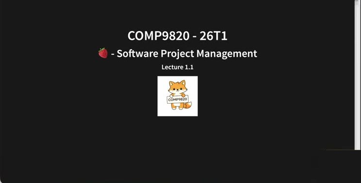

**COMP9820 - 26T1 · 🍎 Software Project Management · Lecture 1.1**


🐴 **Happy Lunar New Year!** 🐴（当天是农历除夕；讲师与同学闲聊年夜饭——饺子、汤圆、鱼）

💬 讲师补充：今后讲座固定 **6:05 开始**，照顾上一节课赶来的同学。本课是**新课**：过去研究生修 GSOE9820，本学期起为 MIT/信息系统类学生开设，因为学生和业界反馈毕业生缺乏**软件/IT 系统**（而非泛工程）项目管理技能。Atlassian、YouTube、Netflix 这类项目都很庞大，如何管理不只是经理的事，**每个开发者都该懂**。

### 1. Welcome / Why Are We Here?

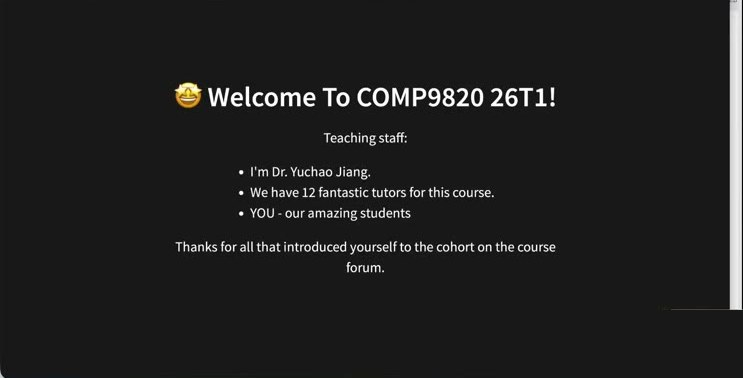

🤩 **Welcome To COMP9820 26T1!** — Teaching staff:
- I'm Dr. Yuchao Jiang.
- We have 12 fantastic tutors for this course.
- YOU – our amazing students

Thanks for all that introduced yourself to the cohort on the course forum.

🇨🇳 讲师：软件工程博士，研究方向为软件工程教育（education-focused lecturer）。12 位 tutor 背景多元——约 1/3 来自业界、1/3 即将毕业的研究生、1/3 曾在本科课程当 Git 等主题助教；每班 **2 位 tutor**。鼓励在论坛自我介绍、认识同学（课堂做了 2 分钟破冰）。

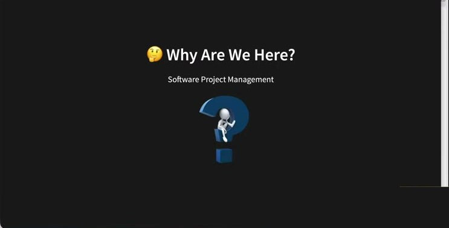

🤔 **Why Are We Here?** — Software Project Management

💬 讲师补充：学生想得到"行业经验""如何与团队合作"。课程会**模拟**行业经验、教未来职业所需技能、学习如何管理/领导多元背景的团队。

### 2. Why Software Project Management Is Exciting & Important

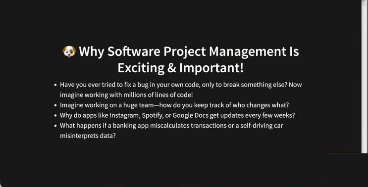

🐼 **Why Software Project Management Is Exciting & Important!**
- Have you ever tried to fix a bug in your own code, only to break something else? Now imagine working with millions of lines of code!
- Imagine working on a huge team—how do you keep track of who changes what?
- Why do apps like Instagram, Spotify, or Google Docs get updates every few weeks?
- What happens if a banking app miscalculates transactions or a self-driving car misinterprets data?

🇨🇳 修一个 bug 却弄坏别的？想象百万行代码；大团队如何追踪**谁改了什么**；为什么 App 每几周更新；银行 App 算错账、自动驾驶误判数据会怎样——本课就是回答"如何管理软件项目以避免这些"。

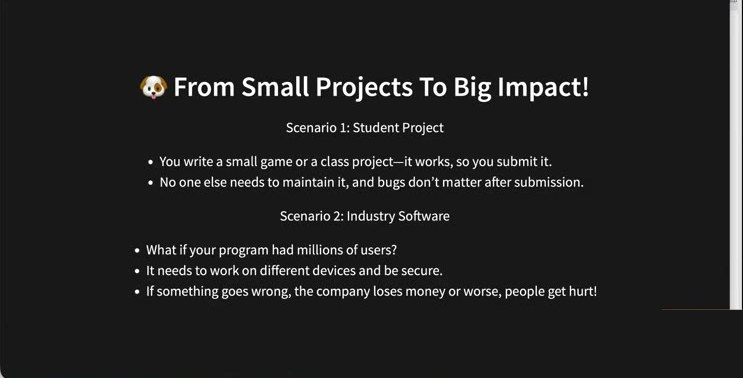

🐼 **From Small Projects To Big Impact!**
- *Scenario 1: Student Project* — You write a small game or a class project—it works, so you submit it. No one else needs to maintain it, and bugs don't matter after submission.
- *Scenario 2: Industry Software* — What if your program had millions of users? It needs to work on different devices and be secure. If something goes wrong, the company loses money or worse, people get hurt!

🇨🇳 学生作业交完即弃；真实世界里代码被真实用户使用、别人要在其上构建和维护、多设备、安全；出错会赔钱甚至伤人。

💬 课堂问答：
- **是来练代码的吗？** ——是也不是：本课**不教编程**（假定已修 COMP9021/9020 或有同等经验），讲的是如何管理**大代码库**、多人协作时如何管理项目和人。
- **是学当经理吗？** ——是也不是：**团队每个人都对项目负责**；可以轮流当 leader，也要学做好协作的成员。
- **角色会轮换吗？** ——建议轮换：10 周一个项目分 **3 个 sprint**，换 sprint 时换角色。
- **期末考什么？** ——**没有期末考试**，唯一考核是项目，Week 10 结束一切结束。

### 3. Understanding Software Processes（SDLC）

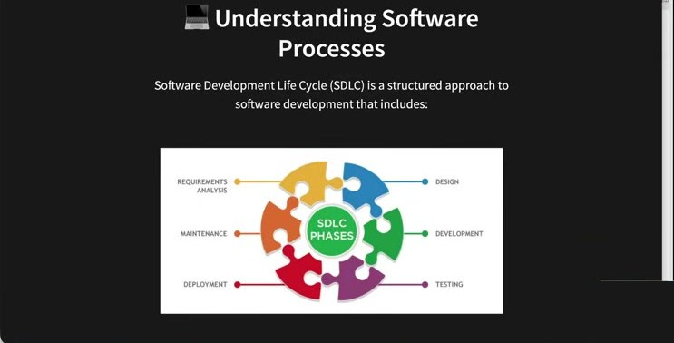

💻 **Understanding Software Processes** — Software Development Life Cycle (SDLC) is a structured approach to software development that includes: Requirements Analysis → Design → Development → Testing → Deployment → Maintenance（拼图环形图）

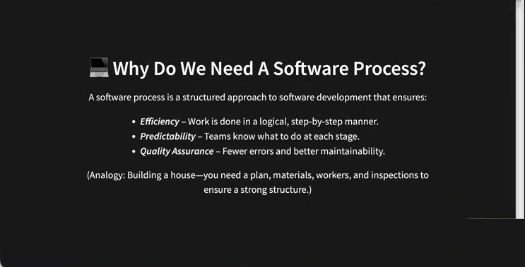

💻 **Why Do We Need A Software Process?** — A software process is a structured approach to software development that ensures:
- **Efficiency** – Work is done in a logical, step-by-step manner.
- **Predictability** – Teams know what to do at each stage.
- **Quality Assurance** – Fewer errors and better maintainability.

(Analogy: Building a house—you need a plan, materials, workers, and inspections to ensure a strong structure.)

🇨🇳 管理大项目首先要理解软件过程：有逻辑、可预测、保证质量与可维护性（不会日后问"这段代码为什么在这"）。像盖房子要先有图纸。今天只是总览，后续每周深入各阶段。

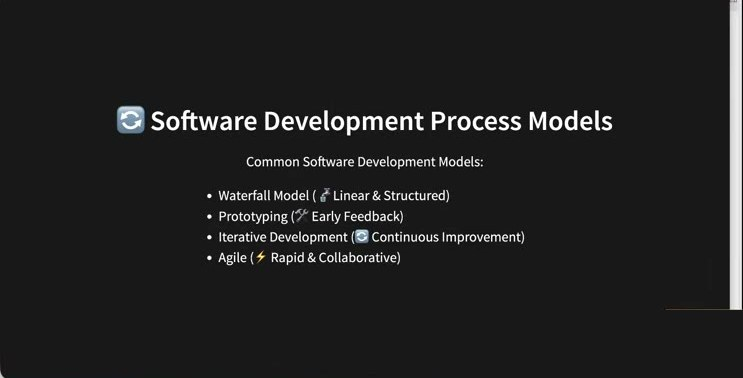

🔄 **Software Development Process Models** — Common Software Development Models:
- Waterfall Model (🚿 Linear & Structured)
- Prototyping (🔧 Early Feedback)
- Iterative Development (🔁 Continuous Improvement)
- Agile (⚡ Rapid & Collaborative)

### 4. The Waterfall Model

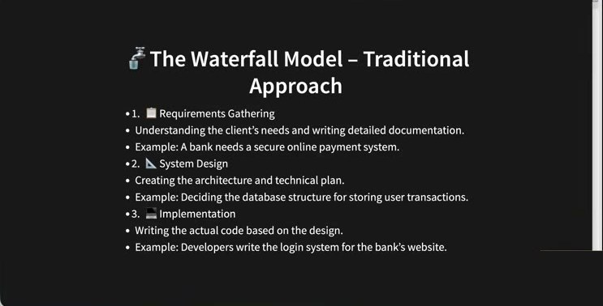
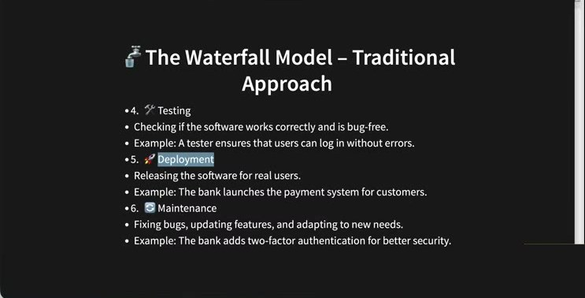

🚿 **The Waterfall Model – Traditional Approach**
1. 📋 **Requirements Gathering** — Understanding the client's needs and writing detailed documentation. *Example: A bank needs a secure online payment system.*
2. 📐 **System Design** — Creating the architecture and technical plan. *Example: Deciding the database structure for storing user transactions.*
3. 💻 **Implementation** — Writing the actual code based on the design. *Example: Developers write the login system for the bank's website.*
4. 🔬 **Testing** — Checking if the software works correctly and is bug-free. *Example: A tester ensures that users can log in without errors.*
5. 🚀 **Deployment** — Releasing the software for real users. *Example: The bank launches the payment system for customers.*
6. 🔄 **Maintenance** — Fixing bugs, updating features, and adapting to new needs. *Example: The bank adds two-factor authentication for better security.*

🇨🇳 瀑布模型线性、结构化：做完第一步才能开始第二步。

💬 讲师用 **timetable management app + 盖房子** 比喻六阶段：客户说"做一个课表管理软件"→ 追问什么意思、要什么功能、用户是谁（需求）；房子一层还是有楼梯、几间卧室、有无厨房厕所（设计：三卧两卫一厨一洗衣房）；把各模块建出来（实现）；房子安全吗、厕所不堵吗（测试）；房子要有人住——代码不能只躺在笔记本上（部署）；厕所偶尔不通请修、请加新功能（维护）。

### 5. The Agile Model

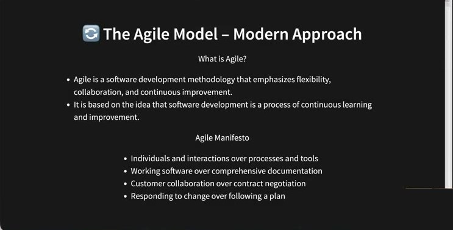

🔄 **The Agile Model – Modern Approach** — What is Agile?
- Agile is a software development methodology that emphasizes flexibility, collaboration, and continuous improvement.
- It is based on the idea that software development is a process of continuous learning and improvement.

**Agile Manifesto**
- Individuals and interactions over processes and tools
- Working software over comprehensive documentation
- Customer collaboration over contract negotiation
- Responding to change over following a plan

🇨🇳 敏捷强调灵活、协作、持续改进；软件开发是持续学习与改进的过程。敏捷宣言四条价值观（Week 2 详讲）。

💬 讲师补充：Agile 不要求上一阶段完美才开始下一阶段，周转更快、更看重可工作软件而非文档——因为科技变化太快，卡在需求阶段别人就先做了；用户需求会变；**需求永远不可能完美**。**协作**不只在团队内，还包括客户（持续汇报、要反馈）和领域专家（例如临床软件要有临床专家参与，涉及隐私与特殊要求）。学生问"多讲讲现代方法"：瀑布是"done then done"；Agile 可先有 **MVP**——不完美但能跑，给客户/用户看再持续改进；迭代而非线性；更多是**心态**而非流程；永远没有"完全做完"。项目里会实践所有阶段。

### 6. Other Aspects（课程事项）

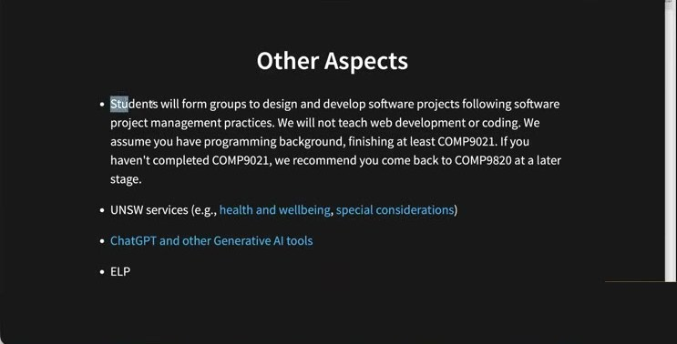

**Other Aspects**
- Students will form groups to design and develop software projects following software project management practices. We will not teach web development or coding. We assume you have programming background, finishing at least COMP9021. If you haven't completed COMP9021, we recommend you come back to COMP9820 at a later stage.
- UNSW services (e.g., health and wellbeing, special considerations)
- ChatGPT and other Generative AI tools
- ELP

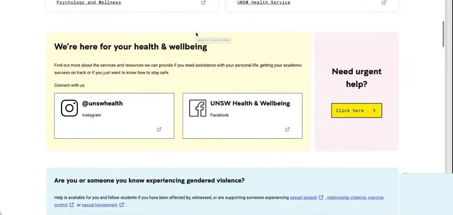
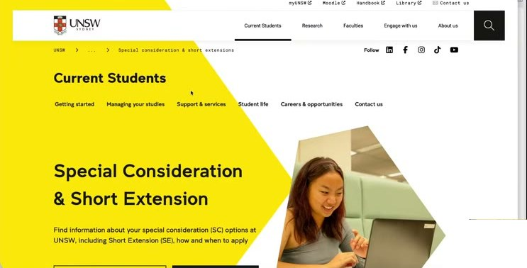

🇨🇳 / 💬 讲师补充：
- **只有一个作业**（无期末、无 quiz、lab 不计分）：小组项目。**分组在 Week 1 lab**，务必参加；不能参加要邮件 tutor 说明没有退课、请留位置。
- **不教 Web 开发/编程**：无正式先修课，但建议先修完 COMP9021 或有同等经验，否则会"非常非常有挑战"；建议晚点再修。
- **UNSW Health & Wellbeing**：压力大、不舒服不要硬撑。
- **Special Consideration & Short Extension**：例如某个 sprint 住院无法贡献，可申请；评分时会考虑你时间更少。健康永远第一。
- **ChatGPT / 生成式 AI**：讲师自己也用、业界看重 AI 素养，不想太严格——但要**正确使用**：不是让工具替你完成作业；可用于研究/学习；必须**知道自己在做什么、能解释为什么**；提交时**声明**用了什么工具、用在哪部分、为什么；每周 project check-in，tutor 会提问。
- **ELP**：有登记的同学讲师本周/下周单独联系说明调整。

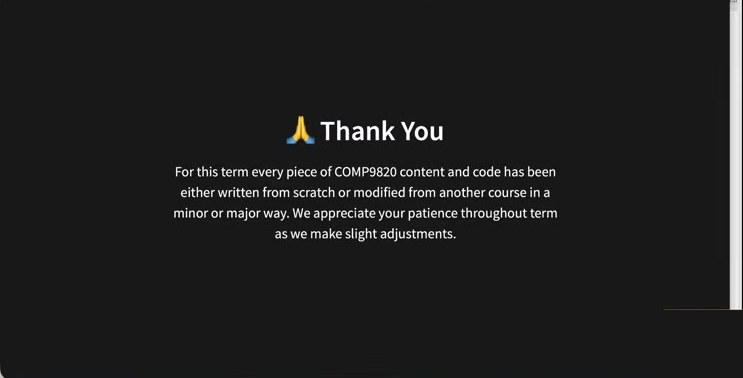

🙏 **Thank You** — For this term every piece of COMP9820 content and code has been either written from scratch or modified from another course in a minor or major way. We appreciate your patience throughout term as we make slight adjustments.

🇨🇳 新课材料大多从零设计（部分来自讲师之前教的本科软件工程基础课），按周逐步发布；欢迎反馈。

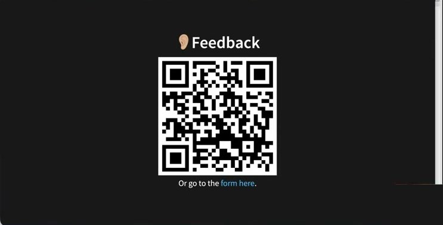

👂 **Feedback** — QR code / form（每个主题课件末尾都有，欢迎对讲座、lab、项目提意见）

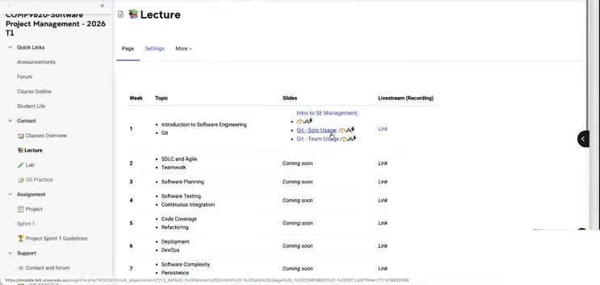

课程网站 **Lecture** 页：每周 Topic / Slides / Livestream(Recording)。Week 1：Introduction to Software Engineering、Git — Slides：Intro to SE Management、Git - Solo Usage、Git - Team Usage。Week 2 SDLC and Agile / Teamwork；Week 3 Software Planning；Week 4 Software Testing / Continuous Integration；Week 5 Code Coverage / Refactoring；Week 6 Deployment / DevOps；Week 7 Software Complexity / Persistence…

💬 录像两份：**YouTube**（有广告，无法控制）与 **SharePoint**（无广告，可访问性稍差），任选。课件按主题拆分；讲不完下周继续。

### 7. 课程网站：Assignments Overview 与 Sprint 1

（休息后 00:58–01:10，讲师统一回答休息时收到的作业问题）

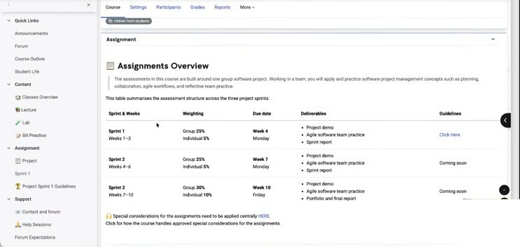

**📋 Assignments Overview** — The assessments in this course are built around one group software project. Working in a team, you will apply and practice software project management concepts such as planning, collaboration, agile workflows, and reflective practice.

| Sprint & Weeks | Weighting | Due date | Deliverables |
|---|---|---|---|
| Sprint 1 (Weeks 1–3) | Group 25% / Individual 5% | **Week 4 Monday** | Project demo · Agile software team practice · Sprint report |
| Sprint 2 (Weeks 4–6) | Group 25% / Individual 5% | **Week 7 Monday** | Project demo · Agile software team practice · Sprint report |
| Sprint 3 (Weeks 7–10) | Group 30% / Individual 10% | **Week 10 Friday** | Project demo · Agile software team practice · Portfolio and final report |

Special considerations for the assignments need to be applied centrally HERE.

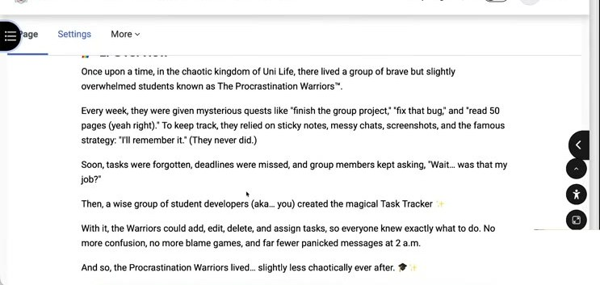

**COMP9820 Project · 🏆 Task Tracker** — 1. Overview：讲师编的小故事——"Procrastination Warriors"们用便利贴、聊天记录、截图记任务，结果任务遗忘、deadline 错过；于是一群学生开发者（就是你们）创建了神奇的 **Task Tracker**：可添加、编辑、删除、分配任务，让每个人都清楚该做什么。

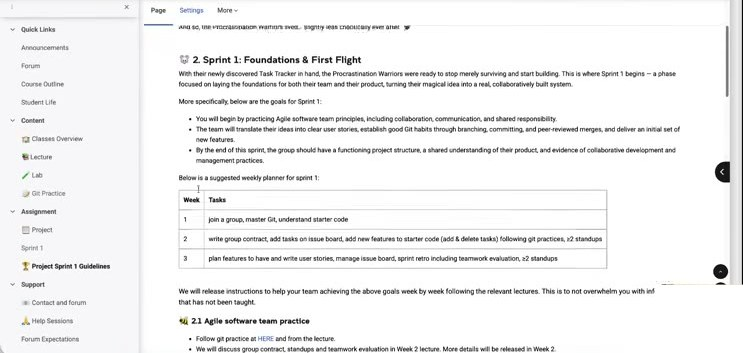

**2. Sprint 1: Foundations & First Flight** — Goals：practice Agile software team principles (collaboration, communication, shared responsibility); translate ideas into clear user stories; establish good Git habits through branching, committing, and peer-reviewed merges; deliver an initial set of new features; by the end have a functioning project structure, shared understanding of the product, and evidence of collaborative development and management practices.

| Week | Tasks |
|---|---|
| 1 | join a group, master Git, understand starter code |
| 2 | write group contract, add tasks on issue board, add new features to starter code (add & delete tasks) following git practices, ≥2 standups |
| 3 | plan features to have and write user stories, manage issue board, sprint retro including teamwork evaluation, ≥2 standups |

2.1 Agile software team practice（Git practice → Week 1 lecture；2.2 Planning – user stories → Week 3；2.3 Participation and standups（Weeks 2–3 每周 2 次，一次在 lab 上当着 tutor）；2.4 Teamwork Evaluation（Participation / Dependability / Team Wellbeing / Work contribution）

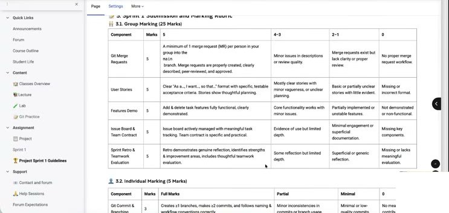

**3. Sprint 1 Submission and Marking Rubric** — 3.1 Group Marking (25 Marks)：Git Merge Requests 5 · User Stories 5 · Features Demo 5 · Issue Board & Team Contract 5 · Sprint Retro & Teamwork Evaluation 5；3.2 Individual Marking (5 Marks)：Git Commit & Branching 3 · Participation & Standups 2（完整表格见 Week 2 笔记）。

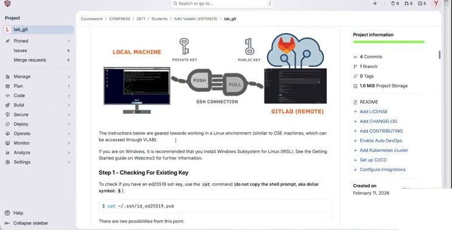

GitLab 上每人已有两个仓库：**lab_git**（Git 分步练习：检查/生成 ed25519 SSH key → 添加到 GitLab → clone/push…，不计分但"超级超级重要"）和项目仓库。

💬 讲师回答：
- 三个 sprint 截止 Week 4 Mon / Week 7 Mon / Week 10 Fri；每个 sprint 末 tutor 给反馈。指南分阶段发布，每个 sprint 有**每周计划表**。
- **组分 + 个人分**：把小组当创业公司，互相学习支持；有人擅长编码，有人擅长处理冲突/规划分工，尽力贡献即可。**完全不写代码不行——每个人都要写代码**（不写代码怎么学会管理代码、处理冲突？）。
- **每组 4–5 人，随机分组**（公平起见）；分组原则之一：**组里不会只有一个女生**（本人愿意除外）。对分组有顾虑在 Week 1 lab 告诉 tutor，尽早提。
- 题目为整个项目共用；Sprint 1 打基础（Agile 实践、用户故事、Git）；Sprint 2 更多**工具**（pipeline 自动化、**部署**）；Sprint 3 更自由（会话、注册等）。**Sprint 1 分最好拿，2 更难，3 最难。**
- 线上问 cloud 等：不是重点，可自学。Lab 时间表在今晚 **newsletter**（每周一发）。

---

## Lecture 1.2 — Git · Version Control · Solo Usage

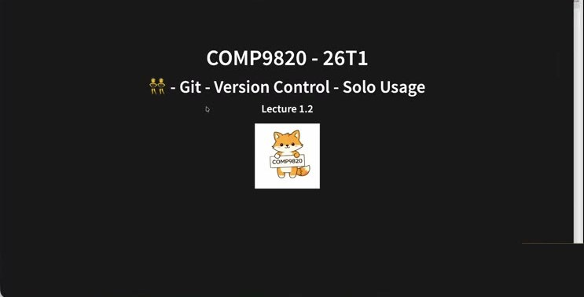

**COMP9820 - 26T1 · 👥 Git - Version Control - Solo Usage · Lecture 1.2**

💬 讲师引入：回到开头的问题——谁改了什么？怎么"坐时光机"回到之前版本？多人如何协作？学生答"保存代码"。用 Google Doc 存代码？存 v1.1、v2.0 多个副本？Google Drive 共享？——这些其实也是版本控制，但不方便、不是为代码设计的。

### 8. The Problem / A Popular Solution: Git

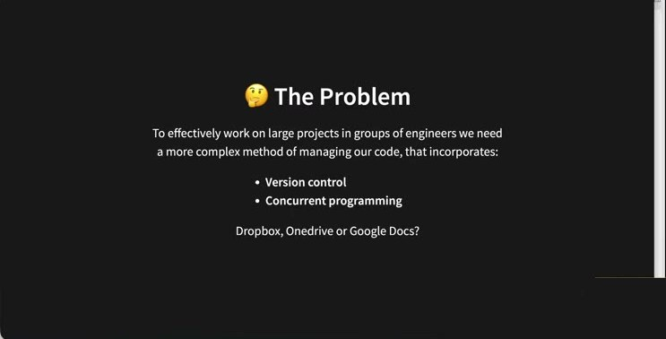

🤔 **The Problem** — To effectively work on large projects in groups of engineers we need a more complex method of managing our code, that incorporates:
- **Version control**
- **Concurrent programming**

Dropbox, Onedrive or Google Docs?

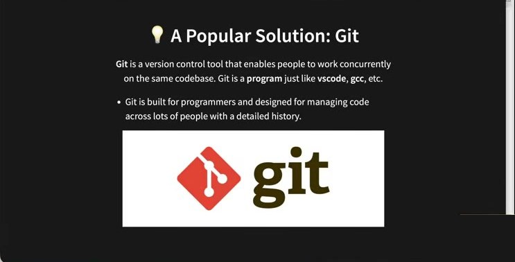

💡 **A Popular Solution: Git** — **Git** is a version control tool that enables people to work concurrently on the same codebase. Git is a **program** just like **vscode**, **gcc**, etc.
- Git is built for programmers and designed for managing code across lots of people with a detailed history.

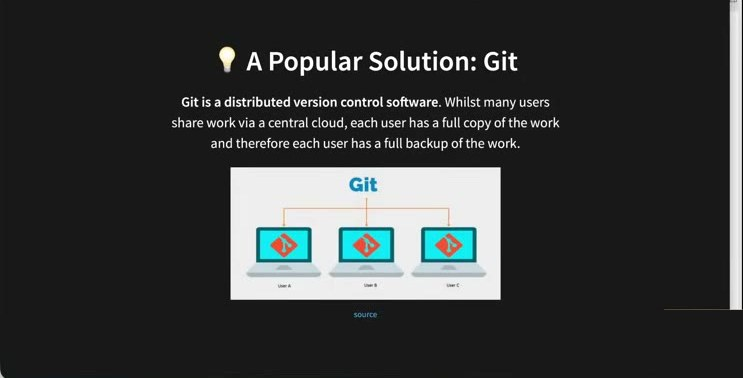

💡 **A Popular Solution: Git** — **Git is a distributed version control software.** Whilst many users share work via a central cloud, each user has a full copy of the work and therefore each user has a full backup of the work.

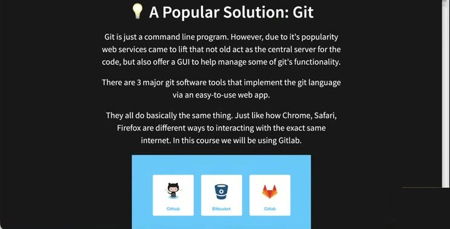

💡 **A Popular Solution: Git** — Git is just a command line program. However, due to it's popularity web services came to lift that not old act as the central server for the code, but also offer a GUI to help manage some of git's functionality. There are 3 major git software tools that implement the git language via an easy-to-use web app. They all do basically the same thing. Just like how Chrome, Safari, Firefox are different ways to interacting with the exact same internet. In this course we will be using **Gitlab**.（GitHub · Bitbucket · GitLab）

🇨🇳 Git 是版本控制工具，让多人**并发**在同一代码库工作；它是程序（像 gcc、vscode）；**分布式**——每人有完整副本即完整备份。GitLab/GitHub/Bitbucket 本质都是 Git，只是提供了网页 GUI 和中央服务器；本课用 **GitLab**（`gitlab.cse.unsw.edu.au`）。两种使用方式：终端命令行 + GUI，今天两种都用。

### 9. Learning Git in 3 Stages

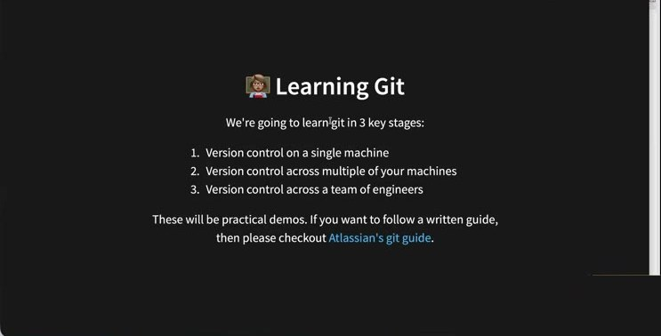

👩‍🏫 **Learning Git** — We're going to learn git in 3 key stages:
1. Version control on a single machine
2. Version control across multiple of your machines
3. Version control across a team of engineers

These will be practical demos. If you want to follow a written guide, then please checkout **Atlassian's git guide**.

### 10. Stage 1：单机演示（clone / add / commit / push / status）

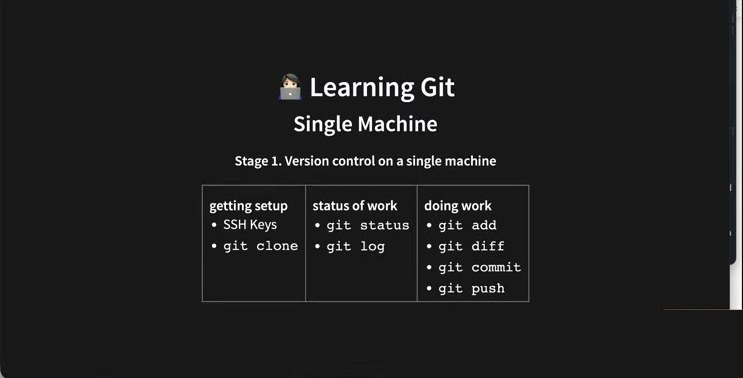

👩‍🏫 **Learning Git — Single Machine** — Stage 1. Version control on a single machine

| getting setup | status of work | doing work |
|---|---|---|
| SSH Keys · `git clone` | `git status` · `git log` | `git add` · `git diff` · `git commit` · `git push` |

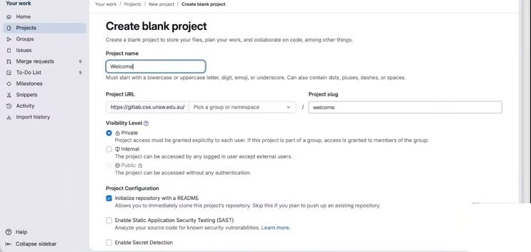
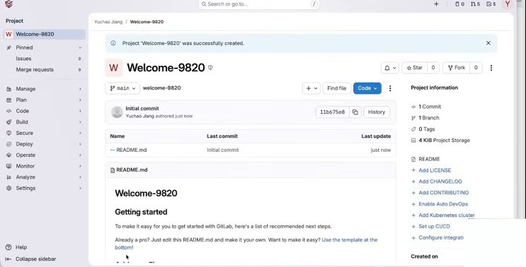

**演示 ①：在 GitLab 新建项目** — `gitlab.cse.unsw.edu.au` → 右上角 "+" → **Create blank project** → Project name（示例 `Welcome-9820`）→ Project URL 选自己的 zID 命名空间 → Visibility：**Private**（需逐个授权）/ **Internal**（任何登录用户可见，讲师选此以便大家查看）/ Public → 勾选 Initialize repository with a README → Create project。得到只含 `README.md` 的仓库。

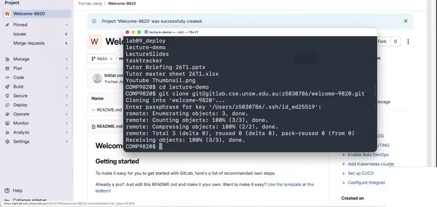

**演示 ②：clone 到本地** — 平时不在浏览器写代码，而在 VS Code 等编辑器；用 **`git clone`** 把 GitLab 上的项目复制到自己电脑：在 GitLab 点 **Code → Clone with SSH** 复制 URL → 终端 `cd` 到目标目录（讲师的 `lecture-demo`）→

```bash
git clone git@gitlab.cse.unsw.edu.au:z5030786/welcome-9820.git
# Enter passphrase for key ... （需先按 lab_git 配置 SSH key）
ls            # welcome-9820
cd welcome-9820 && ls   # README.md
code .        # 用 VS Code 打开
```

🇨🇳 类比：GitLab 像云上的文档，但它在**远端服务器**；本地要用编辑器工作，所以 clone 一份。在 VS Code 新建 `git.md`（markdown：不是可运行代码，只是带格式的文本）→ 刷新 GitLab **看不到**——改动只在本地，尚未同步。

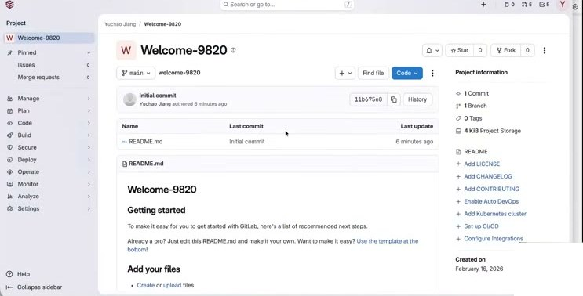
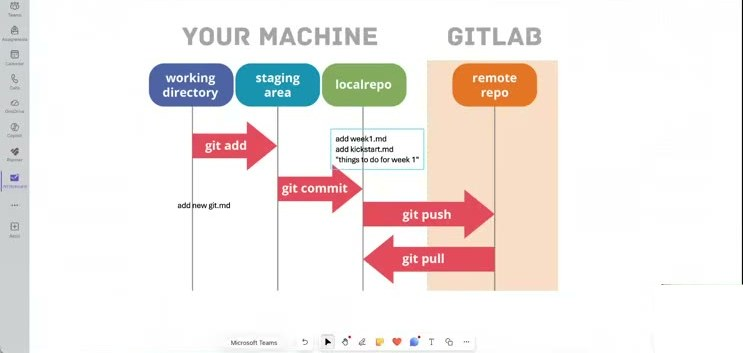

**四个区域（Teams 白板图）**

```
YOUR MACHINE                                     GITLAB
working directory → staging area → local repo → remote repo
              git add        git commit      git push  →
                                             ← git pull
```

- **Working directory**：你的机器。改动只在本地，不影响正在使用产品的用户，也不影响队友。
- **Staging area** / **Local repo** / **Remote repo**（GitLab，团队所有人看到同一份）。

**演示 ③：为什么要分区** — 同时改了不相关的东西：`git.md`（Git 笔记，还没学完）和 `week1.md`（本周事项：practice git、kickstart project、form groups）。只想先推 week1：

```bash
git add week1.md        # 只有 week1.md 进入 staging；远端仍看不到
# 又加了同主题的 kickstart.md（放 Python 代码熟悉环境）
git add kickstart.md
git commit -m "things to do about week 1"   # 打包进 local repo，必须写 message
git push                # 输入 passphrase → 刷新 GitLab：两个文件出现，共享同一条 commit
```

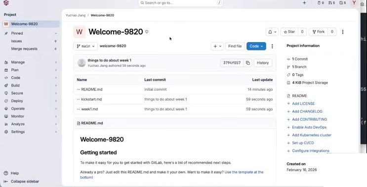
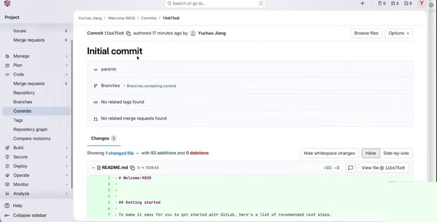

💬 **Q：为什么需要 `git add`？** ——Git 要知道你想把哪些文件打进这个包。没有 staging 就只能把 `git.md`、`week1.md`、`kickstart.md` 这些**不相关**的改动一起提交，历史很乱，别人和一年后的你都不知道目的。**commit 就是项目的历史**——GitLab 的 Commits 页可看到 initial commit 与 "things to do about week 1"（2 个改动文件、具体差异）。**Q：不小心 add 了不该加的怎么办？** ——留作课后作业。

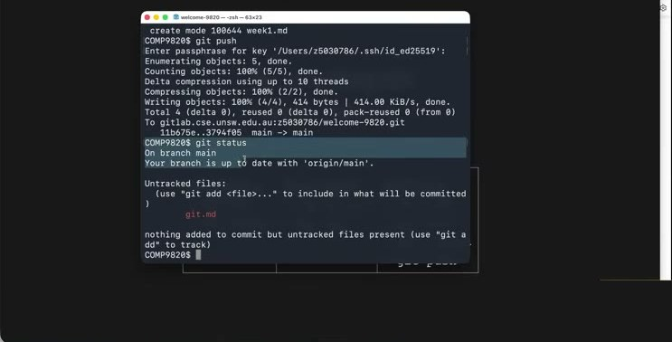

**`git status`**：

```
On branch main
Your branch is up to date with 'origin/main'.
Untracked files:
  (use "git add <file>..." to include in what will be committed)
        git.md
nothing added to commit but untracked files present (use "git add" to track)
```

🇨🇳 显示当前分支（`main`，稍后解释）；`git.md` 仍在工作目录、从未 add，Git 尚未追踪（untracked）；staging 为空。随后把 `git.md` 也 `add` / `commit -m "initial git.md"` / `push`。

### 11. Stage 2：多台机器（pull / merge conflict）

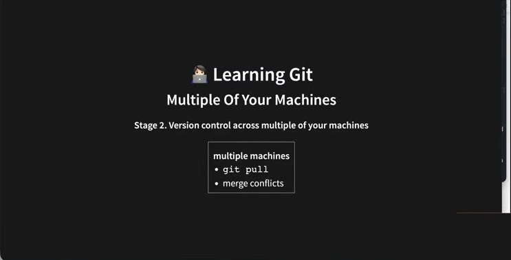

👩‍🏫 **Learning Git — Multiple Of Your Machines** — Stage 2. Version control across multiple of your machines — **multiple machines**：`git pull` · merge conflicts

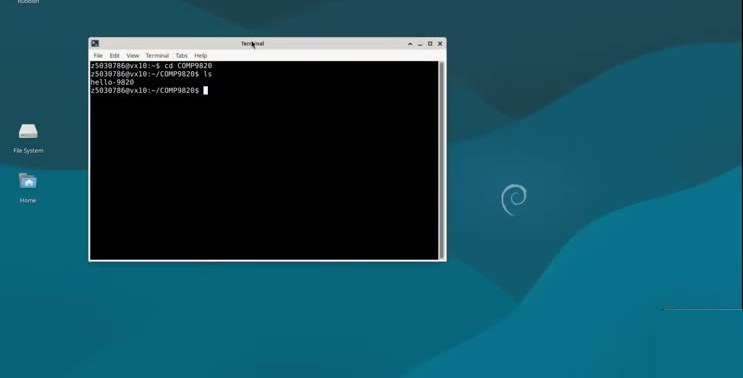

**演示 ④：第二台机器** — 讲师用 **TigerVNC** 远程控制 CSE 机器当"学校电脑"：`git clone` → `code .` → 文件都在。在学校机器上改 `git.md`（加 `git add / commit / push`）→ 回家前：

```bash
git add git.md
git commit -m "add git.md"   # 学生给的 message；讲师：要有意义，不要 "fix" / "random"
git push
```

回家打开本地项目却**只有旧内容**——改动在远端；要 **`git pull`** 把远端拉到本地（"魔法"演示）。**回家/换机器后、动手改之前第一件事就是 `git pull`。** 在家再改（加 pull、status）→ add → commit "add pull and status to git.md" → push。

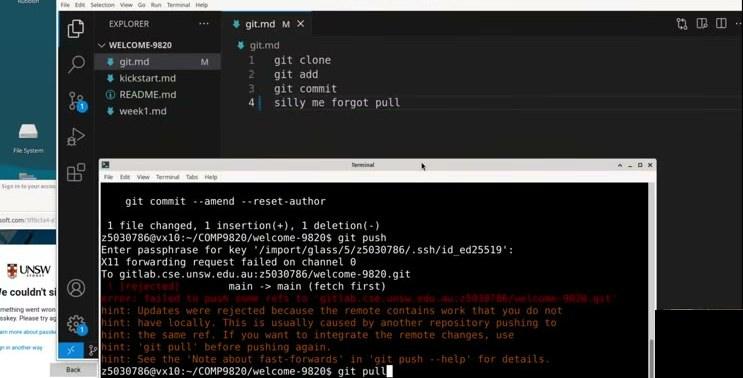

**演示 ⑤：忘了 pull → 冲突** — 第二天在学校**忘了 pull**，直接改（写了 "silly me forgot pull"，还删了些行）→ add → commit "silly work" → **push 被拒绝**：

```
! [rejected]        main -> main (fetch first)
error: failed to push some refs to 'gitlab.cse.unsw.edu.au:z5030786/welcome-9820.git'
hint: Updates were rejected because the remote contains work that you do not
hint: have locally. This is usually caused by another repository pushing to
hint: the same ref. If you want to integrate the remote changes, use
hint: 'git pull' before pushing again.
```

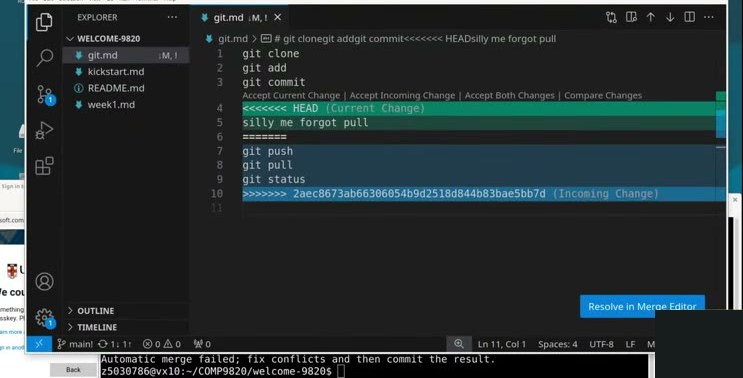
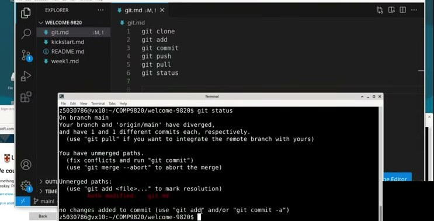

照提示 **`git pull`** → `Automatic merge failed; fix conflicts and then commit the result.` VS Code 中出现冲突标记：

```
git clone
git add
git commit
<<<<<<< HEAD (Current Change)
silly me forgot pull
=======
git push
git pull
git status
>>>>>>> 2aec8673ab66306054b9d2518d844b83bae5bb7d (Incoming Change)
```

🇨🇳 Git 把远端改动和本地改动**都保留**在文件里（它不知道该留哪个），由你删掉不要的（删掉 "silly me…"）→ 保存 → `git status`（unmerged paths）→ `git add git.md` → `git commit -m "fix silly me conflict"` → `git pull`（Already up to date）→ `git push`。这叫 **merge conflict**（代码之间的冲突，不是人之间的）。

💬 **Q：只改同一文件才冲突吗？新增不同文件呢？** ——新增不同文件没问题，Git 会自动合并；只有它解决不了的冲突才需要你处理。lab_git 里有练习。

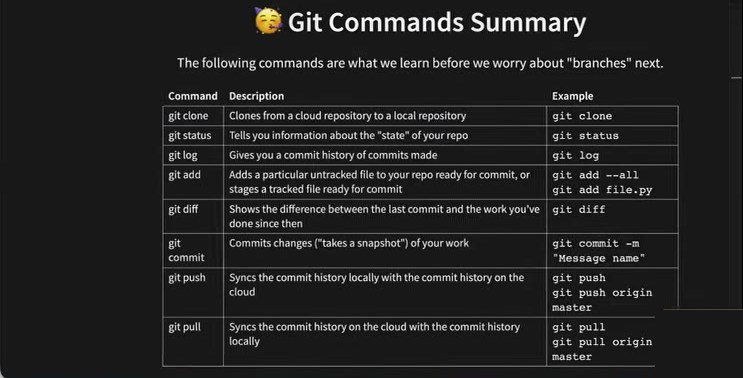

🥳 **Git Commands Summary** — The following commands are what we learn before we worry about "branches" next.

| Command | Description | Example |
|---|---|---|
| `git clone` | Clones from a cloud repository to a local repository | `git clone` |
| `git status` | Tells you information about the "state" of your repo | `git status` |
| `git log` | Gives you a commit history of commits made | `git log` |
| `git add` | Adds a particular untracked file to your repo ready for commit, or stages a tracked file ready for commit | `git add --all` / `git add file.py` |
| `git diff` | Shows the difference between the last commit and the work you've done since then | `git diff` |
| `git commit` | Commits changes ("takes a snapshot") of your work | `git commit -m "Message name"` |
| `git push` | Syncs the commit history locally with the commit history on the cloud | `git push` / `git push origin master` |
| `git pull` | Syncs the commit history on the cloud with the commit history locally | `git pull` / `git pull origin master` |

---

## Lecture 1.3 — Git · Team Usage

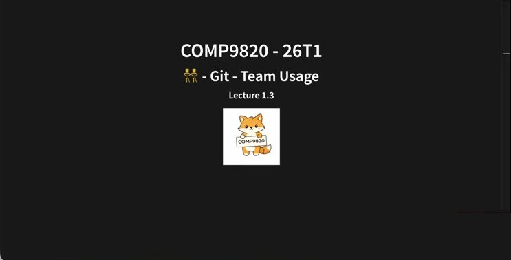

**COMP9820 - 26T1 · 👥 Git - Team Usage · Lecture 1.3**

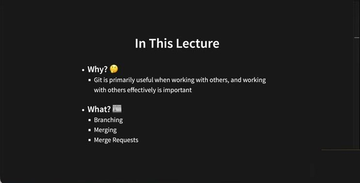

**In This Lecture**
- **Why? 🤔** Git is primarily useful when working with others, and working with others effectively is important
- **What? 📖** Branching · Merging · Merge Requests

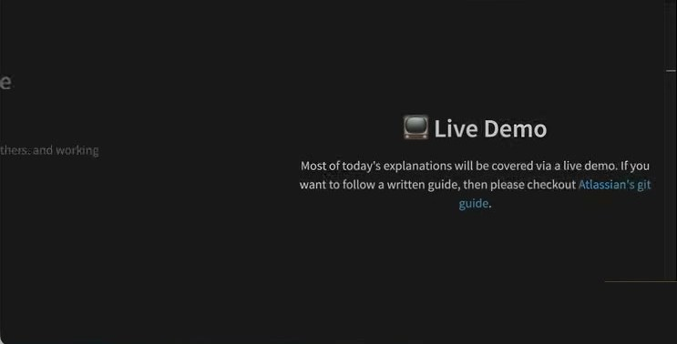

🖥️ **Live Demo** — Most of today's explanations will be covered via a live demo. If you want to follow a written guide, then please checkout Atlassian's git guide.

💬 讲师：Branching 一开始会困惑，很正常，10 分钟没懂没关系——软件工程靠**练习**，lab 里动手才会懂。

### 12. The Git Tree Model / Branches

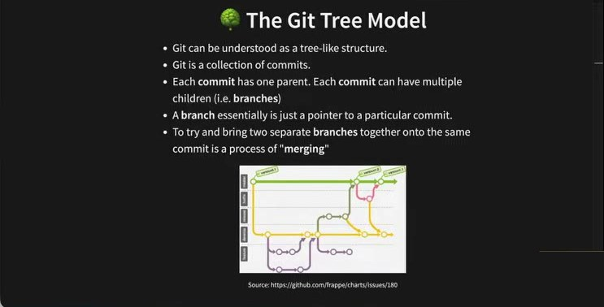

🌳 **The Git Tree Model**
- Git can be understood as a tree-like structure.
- Git is a collection of commits.
- Each **commit** has one parent. Each **commit** can have multiple children (i.e. **branches**)
- A **branch** essentially is just a pointer to a particular commit.
- To try and bring two separate **branches** together onto the same commit is a process of "**merging**"

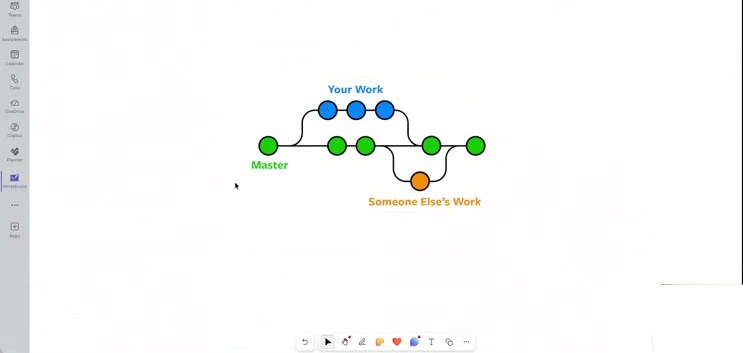
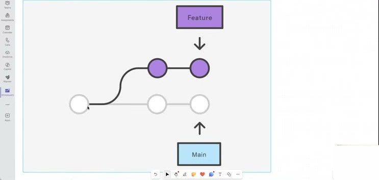

（白板图：Master 主线 + "Your Work" / "Someone Else's Work" 分支；Feature 分支从 Main 分出再合回）

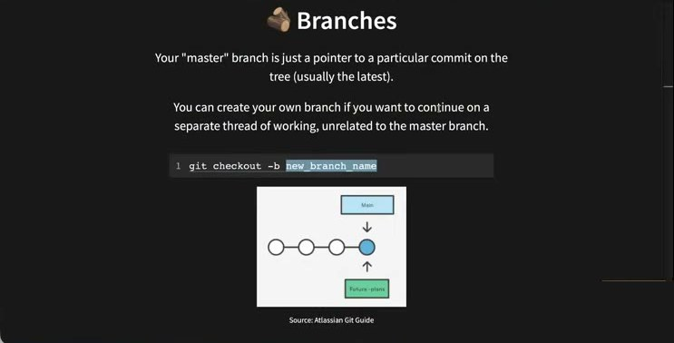
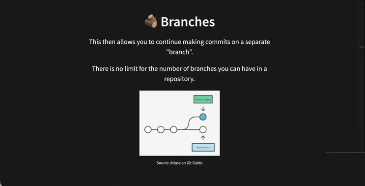

🌿 **Branches** — Your "master" branch is just a pointer to a particular commit on the tree (usually the latest). You can create your own branch if you want to continue on a separate thread of working, unrelated to the master branch.

```bash
git checkout -b new_branch_name
```

This then allows you to continue making commits on a separate "branch". There is no limit for the number of branches you can have in a repository.（Source: Atlassian Git Guide）

🇨🇳 目前工作的分支叫 **main**（有的项目叫 master，同义）——最重要的分支，**所有能工作的代码放这里，绝不放坏代码**。加新功能时代码暂时不完美很正常，但不能打扰 main → 从 main 的某个 commit **checkout 到新分支**开发；测试通过后 **merge 回 main**。

### 13. Stage 3：分支与 Merge Request 演示

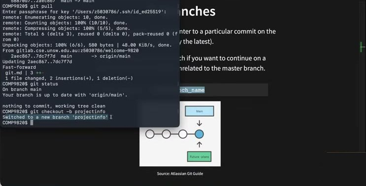
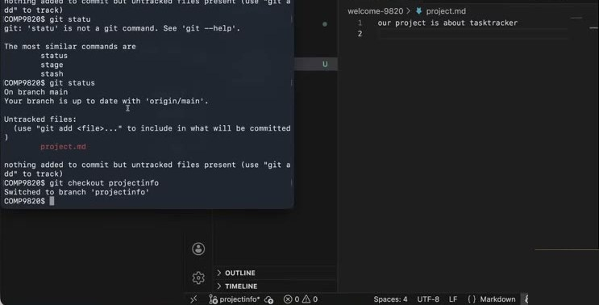

```bash
git pull                     # 动手前先 pull（Git 自动合并了之前的改动）
git status                   # On branch main
git checkout -b projectinfo  # 创建并切换：Switched to a new branch 'projectinfo'
# 新分支拥有 main 的全部文件；新建 project.md："our project is about tasktracker"
git checkout main            # 切回 main
```

💬 切回 main 后 `project.md` 仍显示（讲师："VS Code 干的，我讨厌你"）。原因：该文件还是 **untracked**、从未 add 到任何分支，所以切换分支时它跟着走；讲师现场未确认，留作本周 lab 探索。分支名要像 commit message 一样**有意义**。

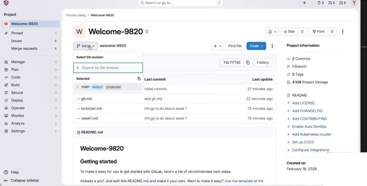

```bash
git checkout projectinfo
git add project.md
git commit -m "add new project.md"
git push
# fatal: The current branch projectinfo has no upstream branch.
# To push the current branch and set the remote as upstream, use
#     git push --set-upstream origin projectinfo
git push --set-upstream origin projectinfo
```

🇨🇳 远端只有 main、没有该分支，所以 push 报错；按提示加 `--set-upstream`。GitLab 上出现第二个分支，并提示 **Create merge request**。

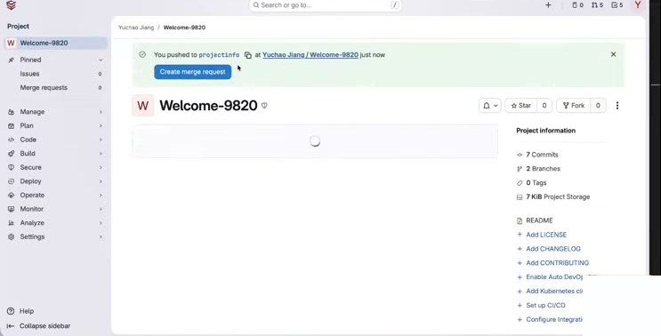
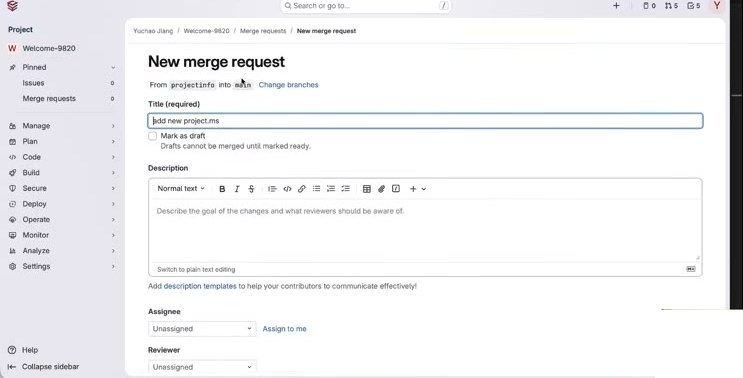
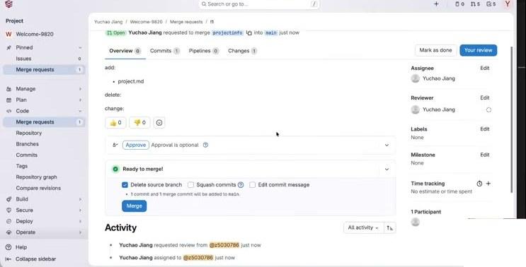
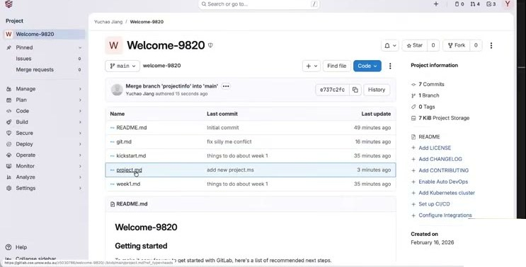

**Merge Request（在 GitLab GUI 完成）**：Create merge request → Title（"add new project.md as the new project feature"）→ Description（add: project.md / delete: … / change: …）→ **Reviewer** 选组员 → Create → reviewer 审核、评论、Approve → **Ready to merge!** → 作者点 **Merge**（可勾选 Delete source branch）→ main 上出现 `project.md`。

🇨🇳 / 💬 讲师强调：合入 main 的方式是**同伴评审（peer review）**——任何合入 main 的代码都要被复查。MR 比 commit message **更重要**：它是更大的构建块（一个功能/一个 bug 修复，可含多个 commit）。Reviewer 的职责是检查功能/修复是否就绪、合并是否安全并给反馈；但**由你自己点 merge**——对自己的代码负责。

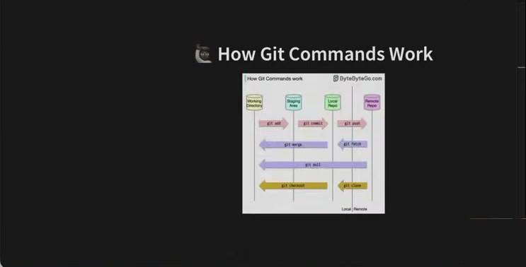

🌊 **How Git Commands Work**（ByteByteGo 图）：Working Directory ⇄ Staging Area ⇄ Local Repo ⇄ Remote Repo：`git add` → `git commit` → `git push`；`git merge` / `git fetch` / `git pull` / `git checkout` / `git clone` 反向。

---

## 附：Git 命令速查与本周待办

**本讲学到的命令**

| 阶段 | 命令 | 作用 |
|---|---|---|
| 设置 | SSH key（lab_git）、`git clone <url>` | 把 GitLab 仓库复制到本地 |
| 状态 | `git status` / `git log` / `git diff` | 当前分支、untracked/staged 文件、历史、差异 |
| 单机 | `git add <file>` → `git commit -m "有意义的信息"` → `git push` | 工作目录 → 暂存区 → 本地仓库 → 远端 |
| 多机 | `git pull`（改之前先拉）；push 被拒 → `git pull` → 手动解决 `<<<<<<< ======= >>>>>>>` → add/commit/push | 同步与 merge conflict |
| 团队 | `git checkout -b <branch>` → 开发 → `git push --set-upstream origin <branch>` → GitLab 建 MR → 组员 review → 作者 merge | 分支 + merge request |

**本周待办**
- [ ] 参加 **Week 1 lab**（分组在 lab 上；不能到要邮件 tutor）
- [ ] 完成 **lab_git**（SSH key、clone、add/commit/push、pull、冲突、分支）——不计分但"practice, practice, practice"
- [ ] 在论坛自我介绍；留意周一 **newsletter**（lab 时间表等）
- [ ] 阅读课程网站 **Project Sprint 1 Guidelines**（Week 1 任务：join a group, master Git, understand starter code）
- [ ] 课后作业：查一下"不小心 `git add` 了不该加的文件怎么撤销"；探索为什么 untracked 文件在 `git checkout` 切换分支后仍然存在
- [ ] 记住：Sprint 1 截止 **Week 4 周一**；AI 使用须声明且能解释代码；main 永远只放能工作的代码
