# COMP9820 Week 2 · Lecture 2.1 — Agile Software Team Practices（课件整理）

> 来源：YouTube 直播录像 [COMP9820 26T1 Week 2](https://www.youtube.com/watch?v=1mxH2UiLoho)（UNSW_COMP9820，2026-02-23，时长约 2 小时）
> 讲师：Yuchao Jiang
> 说明：本文件按讲师投影顺序还原课件内容。**英文为幻灯片原文**，其后的「🇨🇳」为中文翻译/解释；「💬 讲师补充」为课件上没有、但讲师口头强调的内容。所有截图位于 `images/` 目录（由视频抽帧裁剪而来）。
> 课件之外，讲师还演示了课程网站上的 4 份资源页：Teamwork Contract 模板、Standup Guide、Project Sprint 1 Guidelines、Starter Code（README/app.py），也一并整理在后半部分。

---

## 目录

- [0. 课前公告（Housekeeping）](#0-课前公告housekeeping)
- [1. In This Lecture](#1-in-this-lecture)
- [2. Agile 的起源：软件危机与重量级响应](#2-agile-的起源软件危机与重量级响应)
- [3. The Agile Manifesto（敏捷宣言核心价值）](#3-the-agile-manifesto敏捷宣言核心价值)
- [4. Critical Clarification：Agile 是一种哲学](#4-critical-clarificationagile-是一种哲学)
- [5. The Essence of Agile：两条核心原则](#5-the-essence-of-agile两条核心原则)
- [6. How To Be Agile?](#6-how-to-be-agile)
- [7. Sprints](#7-sprints)
- [8. Teamwork](#8-teamwork)
  - [8.1 Teamwork Contract](#81-teamwork-contract)
  - [8.2 Standups](#82-standups)
  - [8.3 Weekly Meetings](#83-weekly-meetings)
  - [8.4 Task / Ticket Boards（GitLab Issue Board）](#84-task--ticket-boardsgitlab-issue-board)
  - [8.5 Pair Programming](#85-pair-programming)
  - [8.6 Handling Conflict](#86-handling-conflict)
- [9. Project Sprint 1 Guidelines（项目 Sprint 1 指南）](#9-project-sprint-1-guidelines项目-sprint-1-指南)
- [10. Starter Code 讲解（Flask 前后端）](#10-starter-code-讲解flask-前后端)
- [附：本周待办清单](#附本周待办清单)

---

## 0. 课前公告（Housekeeping）

（讲师在课程网站 Moodle 上演示，约 00:05–00:11）

- **Git 很重要**：Week 1 的 Git lab 虽不计分，但整个项目每一步贡献都通过 Git 提交（"在业界我们不是上传文件到 Moodle 来交作业，而是用 Git"）。仍然不熟练的同学请继续做 Week 1 的 lab 活动。
- **Windows 用户新指南**：根据 tutor 反馈，Windows 同学安装 Git 有困难，课程网站新增 *Installing Git for Windows Systems*（WSL 安装 Linux 子系统 → 创建用户名/密码 → `sudo apt update && sudo apt upgrade`）。链接会放在本周 **newsletter**（每周课后发布一份重要通知）。
- **Lecture & Resources 页**：每周的 Topic / Slides / Livestream（YouTube 与 SharePoint 两份录像内容相同）/ Other resources 都在此页。
  - Week 1：Intro to SE Management；Git – Solo Usage；Git – Team Usage；资源：Git Practice、Lab_Git
  - Week 2：Agile Software Team Practices；Getting Started with the Project；资源：Standup Guide、Project Sprint 1 Guideline、Setting Up Guide、Teamwork Contract、Help Sessions
  - Week 3 Software Planning · Week 4 Software Testing / CI · Week 5 Code Coverage / Refactoring · Week 6 Deployment / DevOps · Week 7 Software Complexity / Persistence · Week 8 Risk Management · Week 9 Portfolio Packaging / Into the Future · Week 10 No lecture
- **Help Sessions（本周起）**：drop-in 答疑，全部线下（课程为纯线下课），安排在各 lab 的尾段，tutor 优先回答本班问题，其他班同学也可来。时间表在课程网站 *Help Session Schedule*（Weeks 2–9，周二至周五多个时段，地点 Gold G05 / Quad G05 / Webst 252 / Mat 214 等）。
- **Git Practice 页**（课程网站）：好的 commit message（Descriptive yet Concise / Single-Purpose / Unique and Non-Repetitive；✅ "Fix login failure when password contains special characters"，❌ "Fix stuff"）和 Merge Request 规范（每个 MR 一个功能；Sprint 1 每人至少一个 MR；MR 必须由他人审核并在批准后由作者合并；分支命名 `<type>-<feature-name>-<short-description>`，如 `feature-add-task`、`bugfix-password-validation`、`docs-update-readme`）。

---

## 1. In This Lecture

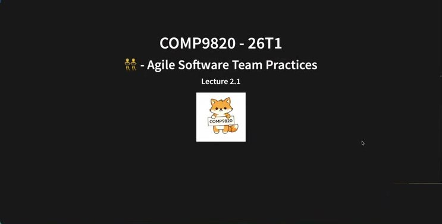

**COMP9820 - 26T1 · 👥 Agile Software Team Practices · Lecture 2.1**

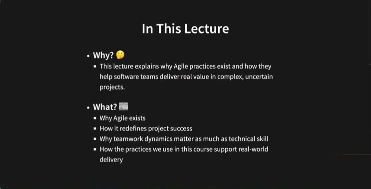

- **Why? 🤔** This lecture explains why Agile practices exist and how they help software teams deliver real value in complex, uncertain projects.
- **What? 📖**
  - Why Agile exists
  - How it redefines project success
  - Why teamwork dynamics matter as much as technical skill
  - How the practices we use in this course support real-world delivery

🇨🇳 本讲回答两个问题：**为什么**需要敏捷（它如何帮助团队在复杂、不确定的项目中交付真正的价值），以及**是什么**（敏捷为何出现、如何重新定义"项目成功"、为何团队协作与技术能力同等重要、本课程采用的实践如何支撑真实交付）。

💬 讲师补充：所有课的结构都是"Why → How"。课堂提问"你对 Agile 的理解？"学生答：把大项目拆成小块并保证每块有价值；更灵活；没有严格规则；不那么重文档。讲师：都对，但 Agile 比这些更多。

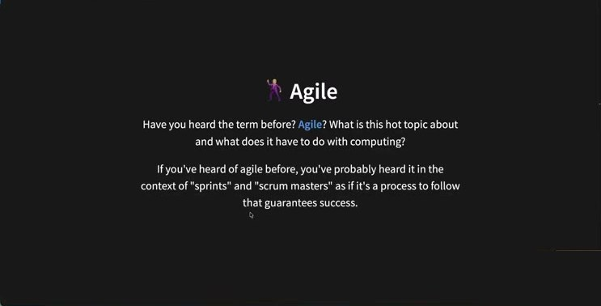

> 🕺 **Agile** — Have you heard the term before? What is this hot topic about and what does it have to do with computing?
> If you've heard of agile before, you've probably heard it in the context of "sprints" and "scrum masters" as if it's a process to follow that guarantees success.

🇨🇳 你可能在"sprint""scrum master"这些词的语境里听过 Agile，好像它是一个照做就能成功的流程——但并非如此。

---

## 2. Agile 的起源：软件危机与重量级响应

### Agile's Genesis: The Software Crisis And The Heavyweight Response

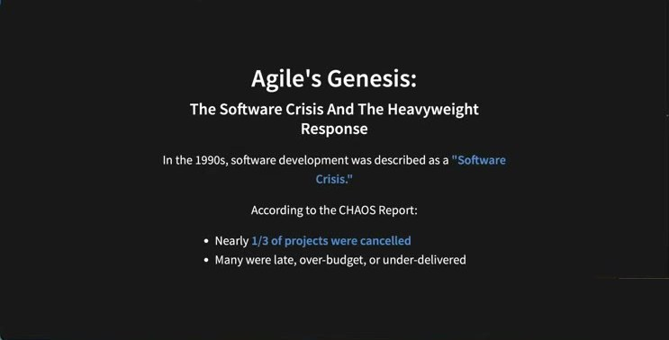

In the 1990s, software development was described as a **"Software Crisis."** According to the CHAOS Report:
- Nearly **1/3 of projects were cancelled**
- Many were late, over-budget, or under-delivered

🇨🇳 1990 年代被称为"软件危机"：近三分之一的项目被取消，大量项目延期、超预算或交付不足。

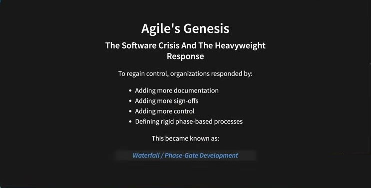

To regain control, organizations responded by:
- Adding more documentation
- Adding more sign-offs
- Adding more control
- Defining rigid phase-based processes

This became known as: **Waterfall / Phase-Gate Development**

🇨🇳 为了重新掌控，组织的反应是：加更多文档、更多签字审批、更多控制、定义严格的分阶段流程——这就是瀑布 / 阶段门（Phase-Gate）开发。

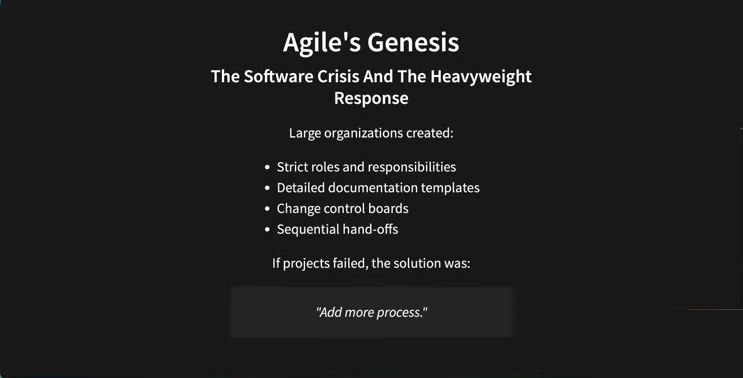

Large organizations created:
- Strict roles and responsibilities
- Detailed documentation templates
- Change control boards
- Sequential hand-offs

If projects failed, the solution was: *"Add more process."*

🇨🇳 大型组织创建了严格的角色职责、详细的文档模板、变更控制委员会、顺序式交接。项目失败？答案永远是"再加流程"。

💬 讲师补充：这就是上周讲的瀑布模型——需求 → 设计（房子有几间房、几个厕所）→ 编码 → 测试 → 上线 → 维护，每个阶段有严格的进入下一阶段的规则。听上去都合理（对其他工程学科确实合理），**但对软件项目没有奏效**。

### Birth Of Lightweight Methods

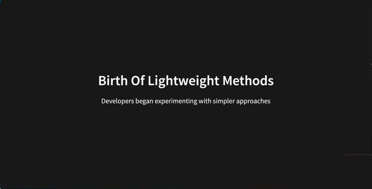

Developers began experimenting with simpler approaches.

🇨🇳 既然"加流程"无效，一批开发者聚在一起尝试更简单的方法，最终产生了敏捷宣言。

---

## 3. The Agile Manifesto（敏捷宣言核心价值）

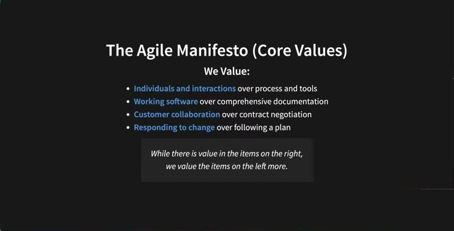

**We Value:**
- **Individuals and interactions** over process and tools
- **Working software** over comprehensive documentation
- **Customer collaboration** over contract negotiation
- **Responding to change** over following a plan

> *While there is value in the items on the right, we value the items on the left more.*

🇨🇳 我们更重视：**个体与互动** 胜过流程与工具；**可工作的软件** 胜过面面俱到的文档；**客户协作** 胜过合同谈判；**响应变化** 胜过遵循计划。右侧的事项仍有价值，但左侧更重要。

💬 讲师补充（课堂讨论"为什么瀑布不行而这个行"，约 00:18–00:27）：
- 这**不是流程、不是方法论，而是价值观**；右侧并非不重要——仍需要流程、工具、文档、计划，只是左侧更优先。
- **少官僚**：不必层层找经理签字；但 review 仍重要——责任由整个团队分担，"在敏捷世界里人人都是经理"。
- **客户协作 / 反馈**：反馈应来自真正使用软件的用户，而非"自以为了解用户"的经理。合同是项目初期谈出来的，未必反映真实用户需求。
- **响应变化**：变化无处不在——最初误判需求；世界变化（尤其 AI 时代）导致需求变化；团队人员变动（骨干离开、新人带来新技能）。要尽快响应，而不是抱着合同回去找经理审批。
- **可工作的软件**：没人喜欢写文档，且非常耗时；文档本身不给客户带来价值。但仍需要**基础文档**（如何运行代码等），对新成员上手尤其重要。
- **个体与互动**：人是一切的中心——不只是客户和经理，而是团队里每个人。每个小组的偏好、技能、协作方式都不同，要找到最适合自己小组的方式。再高级的工具，人不用或不合适也没用。

---

## 4. Critical Clarification：Agile 是一种哲学

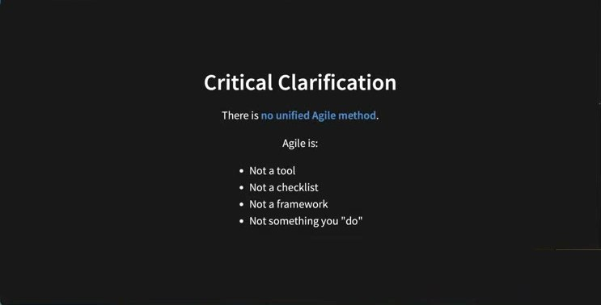

There is **no unified Agile method**. Agile is:
- Not a tool
- Not a checklist
- Not a framework
- Not something you "do"

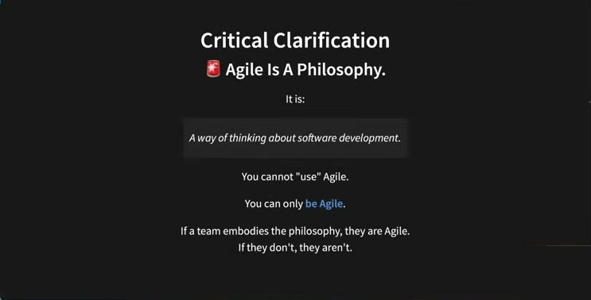

🚨 **Agile Is A Philosophy.** It is: *A way of thinking about software development.*
- You cannot "use" Agile.
- You can only **be Agile**.
- If a team embodies the philosophy, they are Agile. If they don't, they aren't.

🇨🇳 没有统一的敏捷方法。敏捷不是工具、不是清单、不是框架、不是可以"做"的东西；它是一种关于软件开发的思维方式。你不能"使用"敏捷，只能"成为"敏捷——团队体现了这种哲学就是敏捷，否则就不是。

💬 讲师补充：学生可能觉得"没有流程可以照做，太难了"——后面会给出可作为起点的具体实践，再由各组自行定制。

---

## 5. The Essence of Agile：两条核心原则

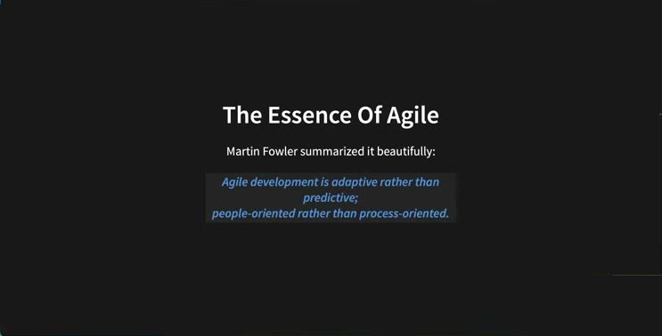

Martin Fowler summarized it beautifully:
> *Agile development is **adaptive rather than predictive**; **people-oriented rather than process-oriented**.*

🇨🇳 Martin Fowler 的总结：敏捷开发是**适应性的而非预测性的**；**以人为本而非以流程为本**。

### 5.1 Adaptive Rather Than Predictive

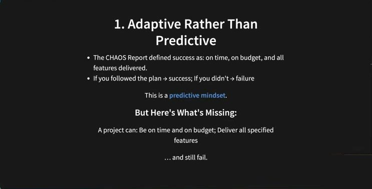

- The CHAOS Report defined success as: on time, on budget, and all features delivered.
- If you followed the plan → success; if you didn't → failure.
- This is a **predictive mindset**.

**But Here's What's Missing:** A project can be on time and on budget, deliver all specified features … *and still fail.*

🇨🇳 传统定义的成功 = 按时、按预算、交付全部功能；照计划走就是成功——这是预测性思维。但缺了什么？一个项目可以按时按预算交付了所有功能，却仍然失败（因为计划本身可能是错的）。

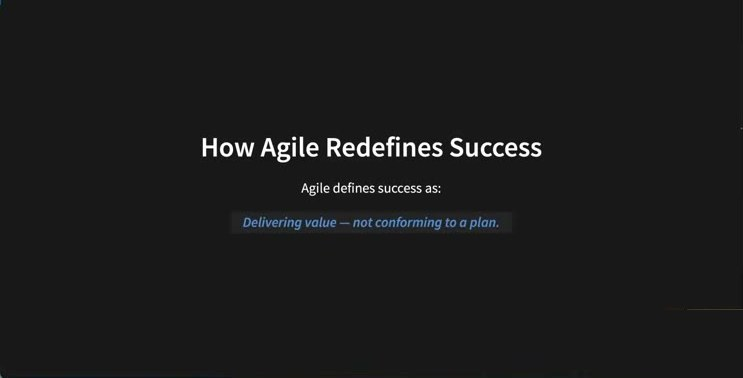

**How Agile Redefines Success** — Agile defines success as: *Delivering value — not conforming to a plan.*

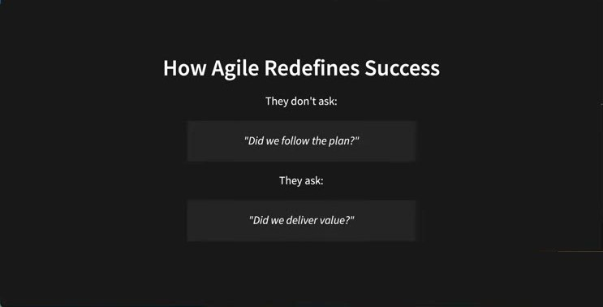

They don't ask: *"Did we follow the plan?"* — They ask: *"Did we deliver value?"*

🇨🇳 敏捷把成功重新定义为"交付价值"，而不是"符合计划"。问的不是"我们照计划做了吗"，而是"我们交付价值了吗"。

### 5.2 People-Oriented Rather Than Process-Oriented

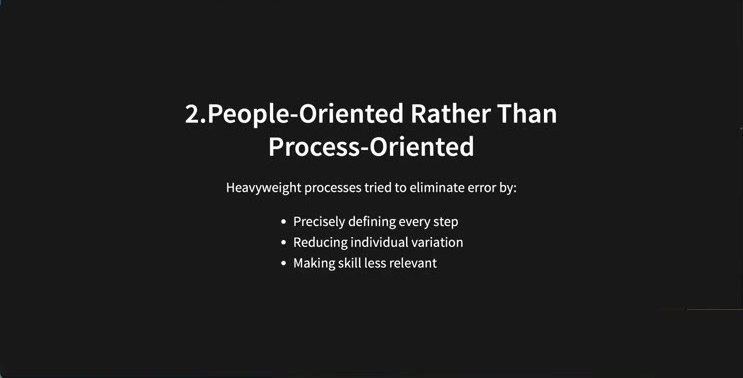

Heavyweight processes tried to eliminate error by:
- Precisely defining every step
- Reducing individual variation
- Making skill less relevant

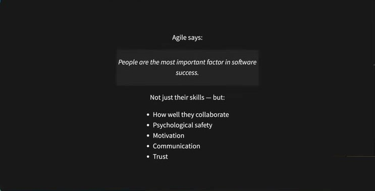

Agile says: *People are the most important factor in software success.*
Not just their skills — but:
- How well they collaborate
- Psychological safety
- Motivation
- Communication
- Trust

🇨🇳 重量级流程试图通过精确定义每一步、减少个体差异、让技能变得不重要来消除错误。敏捷则认为：人是软件成功最重要的因素——不只是技能，还包括协作质量、心理安全、动机、沟通与信任。

💬 讲师补充（约 00:29–00:35）：
- **什么样的团队最可能成功？** 学生答：一起协作、按各自技能贡献。讲师："很高兴你们没说'全是天才'。"**多元化团队**比清一色编码专家更可能成功——不同的人带来不同技能与学习目标，且要乐于协作。
- **Psychological safety（心理安全）**：Google、Amazon 等大厂都在强调——人们**敢于开口**。对计划有顾虑就说出来，不要想"我不是最聪明的，他们的决定一定是对的"。团队要鼓励发言，别人讲顾虑时要耐心倾听。"我最聪明，都听我的"会让其他人觉得无法贡献，最后你只能一个人干、只有一套技能。
- **Communication（沟通）**：敢于发言；**频繁、定期**沟通；让所有人在同一页；**透明**——10 周里有几天状态不好或没进展很正常，告诉队友、互相帮助。卡住了立刻说，否则别人以为你在推进，到 deadline 才说"我卡了两周"就太晚了。

### Process Serves People

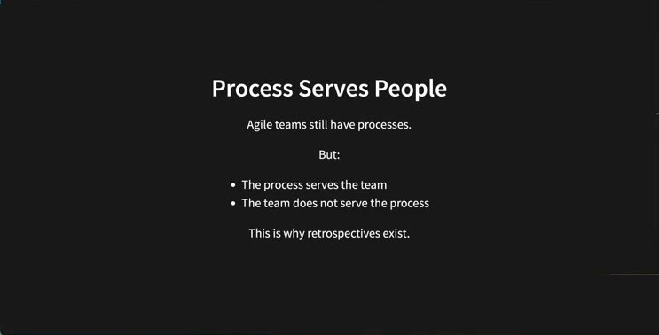

Agile teams still have processes. But:
- The process serves the team
- The team does not serve the process

This is why retrospectives exist.

🇨🇳 敏捷团队仍有流程，但流程服务于团队，而不是团队服务于流程——这就是回顾会（retrospective）存在的原因：找到最适合团队的人和工具。

---

## 6. How To Be Agile?

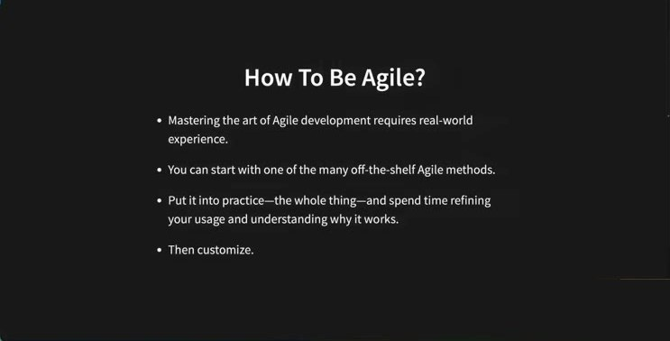

- Mastering the art of Agile development requires real-world experience.
- You can start with one of the many off-the-shelf Agile methods.
- Put it into practice—the whole thing—and spend time refining your usage and understanding why it works.
- Then customize.

🇨🇳 掌握敏捷需要真实经验。可以从现成的敏捷方法起步，完整地实践它，花时间打磨并理解它为什么有效，然后再定制。

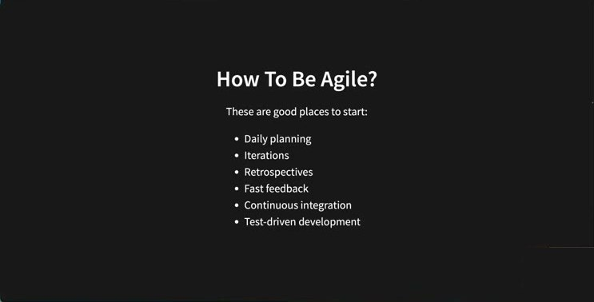

These are good places to start:
- Daily planning
- Iterations
- Retrospectives
- Fast feedback
- Continuous integration
- Test-driven development

🇨🇳 好的起点：每日计划、迭代、回顾、快速反馈、持续集成、测试驱动开发。

💬 讲师补充：这些会在后续几周逐一讲（retro 下周；CI/TDD 在 Week 4–7）。今天讲 Sprint、Teamwork（contract、standup、meeting、task board、pair programming、conflict）。

---

## 7. Sprints

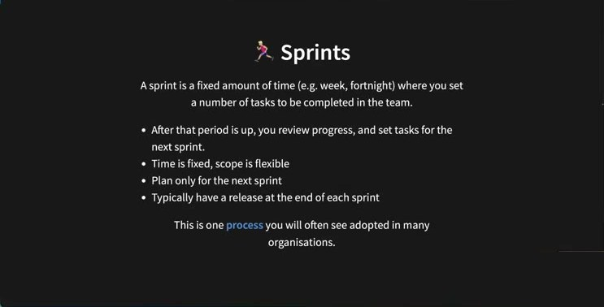

🏃 A sprint is a fixed amount of time (e.g. week, fortnight) where you set a number of tasks to be completed in the team.
- After that period is up, you review progress, and set tasks for the next sprint.
- **Time is fixed, scope is flexible**
- Plan only for the next sprint
- Typically have a release at the end of each sprint

This is one **process** you will often see adopted in many organisations.

🇨🇳 Sprint 是一段固定时长（一周、两周），团队为其设定若干要完成的任务。到期后回顾进度并为下一个 sprint 设定任务。**时间固定、范围灵活**；只为下一个 sprint 做计划；每个 sprint 结束通常有一次发布。

💬 讲师补充：
- Sprint 对应"fast feedback"与"iterations"。不必规划明年，只规划最近的一两周——因为未来会变，最近、最优先的事最重要。
- Sprint 结束时在组内互相反馈/review：这周怎么样？工具合适吗？流程要不要改？（敏捷强调响应变化）。
- 每个 sprint 结束要**带来价值**；本课程不做真实 release，而是 **demo** 给 tutor（tutor 扮演客户），展示你带来了什么价值。
- 学生问"要测试代码吗？"——Sprint 1 尚未讲测试，展示价值的方式就是向 tutor 演示项目能做什么。
- 本项目共 **3 个 sprint**。

---

## 8. Teamwork

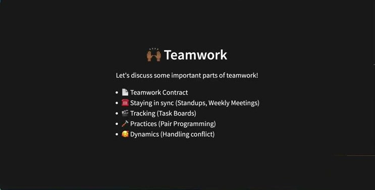

Let's discuss some important parts of teamwork!
- 📄 Teamwork Contract
- ☎️ Staying in sync (Standups, Weekly Meetings)
- 🗂️ Tracking (Task Boards)
- 🔨 Practices (Pair Programming)
- 🥰 Dynamics (Handling conflict)

🇨🇳 团队协作五要素：团队契约；保持同步（站会、周会）；任务追踪（任务板）；实践（结对编程）；团队动态（处理冲突）。

### 8.1 Teamwork Contract

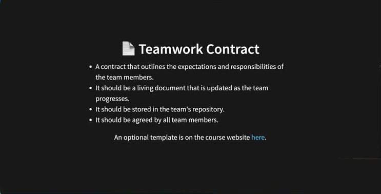

📄 **Teamwork Contract**
- A contract that outlines the expectations and responsibilities of the team members.
- It should be a **living document** that is updated as the team progresses.
- It should be stored in the team's repository.
- It should be agreed by all team members.

An optional template is on the course website.

🇨🇳 团队契约写明成员的期望与责任；它是**活文档**，随团队进展更新；存放在团队仓库中；须全体成员同意。课程网站有可选模板。

💬 讲师补充："不是说不要合同吗？"——这个契约是活文档，随时可改，但敏捷不等于没有规则。模板只是起点，不必严格照抄，找最适合本组的形式。

#### 课程网站 Teamwork Contract 模板（讲师逐段讲解，约 00:41–00:48）

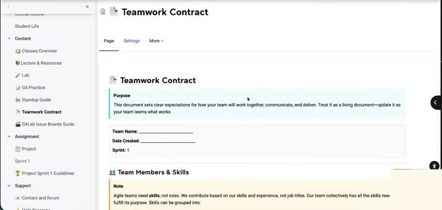

**Purpose**：This document sets clear expectations for how your team will work together, communicate, and deliver. Treat it as a living document—update it as your team learns what works.
- Team Name / Date Created / Sprint: 1

**👥 Team Members & Skills**
> Note: Agile teams need **skills**, not roles. We contribute based on our skills and experience, not job titles. Our team collectively has all the skills needed to fulfil its purpose. Skills can be grouped into:
> - **Customer skills**: Understanding user needs, product management, requirements gathering, user experience
> - **Development skills**: Programming, testing, design, architecture, technical implementation
> - **Coaching skills**: Facilitation, mentoring, process improvement, team coordination

表格列：Name | Email | Primary Skills | Additional Skills | What I'll Contribute
**Team Learning Goal**: We commit to broadening our skills over time, especially customer-related skills.

🇨🇳 传统做法是给每人一个角色（经理、前端、后端、产品负责人），业界仍常见；但敏捷更强调**技能而非角色**，责任共担——不是"我是前端就不管后端"。讲师建议用"主要技能 + 附加技能"取代角色，也可以写**想学的技能**。建议每组至少一人偏重 customer skills（下周讲需求与用户故事，Sprint 1 有相关交付物）。Coaching skills 适合想锻炼领导力的人——协调会议、发起站会，不必是编码最强的人。每个 sprint 可以调整侧重点，但要保证所有方面都有人覆盖。

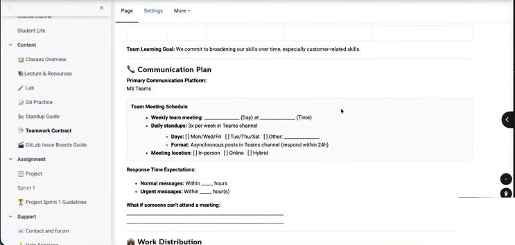

**📞 Communication Plan**
- Primary Communication Platform: **MS Teams**
- Team Meeting Schedule：Weekly team meeting ___ (Day) at ___ (Time)；Daily standups: 3x per week in Teams channel；Days [ ] Mon/Wed/Fri [ ] Tue/Thu/Sat [ ] Other；Format: Asynchronous posts in Teams channel (respond within 24h)；Meeting location [ ] In-person [ ] Online [ ] Hybrid
- Response Time Expectations：Normal messages within ___ hours；Urgent messages within ___ hour(s)
- What if someone can't attend a meeting: ___

🇨🇳 **强烈建议用 Microsoft Teams**：这是 tutor 能看到的渠道；若用 WhatsApp/Discord，日后发生冲突时课程无法查证沟通记录。建议固定会议时间让大家提前锁定日历；约定响应时限；提前想好缺席怎么办。

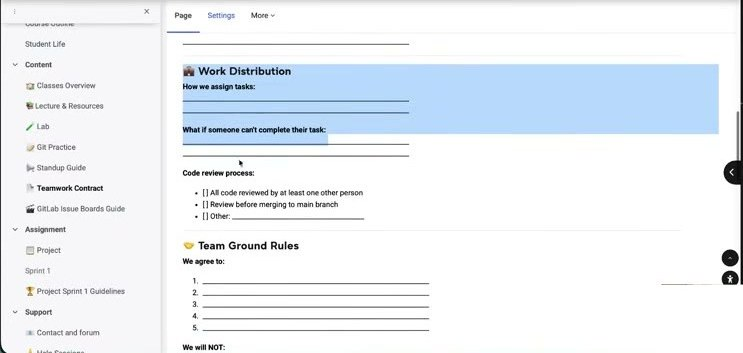

**👷 Work Distribution**：How we assign tasks ___；What if someone can't complete their task ___；Code review process [ ] All code reviewed by at least one other person [ ] Review before merging to main branch [ ] Other
**🤝 Team Ground Rules**：We agree to 1–5；We will NOT 1–3

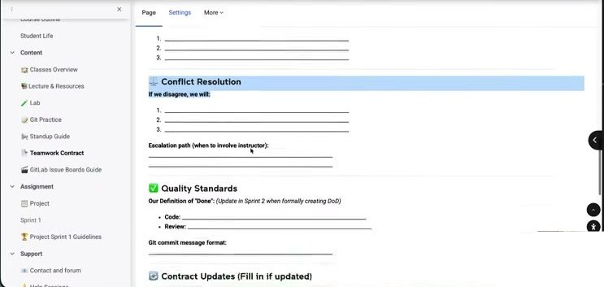

**😤 Conflict Resolution**：If we disagree, we will 1–3；Escalation path (when to involve instructor) ___
**✅ Quality Standards**：Our Definition of "Done" (Update in Sprint 2 when formally creating DoD) — Code ___ / Review ___；Git commit message format ___

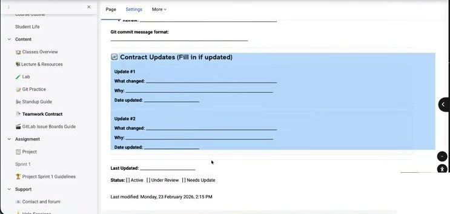

**🔄 Contract Updates (Fill in if updated)**：Update #1/#2 — What changed / Why / Date updated；Last Updated ___；Status [ ] Active [ ] Under Review [ ] Needs Update

🇨🇳 提前想好如何分工、有人完不成怎么办、是否需要 code review；团队规则；冲突如何解决、何时上报；质量标准（Sprint 2 再正式定 DoD，Sprint 1 先写自认为合适的）。契约在 Sprint 1 内更新没问题，但要**留下更新历史**（改了什么、为什么），让大家在同一页。契约是 Sprint 1 的交付物之一，本周 lab 就可以开始写。

### 8.2 Standups

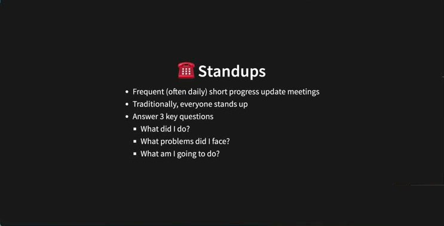

☎️ **Standups**
- Frequent (often daily) short progress update meetings
- Traditionally, everyone stands up
- Answer 3 key questions
  - What did I do?
  - What problems did I face?
  - What am I going to do?

🇨🇳 站会：频繁（通常每日）的简短进度更新会；传统上大家站着开；回答三个问题——我做了什么？遇到什么问题？接下来要做什么？

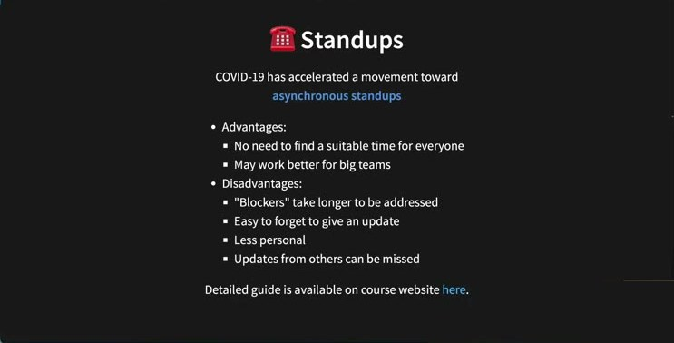

COVID-19 has accelerated a movement toward **asynchronous standups**
- Advantages: No need to find a suitable time for everyone; May work better for big teams
- Disadvantages: "Blockers" take longer to be addressed; Easy to forget to give an update; Less personal; Updates from others can be missed

Detailed guide is available on course website.

🇨🇳 疫情加速了**异步站会**：优点是不必凑时间、大团队更适用；缺点是阻塞问题解决更慢、容易忘记更新、缺乏人情味、容易错过别人的更新。

💬 讲师补充（约 00:49–01:03）：
- 不一定要开真正的会：传统是每天早上 10 点大家坐会议室；现在各自在方便的时间发（早上 8 点或半夜 12 点都行），更灵活。
- **为什么重要**：让所有人在同一页；更重要的是**尽早暴露障碍**——团队工作互相依赖，我卡住了等我交付的人也会卡住；"接下来做什么"让队友能据此规划。
- 每天最多 15 分钟，其实 2–3 分钟足够。
- **Sprint 1 只要求每周 2 次**（Weeks 2–3，任务不多、依赖少）；其中一次可在 lab 课上当着 tutor 做，tutor 可反馈进度、帮解决 blocker。可以做 3 次（周一/三/五）。
- 站会**不是给 tutor 的状态汇报**，而是团队自己对齐；不是长会。
- 形式：在 Teams 频道异步发帖即可；若开同步会议，保留会议纪要或录音也可以。
- **站会按个人计分**：tutor 需看到每周至少两次、每个人都参与。
- **从本周开始**，具体时间自行商定。
- 学生问："经理怎么处理不交东西的人？"——学生答：绩效改进计划（太正式了）、查 Git 贡献（讲师在另一门课这么做，但本课贡献方式不止编码）、跳过其部分、找 tutor。讲师建议：先联系（Teams、邮件）；**24–72 小时无回应先担心其安全**（上学期曾因学生 72 小时失联而叫了保安），报告 tutor 核实；然后跳过其工作继续——把小组当作创业公司，个人成功不算成功，**小组在 sprint 末交付价值才是目标**；计分问题找 tutor。

#### 课程网站 Standup Guide（讲师翻页讲解，约 00:56–01:02）

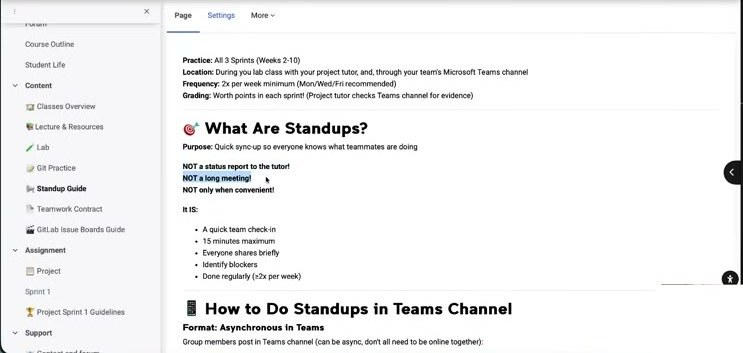

- **Practice**: All 3 Sprints (Weeks 2–10) · **Location**: During your lab class with your project tutor, and through your team's Microsoft Teams channel · **Frequency**: 2x per week minimum (Mon/Wed/Fri recommended) · **Grading**: Worth points in each sprint! (Project tutor checks Teams channel for evidence)
- **🎯 What Are Standups?** Purpose: Quick sync-up so everyone knows what teammates are doing. NOT a status report to the tutor! NOT a long meeting! NOT only when convenient! It IS: A quick team check-in · 15 minutes maximum · Everyone shares briefly · Identify blockers · Done regularly (≥2x per week)

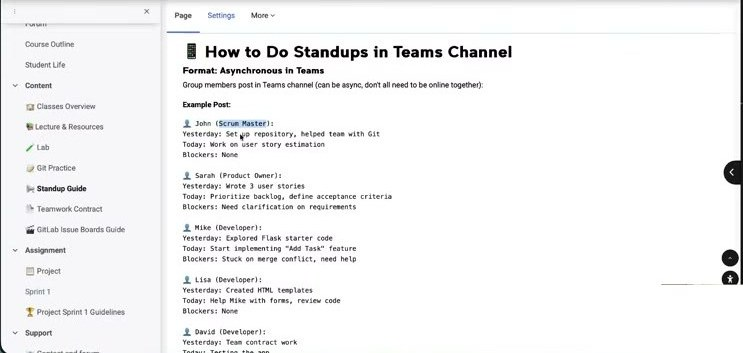

- **📱 How to Do Standups in Teams Channel** — Format: Asynchronous in Teams. Group members post in Teams channel (can be async, don't all need to be online together). Example post（每人三行：Yesterday / Today / Blockers）：
  - 👤 John (Scrum Master): Yesterday: Set up repository, helped team with Git · Today: Work on user story estimation · Blockers: None
  - 👤 Sarah (Product Owner): Yesterday: Wrote 3 user stories · Today: Prioritize backlog, define acceptance criteria · Blockers: Need clarification on requirements
  - 👤 Mike (Developer): Yesterday: Explored Flask starter code · Today: Start implementing "Add Task" feature · Blockers: Stuck on merge conflict, need help
  - 👤 Lisa (Developer): Yesterday: Created HTML templates · Today: Help Mike with forms, review code · Blockers: None
  - 👤 David (Developer): Yesterday: Team contract work · Today: Testing the app · Blockers: None
  - 📌 **Action Items**: Sarah: Ask tutor about requirements (by Wed) · Lisa: Pair with Mike on merge conflict (today)
  - Scrum Master: Posts the template, everyone responds

🇨🇳 示例里写了角色，但你们不必写角色，可写主要技能。**关键是 Action Items**——发现 blocker 就要有行动，否则站会只是一份文档。需要指定一人（通常是想锻炼领导/coaching 技能的人）发起站会。

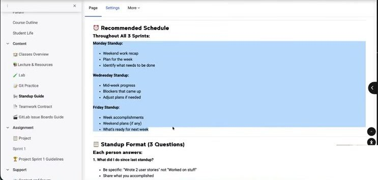

- **⏰ Recommended Schedule (Throughout All 3 Sprints)**：Monday Standup — Weekend work recap / Plan for the week / Identify what needs to be done；Wednesday Standup — Mid-week progress / Blockers that came up / Adjust plans if needed；Friday Standup — Week accomplishments / Weekend plans (if any) / What's ready for next week

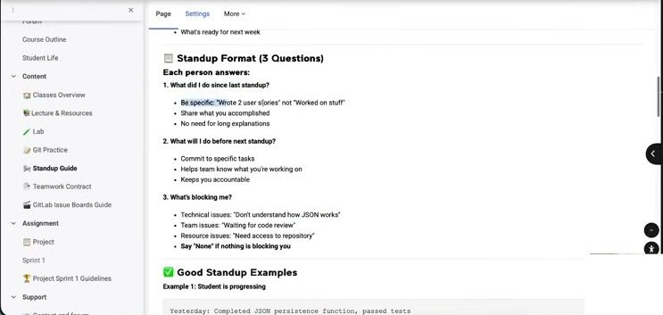

- **📋 Standup Format (3 Questions)** — Each person answers:
  1. What did I do since last standup? — Be specific: "Wrote 2 user stories" not "Worked on stuff" · Share what you accomplished · No need for long explanations
  2. What will I do before next standup? — Commit to specific tasks · Helps team know what you're working on · Keeps you accountable
  3. What's blocking me? — Technical issues: "Don't understand how JSON works" · Team issues: "Waiting for code review" · Resource issues: "Need access to repository" · Say "None" if nothing is blocking you
- **✅ Good Standup Examples** — e.g. "Yesterday: Completed JSON persistence function, passed tests"; Example 3 (Student waiting on others): "Yesterday: Finished my part of user stories / Today: Review team's stories, prepare for sprint planning / Blockers: Waiting for code review from Mike"

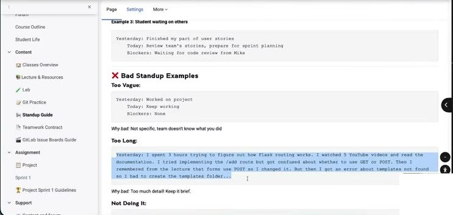

- **❌ Bad Standup Examples**
  - *Too Vague*: "Yesterday: Worked on project / Today: Keep working / Blockers: None" — Why bad: Not specific, team doesn't know what you did
  - *Too Long*: "Yesterday: I spent 3 hours trying to figure out how Flask routing works. I watched 5 YouTube videos and read the documentation. I tried implementing the /add route but got confused about whether to use GET or POST…" — Why bad: Too much detail. Keep it brief.
  - *Not Doing It*

🇨🇳 要具体（"写了 2 个用户故事"而非"做了些东西"）；没有 blocker 就写 None；卡住了要透明说出来，别人才能帮你。太长别人读不下去，太模糊别人不知道你在做什么。

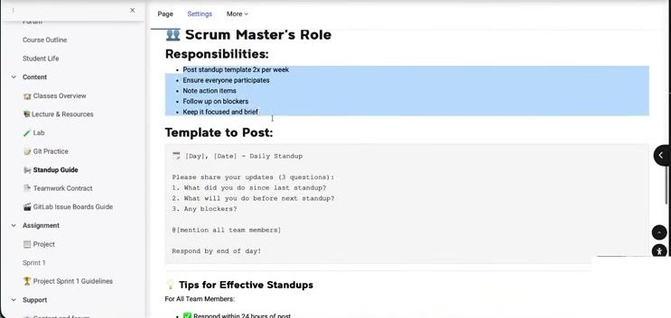

- **👥 Scrum Master's Role** — Responsibilities: Post standup template 2x per week · Ensure everyone participates · Note action items · Follow up on blockers · Keep it focused and brief
- **Template to Post**：`📅 [Day], [Date] - Daily Standup / Please share your updates (3 questions): 1. What did you do since last standup? 2. What will you do before next standup? 3. Any blockers? / @[mention all team members] / Respond by end of day!`
- **💡 Tips for Effective Standups** — For All Team Members: ✅ Respond within 24 hours of post · ✅ Make decisions on questions · ✅ Clarify requirements when needed …

🇨🇳 有人不参与，负责人应私下提醒，但不能强迫——你的职责只是确保他们知道有站会。

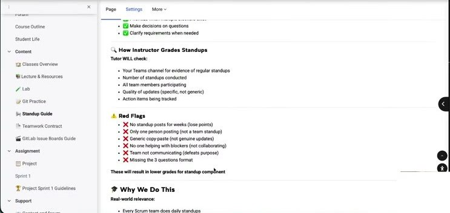

- **🔍 How Instructor Grades Standups** — Tutor WILL check: Your Teams channel for evidence of regular standups · Number of standups conducted · All team members participating · Quality of updates (specific, not generic) · Action items being tracked
- **⚠️ Red Flags** — ❌ No standup posts for weeks (lose points) · ❌ Only one person posting (not a team standup) · ❌ Generic copy-paste (not genuine updates) · ❌ No one helping with blockers (not collaborating) · ❌ Team not communicating (defeats purpose) · ❌ Missing the 3 questions format — *These will result in lower grades for standup component*
- **🎓 Why We Do This** — Real-world relevance: Every Scrum team does daily standups …

### 8.3 Weekly Meetings

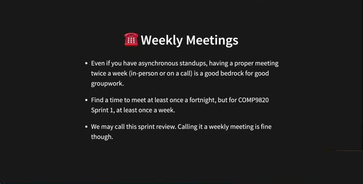

☎️ **Weekly Meetings**
- Even if you have asynchronous standups, having a proper meeting twice a week (in-person or on a call) is a good bedrock for good groupwork.
- Find a time to meet at least once a fortnight, but for COMP9820 Sprint 1, at least once a week.
- We may call this sprint review. Calling it a weekly meeting is fine though.

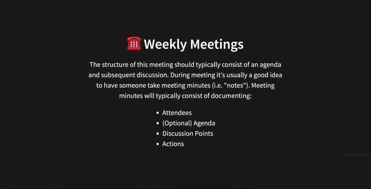

The structure of this meeting should typically consist of an agenda and subsequent discussion. During meeting it's usually a good idea to have someone take meeting minutes (i.e. "notes"). Meeting minutes will typically consist of documenting:
- Attendees
- (Optional) Agenda
- Discussion Points
- Actions

🇨🇳 即使有异步站会，每周一两次真正的会议（线下或线上）仍是良好协作的基石。会议要有议程与讨论，并由专人记录**会议纪要**：出席人、（可选）议程、讨论要点、行动项。

💬 讲师补充：**Sprint 1 不要求周会**（任务少）；**Sprint 2 起每周至少一次**，可以在 lab 课上开。周会相当于"更长的站会"——可以结对编码、讨论、规划、一起解决问题；站会异步，周会同步；需要会议纪要。形式灵活，不必死板照做。

### 8.4 Task / Ticket Boards（GitLab Issue Board）

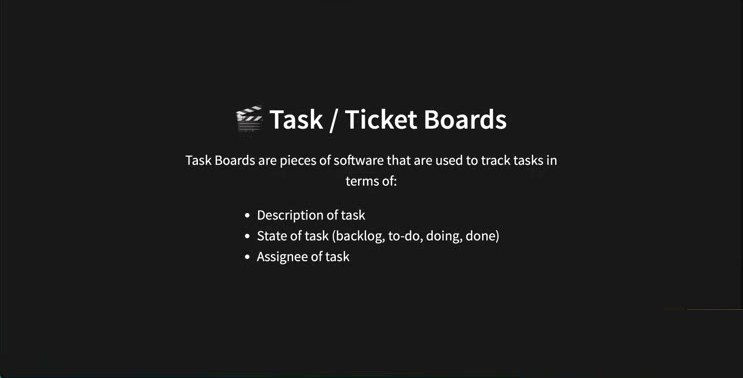

🎬 **Task / Ticket Boards** — Task Boards are pieces of software that are used to track tasks in terms of:
- Description of task
- State of task (backlog, to-do, doing, done)
- Assignee of task

🇨🇳 任务板用来跟踪任务的描述、状态（待办、进行中、完成）和负责人。

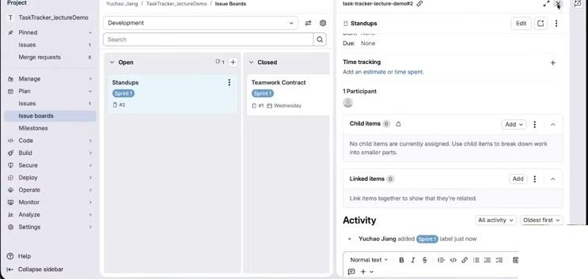
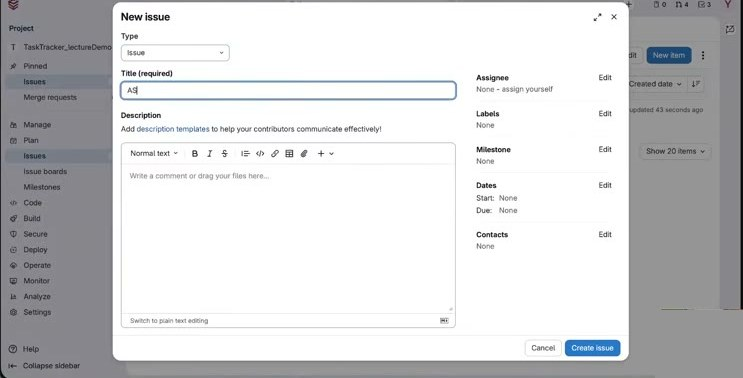

💬 讲师演示（约 01:18–01:22，GitLab）：
- 在小组项目 **Plan → Issues** 新建 issue（标题如 "Feature: adding tasks"，描述可写 research Flask / backend for adding tasks / frontend），**建议拆成多个小 issue**（一个 research Flask、一个 backend…）更易跟踪，而不是一个巨大的 issue。
- **Issue Board** 有 Open / Closed 列，可拖动；可给自己分配 issue、指定他人 review。学生："像 Jira。"讲师：对，像 Jira/Kanban 的简化版；用 GitLab 是因为与代码库集成，不用再去别的平台。
- 每个 issue 有编号（#1、#2），可在 commit message / merge 中写 `Closes #2`，合并到 main 时自动关闭该 issue，别人也知道这次提交对应哪个 issue。

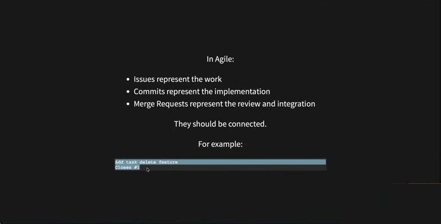

In Agile:
- **Issues** represent the work
- **Commits** represent the implementation
- **Merge Requests** represent the review and integration

They should be connected. For example: `Add task delete feature` / `Closes #1`

🇨🇳 Issue 代表工作、Commit 代表实现、Merge Request 代表审查与集成——三者应当关联起来（在 commit/MR 中写 `Closes #N`）。

### 8.5 Pair Programming

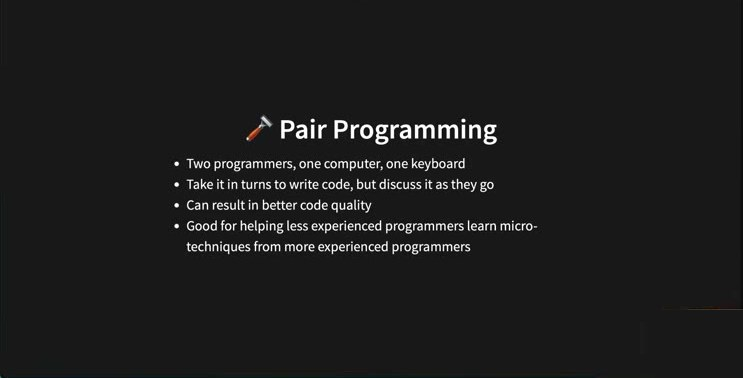

🔨 **Pair Programming**
- Two programmers, one computer, one keyboard
- Take it in turns to write code, but discuss it as they go
- Can result in better code quality
- Good for helping less experienced programmers learn micro-techniques from more experienced programmers

🇨🇳 结对编程：两人一台电脑一个键盘，轮流写代码、边写边讨论；可提升代码质量；有助于新手向有经验者学习细节技巧。本课不强制，如果你的目标是学编程，可以与组员结对。

### 8.6 Handling Conflict

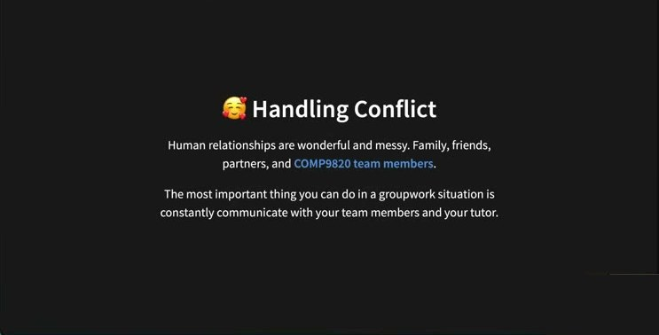

🥰 **Handling Conflict** — Human relationships are wonderful and messy. Family, friends, partners, and **COMP9820 team members**.
The most important thing you can do in a groupwork situation is **constantly communicate** with your team members and your tutor.

🇨🇳 有人的地方就有混乱。小组合作中最重要的事是**持续沟通**——和队友、和 tutor。讲师："沟通能解决大多数冲突。"曾在 Reddit 看到学生说三周没和组员联系——即使没进展、卡住了，也要沟通。

| 情境（幻灯片原文） | 建议（幻灯片原文） | 🇨🇳 |
|---|---|---|
| **I Know More Than My Group Members…** 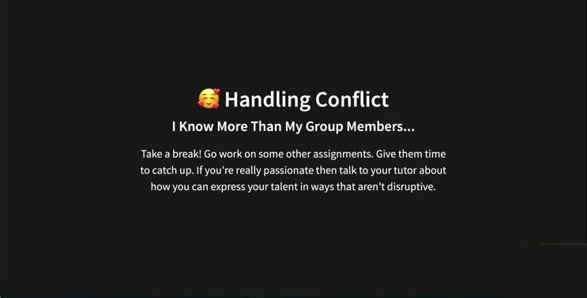 | Take a break! Go work on some other assignments. Give them time to catch up. If you're really passionate then talk to your tutor about how you can express your talent in ways that aren't disruptive. | 休息一下、做别的作业、给队友时间追上；或者去学不同的技能（本项目可锻炼的技能很多）。 |
| **My Group Member(s) Aren't Doing Enough…** 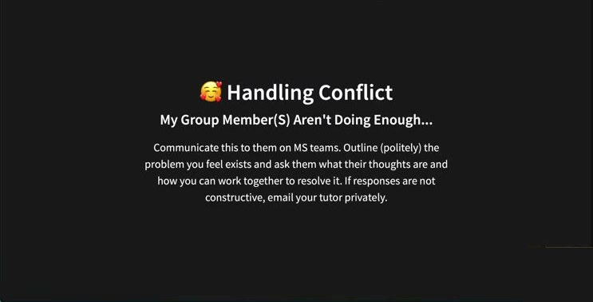 | Communicate this to them on MS teams. Outline (politely) the problem you feel exists and ask them what their thoughts are and how you can work together to resolve it. If responses are not constructive, email your tutor privately. | 在 Teams 上礼貌沟通，说明问题、询问想法、一起解决；不行再私下邮件 tutor。一次不回可能第二次会回，持续沟通。 |
| **My Group Member(s) Have Just Disappeared…** 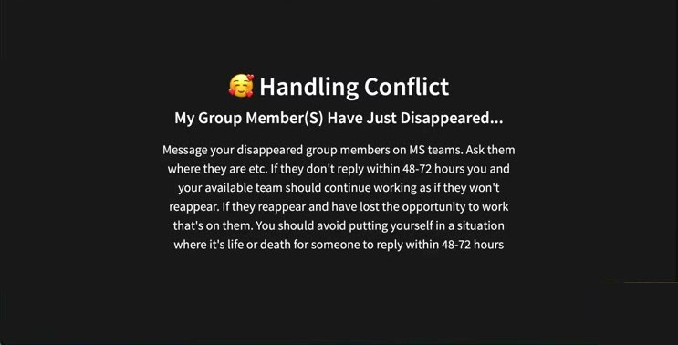 | Message your disappeared group members on MS teams. Ask them where they are etc. If they don't reply within 48-72 hours you and your available team should continue working as if they won't reappear. If they reappear and have lost the opportunity to work that's on them. You should avoid putting yourself in a situation where it's life or death for someone to reply within 48-72 hours | 先在 Teams 联系确认其安全；48–72 小时无回应就当其不会回来继续推进，并**报告 tutor**（讲师会去联系）。不要让自己陷入"别人不回就完蛋"的境地。 |
| **My Group Member(s) Are Merging In Broken Code…** 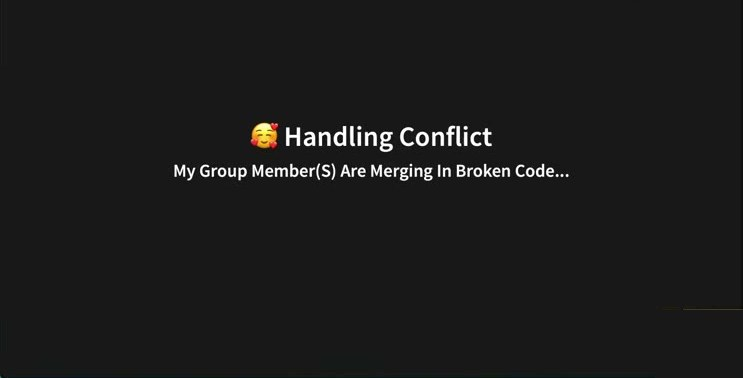 | （课堂讨论）学生答：Revert；问他们为什么。 | 也许他们不知道 Git 怎么用、不小心合并了，或需要帮助但不好意思问——没有人是傻瓜，尽管求助。私信礼貌请其停止；不改就邮件 tutor。 |
| **My Group Member(s) Are Being Rude…** | Politely ask them to stop. If they don't respond positively or change, email your tutor. | 礼貌要求停止；无改善就找 tutor。 |

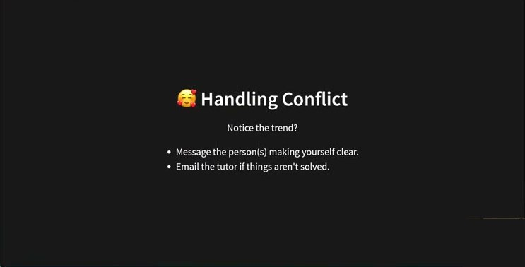

**Notice the trend?**
- Message the person(s) making yourself clear.
- Email the tutor if things aren't solved.

🇨🇳 规律：先直接、清楚地和当事人沟通；解决不了就邮件 tutor。也可以调整自己的计划——保持灵活，最终目标是项目的价值。

---

## 9. Project Sprint 1 Guidelines（项目 Sprint 1 指南）

（讲师在课程网站上逐段讲解，约 01:28–01:45；下周继续讲用户故事与 sprint retro）

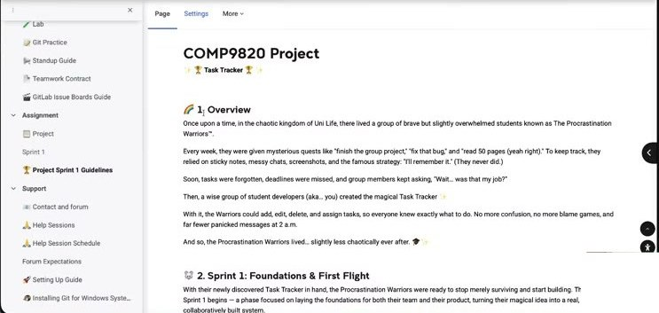

**COMP9820 Project · 🏆 Task Tracker**
- **1. Overview**：故事化的背景——"Procrastination Warriors"学生们用便利贴、聊天记录、截图记任务，结果任务遗忘、deadline 错过；于是一群学生开发者（也就是你们）创建了神奇的 **Task Tracker**：可添加、编辑、删除、分配任务，让每个人都清楚该做什么。
- **2. Sprint 1: Foundations & First Flight**：Sprint 1 的重点是为团队与产品打基础，把神奇想法变成真实的、协作构建的系统。

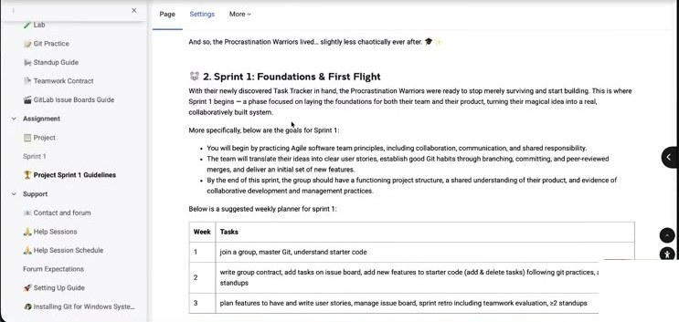

**Goals for Sprint 1**
- You will begin by practicing Agile software team principles, including collaboration, communication, and shared responsibility.
- The team will translate their ideas into clear user stories, establish good Git habits through branching, committing, and peer-reviewed merges, and deliver an initial set of new features.
- By the end of this sprint, the group should have a functioning project structure, a shared understanding of their product, and evidence of collaborative development and management practices.

**Suggested weekly planner for Sprint 1**

| Week | Tasks |
|---|---|
| 1 | join a group, master Git, understand starter code |
| 2 | write group contract, add tasks on issue board, add new features to starter code (add & delete tasks) following git practices, ≥2 standups |
| 3 | plan features to have and write user stories, manage issue board, sprint retro including teamwork evaluation, ≥2 standups |

💬 讲师补充：只发布了 Sprint 1 指南，避免信息过载。按周计划走就没问题；落后一点不用慌——**没有每周交付物**，Sprint 1 截止 **Week 4 周一**。本周任务有易有难：易的是契约、issue board、站会（照做就得分）；难的是给 starter code 加功能（尤其无前后端经验者）——但 Features Demo 只占 30 分中的 5 分，其他部分照样能拿高分。Sprint 1 是最容易拿分的，Sprint 2 更难，Sprint 3 最难，所以要在 Sprint 1 打好基础。Web 开发不是本课重点，但讲师每周会教一点前后端，也需要自学。

**2.1 Agile software team practice**
- **2.1.1 Git practice**：Follow Git Practice and from the Week 1 lecture.（一切推送到 GitLab 的内容都必须遵守——MR、commit message 等。）

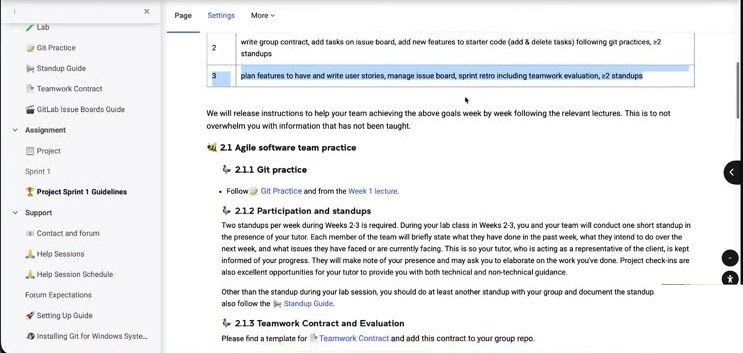

- **2.1.2 Participation and standups**：Two standups per week during Weeks 2–3 is required. During your lab class in Weeks 2–3, you and your team will conduct one short standup in the presence of your tutor. Each member of the team will briefly state what they have done in the past week, what they intend to do over the next week, and what issues they have faced or are currently facing. This is so your tutor, who is acting as a representative of the client, is kept informed of your progress. They will make note of your presence and may ask you to elaborate on the work you've done. Project check-ins are also excellent opportunities for your tutor to provide you with both technical and non-technical guidance. Other than the standup during your lab session, you should do at least another standup with your group and document the standup. Please also follow the Standup Guide.

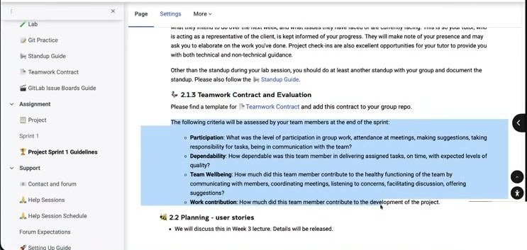

- **2.1.3 Teamwork Contract and Evaluation**：Please find a template for Teamwork Contract and add this contract to your group repo. The following criteria will be assessed by your team members at the end of the sprint:
  - **Participation**: What was the level of participation in group work, attendance at meetings, making suggestions, taking responsibility for tasks, being in communication with the team?
  - **Dependability**: How dependable was this team member in delivering assigned tasks, on time, with expected levels of quality?
  - **Team Wellbeing**: How much did this team member contribute to the healthy functioning of the team by communicating with members, coordinating meetings, listening to concerns, facilitating discussion, offering suggestions?
  - **Work contribution**: How much did this team member contribute to the development of the project?
- **2.2 Planning – user stories**：We will discuss this in Week 3 lecture. Details will be released.

🇨🇳 每个迭代末做一次**teamwork evaluation**（组员互评），不直接计分，用于让教学团队了解小组状况、帮助小组反思并规划下一 sprint。要参与、可靠、不粗鲁、多沟通多帮忙。

**3. Sprint 1 Submission and Marking Rubric**

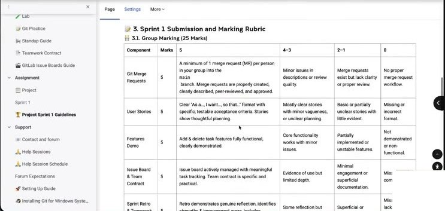

**3.1 Group Marking (25 Marks)**

| Component | Marks | 5 | 4–3 | 2–1 | 0 |
|---|---|---|---|---|---|
| Git Merge Requests | 5 | A minimum of 1 merge request (MR) per person in your group into the `main` branch. Merge requests are properly created, clearly described, peer-reviewed, and approved. | Minor issues in descriptions or review quality. | Merge requests exist but lack clarity or proper review. | No proper merge request workflow. |
| User Stories | 5 | Clear "As a…, I want…, so that…" format with specific, testable acceptance criteria. Stories show thoughtful planning. | Mostly clear stories with minor vagueness, or unclear planning. | Basic or partially unclear stories with little evident. | Missing or incorrect format. |
| Features Demo | 5 | Add & delete task features fully functional, clearly demonstrated. | Core functionality works with minor issues. | Partially implemented or unstable features. | Not demonstrated or non-functional. |
| Issue Board & Team Contract | 5 | Issue board actively managed with meaningful task tracking. Team contract is specific and practical. | Evidence of use but limited depth. | Minimal engagement or superficial documentation. | Missing key components. |
| Sprint Retro & Teamwork Evaluation | 5 | Retro demonstrates genuine reflection, identifies strengths & improvement areas, includes thoughtful teamwork evaluation. | Some reflection but limited depth. | Superficial or generic reflection. | Missing or lacks meaningful evaluation. |

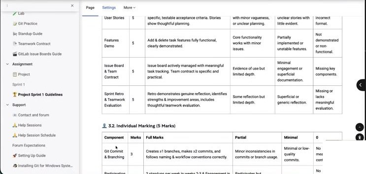

**3.2 Individual Marking (5 Marks)**

| Component | Marks | Full Marks | Partial | Minimal | 0 |
|---|---|---|---|---|---|
| Git Commit & Branching | 3 | Creates ≥1 branches, makes ≥2 commits, and follows naming & workflow conventions correctly. | Minor inconsistencies in commits or branch usage. | Minimal or low-quality commits. | No meaningful contribution. |
| Participation & Standups | 2 | 2 standups per week in weeks 2–3 & Engagement in lab classes (2 marks) | Participates but inconsistently (1 mark) | N/A | No meaningful participation |

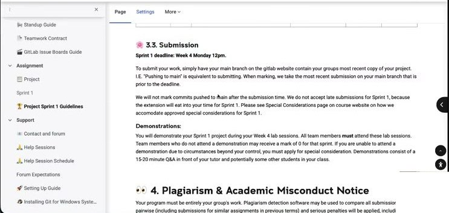

**3.3 Submission** — *Sprint 1 deadline: Week 4 Monday 12pm.*
- To submit your work, simply have your main branch on the gitlab website contain your groups most recent copy of your project. I.E. "Pushing to main" is equivalent to submitting. When marking, we take the most recent submission on your main branch that is prior to the deadline.
- We will not mark commits pushed to main after the submission time. We do not accept late submissions for Sprint 1, because the extension will eat into your time for Sprint 1. Please see Special Considerations page on course website on how we accommodate approved special considerations for Sprint 1.
- **Demonstrations**: You will demonstrate your Sprint 1 project during your Week 4 lab sessions. All team members **must** attend these lab sessions. Team members who do not attend a demonstration may receive a mark of 0 for that sprint. If you are unable to attend a demonstration due to circumstances beyond your control, you must apply for special consideration. Demonstrations consist of a 15–20 minute Q&A in front of your tutor and potentially some other students in your class.

🇨🇳 讲师强调：
- **推到 main 即提交**；站会在 Teams 频道里，不用再推到仓库；契约等其他内容都推到 main。建议把契约写成 `teamwork.md`（Markdown 可追踪变更、commit 时能说明改了什么；PDF 也可以、不扣分，但 Sprint 2 更新时 MD 更方便）。
- 不要等到最后一刻才推（讲师以前教 1000+ 人的课，deadline 前服务器被推爆）。
- **Sprint 1 无迟交、无延期**（即使有 special consideration 也不延期，因为会吃掉 Sprint 2 的时间；有批准的特殊情况会在评分时考虑）。
- **Week 4 lab demo 必须到场**，缺席该 sprint 记 0 分（除非有批准的特殊情况）——目的是确认工作是你自己做的；同时也是 tutor 给反馈、帮助规划下一 sprint 的机会。demo 是非正式的，不需要准备演讲，只需展示项目给客户带来了什么价值、你们如何做到、为什么这么做。

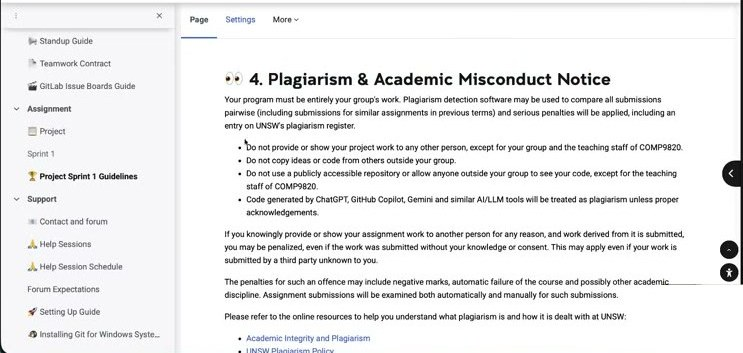

**4. Plagiarism & Academic Misconduct Notice**
- Your program must be entirely your group's work. Plagiarism detection software may be used to compare all submissions pairwise (including submissions for similar assignments in previous terms)…
- Do not provide or show your project work to any other person, except for your group and the teaching staff of COMP9820.
- Do not copy ideas or code from others outside your group.
- Do not use a publicly accessible repository or allow anyone outside your group to see your code, except for the teaching staff of COMP9820.
- **Code generated by ChatGPT, GitHub Copilot, Gemini and similar AI/LLM tools will be treated as plagiarism unless proper acknowledgements.**
- If you knowingly provide or show your assignment work to another person for any reason, and work derived from it is submitted, you may be penalized…
- The penalties for such an offence may include negative marks, automatic failure of the course and possibly other academic discipline…（参见 Academic Integrity and Plagiarism / UNSW Plagiarism Policy）

🇨🇳 讲师强调：用 AI 辅助（研究等）**必须正式声明**（哪部分代码、以何种方式得到支持）；即便如此，**你必须能解释自己的代码**——demo 时 tutor 可能要求你现场修改某行、加一个功能；做不到会被视为不了解自己的工作（抄袭），该 sprint 记 0。

**Git Practice 页要点**（约 01:37 讲师回答学生提问时展示）

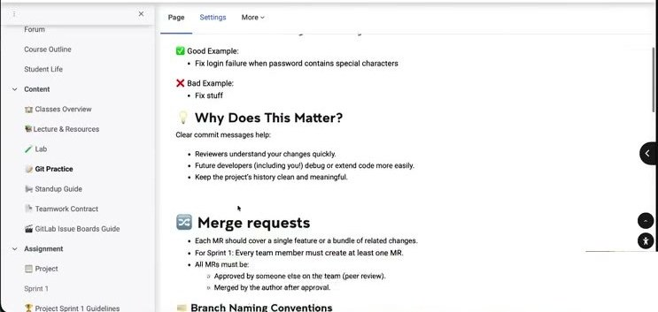
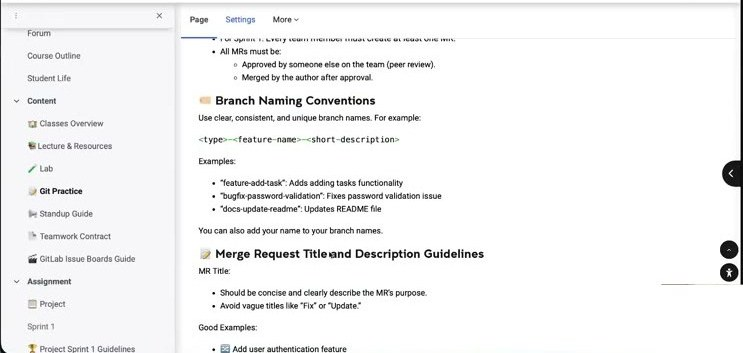

- **Why Does This Matter?** Clear commit messages help: Reviewers understand your changes quickly · Future developers (including you) debug or extend code more easily · Keep the project's history clean and meaningful.
- **Merge requests**：Each MR should cover a single feature or a bundle of related changes · For Sprint 1: Every team member must create at least one MR · All MRs must be: Approved by someone else on the team (peer review); Merged by the author after approval.
- **Branch Naming Conventions**：`<type>-<feature-name>-<short-description>`，如 `feature-add-task`、`bugfix-password-validation`、`docs-update-readme`；可加上自己的名字。
- **Merge Request Title and Description Guidelines**：Title should be concise and clearly describe the MR's purpose; avoid vague titles like "Fix" or "Update"。Good: "Add user authentication feature"。

---

## 10. Starter Code 讲解（Flask 前后端）

（约 01:45–02:00；讲师说时间不够，下周继续讲 demo 与代码）

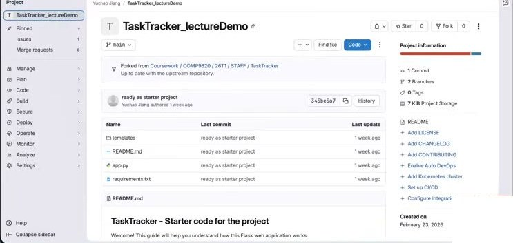
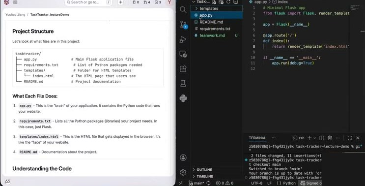

**仓库结构**（个人 GitLab 仓库中的 TaskTracker starter code，README 有面向零基础同学的逐行讲解）

```
tasktracker/
├── app.py              # Main Flask application file（后端，项目的"大脑"）
├── requirements.txt    # List of Python packages needed
├── templates/          # Folder for HTML templates
│   └── index.html      # The HTML page that users see（前端）
└── README.md           # Project documentation
```

README 目录：How to Run the Project（Step 1 Install Flask → Step 2 Run → Step 3 Open in Browser → Step 4 Stop the Server）· How It All Works Together · Making Your First Changes（Change 1: Modify the Welcome Message；Change 2: Add a New Route；Change 3: Add More Content to HTML）· Common Questions（Why do I need a templates folder? What does debug=True do? Can I use a different port? "Template not found"? How do I add CSS styling?）· Next Steps · Key Terms Glossary · Miscellaneous（What is Flask? Flask and Web Servers – What's the Relationship?）

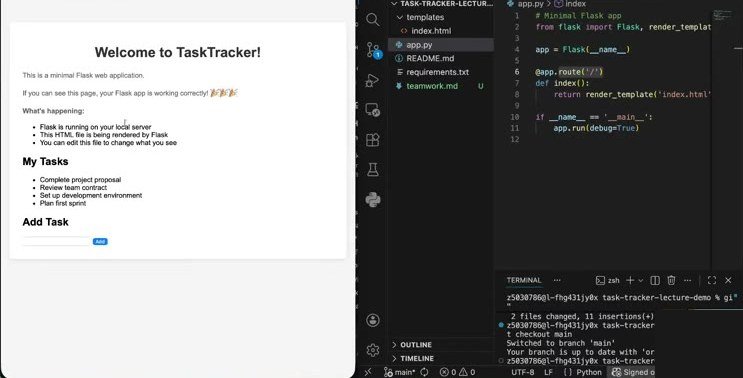
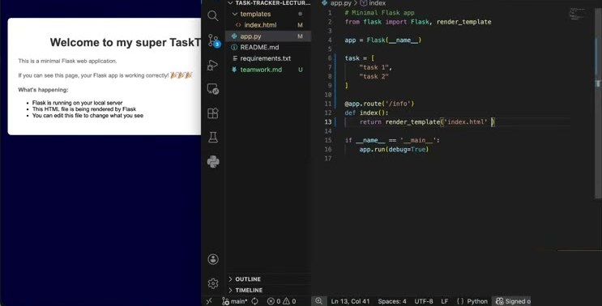

**app.py（最小 Flask 应用）**

```python
# Minimal Flask app
from flask import Flask, render_template

app = Flask(__name__)

@app.route('/')
def index():
    return render_template('index.html')

if __name__ == '__main__':
    app.run(debug=True)
```

💬 讲师讲解要点：
- **Web server 是什么**——餐厅比喻：Python 函数像厨房里的锅具（给输入、得输出），但用户如何"调用"这些函数？需要一个中间人接单——顾客点披萨 → 服务员到厨房用工具做披萨 → 送回顾客。**服务器就是餐厅**，函数是厨房工具，用户是顾客；一次请求 → 一次响应，"像一个包含很多函数的大函数"。
- **发请求的方式**：改 URL（讲师演示幻灯片 URL 从 `/2` 改成 `/1` 显示不同页面）；点按钮（课程网站翻页）；点赞/回复（Discord 论坛——点赞、回复"hello"后页面变化）。
- **前端 vs 后端**：前端是你看到的东西；改变前端的往往是后端——例如回帖会改数据库（后端变了）；而仅仅切换页面只改变显示哪个前端，后端没变。
- **路由**：`@app.route('/')` 定义"收到这个 URL 的请求就返回这个页面"。把 `'/'` 改成 `'/info'` 后，访问 `/` 会 **Not Found**，访问 `/info` 才显示。可以再加 `@app.route('/about')` 返回 `about.html`（templates 里新增该文件）——这就是"请求 → 响应"的核心。
- **index.html**：`<style>` 里是样式（字体、颜色等），可以改（讲师改背景色演示）；文本 "Welcome to TaskTracker!" 可改成 "Welcome to my super TaskTracker"。但**不要追求花哨**——重点是给用户带来价值，用户最关心什么功能。
- **后端数据**：可以在 app.py 里定义 Python 列表 `task = ["task 1", "task 2"]`，再通过 `render_template` 把数据传给前端——这部分留作课后研究。
- **Git 纪律**：改代码前先 `checkout` 新分支，**绝不直接在 main 上改**；改完发 MR 让队友 review 再合并；**不要合并有问题的代码**，main 必须始终安全。
- 学生问能否用其他语言——**必须用 Python + HTML**：课程只能提供这些支持，且要保证组内每个人都能贡献，而不是只有一两个会 JavaScript 的人。

---

## 附：本周待办清单

- [ ] 加入小组；确认 Git 已配置好（Windows 参考新指南）；复习 Git Practice（commit message、MR、分支命名）
- [ ] 与组员商定沟通平台（**MS Teams**）、会议时间、响应时限
- [ ] 完成 **Teamwork Contract**（推荐 `teamwork.md`，推到 main）
- [ ] 在 GitLab **Issue Board** 上拆分并添加任务、分配负责人
- [ ] **每周 ≥2 次站会**（一次在 lab 上当着 tutor；另一次在 Teams 频道），从本周开始，指定一人发起
- [ ] 理解 starter code；在**新分支**上实现 **add & delete task** 功能；每人 ≥1 个 branch、≥2 个 commit、≥1 个经过 peer review 的 MR；commit/MR 里用 `Closes #N` 关联 issue
- [ ] 记住：Sprint 1 截止 **Week 4 周一 12pm**（无迟交/延期）；**Week 4 lab demo 必须到场**；使用 AI 必须声明且能解释代码
- [ ] 下周预告：用户故事（user stories）、sprint retro、更多前后端讲解
