# COMP9820 Week 3 — Lecture 3.1 Software Planning And Stories · Lecture 3.2 Continuous Improvement And Retrospective（课件整理）

> 来源：YouTube 直播录像 [COMP9820 26T1 Week 3](https://www.youtube.com/watch?v=DuxIPX36A3w)（UNSW_COMP9820，2026-03-02，约 1 小时 57 分）
> 讲师：Dr. Yuchao Jiang
> 说明：按讲师投影顺序还原两份课件。**英文为幻灯片原文**，「🇨🇳」为中文翻译/解释，「💬 讲师补充」为课件上没有但讲师口头强调的内容。截图位于 `images/`（视频抽帧裁剪，360p，字体较小但可辨认；所有表格/要点均已转录为文字）。
> 课件之外，讲师还走读了课程网站 Sprint 1 指南新增的 **2.2 Planning & stories**、**2.3 Sprint retrospective** 与更新后的评分表，一并整理在第 9 节。

---

## 目录

- [Lecture 3.1 — Software Planning And Stories](#lecture-31--software-planning-and-stories)
  - [1. In This Lecture / Agile 回顾](#1-in-this-lecture--agile-回顾)
  - [2. Agile Planning](#2-agile-planning)
  - [3. Stories（用户故事）](#3-stories用户故事)
  - [4. Splitting Stories / Special Story Types / Best Practices](#4-splitting-stories--special-story-types--best-practices)
  - [5. User Acceptance Criteria（验收标准）](#5-user-acceptance-criteria验收标准)
  - [6. Stories → GitLab Issues](#6-stories--gitlab-issues)
  - [7. Requirements Engineering（需求工程四步）](#7-requirements-engineering需求工程四步)
  - [8. Functional vs Non-Functional](#8-functional-vs-non-functional)
  - [9. 课程网站：Sprint 1 指南更新（2.2 / 2.3 / 评分表）](#9-课程网站sprint-1-指南更新22--23--评分表)
- [Lecture 3.2 — Continuous Improvement And Retrospective](#lecture-32--continuous-improvement-and-retrospective)
  - [10. Continuous Improvement / Types / Who Participates](#10-continuous-improvement--types--who-participates)
  - [11. Facilitator / Warning / Timing](#11-facilitator--warning--timing)
  - [12. 五步 Retrospective](#12-五步-retrospective)
  - [13. Closing / Common Problems](#13-closing--common-problems)
- [附：本周待办清单](#附本周待办清单)

---

## Lecture 3.1 — Software Planning And Stories

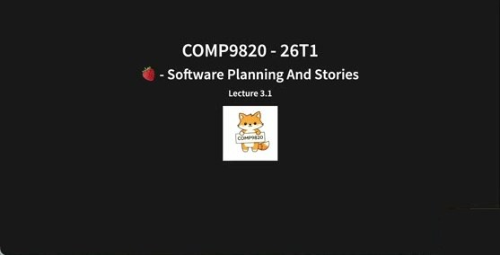

**COMP9820 - 26T1 · 🍓 Software Planning And Stories · Lecture 3.1**

💬 讲师开场：本周已近学期三分之一。本周重点是**规划**（为学期余下部分、为项目规划）和一个新东西——**sprint retro**（回顾过去三周：什么有效、什么要改，因为敏捷是 adaptive 而非 predictive）。

### 1. In This Lecture / Agile 回顾

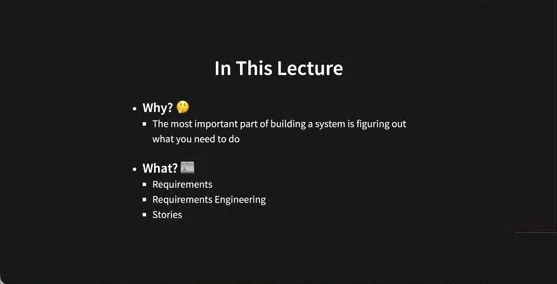

**In This Lecture**
- **Why? 🤔** The most important part of building a system is figuring out what you need to do
- **What? 📖** Requirements · Requirements Engineering · Stories

💬 讲师补充：提到"软件项目"大家先想到编码，但软件工程远不止编码——CSE 装修大门时有人建议用"coding"做主题，同事们反对："CSE 远不止编码。"编码是工具和基础，真正重要的是**为人创造真实价值**。今天讲的是：先弄清要为用户提供什么价值，再决定写什么代码。

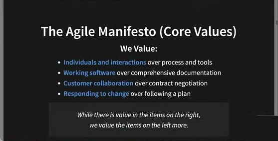

**The Agile Manifesto (Core Values)** — We Value: Individuals and interactions over process and tools · Working software over comprehensive documentation · Customer collaboration over contract negotiation · Responding to change over following a plan. *While there is value in the items on the right, we value the items on the left more.*

💬 学生回顾核心价值：协作（人 > 流程）、可工作软件 > 文档、迭代（短 sprint，adaptive 而非 predictive）。讲师："响应变化优先于遵循计划——但**我们仍然需要计划**，右侧的价值只是优先级更低。"

### 2. Agile Planning

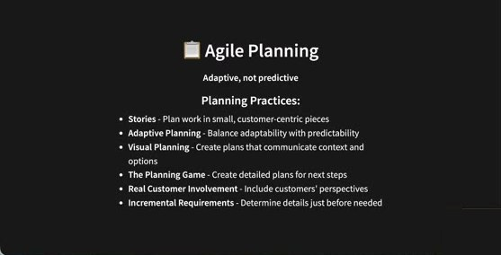

📋 **Agile Planning** — *Adaptive, not predictive* — Planning Practices:
- **Stories** - Plan work in small, customer-centric pieces
- **Adaptive Planning** - Balance adaptability with predictability
- **Visual Planning** - Create plans that communicate context and options
- **The Planning Game** - Create detailed plans for next steps
- **Real Customer Involvement** - Include customers' perspectives
- **Incremental Requirements** - Determine details just before needed

🇨🇳 敏捷规划实践：**故事**（以客户为中心的小块工作，而不是"要有这种数据库、前端用什么、后端用 Python 还是 JS"）；**自适应规划**（在适应性与可预测性之间平衡，偏向适应性）；**可视化规划**（用图示表达流程，课外自学）；**规划游戏**（不讲）；**真实客户参与**（核心价值之一）；**增量式需求**（细节在需要前才确定——传统做法是写又长又细的需求文档，涉及安全/金钱/健康的项目至今仍如此；本课采用增量式）。

### 3. Stories（用户故事）

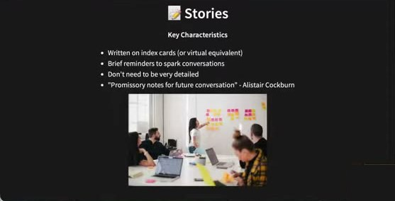

📝 **Stories** — Key Characteristics
- Written on index cards (or virtual equivalent)
- Brief reminders to spark conversations
- Don't need to be very detailed
- "Promissory notes for future conversation" - Alistair Cockburn

🇨🇳 过去（至今业界仍常见）大家聚在一个房间，把客户重视的东西写在卡片上——"我想管理任务""我想追踪任务""我想分配任务"。非常简短，不用长段落，只是为了引发与客户/用户/团队的讨论。

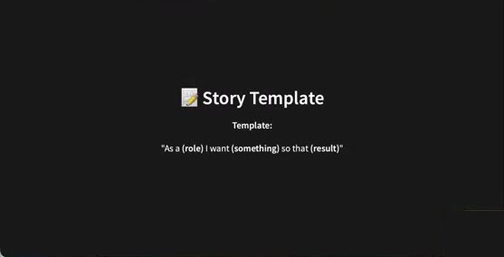

📝 **Story Template** — Template: *"As a (role) I want (something) so that (result)"*

🇨🇳 本课要求用这个格式写故事：**以某类用户的身份，我想做某事，以便达到某个目标**。业界不一定要求此格式，但它提醒你**把用户放在中心**——从用户出发、以用户能做什么为中心，而不是系统能做什么；"so that" 后面就是故事带来的价值。

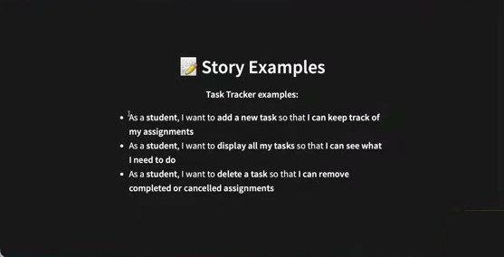

📝 **Story Examples** — Task Tracker examples:
- As a **student**, I want to **add a new task** so that **I can keep track of my assignments**
- As a **student**, I want to **display all my tasks** so that **I can see what I need to do**
- As a **student**, I want to **delete a task** so that **I can remove completed or cancelled assignments**

💬 角色不一定都是 student——可以是 group mentor、product owner、lecturer、admin……写故事的第一步是**确定产品的用户类型**，再思考能为他们带来什么价值、如何实现。

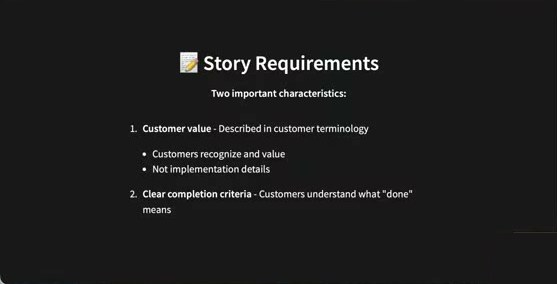

📝 **Story Requirements** — Two important characteristics:
1. **Customer value** - Described in customer terminology · Customers recognize and value · Not implementation details
2. **Clear completion criteria** - Customers understand what "done" means

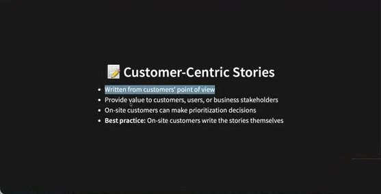

📝 **Customer-Centric Stories**
- Written from customers' point of view
- Provide value to customers, users, or business stakeholders
- On-site customers can make prioritization decisions
- **Best practice:** On-site customers write the stories themselves

🇨🇳 / 💬 为什么要用客户能懂的平白语言？①提醒自己要为客户带来价值；②故事通常**与真实用户一起写**，他们没有技术背景——说"database"他们听不懂，就无法反馈"这正是我要的/我要的是别的"。有时直接让用户自己写（格式不对你再改写），还可以**请客户帮你排优先级**——想要 100 个功能但只剩 8 周半，让客户来定。

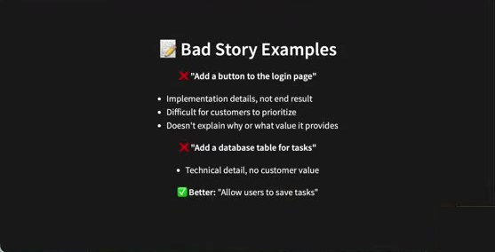

📝 **Bad Story Examples**
- ❌ "Add a button to the login page" — Implementation details, not end result · Difficult for customers to prioritize · Doesn't explain why or what value it provides
- ❌ "Add a database table for tasks" — Technical detail, no customer value
- ✅ Better: "Allow users to save tasks"

### 4. Splitting Stories / Special Story Types / Best Practices

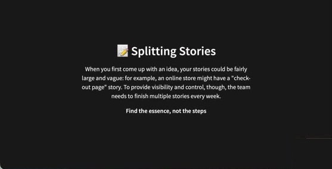

📝 **Splitting Stories** — When you first come up with an idea, your stories could be fairly large and vague: for example, an online store might have a "check-out page" story. To provide visibility and control, though, the team needs to finish multiple stories every week. **Find the essence, not the steps**

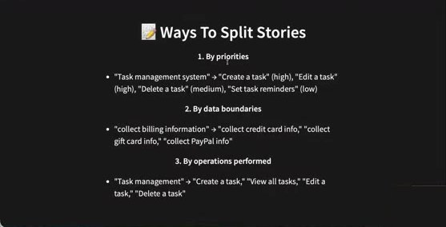

📝 **Ways To Split Stories**
1. **By priorities** — "Task management system" → "Create a task" (high), "Edit a task" (high), "Delete a task" (medium), "Set task reminders" (low)
2. **By data boundaries** — "collect billing information" → "collect credit card info," "collect gift card info," "collect PayPal info"
3. **By operations performed** — "Task management" → "Create a task," "View all tasks," "Edit a task," "Delete a task"

🇨🇳 "管理任务"这种大故事太笼统，难以排优先级、也不清楚具体价值，所以要**拆分**。按优先级拆（你们组可能觉得"编辑"不重要，删了重建就行——去问真实用户）；按数据边界拆；按操作步骤拆。同一个故事可以用不同方式拆。

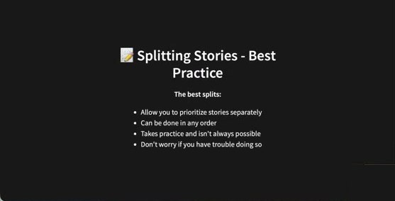

📝 **Splitting Stories - Best Practice** — The best splits: Allow you to prioritize stories separately · Can be done in any order · Takes practice and isn't always possible · Don't worry if you have trouble doing so

💬 有的故事就是拆不开，没关系。但也别拆得太小（一小时就能做完的）——可以按共同主题**合并**；合并比拆分容易，都需要练习。

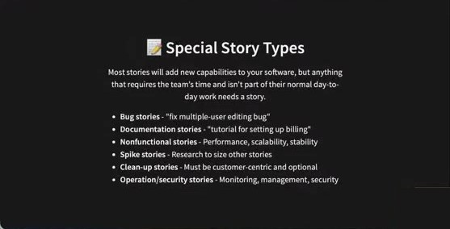

📝 **Special Story Types** — Most stories will add new capabilities to your software, but anything that requires the team's time and isn't part of their normal day-to-day work needs a story.
- **Bug stories** - "fix multiple-user editing bug"
- **Documentation stories** - "tutorial for setting up billing"
- **Nonfunctional stories** - Performance, scalability, stability
- **Spike stories** - Research to size other stories
- **Clean-up stories** - Must be customer-centric and optional
- **Operation/security stories** - Monitoring, management, security

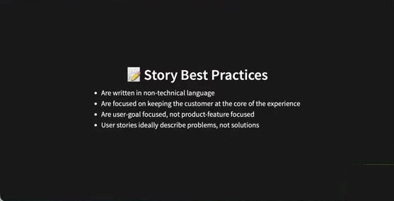

📝 **Story Best Practices**
- Are written in non-technical language
- Are focused on keeping the customer at the core of the experience
- Are user-goal focused, not product-feature focused
- User stories ideally describe problems, not solutions

💬 工程师常犯的错误（讲师自己也会）：**太早跳到解决方案**。先识别用户需求，再谈解法。

### 5. User Acceptance Criteria（验收标准）

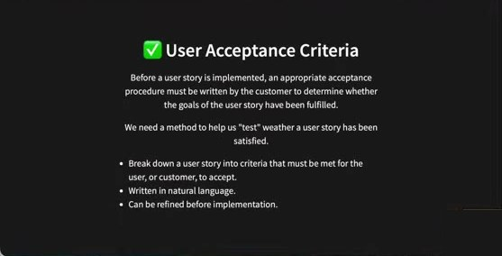

✅ **User Acceptance Criteria** — Before a user story is implemented, an appropriate acceptance procedure must be written by the customer to determine whether the goals of the user story have been fulfilled. We need a method to help us "test" whether a user story has been satisfied.
- Break down a user story into criteria that must be met for the user, or customer, to accept.
- Written in natural language.
- Can be refined before implementation.

🇨🇳 故事的第二个特征：**清晰的完成标准**。"这两天我专注做这个故事"——怎么知道做完了、可以换下一个？所以每个故事在实现前都要有 **UAC**（目标导向：从目标出发再写代码）。同样用自然语言，因为客户要审阅、确认、反馈"这才是我说的 done"；可以在实现前修改（adaptive）。

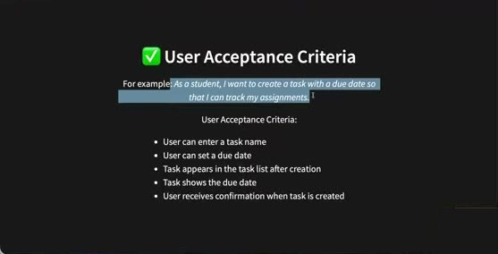

✅ For example: *As a student, I want to create a task with a due date so that I can track my assignments.* — User Acceptance Criteria:
- User can enter a task name
- User can set a due date
- Task appears in the task list after creation
- Task shows the due date
- User receives confirmation when task is created

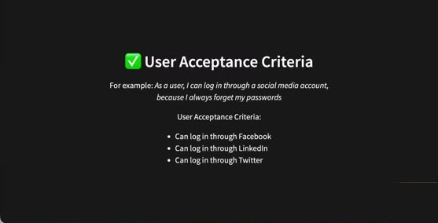

✅ For example: *As a user, I can log in through a social media account, because I always forget my passwords* — User Acceptance Criteria: Can log in through Facebook · Can log in through LinkedIn · Can log in through Twitter

💬 实现完这三个登录就算完成该故事；UNSW 账号登录等不在标准里就不用管——用户没要。

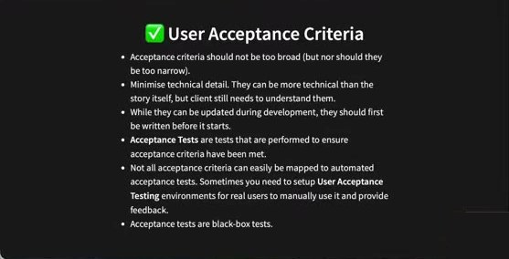

✅ **User Acceptance Criteria**
- Acceptance criteria should not be too broad (but nor should they be too narrow).
- Minimise technical detail. They can be more technical than the story itself, but client still needs to understand them.
- While they can be updated during development, they should first be written before it starts.
- **Acceptance Tests** are tests that are performed to ensure acceptance criteria have been met.
- Not all acceptance criteria can easily be mapped to automated acceptance tests. Sometimes you need to setup **User Acceptance Testing** environments for real users to manually use it and provide feedback.
- Acceptance tests are black-box tests.

💬 太宽还是太窄？做完几个故事就会有感觉，再反思调整。

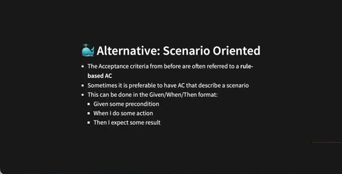

🐳 **Alternative: Scenario Oriented**
- The Acceptance criteria from before are often referred to a **rule-based AC**
- Sometimes it is preferable to have AC that describe a scenario
- This can be done in the Given/When/Then format: Given some precondition · When I do some action · Then I expect some result

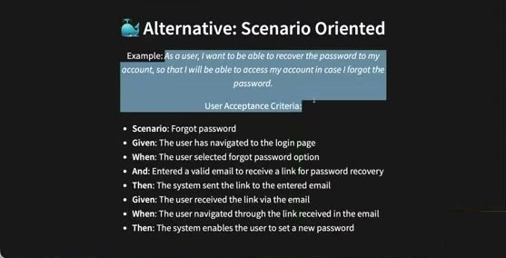

Example: *As a user, I want to be able to recover the password to my account, so that I will be able to access my account in case I forgot the password.* — User Acceptance Criteria:
- **Scenario**: Forgot password
- **Given**: The user has navigated to the login page
- **When**: The user selected forgot password option
- **And**: Entered a valid email to receive a link for password recovery
- **Then**: The system sent the link to the entered email
- **Given**: The user received the link via the email
- **When**: The user navigated through the link received in the email
- **Then**: The system enables the user to set a new password

🇨🇳 Given = 前置条件（不在登录页就无法重置密码）；When = 触发动作；And = 同时需要的动作；Then = 结果；结果又可成为下一段的 Given。

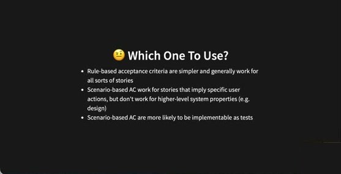

🤔 **Which One To Use?**
- Rule-based acceptance criteria are simpler and generally work for all sorts of stories
- Scenario-based AC work for stories that imply specific user actions, but don't work for higher-level system properties (e.g. design)
- Scenario-based AC are more likely to be implementable as tests

💬 课堂投票：多数人偏好 scenario（更详细、更有逻辑）；rule-based 更简洁易读易改。Scenario 式更容易转成**测试**（后几周讲测试）。Sprint 1 两种任选、可各练一种。

💬 **课堂练习（学生提出的故事与反馈）**：
- "monitor the task" → 太大、"monitor"含义太多（查看待办？看分配给谁？）→ 练习拆分。
- "As a business manager, I want to add and delete tasks so that I can manage multiple tasks" → add 和 delete 是不同价值 → 拆成两个故事。
- "As a customer, I want the tasks described clearly so that I can understand easily" → 典型**模糊故事**："clearly""easy to use" 无法实现、无法判定完成；要定义清楚"易用"具体指什么——问客户过去用其他工具的痛点。
- "As a student, I want to prioritise tasks with colours, and a button to ask questions" → 两件事要拆成两个故事，并遵循格式："As a student I want to add different colours to my tasks so that I know the priority."
- **Q：用户类型怎么定？** 各组自定，通过与真实客户交流或参考现有平台确定；10 周时间有限，建议先聚焦 1–2 类用户，后续 sprint 再加。

### 6. Stories → GitLab Issues

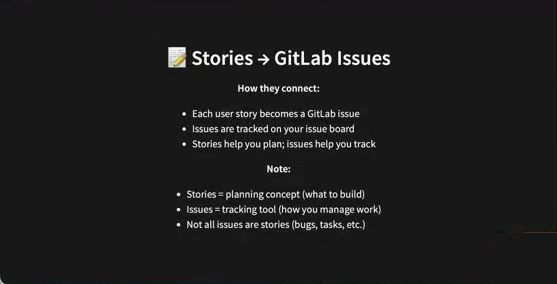

📝 **Stories → GitLab Issues** — How they connect: Each user story becomes a GitLab issue · Issues are tracked on your issue board · Stories help you plan; issues help you track. **Note:** Stories = planning concept (what to build) · Issues = tracking tool (how you manage work) · Not all issues are stories (bugs, tasks, etc.)

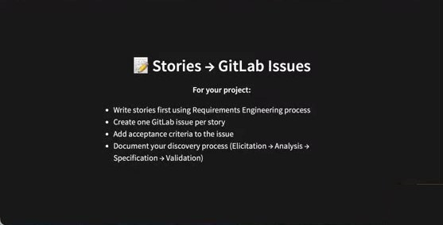

📝 **Stories → GitLab Issues** — For your project: Write stories first using Requirements Engineering process · Create one GitLab issue per story · Add acceptance criteria to the issue · Document your discovery process (Elicitation → Analysis → Specification → Validation)

🇨🇳 每个故事都会成为一个 issue，但 issue 比故事多（如"写团队契约""修某个 bug"也是 issue，却不是用户故事）。故事是"要构建什么"的规划；issue 是跟踪实现进度的工具。

### 7. Requirements Engineering（需求工程四步）

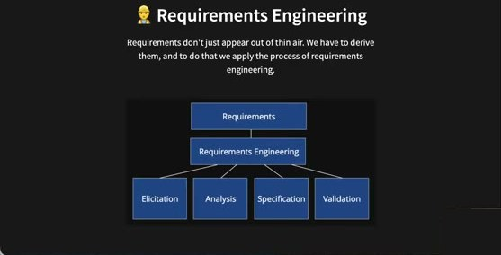

👩‍🔧 **Requirements Engineering** — Requirements don't just appear out of thin air. We have to derive them, and to do that we apply the process of requirements engineering. Requirements → Requirements Engineering → **Elicitation · Analysis · Specification · Validation**

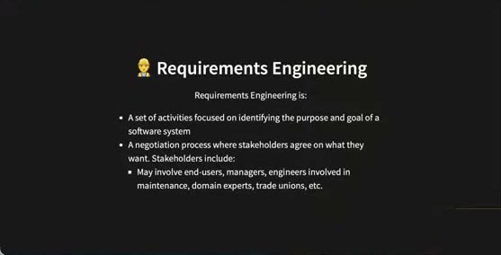

👩‍🔧 Requirements Engineering is:
- A set of activities focused on identifying the purpose and goal of a software system
- A negotiation process where stakeholders agree on what they want. Stakeholders include: May involve end-users, managers, engineers involved in maintenance, domain experts, trade unions, etc.

💬 **Stakeholder 不只是用户**：还有维护系统的人、领域专家（做医疗软件要问医疗专家；做自动驾驶要问隐私/安全专家）。选 Task Tracker 做题目是因为人人用过任务追踪器——组内可以**轮流扮演**最终用户等角色。

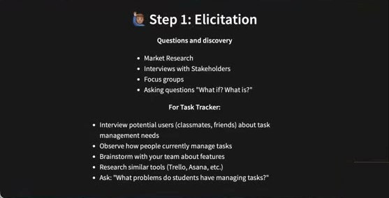

🕵️ **Step 1: Elicitation** — Questions and discovery: Market Research · Interviews with Stakeholders · Focus groups · Asking questions "What if? What is?"
**For Task Tracker:** Interview potential users (classmates, friends) about task management needs · Observe how people currently manage tasks · Brainstorm with your team about features · Research similar tools (Trello, Asana, etc.) · Ask: "What problems do students have managing tasks?"

🇨🇳 / 💬 获取数据：做市场调研（GitLab issue board、Jira、Trello 都是任务追踪器——各有优缺点，你用过吗？好用吗？太花哨？），你们可以聚焦特定人群（做小组项目的学生、跟踪软件项目的老板）而不需要那些高级功能。**Interview** 是一对一深入交谈，可追问；**Focus group** 是把不同背景的人（最终用户、领域专家、懂技术边界的工程师）聚在一起问"如果…会怎样？你遇到什么挑战？"。同学、朋友都是潜在用户。

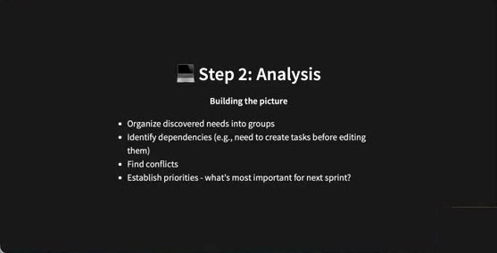

💻 **Step 2: Analysis** — Building the picture: Organize discovered needs into groups · Identify dependencies (e.g., need to create tasks before editing them) · Find conflicts · Establish priorities - what's most important for next sprint?

🇨🇳 很多人提到同一个问题 → 主题/优先级；依赖（先创建才能编辑）；冲突（有人恨某功能、有人离不开它）→ 再去问为什么、找底层原因。**只需为下一个 sprint 排优先级**，不用管 sprint 100。

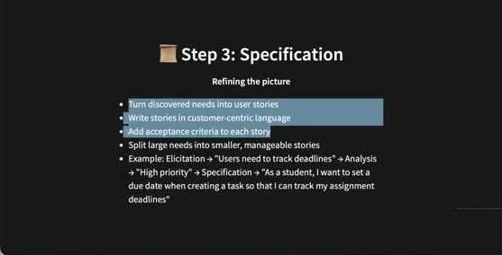

📜 **Step 3: Specification** — Refining the picture: Turn discovered needs into user stories · Write stories in customer-centric language · Add acceptance criteria to each story · Split large needs into smaller, manageable stories · Example: Elicitation → "Users need to track deadlines" → Analysis → "High priority" → Specification → "As a student, I want to set a due date when creating a task so that I can track my assignment deadlines"

💬 只在第一步和客户聊吗？**不，始终在聊**：第二步追问为什么；第三步写完故事再问"这是你要的吗？验收标准漏了什么？优先级对吗？"组员也是你的客户。

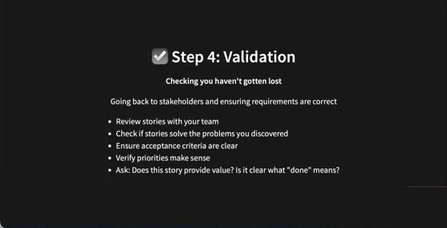

☑️ **Step 4: Validation** — Checking you haven't gotten lost — Going back to stakeholders and ensuring requirements are correct: Review stories with your team · Check if stories solve the problems you discovered · Ensure acceptance criteria are clear · Verify priorities make sense · Ask: Does this story provide value? Is it clear what "done" means?

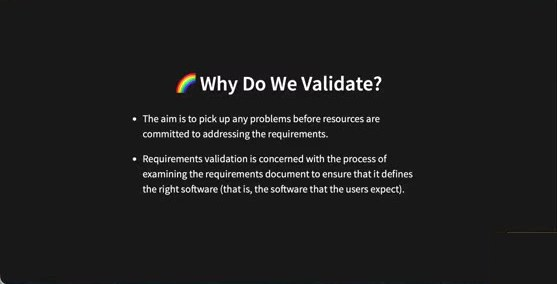

🌈 **Why Do We Validate?** — The aim is to pick up any problems before resources are committed to addressing the requirements. Requirements validation is concerned with the process of examining the requirements document to ensure that it defines the right software (that is, the software that the users expect).

💬 有了不完美但能跑的功能就拿给客户看："这解决你的问题了吗？"——频繁、经常地要反馈，客户参与是敏捷核心价值。

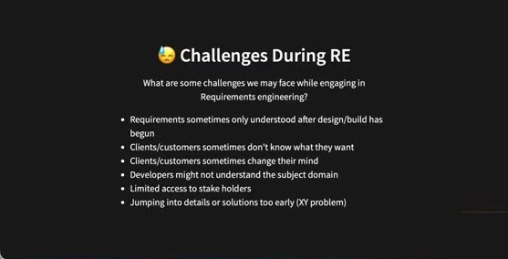

😓 **Challenges During RE** — What are some challenges we may face while engaging in Requirements engineering?
- Requirements sometimes only understood after design/build has begun
- Clients/customers sometimes don't know what they want
- Clients/customers sometimes change their mind
- Developers might not understand the subject domain
- Limited access to stake holders
- Jumping into details or solutions too early (XY problem)

💬 客户一开始说"太棒了"，做出来一看"不是这个意思/我不需要了"——所以要频繁回访，及时**停掉不再有效的故事**，别为已花的几天难过。客户常常**看到产品才知道要什么**——做出能用的软件，不追求完美。工程师常常先跳到解法，最后发现解决的不是真实存在的问题。因此只规划下一个 sprint。

### 8. Functional vs Non-Functional

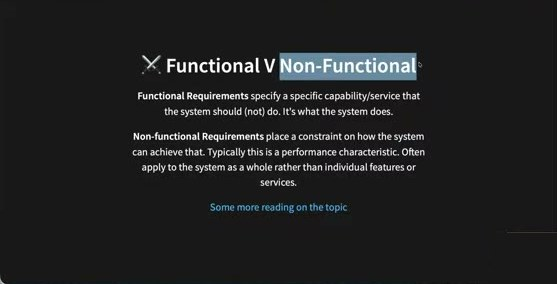

⚔️ **Functional V Non-Functional** — **Functional Requirements** specify a specific capability/service that the system should (not) do. It's what the system does. **Non-functional Requirements** place a constraint on how the system can achieve that. Typically this is a performance characteristic. Often apply to the system as a whole rather than individual features or services.

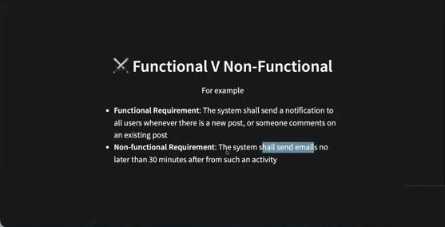

For example — **Functional Requirement**: The system shall send a notification to all users whenever there is a new post, or someone comments on an existing post · **Non-functional Requirement**: The system shall send emails no later than 30 minutes after from such an activity

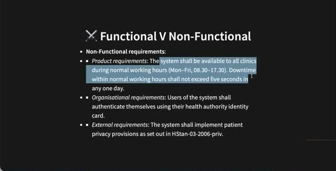

**Non-Functional requirements**:
- *Product requirements*: The system shall be available to all clinics during normal working hours (Mon–Fri, 08.30–17.30). Downtime within normal working hours shall not exceed five seconds in any one day.
- *Organisational requirements*: Users of the system shall authenticate themselves using their health authority identity card.
- *External requirements*: The system shall implement patient privacy provisions as set out in HStan-03-2006-priv.

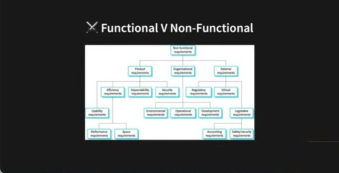

（非功能需求分类树：Product requirements → Efficiency (Usability, Performance, Space) / Dependability / Security；Organisational requirements → Environmental / Operational / Development；External requirements → Regulatory / Ethical / Legislative (Accounting, Safety/security)）

🇨🇳 课堂上"清晰显示""易用"这类故事其实不是用户能做的事，而是**非功能需求**——对系统如何实现的约束（速度、准确率、可用性、隐私），同样重要，也要和利益相关方讨论。（讲师跳过了随后的 quiz 幻灯片。）

### 9. 课程网站：Sprint 1 指南更新（2.2 / 2.3 / 评分表）

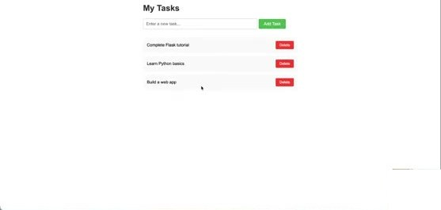

💬 **Sprint 1 功能到底要多少？** 讲师演示自己的最小版本（My Tasks：输入框 + Add Task；列表三条各带 Delete）："这已经绰绰有余。"不需要漂亮 UI、邮件确认、数据库持久化（刷新后数据还在）——能显示、能添加、能删除即可。Sprint 1 重点是理解 starter code、练 Git、协作、反思、规划——"easy marks"。

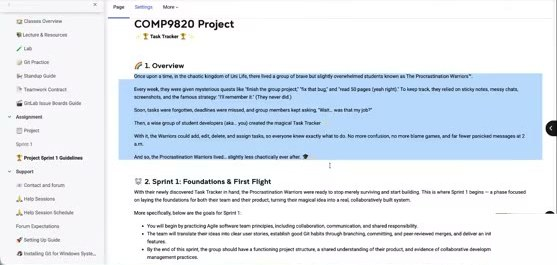

💬 Q&A：
- **每人都要有 MR，但 Sprint 1 事情太少？** 自行分工：建议两人一组做 add、两人一组做 delete；其余人可以 merge 团队契约、用户故事（每人合并一个故事）。现实中没人这样做，设计成这样是为了**人人练到 Git**。几个人做同一件事可共用一个分支，但每人在 Sprint 1 都要有一次合并到 main 的经历。
- **用户类型由组决定？** 是。**Sprint 2/3 在 Sprint 1 基础上继续？** 是，同一项目做 10 周，本周写故事就是在为整个学期规划。**契约还能改？** 随时可改，活文档。
- **语言：** 后端 Python，前端 HTML/CSS。**add 和 delete 要分开吗？** 分开（不同的事），而且用户故事要多于这两个。**Sprint 2 指南何时发布？** Week 4，逐周发布以免信息过载。

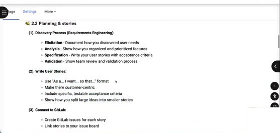
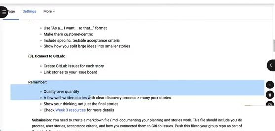

**2.2 Planning & stories**（课程网站新增）
- **(1) Discovery Process (Requirements Engineering)**：**Elicitation** - Document how you discovered user needs · **Analysis** - Show how you organized and prioritized features · **Specification** - Write your user stories with acceptance criteria · **Validation** - Show team review and validation process
- **(2) Write User Stories**：Use "As a... I want... so that..." format · Make them customer-centric · Include specific, testable acceptance criteria · Show how you split large ideas into smaller stories
- **(3) Connect to GitLab**：Create GitLab issues for each story · Link stories to your issue board
- **Remember**：Quality over quantity · A few well-written stories with clear discovery process > many poor stories · Show your thinking, not just the final stories · Check Week 3 resources for more details
- **Submission**：You need to create a markdown file (.md) documenting your planning and stories work. This file should include your discovery process, user stories, acceptance criteria, and how you connected them to GitLab issues. Push this file to your group repo as part of your Sprint 1 deliverables.

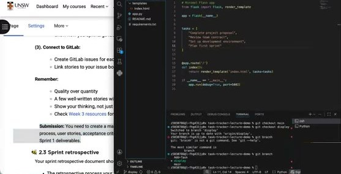

💬 提交方式演示：在 starter code 仓库 **先 `git checkout -b stories`**（不要直接改 main），新建 `stories.md`，写下上述内容，add/commit（写清改了什么）/push，再发 MR。可以把网站上的结构复制进 md，各小节写你们如何做 elicitation、analysis…；线下用卡片做的可以**拍照贴进 md**，不必全部打字。本周 lab 就可以带纸做访谈、分组、写故事和 UAC，拍照即可。**质量 > 数量**，不要交 20–30 页。

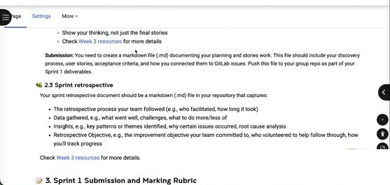

**2.3 Sprint retrospective** — Your sprint retrospective document should be a markdown (.md) file in your repository that captures:
- The retrospective process your team followed (e.g., who facilitated, how long it took)
- Data gathered, e.g., what went well, challenges, what to do more/less of
- Insights, e.g., key patterns or themes identified, why certain issues occurred, root cause analysis
- Retrospective Objective, e.g., the improvement objective your team committed to, who volunteered to help follow through, how you'll track progress

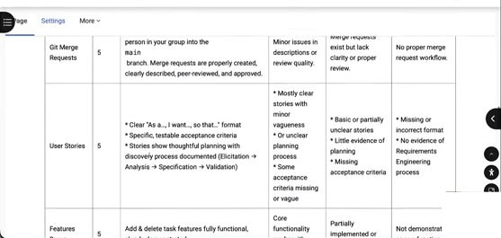
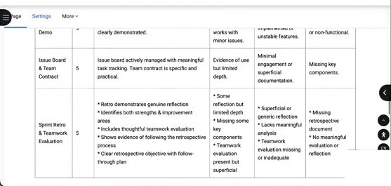

**评分表更新**（讲师根据反馈把一句话拆成要点）：
- **User Stories (5)** — 满分：Clear "As a…, I want…, so that…" format · Specific, testable acceptance criteria · Stories show thoughtful planning with discovery process documented (Elicitation → Analysis → Specification → Validation)；4–3：Mostly clear stories with minor vagueness · Basic or partially unclear acceptance criteria · Little evidence of planning process · Some acceptance criteria missing or vague；2–1：Basic or partially unclear stories · Little evidence of planning process · Missing acceptance criteria；0：Missing or incorrect format · No evidence of Requirements Engineering process
- **Sprint Retro & Teamwork Evaluation (5)** — 满分：Retro demonstrates genuine reflection · Identifies both strengths & improvement areas · Includes thoughtful teamwork evaluation · Shows evidence of following the retrospective process · Clear retrospective objective with follow-through plan；4–3：Some reflection but limited depth · Missing some key components · Teamwork evaluation present but superficial；2–1：Superficial or generic reflection · Lacks meaningful analysis · Teamwork evaluation missing or inadequate；0：Missing retrospective document · No meaningful evaluation or reflection

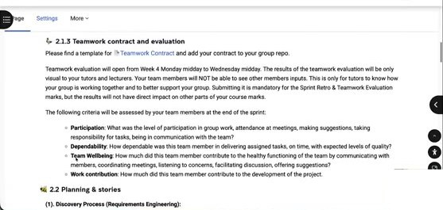

**2.1.3 Teamwork contract and evaluation** — Teamwork evaluation will open from Week 4 Monday midday to Wednesday midday. The results of the teamwork evaluation will be only visual to your tutors and lecturers. Your team members will NOT be able to see other members inputs. This is only for tutors to know how your group is working together and to better support your group. Submitting it is mandatory for the Sprint Retro & Teamwork Evaluation marks, but the results will not have direct impact on other parts of your course marks. Criteria: **Participation · Dependability · Team Wellbeing · Work contribution**.

💬 互评在 Moodle 上，Week 4 周一截止后开放约三天，讲师下周一发链接；保密、不用于给分，只帮助 tutor 了解小组情况（有人掉队、有人觉得被不公平对待、有人当"超级英雄"）；**必须提交**才能拿 Sprint Retro & Teamwork Evaluation 的 5 分；组员不交只影响他自己。

---

## Lecture 3.2 — Continuous Improvement And Retrospective

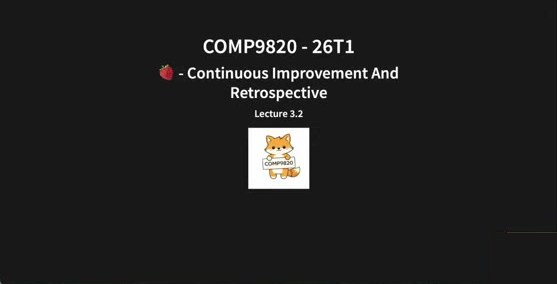

**COMP9820 - 26T1 · 🍓 Continuous Improvement And Retrospective · Lecture 3.2**

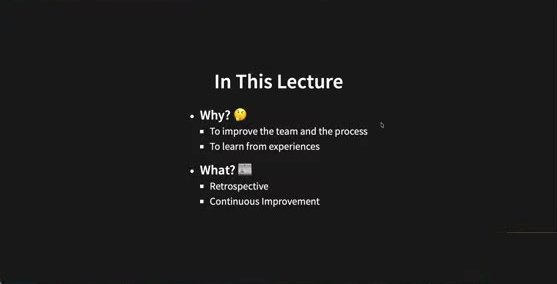

**In This Lecture** — **Why? 🤔** To improve the team and the process · To learn from experiences — **What? 📖** Retrospective · Continuous Improvement

💬 再看敏捷价值观：响应变化、个体与互动——怎么做到？需要**反思**：什么有效、什么无效、如何改进。方法就是 sprint retrospective。

### 10. Continuous Improvement / Types / Who Participates

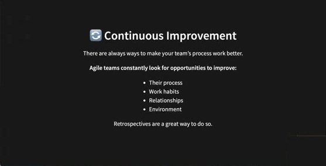

🔄 **Continuous Improvement** — There are always ways to make your team's process work better. Agile teams constantly look for opportunities to improve: Their process · Work habits · Relationships · Environment. Retrospectives are a great way to do so.

🇨🇳 没有适用于所有团队的单一标准；每个团队不同，要反思自己团队的经验并从中学习。

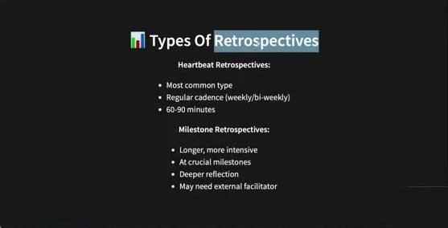

📊 **Types Of Retrospectives** — **Heartbeat Retrospectives:** Most common type · Regular cadence (weekly/bi-weekly) · 60-90 minutes — **Milestone Retrospectives:** Longer, more intensive · At crucial milestones · Deeper reflection · May need external facilitator

💬 本课只做 heartbeat 型，**每个 sprint 末一次**（Sprint 1/2/3 各一次），60–90 分钟。周二/周三班不建议在本周课上做（Sprint 1 还有一周、本周还要写故事）；周五晚班可以在课上做，但故事要先写完；也可另约时间。

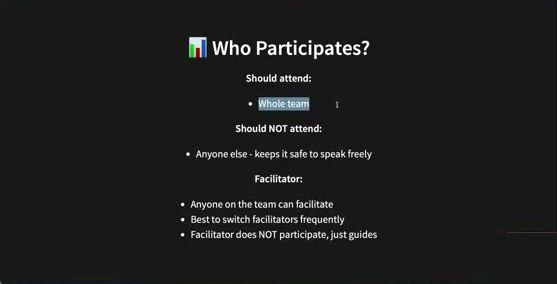

📊 **Who Participates?** — **Should attend:** Whole team — **Should NOT attend:** Anyone else - keeps it safe to speak freely — **Facilitator:** Anyone on the team can facilitate · Best to switch facilitators frequently · Facilitator does NOT participate, just guides

💬 全员参加确保没人掉队；不要叫 mentor/tutor 参加（除非有冲突），保持私密。每个 sprint 可轮换 facilitator（想练领导力的人可以试），但第一次建议由项目经验相对多的人担任；facilitator 不参与讨论，只引导。

### 11. Facilitator / Warning / Timing

📊 **The Facilitator Role** — Getting started: Start with people who have facilitation experience · Once running smoothly, give the rest of the team a chance — Facilitator responsibilities: Keep the retrospective on track · Ensure everyone's voice is heard · Does NOT otherwise participate · Stays neutral — If team members have trouble staying neutral: Teams can trade facilitators · Facilitator must agree to keep everything confidential

🇨🇳 保持中立（不说"我同意/不同意"）；做不到就换人；必须保密——营造让每个人敢于发言的安全环境（**psychological safety**，上周讲过）。

⚠️ **Important Warning** — Retrospectives can be damaging: When used to attack one another · When there's blame and criticism · When team members don't treat each other with respect — Before you begin: If your team has trouble treating one another with respect · Focus on safety and team dynamics first · Establish psychological safety before conducting retrospectives

💬 出现指责、批评、不尊重，应尽早提出并**停止 retro**，先建立心理安全。

📊 **Timing** — Timebox: 60-90 minutes: First several retrospectives will probably need full 90 minutes · Give it the extra time · Don't be shy about politely wrapping up and moving to the next step — Practice makes perfect: The whole team will get better with practice · The next retrospective is only a week or two away · Important issues will recur if not addressed — 5 Steps in each retrospective.

💬 第一次做可能超时或用不完 90 分钟都正常，流程比计时重要；超过两小时就太长了。

### 12. 五步 Retrospective

📊 **Step 1: Set The Stage - The Prime Directive** — Norm Kerth's Prime Directive: *"Regardless of what we discover, we must understand and truly believe that everyone did the best job he or she could, given what was known at the time, his or her skills and abilities, the resources available, and the situation at the time."* — Purpose: Create psychological safety · Focus on learning, not blame · Everyone must agree verbally

💬 每个人在组里**大声读出来**并口头同意；有人不同意就停下 retro，先解决冲突/建立心理安全。这套步骤来自 *The Art of Agile Development*（O'Reilly，讲师现场展示了该书的 Retrospectives 章节目录：Step 1 Prime Directive (5 min) · Step 2 Brainstorming (20 min) · Step 3 Mute Mapping (15 min) · Step 4 Generate Insights (10–30 min) · Step 5 Retrospective Objective (10–20 min) · Follow Through）。

📊 **Step 2: Gather Data - Brainstorming (20 Min)** — Categories on whiteboard: **Enjoyable** - What went well · **Frustrating** - What was difficult · **Puzzling** - What was confusing · **Keep** - What to continue doing · **More** - What to do more of · **Less** - What to do less of — Use simultaneous brainstorming: Everyone writes ideas on cards/sticky notes · No discussion yet, just capture thoughts

🇨🇳 白板（或线上）写好六个类别，每人拿便利贴，想到什么写什么（不必每类都写），**各自静默**写，不讨论，贴到对应类别下。

📊 **Step 3: Mute Mapping (15 Min)** — Sort cards into clusters: Group related ideas together · Use mute mapping (silent sorting) · Look for patterns and themes — Choose one cluster: Use dot voting to select which cluster to improve · If no clear winner, flip a coin · Discard cards from other clusters · Important issues will recur in future retrospectives

🇨🇳 静默分组成主题（例如多人说"每日站会很有效"→ 继续保持；多人说"应该多开一次会"）。一个 sprint 改不了所有东西，用**点投票**（贴圆点或用彩笔打勾）选出下一 sprint 最想改进的一个主题。

📊 **Step 4: Generate Insights (10-30 Min)** — Time for analysis: Relaxed, freeform conversation · Ask "why" questions: Why is this cluster most important? Why isn't the current situation good enough? Why are things done this way? — Focus: Explore ideas, not drive to solutions yet · Take notes of key ideas · Ask quiet people for their thoughts

📊 **Step 5: Retrospective Objective (10-20 Min)** — Generate improvement options: Think of experiments that might make things better · Don't need perfect solutions — Choose one objective: Limit to just one or two improvements · Team focuses on this until next retrospective · Someone volunteers to help follow through

💬 "一次会改两次会"可以当作一个**实验**——也许有效也许无效，反正还有下一个 sprint（真实项目一两年会有很多 sprint）。只选一两个改进——sprint 很短、大家都忙，改太多会不堪重负、哪个都做不好。想练领导力的人可以自愿负责跟进。

### 13. Closing / Common Problems

📊 **Closing The Retrospective** — Consent vote: Everyone must consent to the objective · If no consent, choose another idea or try again next time — Follow through: Make the objective visible · Add tasks to your plan if needed · Check in daily (stand-up is a good place)

💬 可以把改进目标加到 issue board；每天检查可能太多，每周 2–3 次即可；站会里加一节反思改进进展。

⚠️ **Common Problems** — Blaming and arguing: Focus on team dynamics and psychological safety first · May need outside help (project tutor) — Nothing happens after: Ideas may be too big - make them smaller · May not have enough slack in schedule · Team may not feel they have a voice — Some people won't speak up: May be shy - that's okay · May not feel safe - focus on psychological safety

💬 目标太大一个 sprint 做不完就缩小，不必等下次 retro 再改（adaptive）；害羞的同学可以用站会等其他方式表达。"我反复提心理安全，因为它非常非常重要。"

💬 **Q：retro 就是 sprint 末的会议吗？** 是在 sprint 末的会议里做，但结构更强、专注于**反思**，不是规划或进度同步。需要记录——写成另一个 markdown（又是一次每人做 MR 的机会）：checkout 新分支 → 建文件 → 贴白板照片/笔记 → facilitator 是谁、用时多久 → 数据（what went well / challenges / more / less）→ insights → **计划改什么、谁负责跟进、如何跟踪**。

---

## 附：本周待办清单

- [ ] **Discovery（需求工程）**：访谈同学/朋友、调研 Trello/Jira/GitLab 等工具、组内头脑风暴 → 记录如何做 elicitation / analysis（主题、依赖、冲突、优先级）
- [ ] **写用户故事**："As a … I want … so that …"，以客户为中心，拆分大故事，每个故事附**可测试的 UAC**（rule-based 或 Given/When/Then 任选）；先聚焦 1–2 类用户
- [ ] **Validation**：回访受访者/组员确认故事与优先级
- [ ] 每个故事建一个 **GitLab issue** 并放到 issue board
- [ ] 在**新分支**上创建 `stories.md`（可贴卡片照片）→ commit → push → MR → 组员 review → 合并（质量 > 数量，不要 20–30 页）
- [ ] 实现最小功能：显示任务 + add + delete（无需漂亮 UI/持久化）；确保**每人都有一次合并到 main 的 MR**
- [ ] **Sprint retro**（60–90 分钟，全员，指定 facilitator，五步法）→ `retro.md`（过程、数据、insights、改进目标与负责人）
- [ ] Week 4 周一 12pm Sprint 1 截止；随后三天在 Moodle 完成 **Teamwork evaluation**（必交）；Week 4 lab demo 必到
- [ ] 下周发布 Sprint 2 指南
