# COMP9820 Week 4 — Lecture 4.1 Software Testing And Test-Driven Development · Lecture 4.2 Continuous Integration（课件整理）

> 来源：YouTube 直播录像 [COMP9820 26T1 Week 4](https://www.youtube.com/watch?v=i7d9lQKjZGs)（UNSW_COMP9820，2026-03-09，约 1 小时 34 分）
> 讲师：Dr. Yuchao Jiang
> 说明：按讲师投影顺序还原两份课件。**英文为幻灯片原文**，「🇨🇳」为中文翻译/解释，「💬 讲师补充」为课件上没有但讲师口头强调的内容。截图位于 `images/`（视频抽帧裁剪，360p，字体较小但可辨认；所有代码/表格/要点均已转录为文字）。
> 课件之外，讲师还走读了课程网站的 **Teamwork Contract 模板**、**Project Sprint 2 Guidelines**，以及 VS Code / GitLab 上的完整 pytest 与 CI pipeline 现场演示，一并整理在第 1 节和各演示小节。

---

## 目录

- [0. 开场：Sprint 1 Q&A 与 Sprint 2 指南走读](#0-开场sprint-1-qa-与-sprint-2-指南走读)
  - [0.1 Teamwork Contract 模板](#01-teamwork-contract-模板)
  - [0.2 Project Sprint 2 Guidelines](#02-project-sprint-2-guidelines)
- [Lecture 4.1 — Software Testing And Test-Driven Development](#lecture-41--software-testing-and-test-driven-development)
  - [1. In This Lecture](#1-in-this-lecture)
  - [2. 演示：Task Tracker 与手动测试](#2-演示task-tracker-与手动测试)
  - [3. Feedback And Iteration / TDD 定义](#3-feedback-and-iteration--tdd-定义)
  - [4. What Is A Test / 第一个测试](#4-what-is-a-test--第一个测试)
  - [5. Setup: Run Your First Test（含 VS Code 演示）](#5-setup-run-your-first-test含-vs-code-演示)
  - [6. conftest.py 与 Test Structure And Syntax](#6-conftestpy-与-test-structure-and-syntax)
  - [7. More Behaviours: Add, Empty, Delete](#7-more-behaviours-add-empty-delete)
  - [8. The Rule / Why TDD? / Common Misunderstanding / Order](#8-the-rule--why-tdd--common-misunderstanding--order)
- [休息期间 Q&A：Sprint 2 做什么功能？](#休息期间-qasprint-2-做什么功能)
- [Lecture 4.2 — Continuous Integration](#lecture-42--continuous-integration)
  - [9. In This Lecture / CI 定义](#9-in-this-lecture--ci-定义)
  - [10. 演示：GitLab 上的绿勾与红叉](#10-演示gitlab-上的绿勾与红叉)
  - [11. Setting It Up：.gitlab-ci.yml](#11-setting-it-upgitlab-ciyml)
  - [12. 演示：用 Pipeline Editor 添加 pipeline](#12-演示用-pipeline-editor-添加-pipeline)
  - [13. How It Works：Runner](#13-how-it-worksrunner)
  - [14. Configuring / Adding Pytest To The Pipeline](#14-configuring--adding-pytest-to-the-pipeline)
  - [15. 演示：push 与 merge request 触发 pipeline](#15-演示push-与-merge-request-触发-pipeline)
  - [16. CI Summary / Master Always Green / Further Reading](#16-ci-summary--master-always-green--further-reading)
- [附：本周待办清单](#附本周待办清单)

---

## 0. 开场：Sprint 1 Q&A 与 Sprint 2 指南走读

💬 讲师开场："欢迎来到第四周（口误说成第五周）。恭喜完成 Sprint 1——学期已过三分之一。"

### 0.1 Teamwork Contract 模板

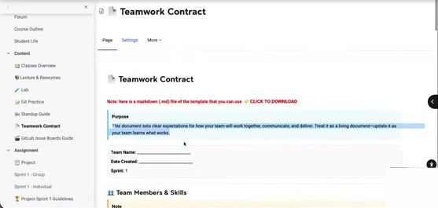

课程网站 → Content → **Teamwork Contract**（提供 markdown 模板可下载）

**Purpose** — This document sets clear expectations for how your team will work together, communicate, and deliver. Treat it as a living document—update it as your team learns what works.
Team Name / Date Created / Sprint: 1

**👥 Team Members & Skills** — Note: Agile teams need **skills**, not roles. We contribute based on our skills and experience, not job titles. Our team collectively has all the skills needed to fulfil its purpose. Skills can be grouped into: **Customer skills**（understanding user needs, product management, requirements gathering, UX）· **Development skills**（programming, testing, database, architecture, technical implementation）· **Coaching skills**（facilitation, mentoring, process improvement, team coordination）。表格列：Name / Email / Primary Skills / Additional Skills / What I'll Contribute

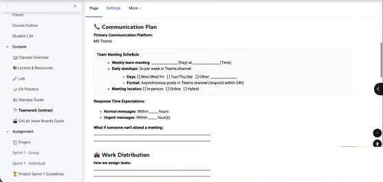

**📞 Communication Plan** — Primary Communication Platform: MS Teams · **Team Meeting Schedule**：Weekly meeting ____ (Day) at ____ (Time)；Daily standups: 3x per week in Teams channel；Days: [ ] Mon/Wed/Fri [ ] Tue/Thu/Sat [ ] Other；Format: Asynchronous posts in Teams channel (respond within 24h)；Meeting location: [ ] In-person [ ] Online [ ] Hybrid · **Response Time Expectations**：Normal messages: within ___ hours；Urgent messages: within ___ hour(s) · What if someone can't attend a meeting: ____
**📦 Work Distribution** — How we assign tasks / What if someone can't complete their task · **Code review process**：[ ] All code reviewed by at least one other person [ ] Review before merging to main branch [ ] Other · **💛 Team Ground Rules** — We agree to: 1. 2. 3. ...

🇨🇳 团队契约不是"贡献总结"，而是团队成员之间关于**打算如何协作**的约定（带什么技能、怎么沟通、怎么分工）。它是**规划**性质的，不是反思。

💬 学生问：是否要在截止前提交 teamwork contract？讲师：它和"贡献汇总"不同——你说的其实是 **sprint retro**（回顾），那是另一样东西，在 sprint 末做。Sprint 1 已过，但现在你知道为什么需要它，可用于下一个 sprint。
💬 关于 **Sprint 1 retro 的提交时间**有混淆（讲师看了 Discord/论坛）：正常应在 deadline 前交，但 **Sprint 1 的 retro 接受迟交，迟至本周你们的 class 前**；Sprint 2、3 的 retro 必须在截止前交。retro 文档不需要很长，只要证明开了会、走了流程、学到了什么、下个 sprint 要改什么。建议在 sprint 结束时（截止前）做，否则会吃掉 Sprint 2 的时间。
💬 学生反馈 Sprint 1 "要做的东西太多"。讲师：初衷是文档越少越好，明天会看提交情况，再看 Sprint 2/3 能怎么调整。另外反馈表里看到有人对 Sprint 1 的 add/delete 功能要求有疑惑，但讲师今天（已过截止）才知道——**有疑问请及早发邮件或发论坛**，反馈表是用于长期改进的，不适合提问；论坛能更快得到回复。

### 0.2 Project Sprint 2 Guidelines

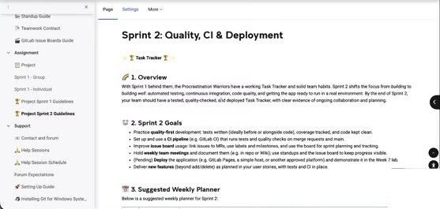

**Sprint 2: Quality, CI & Deployment**（🏆 Task Tracker）

**🚀 1. Overview** — With Sprint 1 behind them, the Procrastination Warriors have a working Task Tracker and solid team habits. Sprint 2 shifts the focus from *building* to *building well*: automated testing, continuous integration, code quality, and getting the app ready to run in a real environment. By the end of Sprint 2, your team should have a tested, quality-checked, and deployed Task Tracker, with clear evidence of ongoing collaboration and planning.

🇨🇳 Sprint 2 的重点从"做出来"转为"做得好"：自动化测试、持续集成、代码质量、部署。💬 讲师：目前只发布了高层内容，因为相关知识还没教；接下来三周会逐周补充。

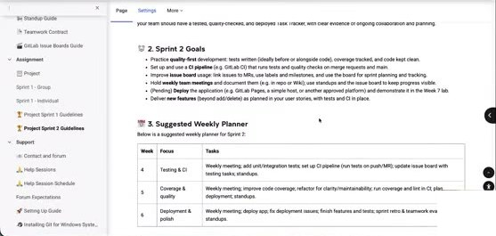

**🎯 2. Sprint 2 Goals**
- Practice **quality-first** development: tests written (ideally before or alongside code), coverage tracked, and code kept clean.
- Set up and use a **CI pipeline** (e.g. GitLab CI) that runs tests and quality checks on merge requests and main.
- Improve **issue board** usage: link issues to MRs, use labels and milestones, and use the board for sprint planning and tracking.
- Hold **weekly team meetings** and document them (e.g. in repo or Wiki); use standups and the issue board to keep progress visible.
- (Pending) **Deploy** the application (e.g. GitLab Pages, a simple host, or another approved platform) and demonstrate it in the Week 7 lab.
- Deliver **new features** (beyond add/delete) as planned in your user stories, with tests and CI in place.

**📅 3. Suggested Weekly Planner**

| Week | Focus | Tasks |
|---|---|---|
| 4 | Testing & CI | Weekly meeting; add unit/integration tests; set up CI pipeline (run tests on push/MR); update issue board with testing tasks; standups. |
| 5 | Coverage & quality | Weekly meeting; improve code coverage; refactor for clarity/maintainability; run coverage and lint in CI; plan deployment; standups. |
| 6 | Deployment & polish | Weekly meeting; deploy app; fix deployment issues; finish features and tests; sprint retro & teamwork evaluation; standups. |

Relevant lectures: Week 4 (Testing, CI), Week 5 (Coverage, Refactoring), Week 6 (DevOps).

💬 讲师：和 Sprint 1 一样，按这个周计划走，sprint 末就不会有问题。

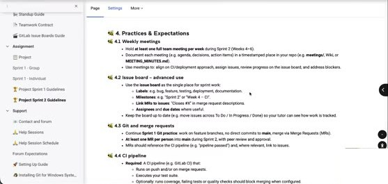

**🧭 4. Practices & Expectations**

**4.1 Weekly meetings**
- Hold **at least one full team meeting per week** during Sprint 2 (Weeks 4–6).
- Document each meeting (e.g. agenda, decisions, action items) in a timestamped place in your repo (e.g. `meetings/`, Wiki, or `MEETING_MINUTES.md`).
- Use meetings to: align on CI/deployment approach, assign issues, review progress on the issue board, and address blockers.

💬 讲师：Sprint 1 只要求 standup 不要求会议；Sprint 2 起**每周至少一次全员会议**——门槛不高，可以直接在 live class 大家都在时开。会后要有 meeting minutes；不爱写文档可用录制工具（如 Microsoft Teams 的 AI 会议纪要）自动生成。我们只要求：开了会、有 action items、有计划。

**4.2 Issue board – advanced use**
- Use the **issue board** as the single place for sprint work: **Labels**: e.g. bug, feature, testing, deployment, documentation. **Milestones**: e.g. "Sprint 2" or "Week 4 – CI". **Link MRs to issues**: "Closes #X" in merge request descriptions. **Assignees** and **due dates** where useful.
- Keep the board up to date (e.g. move issues across To Do / In Progress / Done) so your tutor can see how work is tracked.

💬 讲师：Sprint 1 提过 MR 关联 issue 但没要求；Sprint 2 **要求把 MR 链接到 issue**（在 MR 描述里写 `Closes #X` 即可关闭 issue）。Milestones 和 labels 是**可选**的。

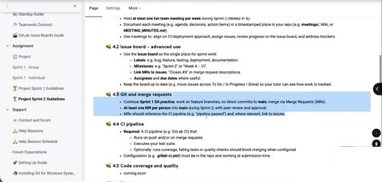

**4.3 Git and merge requests**
- Continue **Sprint 1 Git practice**: work on feature branches, no direct commits to **main**, merge via Merge Requests (MRs).
- **At least one MR per person** into **main** during Sprint 2, with peer review and approval.
- MRs should reference the CI pipeline (e.g. "pipeline passed") and, where relevant, link to issues.

💬 讲师：Git 与 MR 要求和 Sprint 1 相同，但**不再要求"每人一个 MR"**那样严格——Sprint 1 那么要求是为了确保每人都练到；Sprint 2 给你们更多灵活性，按团队实际情况规划。（注：网页文本仍写着 at least one MR per person，讲师口头表示会放宽。）

**4.4 CI pipeline**
- **Required**: A CI pipeline (e.g. GitLab CI) that: Runs on push and/or on merge requests. Executes your test suite. Optionally: runs coverage, failing tests or quality checks should block merging when configured.
- Configuration (e.g. `.gitlab-ci.yml`) must be in the repo and working at submission time.

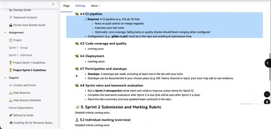

**4.5 Code coverage and quality** — coming soon · **4.6 Deployment** — coming soon
**4.7 Participation and standups** — **Standups**: 3 standups per week, including at least one in the lab with your tutor. Standups can be documented in your chosen place (e.g. MS Teams channel or repo); your tutor may ask to see evidence.
**4.8 Sprint retro and teamwork evaluation** — Run a **Sprint 2 retrospective** (what went well, what to improve, action items for Sprint 3). Complete the teamwork evaluation after Sprint 2 is due (link will be sent after Sprint 2 is due). Store the retro summary (and any updated team contract) in the repo.

💬 讲师：Sprint 1 每周 2 次 standup，Sprint 2 每周 3 次；standup 不应耗时，最多 15 分钟，通常 5 分钟够了。（线上提问：standup 是要视频会吗？——不是，在 Teams 频道里发消息即可；说"15 分钟"只是强调要快。）

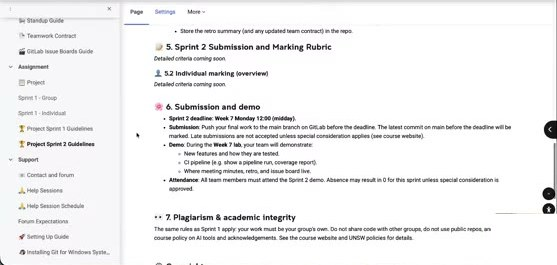

**📝 5. Sprint 2 Submission and Marking Rubric** — Detailed criteria coming soon. **5.2 Individual marking (overview)** — Detailed criteria coming soon.
**📌 6. Submission and demo**
- **Sprint 2 deadline: Week 7 Monday 12:00 (midday)**.
- **Submission**: Push your final work to the main branch on GitLab before the deadline. The latest commit on main before the deadline will be marked. Late submissions are not accepted unless special consideration applies (see course website).
- **Demo**: During the **Week 7 lab**, your team will demonstrate: New features and how they are tested. CI pipeline (e.g. show a pipeline run, coverage report). Where meeting minutes, retro, and issue board live.
- **Attendance**: All team members must attend the Sprint 2 demo. Absence may result in 0 for this sprint unless special consideration is approved.
**✍️ 7. Plagiarism and academic integrity** — The same rules as Sprint 1 apply...

🇨🇳 Sprint 2 截止：**第 7 周周一中午 12:00**，约三周后。Sprint ritual 与 Sprint 1 相同。

---

## Lecture 4.1 — Software Testing And Test-Driven Development

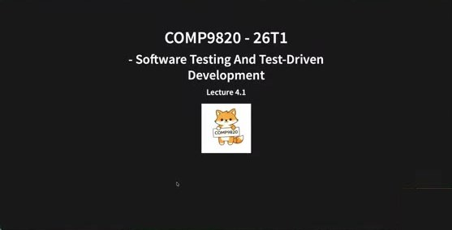

**COMP9820 - 26T1 · Software Testing And Test-Driven Development · Lecture 4.1**

### 1. In This Lecture

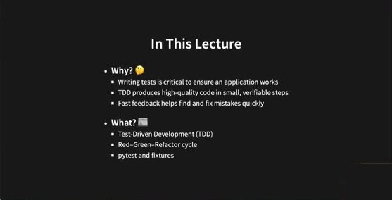

**In This Lecture**
- **Why? 🤔** Writing tests is critical to ensure an application works · TDD produces high-quality code in small, verifiable steps · Fast feedback helps find and fix mistakes quickly
- **What? 📖** Test-Driven Development (TDD) · Red–Green–Refactor cycle · pytest and fixtures

💬 讲师引入：讲软件管理时我们说**重视反馈、缩短迭代、根据反馈做改变**。反馈不只来自用户/客户/利益相关者这些"人"，也包括**代码/项目本身运行情况的反馈**——有没有 bug？软件是否在做你想让它做的事？你希望**尽早**得到这种反馈。获得这种快速反馈的一种方式就是**测试**。

### 2. 演示：Task Tracker 与手动测试

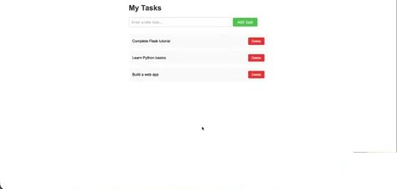

**My Tasks** — [Enter a new task...] [Add Task]；Complete Flask tutorial [Delete]；Learn Python basics [Delete]；Build a web app [Delete]

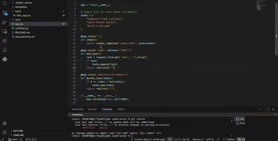

讲师 Sprint 1 项目 `app.py`（Flask，任务存在内存 list 里）：

```python
app = Flask(__name__)

# Simple list to store tasks (in memory)
tasks = [
    "Complete Flask tutorial",
    "Learn Python basics",
    "Build a web app",
]

@app.route('/')
def index():
    return render_template('index.html', tasks=tasks)

@app.route('/add', methods=['POST'])
def add_task():
    task = request.form.get('task', '').strip()
    if task:
        tasks.append(task)
    return redirect('/')

@app.route('/delete/<int:index>')
def delete_task(index):
    if 0 <= index < len(tasks):
        tasks.pop(index)
    return redirect('/')

if __name__ == '__main__':
    app.run(debug=True, port=5001)
```

💬 讲师问：Sprint 1 你们怎么验证软件能用？——在页面里加一个 task、看到了、删掉、没了：这是一种测试。学生答：什么都不填点 add 看会不会加；用 `print` 看变量（如 tasks 列表）有没有更新。讲师：这些都是验证软件按意图工作的方法，**但都需要手动操作**。有没有办法**更快、更容易、更少手动**？学生："自动化。"——这就是今天的内容：让测试更容易、更快、更频繁、更可视化。

### 3. Feedback And Iteration / TDD 定义

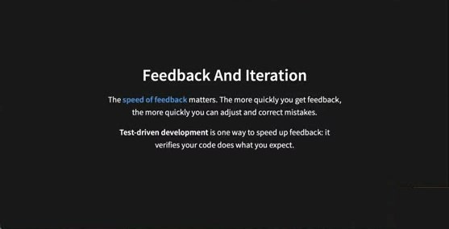

**Feedback And Iteration** — The **speed of feedback** matters. The more quickly you get feedback, the more quickly you can adjust and correct mistakes. **Test-driven development** is one way to speed up feedback: it verifies your code does what you expect.

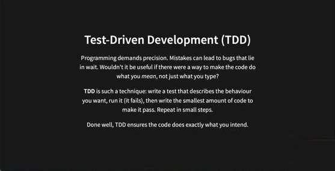

**Test-Driven Development (TDD)** — Programming demands precision. Mistakes can lead to bugs that lie in wait. Wouldn't it be useful if there were a way to make the code do what you *mean*, not just what you type? **TDD** is such a technique: write a test that describes the behaviour you want, run it (it fails), then write the smallest amount of code to make it pass. Repeat in small steps. Done well, TDD ensures the code does exactly what you intend.

🇨🇳 TDD：**先写测试**描述想要的行为 → 运行（失败，因为还没写生产代码）→ 写**最少的代码**让它通过 → 小步重复。

💬 讲师："为什么要先写测试？"学生：更早犯错、更早纠正。讲师补充的几个理由：
1. 上周讲用户故事时说过，一切从**用户视角/用户价值**出发——TDD 让你先想"我要达成什么"，再实现细节：**先设计、先规划，再实现**。
2. 测试是**活文档（living documentation）**：不需要另写文档，看测试就知道软件能做什么；将来改生产代码（更优雅、加注释等）时，测试不变，跑一遍就知道是否仍按预期工作。
3. **减少偏见**：先写实现再写测试，脑子里已经有了"应该怎么工作"的假设，测试会受其影响；先从故事写测试，测的是系统的**预期行为**。

### 4. What Is A Test / 第一个测试

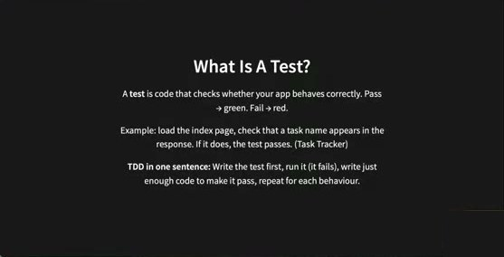

**What Is A Test?** — A **test** is code that checks whether your app behaves correctly. Pass → green. Fail → red. Example: load the index page, check that a task name appears in the response. If it does, the test passes. (Task Tracker) **TDD in one sentence:** Write the test first, run it (it fails), write just enough code to make it pass, repeat for each behaviour.

🇨🇳 在软件工程里，"测试"可以用**代码**来写：加载首页、检查响应里是否出现某个任务名。

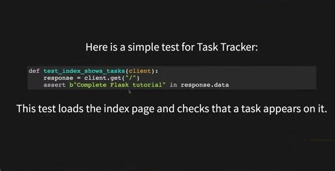

**Here is a simple test for Task Tracker:**

```python
def test_index_shows_tasks(client):
    response = client.get("/")
    assert b"Complete Flask tutorial" in response.data
```

This test loads the index page and checks that a task appears on it.

💬 讲师：我只有一个页面 index，我想确保 index 页面的响应里有 "Complete Flask tutorial" 这一行。做这个测试**不需要启动服务器、不需要 UI 能用**——很多时候项目只实现了一部分、前端还没好，UI 上什么都显示不了，但你可以先把测试写好。
💬 "测试放哪、怎么跑？"——Python 已有现成框架，不用从零写：**pytest**（讲师口音听起来像 "pest/piest"，就是 pytest）。

### 5. Setup: Run Your First Test（含 VS Code 演示）

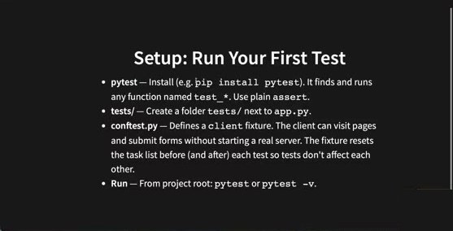

**Setup: Run Your First Test**
- **pytest** — Install (e.g. `pip install pytest`). It finds and runs any function named `test_*`. Use plain `assert`.
- **tests/** — Create a folder `tests/` next to `app.py`.
- **conftest.py** — Defines a `client` fixture. The client can visit pages and submit forms without starting a real server. The fixture resets the task list before (and after) each test so tests don't affect each other.
- **Run** — From project root: `pytest` or `pytest -v`.

💬 讲师：Windows/Linux 用 `pip install pytest`，macOS 用 `pip3 install pytest`。pytest 会找到所有以 `test_` 开头的函数并自动运行。建议建一个 `tests/` 文件夹把测试归在一起（不是强制——只要有 `test_*.py` 文件 pytest 就能找到，但分文件夹结构更清晰）。

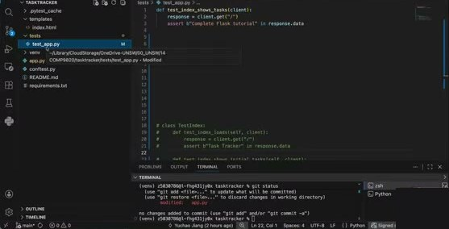
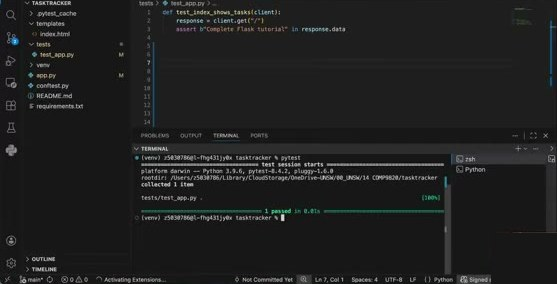

演示：项目结构 `tasktracker/ ├ .pytest_cache ├ templates/index.html ├ tests/test_app.py ├ venv ├ app.py ├ conftest.py ├ README.md └ requirements.txt`。把课件例子粘进 `tests/test_app.py`，终端运行 `pytest`：

```
==================== test session starts ====================
platform darwin -- Python 3.9.6, pytest-8.4.2, pluggy-1.6.0
rootdir: /Users/z5030786/.../COMP9820/tasktracker
collected 1 item

tests/test_app.py .                                    [100%]
==================== 1 passed in 0.01s ====================
```

🇨🇳 一个点 `.` = 一个通过；`1 passed`。意思是向 `/` 发 GET 请求，响应里包含那一行。

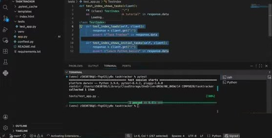

讲师加入更多测试并用**class 分组**：

```python
def test_index_shows_tasks(client):
    response = client.get("/")
    assert b"Complete Flask tutorial" in response.data

class TestIndex:
    def test_index_loads(self, client):
        response = client.get("/")
        assert b"Task Tracker" in response.data

    def test_index_shows_initial_tasks(self, client):
        response = client.get("/")
        assert b"Learn Python basics" in response.data
```

💬 为什么有 class？当测试很多、列表很长难读时，用 class 做**更高层的分组**（比如所有关于 index 页的测试放进 `TestIndex`）。再跑 `pytest` → `3 passed`。

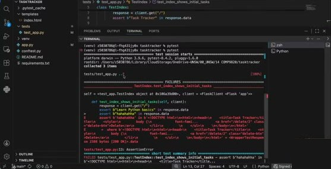

💬 出错时长什么样？讲师在最后一个测试加一行 `assert b"hahahaha" in response.data`（页面里并没有）：

```
tests/test_app.py ..F                                  [100%]
========================= FAILURES =========================
____ TestIndex.test_index_shows_initial_tasks ____
    def test_index_shows_initial_tasks(self, client):
        response = client.get("/")
        assert b"Learn Python basics" in response.data
>       assert b"hahahaha" in response.data
E       assert b'hahahaha' in b'<!DOCTYPE html>\n<html>\n<head>\n <title>Task Tracker</title>...'
tests/test_app.py:13: AssertionError
================= short test summary info =================
FAILED tests/test_app.py::TestIndex::test_index_shows_initial_tasks - assert b'hahahaha' in b'<!DOCTYPE html>...
================= 1 failed, 2 passed in 0.03s =================
```

🇨🇳 绿点 = 通过，红 `F` = 失败；报告告诉你**哪个测试、哪一行**失败。于是你知道：是测试写错了，还是实现缺了/错了，回去看实现让它通过。
💬 正常流程是：**先写测试用例（不写实现）**，再写实现。其他可测的行为：输入为空时点 Add Task，会不会加一个空白项带 Delete 按钮？这些先写成测试，再回去写实现。

### 6. conftest.py 与 Test Structure And Syntax

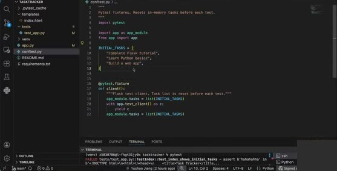

`conftest.py`（文件名**必须**是这个，pytest 自动识别）：

```python
"""
Pytest fixtures. Resets in-memory tasks before each test.
"""
import pytest

import app as app_module
from app import app

INITIAL_TASKS = [
    "Complete Flask tutorial",
    "Learn Python basics",
    "Build a web app",
]

@pytest.fixture
def client():
    """Flask test client. Task list is reset before each test."""
    app_module.tasks = list(INITIAL_TASKS)
    with app.test_client() as c:
        yield c
    app_module.tasks = list(INITIAL_TASKS)
```

💬 讲师："`client` 是什么？"——不用真正启动服务器，pytest（Flask test client）就能帮你测"给定请求，是否得到特定响应"，框架已经实现好了。`client` 在 `conftest.py` 里定义；这里定义了初始任务，并要求**每个测试前重置**。这很重要：前一个测试可能删了任务，后一个测试检查"数量加一"就会被影响——测试之间不能互相影响。放进 conftest 的重置会**对每个测试自动触发**，这是 pytest 的强大之处。
💬 第一次学测试会觉得很"虚"、不知道为什么这样能行——**动手写一写就会越来越清楚**，需要实践。

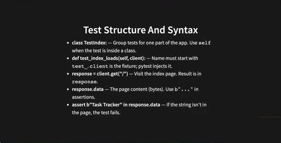

**Test Structure And Syntax**
- **class TestIndex:** — Group tests for one part of the app. Use `self` when the test is inside a class.
- **def test_index_loads(self, client):** — Name must start with `test_`. `client` is the fixture; pytest injects it.
- **response = client.get("/")** — Visit the index page. Result is in `response`.
- **response.data** — The page content (bytes). Use `b"..."` in assertions.
- **assert b"Task Tracker" in response.data** — If the string isn't in the page, the test fails.

💬 `b` 的原因：服务器返回的响应是 **bytes**。

💬 **课堂互动："明天做项目，想按 TDD 做，下一步是什么？"** 学生：写测试用例。讲师：看你的**用户故事**，用故事写测试。一开始测试可能不全面（比如只测 index 显示所有任务 + add 主功能），后来发现**边界情况**（输入为空点 Add 应保持不变）再补。→ 从故事出发，先写**主要**用例，逐步补边界。
💬 "是先把所有测试写完再写所有实现吗？"——**不是**。先写核心测试 → 写实现 → 任何时候发现缺测试就回去补。
💬 "测试写好了、生产代码能通过，但我觉得代码不够好想重构——先改还是先保证通过？"——**先用最少的努力让测试通过，之后有时间再重构**让代码更优雅/高效；首要目标是先通过。
💬 "我已经很确定要做多用户，也很清楚怎么写，能不能先写代码再补测试？"——学生们：**还是先写测试**。讲师：对，**再自信也先写测试**。

### 7. More Behaviours: Add, Empty, Delete

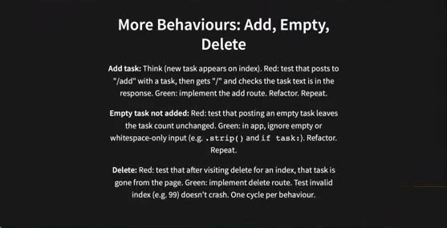

**More Behaviours: Add, Empty, Delete**
- **Add task:** Think (new task appears on index). Red: test that posts to "/add" with a task, then gets "/" and checks the task text is in the response. Green: implement the add route. Refactor. Repeat.
- **Empty task not added:** Red: test that posting an empty task leaves the task count unchanged. Green: in app, ignore empty or whitespace-only input (e.g. `.strip()` and `if task:`). Refactor. Repeat.
- **Delete:** Red: test that after visiting delete for an index, that task is gone from the page. Green: implement delete route. Test invalid index (e.g. 99) doesn't crash. One cycle per behaviour.

🇨🇳 每个行为一个 **Red → Green → Refactor → Repeat** 循环。💬 "空任务不添加"在 Sprint 1 不要求（Sprint 1 只要能加能删），Sprint 2 可作为一个故事：先写"POST 空任务后数量不变"的失败测试 → 实现忽略空/纯空白输入 → 重构 → 重复。可以一次写多个测试，但**不必**一次写完所有测试。

### 8. The Rule / Why TDD? / Common Misunderstanding / Order

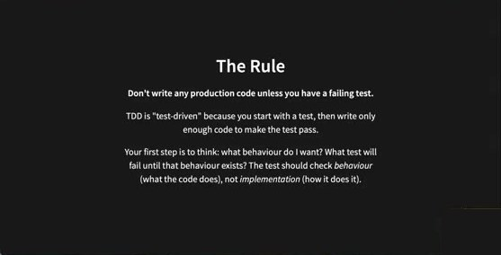

**The Rule** — **Don't write any production code unless you have a failing test.** TDD is "test-driven" because you start with a test, then write only enough code to make the test pass. Your first step is to think: what behaviour do I want? What test will fail until that behaviour exists? The test should check *behaviour* (what the code does), not *implementation* (how it does it).

💬 讲师：这是早期开发者**非常常见的错误**——"我以后肯定会用到这行代码"。这些都是对未来的假设，现实中往往用不到。写得越多要维护的越多、潜在 bug 越多、将来改动要操心的越多。**不要写任何你"假设将来会用到"的代码**；从测试开始，只写刚好够通过测试的代码。"想要什么行为"的答案来自**用户故事**。测行为不测实现，也是先写测试的原因之一（先写实现会带偏测试）。

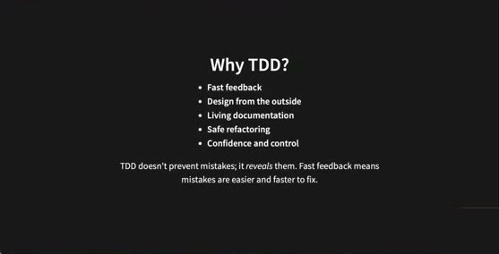

**Why TDD?** — Fast feedback · Design from the outside · Living documentation · Safe refactoring · Confidence and control. TDD doesn't prevent mistakes; it *reveals* them. Fast feedback means mistakes are easier and faster to fix.

💬 讲师逐条解释：
- **Design from the outside**：也叫**黑盒测试**——不关心盒子里怎么工作，只关心它怎么表现。像开车：不需要懂发动机，只要知道向左打方向盘就左转。
- **Living documentation**：读测试就知道软件能做什么。
- **Safe refactoring**：学生答"生产代码更少"；讲师补充：功能之间有依赖，改 A 可能无意中影响 B；跑 `pytest` 会测整个产品（或某一部分）的所有测试，所以改动更安全。**经常跑**：每次改完就跑，确保都过。
- **Confidence and control**：测试全过 → "耶，我有信心"。
- ⚠️ **非常重要的问题**："pytest 全绿，没有红的，能说软件做了你想要的吗？"——**不能**。TDD 不防错，可能测试**不全面**（比如忘了测空输入）。全绿只意味着**你测的那些**都对。它帮助**揭示** bug，不能**防止** bug。

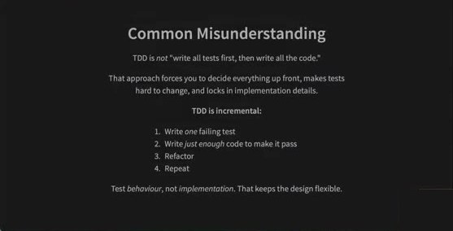

**Common Misunderstanding** — TDD is *not* "write all tests first, then write all the code." That approach forces you to decide everything up front, makes tests hard to change, and locks in implementation details. **TDD is incremental:** 1. Write *one* failing test 2. Write *just enough* code to make it pass 3. Refactor 4. Repeat. Test *behaviour*, not *implementation*. That keeps the design flexible.

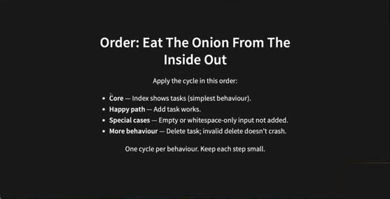

**Order: Eat The Onion From The Inside Out** — Apply the cycle in this order: **Core** — Index shows tasks (simplest behaviour). **Happy path** — Add task works. **Special cases** — Empty or whitespace-only input not added. **More behaviour** — Delete task; invalid delete doesn't crash. One cycle per behaviour. Keep each step small.

🇨🇳 "由内向外剥洋葱"：核心 → 正常路径 → 特殊情况 → 更多行为，每个行为一个循环、步子要小。💬 讲师：这两页刚才都已经讲过了。


**Feedback** — QR code / Or go to the form here.

💬 讲师结束 4.1：讲座只能解释高层逻辑（为什么、是什么）；真正学会**怎么做**要自己写测试、练流程，之后会有更深的理解和更多问题——这很正常。休息，19:00 回来学"怎么让它更快"。

---

## 休息期间 Q&A：Sprint 2 做什么功能？

💬 休息时有个很好的问题：Sprint 2 到底做什么功能？
- Sprint 1 所有人做同样的功能（add/delete），因为当时还没学故事；**现在你们有了自己的故事，Sprint 2/3 由你们自己决定做什么功能**。这部分指南还在起草，最迟明天发布。课程**不会**规定"加登录按钮、加用户"之类，你们实现**自己故事里**的功能；sprint 末按**给用户带来的价值**评分。
- 学生问：是否有**最低功能数量**基线？讲师反问学生怎么看。学生提议："能进生产、有人能用"作为基线；也有人提到和 GitLab issue board 之类比较（讲师：那太多功能了，有些组的故事未必需要）；也有人建议按**功能数量**。讲师：之前故意不用功能数量，因为**不想让大家觉得功能越多分越高**，或为凑数量牺牲功能质量/过程。会再想想；**请在明天结束前把建议写进反馈表**，今天的 newsletter 也会征集意见，**明晚定稿评分标准**。
- 已确定的：**没有课程规定的故事**，你们有自由度，继续做自己的故事；到 Sprint 3 结束要有一个**能工作的项目**。曾考虑只按测试/CI 评分不要求新功能，但不写新功能就无法练"测试先于实现"、pipeline、协作、团队契约是否有效——所以仍要以好的最终产品为目标，在真实实践中练习课程内容。
- "让我们一起创造这门课"——这是课程第一次开设，任何正面/负面反馈都欢迎。

---

## Lecture 4.2 — Continuous Integration

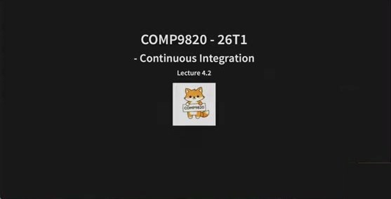

**COMP9820 - 26T1 · Continuous Integration · Lecture 4.2**

### 9. In This Lecture / CI 定义

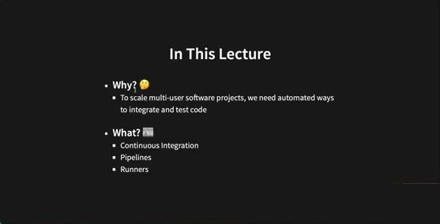

**In This Lecture** — **Why? 🤔** To scale multi-user software projects, we need automated ways to integrate and test code · **What? 📖** Continuous Integration · Pipelines · Runners

💬 讲师引入：现在有了测试，但我还得**手动**在终端跑 `pytest`，有时会忘，bug 就会溜过去；队友也可能没好好跑测试。怎么让每个人都**频繁、轻松**地得到反馈？——有个工具：**pipeline**，它是**持续集成**的一部分。

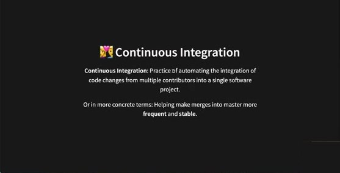

**🎊 Continuous Integration** — **Continuous Integration**: Practice of automating the integration of code changes from multiple contributors into a single software project. Or in more concrete terms: Helping make merges into master more **frequent** and **stable**.

🇨🇳 关键词：**自动化**、**代码变更**、**多个贡献者**、**单一软件项目**。更具体地说：让合入 main 更**频繁**、更**稳定**。

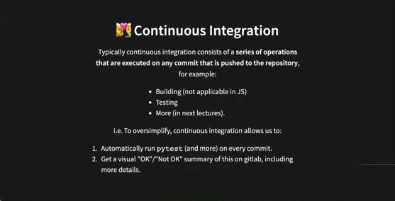

**🎊 Continuous Integration** — Typically continuous integration consists of a **series of operations that are executed on any commit that is pushed to the repository**, for example: Building (not applicable in JS) · Testing · More (in next lectures). i.e. To oversimplify, continuous integration allows us to: 1. Automatically run `pytest` (and more) on every commit. 2. Get a visual "OK"/"Not OK" summary of this on gitlab, including more details.

### 10. 演示：GitLab 上的绿勾与红叉

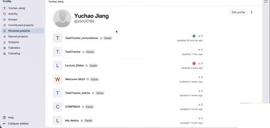

讲师 GitLab（gitlab.cse.unsw.edu.au）个人项目列表：TaskTracker_lectureDemo ✅（绿勾）、TaskTracker、Lecture_Slides ❌（红叉）、Welcome-9820、TaskTracker_starter、COMP9820、lab_deploy。

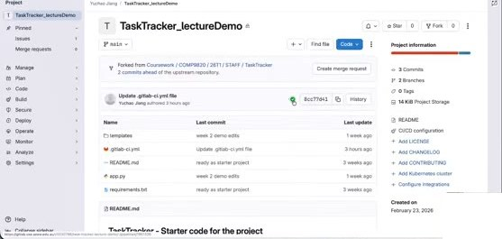
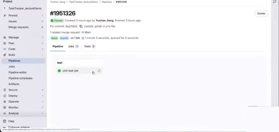
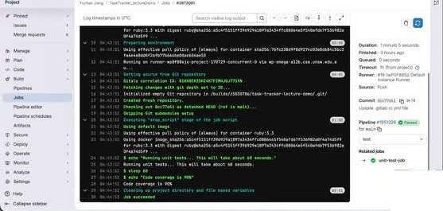

🇨🇳 项目页 commit 旁边的**绿勾/红叉**是 pipeline 通过/失败的**可视化指示**。点绿勾 → Pipeline `#1951326` Passed（For commit `8cc77d41` Update .gitlab-ci.yml file，1 related merge request !4 Main；stage **test** → job `unit-test-job` ✅）。点 job 看日志：`Running with gitlab-runner ... on runner wp0f88sj` → `Getting source from Git repository` → `Executing "step_script" stage of the job script` → `$ echo "Running unit tests... This will take about 60 seconds."` → `$ sleep 60` → `$ echo "Code coverage is 90%"` → `Job succeeded`。右侧：Duration 1 minute 5 seconds, Queued 0 seconds, Runner #19 (wP0F88Sj) Default Instance Runner, Source: Push。

💬 讲师："pipeline"意味着有几件事要测，分成不同的**阶段（stages）**——比如必须先过这一步才能做下一步，或者几个测试并行。这里只有一组、其实什么都没测，只是打印。

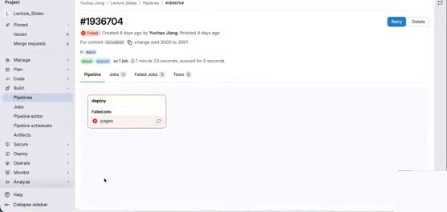
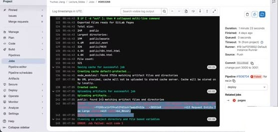

红叉示例（Lecture_Slides 项目）：Pipeline `#1936704` ❌ Failed，For commit change port 3000 to 3001，stage **deploy** → Failed jobs: `pages` ❌。日志末尾：`Uploading artifacts...` → `ERROR: Job failed: exit code 1`（413 Request Entity Too Large）。

💬 讲师：**每次 commit、每个 merge request**都会自动跑全部测试，得到报告和绿勾/红叉，**全组都能看到**，可以互相支持。这也很重要：**不要把坏代码合进 main**——合并 feature branch 前，先确认它有绿勾。
💬 休息时的另一个问题："需要写文档证明'测试先于实现'吗？"——**不需要**单独文档：**git 历史就是文档**。先提交测试（commit message 写"adding tests for …"），再提交实现（"implementation for …"），git history 已是活文档。

### 11. Setting It Up：.gitlab-ci.yml

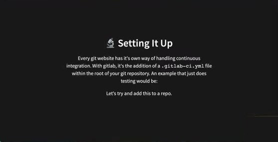

**🔩 Setting It Up** — Every git website has its own way of handling continuous integration. With gitlab, it's the addition of a `.gitlab-ci.yml` file within the root of your git repository. An example that just does testing would be: Let's try and add this to a repo.

💬 讲师：本课用 GitLab，GitHub、Bitbucket 等平台各有各的 CI 方式。GitLab 通过在仓库根目录加 **`.gitlab-ci.yml`** 文件——**文件名必须完全一样**，否则 GitLab 不认识。**yml = YAML**：像 markdown 一样是**数据**文件，不像 Python 那样可运行。

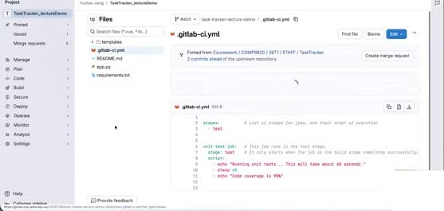

TaskTracker_lectureDemo 里的 `.gitlab-ci.yml`（355 B）：

```yaml
stages:          # List of stages for jobs, and their order of execution
  - test

unit-test-job:   # This job runs in the test stage.
  stage: test    # It only starts when the job in the build stage completes successfully.
  script:
    - echo "Running unit tests... This will take about 60 seconds."
    - sleep 60
    - echo "Code coverage is 90%"
```

💬 讲师解释：有 **stage**、有 **job**（名字自取）；job 发生在 test 阶段。为什么要分阶段？本课只讲 test 和 deploy，现实中测试前还有 **build** 阶段、之后有 **deployment** 阶段——只有 build 过了才进 test，只有 test 过了才 deploy。**script** 是 pipeline 里真正执行的动作；这里只是 `echo` 打印（code coverage 下周讲）。对我们来说真正要执行的动作是 **`pytest`**——把 echo/sleep 换成 `pytest`，意思就是 pipeline 触发时运行 pytest。

### 12. 演示：用 Pipeline Editor 添加 pipeline

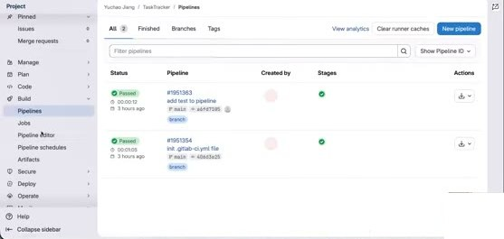

💬 添加 yml 的两种方式：① 项目里直接 add file 命名为 `.gitlab-ci.yml`；② 通过 **GitLab UI**：左侧菜单 **Build → Pipelines / Pipeline editor**。

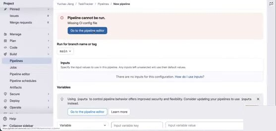
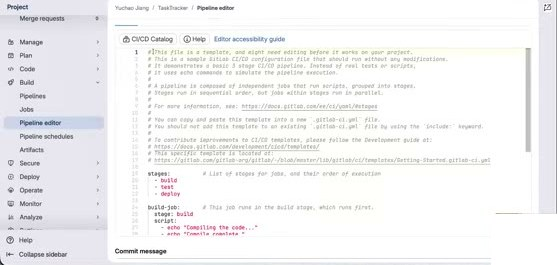

New pipeline → "Pipeline cannot be run. Missing CI config file" → **Go to the pipeline editor**。编辑器给出模板（含注释、文档链接）：`stages: - build - test - deploy`，以及 `build-job`、`unit-test-job`、`lint-test-job`、`deploy-job` 等示例 job。

💬 讲师：模板有指引和文档链接，也带了不同 stage 和 job，但本课只需要 test。Pipeline editor 的另一个好处是**语法检查器**：YAML 对语法（缩进空格等）非常严格，多一个空格就报 "This GitLab CI configuration is invalid"。

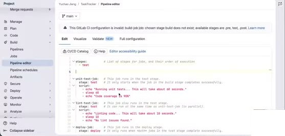

删多了会提示：*This GitLab CI configuration is invalid: build-job: chosen stage build does not exist; available stages are .pre, test, .post*。

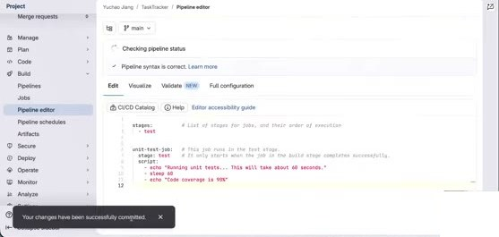

只保留 `stages: - test` 和 `unit-test-job` → **Pipeline syntax is correct** → Commit changes（Commit message: Update .gitlab-ci.yml file, Branch: main）→ *Your changes have been successfully committed* → Checking pipeline status。

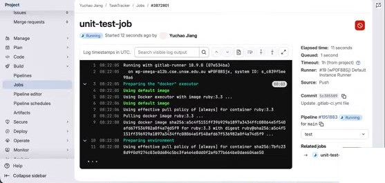

🇨🇳 提交后项目页出现之前没有的 pipeline 状态按钮（Running）；点开看 Pipeline `#1951883` → job `unit-test-job` 日志：`Running with gitlab-runner 18.9.0 ... Preparing the "docker" executor ... Using Docker executor with image ruby:3.3 ... Pulling docker image ruby:3.3 ...`。等约 1 分钟 → **Job succeeded**，项目页出现绿勾。💬 "Please pass, please pass"——其实什么都没做，肯定过。

### 13. How It Works：Runner

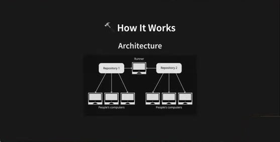

**🔨 How It Works — Architecture**：Repository 1、Repository 2 ← People's computers（各三台）；两个仓库共享一个 **Runner**。

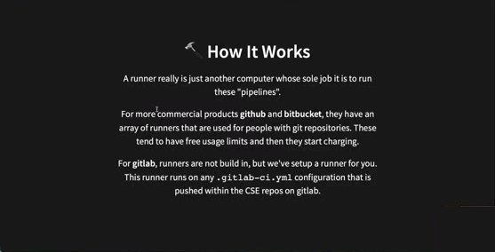

**🔨 How It Works** — A runner really is just another computer whose sole job it is to run these "pipelines". For more commercial products **github** and **bitbucket**, they have an array of runners that are used for people with git repositories. These tend to have free usage limits and then they start charging. For **gitlab**, runners are not build in, but we've setup a runner for you. This runner runs on any `.gitlab-ci.yml` configuration that is pushed within the CSE repos on gitlab.

💬 讲师：GitLab 为什么能跑你的代码？pipeline 跑在一台**服务器/runner**上——另一台机器拿到你的项目代码并运行 pipeline。组里所有人 push 到同一个仓库，而**多个仓库共用同一个 runner**，所以有时会很慢：刚才排队 1 秒、跑了 1 分 5 秒算快的；测试多了会更久，很多人同时用时会很慢。**不要在截止前最后一刻才把所有 commit 推上去**——所有组都在用同一个 runner，会排长队。
💬 在你**个人**项目里练 pipeline 可能提示 "no runner available"；**COMP9820 下的项目**都能用，因为 CSE 为你们配了 runner。GitHub/Bitbucket 有一批 runner，超出免费额度要付费，你们不需要。

### 14. Configuring / Adding Pytest To The Pipeline

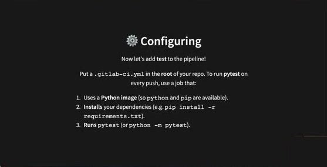

**⚙️ Configuring** — Now let's add **test** to the pipeline! Put a `.gitlab-ci.yml` in the **root** of your repo. To run **pytest** on every push, use a job that: 1. Uses a **Python image** (so `python` and `pip` are available). 2. **Installs** your dependencies (e.g. `pip install -r requirements.txt`). 3. **Runs** `pytest` (or `python -m pytest`).

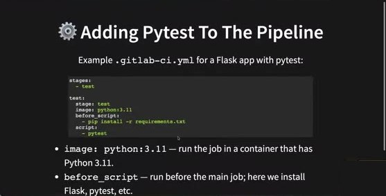

**⚙️ Adding Pytest To The Pipeline** — Example `.gitlab-ci.yml` for a Flask app with pytest:

```yaml
stages:
  - test

test:
  stage: test
  image: python:3.11
  before_script:
    - pip install -r requirements.txt
  script:
    - pytest
```

- `image: python:3.11` — run the job in a container that has Python 3.11.
- `before_script` — run before the main job; here we install Flask, pytest, etc.
- `script` — the actual test command; GitLab CI fails the job if `pytest` exits non-zero.

💬 讲师：要确保 runner 那台电脑装了 Python 才能跑你的 Python 代码，所以要有 **Python image** 并指定版本——**保证全组用同一版本**，避免"在我电脑上能跑、在他电脑上不行"。**before_script** = 在 script 之前运行的命令：先安装 `requirements.txt` 里所有依赖，避免因依赖缺失导致测试失败。
💬 可选扩展：加 `only: - main`，pipeline **只在 main 分支运行**——组里 feature branch 很多、每个 commit 都触发会很慢，可以只让合入 main 的 MR 触发。看什么适合你们组。其他配置课后自行探索。


**⚙️ Adding Pytest To The Pipeline — Requirements:** `requirements.txt` in the repo root (include `pytest` and your app deps, e.g. `Flask`). Tests in `tests/` (or wherever `pytest` finds them by default). After you push, the **test** job runs on GitLab's runner; the pipeline is **green** if `pytest` passes and **red** if any test fails.

### 15. 演示：push 与 merge request 触发 pipeline


💬 讲师回到 VS Code："改项目前先做什么？"——**`git pull`**。然后把课件里的 yml 粘进 `.gitlab-ci.yml`，`git status` 检查（改了 `.gitlab-ci.yml`、`app.py`（测试用端口号）、`tests/test_app.py`（删掉 hahahaha 那行））。"提交前先做什么？"——`git add`。第一周讲的是逐个 `git add 文件`，更省事的是 **`git add --all`**（或 `-A`），但**要小心**：只在你确定要把这些改动放在同一个 commit 里时才用。`git commit -m "ready to demo ci"` → `git push` → GitLab 上 pipeline 开始 Running。


Pipeline `#1951918` → job `test` 日志：`Installing collected packages: pluggy, packaging, MarkupSafe, itsdangerous, iniconfig, click, blinker, Werkzeug, Jinja2, Flask ... Successfully installed Flask-3.0.0 ...` → `$ pytest` → `platform linux -- Python 3.11.15, pytest-7.4.0` → `collected 3 items` → `tests/test_app.py ... [100%]` → **3 passed in 0.01s** → `Job succeeded`。✅ Passed。

🇨🇳 只要 push 到 GitLab 仓库就会触发 pipeline，这里跑的就是 pytest。


💬 **Merge request 也会触发 pipeline**：New merge request（source main → target `displayonly` 之类的实验分支）→ Compare branches and continue → Create merge request。MR 页面：**Pipeline #1951918 passed** ✅（for a6de5084 on main）· Approve · **Ready to merge!** · [Merge]。（一开始没显示是因为在等 runner。）
💬 **合并前一定要看到这个绿勾**；审查队友 MR 时，**确认绿勾再 approve**；原提交者合并时也要再确认 pipeline passed。讲师没有真的合并（会把仓库搞乱），只是展示绿勾。

### 16. CI Summary / Master Always Green / Further Reading


**🎊 Continuous Integration** — In summary, continuous integration assists us in making frequent code changes, because we can: 1. Write tests 2. Write implementation 3. Push to gitlab + add merge request 4. Make sure we have the green tick 5. Merge in Confidence!


**🎊 Continuous Integration** — An important rule to follow is that your **master** branch should ALWAYS be green. No code should be merged into it unless you're getting the green tick.

🇨🇳 **main 分支永远是绿的**：没有绿勾的代码不许合入。


**📚 Further Reading** — You should definitely read the following: **Gitlab Continuous Integration** · **Atlassian Continuous Integration**

💬 讲师：两份都读过，都很好。GitLab 有视频和文档；Atlassian 关于 CI、GitLab、Git 的教程/指南都很棒（演示打开了 about.gitlab.com 的 CI 页面和 Atlassian 的 "How to get to continuous integration → Getting started with automated testing"）。今天难得提前讲完。
💬 线上最后提问："是不是说不用在课外开会、每周会议可以在课上开？"——讲师**没有**说不用在课外开会；很多组发现课外开会很有帮助。只是说课上开会能省时间（大家都在）。**每周一次会议是最低要求**。

---

## 附：本周待办清单

- [ ] **Sprint 1 retro**：若未交，最迟在**本周你的 class 之前**补交（仅 Sprint 1 接受迟交；Sprint 2/3 必须截止前交）；内容不必长。
- [ ] 参考 Teamwork Contract 模板（课程网站 Content → Teamwork Contract）为 Sprint 2 更新团队契约（技能、沟通、分工、code review 规则、ground rules）。
- [ ] 阅读 **Project Sprint 2 Guidelines**（会逐周更新）；关注明天发布的**功能要求/评分标准**；**明天结束前**在反馈表提出对"最低功能基线"的建议。
- [ ] Sprint 2 起：**每周至少 1 次全员会议**并留下 meeting minutes（可用 Teams AI 纪要）；**每周 3 次 standup**（含至少 1 次在 lab 与 tutor）；MR 描述用 `Closes #X` **链接 issue**（必做）；labels/milestones 可选。
- [ ] 在项目里安装 pytest，建 `tests/` 与 `conftest.py`（`client` fixture + 每个测试前重置数据），从**用户故事**写核心测试 → 最少代码通过 → 重构 → 重复；**先测试后实现**，git 历史即证明。
- [ ] 在仓库根目录添加 `.gitlab-ci.yml`（`image: python:3.11`、`before_script: pip install -r requirements.txt`、`script: pytest`），确保 `requirements.txt` 含 pytest 与 Flask；提交后确认 GitLab 绿勾。
- [ ] 规则：**main 永远绿**——MR 合并前（审查者 approve 前、提交者 merge 前）确认 pipeline passed。
- [ ] 不要在截止前最后一刻集中 push（runner 共享会排队）。
- [ ] 阅读 GitLab CI 与 Atlassian CI 文档。
- [ ] **Sprint 2 截止：Week 7 周一 12:00**；Week 7 lab 全员出席 demo（新功能与测试、pipeline/coverage、会议纪要/retro/issue board）。
