# COMP9820 Week 5 — Lecture 5.1 Management: Coverage Reports (Without Dysfunction) · Lecture 5.2 Designing For Maintainability（课件整理）

> 来源：YouTube 直播录像 [COMP9820 26T1 Week 5](https://www.youtube.com/watch?v=jRUYk4oM92U)（UNSW_COMP9820，2026-03-16，约 1 小时 37 分，含 7 分钟休息）
> 讲师：Dr. Yuchao Jiang
> 说明：按讲师投影顺序还原两份课件。**英文为幻灯片原文**，「🇨🇳」为中文翻译/解释，「💬 讲师补充」为课件上没有但讲师口头强调的内容。截图位于 `images/`（视频抽帧裁剪，本视频最高 360p，字体较小但可辨认；所有代码/表格/要点均已转录为文字）。
> 课件之外，讲师在 VS Code / Safari 里现场演示了 **pytest-cov 终端报告与 HTML 报告**，并逐个打开了 5.2 的示例代码文件（`dry_dirty.py`、`kiss_simple.py`、`over_under_design.py`、`coupling.py`、`conventions_clear.py`），一并整理在各小节。

---

## 目录

- [Lecture 5.1 — Management: Coverage Reports (Without Dysfunction)](#lecture-51--management-coverage-reports-without-dysfunction)
  - [0. 开场故事：你是经理，bug 越来越多怎么办？](#0-开场故事你是经理bug-越来越多怎么办)
  - [1. In This Lecture](#1-in-this-lecture)
  - [2. Theory X vs Theory Y](#2-theory-x-vs-theory-y)
  - [3. Metrics Can Be Useful / But Only If Used Carefully](#3-metrics-can-be-useful--but-only-if-used-carefully)
  - [4. The Example Metric: Coverage / Two Meanings](#4-the-example-metric-coverage--two-meanings)
  - [5. What Code Coverage Tells Us（含代码走读）](#5-what-code-coverage-tells-us含代码走读)
  - [6. Getting A Coverage Report (Pytest)（含终端演示）](#6-getting-a-coverage-report-pytest含终端演示)
  - [7. 演示：HTML 报告（Files / Functions / 逐行）](#7-演示html-报告files--functions--逐行)
  - [8. Reading The Coverage Table / 什么是 statement](#8-reading-the-coverage-table--什么是-statement)
  - [9. The Classic Coverage Mandate / Why This Dysfunction Is Inevitable](#9-the-classic-coverage-mandate--why-this-dysfunction-is-inevitable)
  - [10. Coverage Report: What It Is (And Isn't) / Branch coverage](#10-coverage-report-what-it-is-and-isnt--branch-coverage)
  - [11. AI And Coverage / AI And Measurement Dysfunction / What This Means For You](#11-ai-and-coverage--ai-and-measurement-dysfunction--what-this-means-for-you)
- [Lecture 5.2 — Designing For Maintainability](#lecture-52--designing-for-maintainability)
  - [12. In This Lecture / Why Care About Maintainability?](#12-in-this-lecture--why-care-about-maintainability)
  - [13. Sustainable Speed > Raw Performance / Maintainability: But How?](#13-sustainable-speed--raw-performance--maintainability-but-how)
  - [14. Code Design / 7 Design Questions To Ask](#14-code-design--7-design-questions-to-ask)
  - [15. Q1 Is There One Source Of Truth? — DRY](#15-q1-is-there-one-source-of-truth--dry)
  - [16. Q2 Is This As Simple As Possible? — KISS](#16-q2-is-this-as-simple-as-possible--kiss)
  - [17. Q3 Is This Over-Designed Or Under-Designed?](#17-q3-is-this-over-designed-or-under-designed)
  - [18. Q4/Q5 Coupling：related close, unrelated apart](#18-q4q5-couplingrelated-close-unrelated-apart)
  - [19. Q6 Am I Speculating About How Necessary This Is? — YAGNI](#19-q6-am-i-speculating-about-how-necessary-this-is--yagni)
  - [20. Q7 Does This Follow Standard Conventions?](#20-q7-does-this-follow-standard-conventions)
  - [21. Refactoring](#21-refactoring)
  - [22. Why Does This Still Matter With AI?](#22-why-does-this-still-matter-with-ai)
  - [23. 结尾 Q&A：Sprint 1 成绩](#23-结尾-qasprint-1-成绩)
- [附：本周待办清单](#附本周待办清单)

---

## Lecture 5.1 — Management: Coverage Reports (Without Dysfunction)

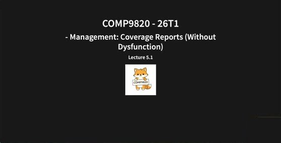

**COMP9820 - 26T1 — Management: Coverage Reports (Without Dysfunction) — Lecture 5.1**

💬 讲师开场："今天的内容应该比较轻松，不难但很重要；希望早点结束，把时间还给你们做项目/其他作业。欢迎来到第五周。"

### 0. 开场故事：你是经理，bug 越来越多怎么办？

💬 讲师口头叙述（课件无此页）：

> 这门课叫软件项目管理。到目前为止我们讲的都是敏捷——团队每个人都参与管理。但除了普通成员，还有一个角色叫 **manager**：进业界会有经理，做创业会有 founder/co-founder 来管项目。今天第一讲聚焦这个角色：如果你当了经理或自己创业带项目，**你能做什么让项目保持敏捷、给客户带来价值、高效、适应变化？**
>
> **故事**：你是一个敏捷软件项目的经理，每周/双周和团队 check-in，看 demo，新功能不断交付，一切看起来不错。但随着时间推移，**bug 越来越多**；部署给最终用户后问题也越来越多。你会怎么办？
>
> 学生答：加追踪系统、看性能指标；加 **code review**。
>
> 于是这位经理决定：增加 code review + 增加指标——既然功能交付了但 bug 多，就看看**测试够不够、每个功能有没有被彻底测试**。
>
> 几周后：几乎所有功能都被测试覆盖了，测试数量暴涨。**但软件仍然很 buggy**，而且因为测试太多，**测试变得非常慢**。为什么？下一步怎么办？
>
> 原因：你要的是"给我看有多少测试、是否覆盖了所有函数"。团队被这个指标驱动，开始写大量**琐碎的测试**，目标变成了"每一行代码都被测试覆盖"，而不是"软件稳定、安全、按预期工作"。**团队的目标因为经理的指挥而偏移了。** 一开始没指标 → 一堆 bug；加了指标 → 还是一堆 bug；根本问题没解决。
>
> 这就是今天要讲的：经理的角色、如何管理软件项目——以 **coverage report 这个指标为例**。

### 1. In This Lecture

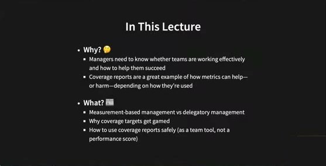

- **Why? 🤔**
  - Managers need to know whether teams are working effectively and how to help them succeed
  - Coverage reports are a great example of how metrics can help—or harm—depending on how they're used
- **What? 📖**
  - Measurement-based management vs delegatory management
  - Why coverage targets get gamed
  - How to use coverage reports safely (as a team tool, not a performance score)

🇨🇳 为什么：经理需要知道团队是否高效、问题在哪、怎么帮他们成功；覆盖率报告是"指标可以帮忙也可以伤害，取决于怎么用"的绝佳例子。讲什么：基于测量的管理 vs 授权式管理；为什么覆盖率目标会被"刷"；如何安全使用覆盖率报告（作为团队工具，而非绩效分数）。

### 2. Theory X vs Theory Y

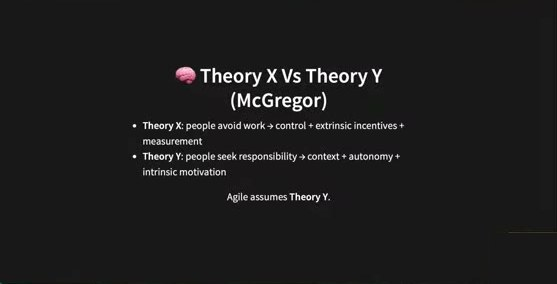

**🧠 Theory X Vs Theory Y (McGregor)**

- **Theory X**: people avoid work → control + extrinsic incentives + measurement
- **Theory Y**: people seek responsibility → context + autonomy + intrinsic motivation

Agile assumes **Theory Y**.

🇨🇳 麦格雷戈 X/Y 理论。**X 理论**假设人逃避工作（只想拿钱、不享受工作）→ 经理用控制、外在激励（例如"所有函数都被测试覆盖就给奖金/升职"）和大量测量（指标、报告、文档）来管控进度。**Y 理论**假设人主动寻求责任、希望项目成功 → 提供环境（学习环境、支持），让人自主工作，并用内在动机激励（比如"看看多少用户在真正使用你写的代码"）。**敏捷假设 Y 理论。**

💬 讲师："上世纪 90 年代左右（记不清具体年份）有人对大量软件公司做研究，发现大多数公司要么用 X 要么用 Y。"

### 3. Metrics Can Be Useful / But Only If Used Carefully

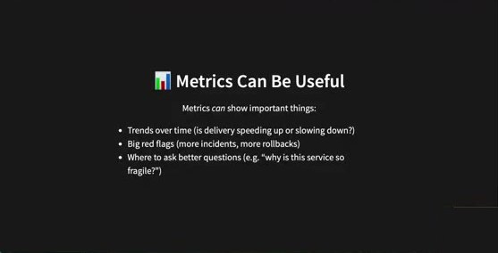

**📊 Metrics Can Be Useful** — Metrics *can* show important things:

- Trends over time (is delivery speeding up or slowing down?)
- Big red flags (more incidents, more rollbacks)
- Where to ask better questions (e.g. "why is this service so fragile?")

🇨🇳 指标能显示趋势（交付在加速还是减速）、大红旗（事故/回滚变多）、以及该去哪里问更好的问题。

💬 讲师举例：commit 数量在**一定程度上**反映工作量；测试数量在一定程度上反映测试的彻底程度；代码行数也能说明一些东西——**但不是全部**。

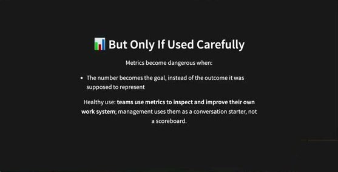

**📊 But Only If Used Carefully** — Metrics become dangerous when:

- The number becomes the goal, instead of the outcome it was supposed to represent

Healthy use: **teams use metrics to inspect and improve their own work system**; management uses them as a conversation starter, not a scoreboard.

🇨🇳 当**数字本身变成目标**、而不是它本应代表的结果时，指标就危险了。健康用法：团队自己用指标检查并改进自己的工作系统；管理层把它当**对话的起点**，而不是记分板。

💬 讲师："如果我说'你们每个人两天内写 100 行代码'，得到的是什么？一堆质量不好、跑不通的代码。"
💬 经理的正确用法：不是"这是你升职的目标"，而是问"有没有函数还没被测试覆盖？"——以此**开启对话**：是我给的时间太短？是你不知道怎么给这个函数写测试（blocker）？还是你觉得它暂时不需要测试？

### 4. The Example Metric: Coverage / Two Meanings

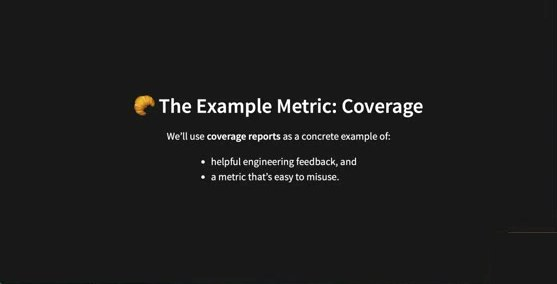

**🧭 The Example Metric: Coverage** — We'll use **coverage reports** as a concrete example of:

- helpful engineering feedback, and
- a metric that's easy to misuse.

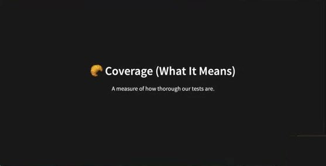

**🧭 Coverage (What It Means)** — A measure of how thorough our tests are.

🇨🇳 覆盖率 = 衡量测试有多彻底。

💬 讲师提问："上周讲了测试。你怎么知道测试够不够？怎么知道该在哪加测试？"学生：取决于功能数量——功能越多需要越多测试。讲师：对；但你可以手动对着测试文件和实现文件逐个看"这个功能被那个测试覆盖了吗"——**有没有工具帮我们自动算？** 就像 pipeline 自动化、Git 帮协作一样。

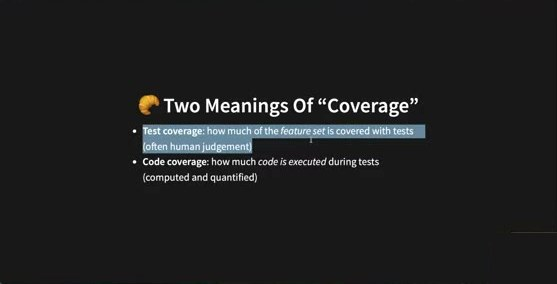

**🧭 Two Meanings Of "Coverage"**

- **Test coverage**: how much of the *feature set* is covered with tests (often human judgement)
- **Code coverage**: how much *code is executed* during tests (computed and quantified)

🇨🇳 **测试覆盖**：功能集有多少被测试覆盖——通常靠人判断（"有个加任务的功能，也有个加任务的测试"）。**代码覆盖**：测试运行时有多少**代码被执行**——可计算、可量化为百分比。**今天的重点是 code coverage。**

💬 讲师回到上周的 Task Tracker：后端有显示任务、添加任务、删除任务三个故事；测试套件里 `test_index_shows_tasks`、`test_index_loads`、`test_index_shows_initial_tasks` **全是关于显示任务的**——人工一看就知道 add / delete 还没测。这就是靠人判断的 test coverage。

### 5. What Code Coverage Tells Us（含代码走读）

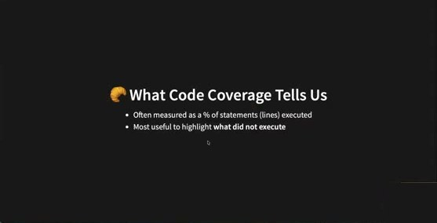

**🧭 What Code Coverage Tells Us**

- Often measured as a % of statements (lines) executed
- Most useful to highlight **what did not execute**

🇨🇳 通常按"被执行的语句（行）百分比"来度量；**最有用的是指出哪些代码没有被执行。**

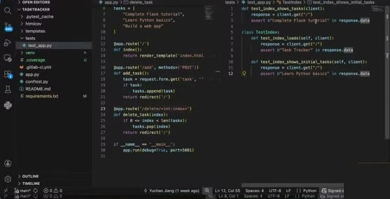

💬 讲师在 VS Code 里并排打开 `app.py` 与 `tests/test_app.py`（上周项目）：

```python
# app.py
from flask import Flask, render_template, request, redirect

app = Flask(__name__)

# Simple list to store tasks (in memory)
tasks = [
    "Complete Flask tutorial",
    "Learn Python basics",
    "Build a web app"
]

@app.route('/')
def index():
    return render_template('index.html', tasks=tasks)

@app.route('/add', methods=['POST'])
def add_task():
    task = request.form.get('task', '').strip()
    if task:
        tasks.append(task)
    return redirect('/')

@app.route('/delete/<int:index>')
def delete_task(index):
    if 0 <= index < len(tasks):
        tasks.pop(index)
    return redirect('/')

if __name__ == '__main__':
    app.run(debug=True, port=5001)
```

```python
# tests/test_app.py
def test_index_shows_tasks(client):
    response = client.get("/")
    assert b"Complete Flask tutorial" in response.data

class TestIndex:
    def test_index_loads(self, client):
        response = client.get("/")
        assert b"Task Tracker" in response.data

    def test_index_shows_initial_tasks(self, client):
        response = client.get("/")
        assert b"Learn Python basics" in response.data
```

💬 三个测试都只 `client.get("/")`，所以运行测试时只有 `index()` 被执行；`add_task` 和 `delete_task` 里的语句**明显没有被覆盖**。代码短的时候肉眼能看出来，代码长了就需要工具。

### 6. Getting A Coverage Report (Pytest)（含终端演示）

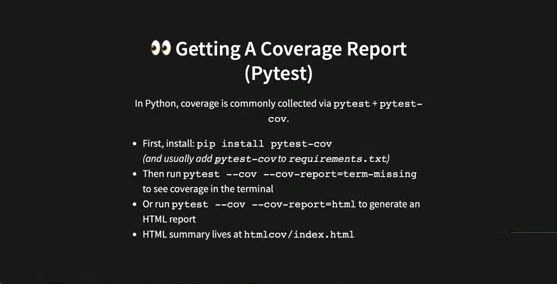

**👀 Getting A Coverage Report (Pytest)** — In Python, coverage is commonly collected via `pytest` + `pytest-cov`.

- First, install: `pip install pytest-cov` *(and usually add `pytest-cov` to `requirements.txt`)*
- Then run `pytest --cov --cov-report=term-missing` to see coverage in the terminal
- Or run `pytest --cov --cov-report=html` to generate an HTML report
- HTML summary lives at `htmlcov/index.html`

🇨🇳 安装 `pytest-cov`；终端报告用 `--cov-report=term-missing`；HTML 报告用 `--cov-report=html`，输出在 `htmlcov/index.html`。

💬 讲师演示与补充：
- Mac 上用 `pip3 install pytest-cov`（**Mac 要加 3**）。
- **强烈建议把 `pytest-cov` 加进 `requirements.txt`**：上周的 GitLab pipeline 在 `before_script` 里从 requirements 装依赖，这样以后可以把覆盖率加进 pipeline 里跑。
- 虽然不是 TDD 顺序（先写测试再写实现），**已有实现也要把测试补回来**：以后重构/改代码时，怎么知道行为没变？靠测试全绿。

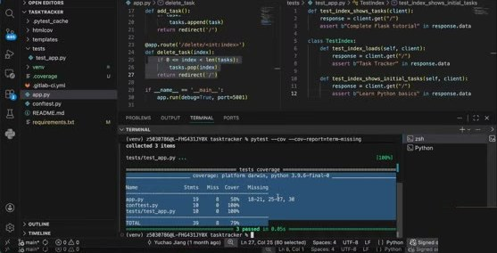

终端输出（`pytest --cov --cov-report=term-missing`）：

```
collected 3 items

tests/test_app.py ...                                    [100%]

---------- coverage: platform darwin, python 3.9.6-final-0 ----------
Name                Stmts   Miss  Cover   Missing
-------------------------------------------------
app.py                 19      8    58%   18-21, 25-27, 30
conftest.py            10      0   100%
tests/test_app.py      10      0   100%
-------------------------------------------------
TOTAL                  39      8    79%

3 passed in 0.05s
```

💬 `app.py` 缺失 **18–21 行**（`add_task` 路由的语句）和 **25–27 行**（`delete_task`）——正是没写测试的两个功能；第 30 行是 `app.run(...)`。"非常直观、非常有用：我知道该在哪里补测试了。"

### 7. 演示：HTML 报告（Files / Functions / 逐行）

💬 讲师："你可能说，这个报告已经很强了，但我想要更方便的看法。"运行 `pytest --cov --cov-report=html`，终端提示 `Coverage HTML written to dir htmlcov`；项目里新出现 `htmlcov/` 目录，里面有 `index.html`，用 VS Code 打开（或任何浏览器）。

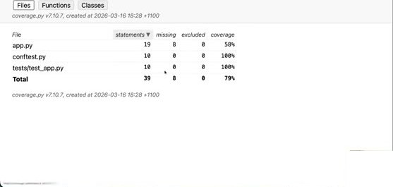

**Coverage report: 79%** — 标签页 Files / Functions / Classes

| File | statements | missing | excluded | coverage |
|---|---|---|---|---|
| app.py | 19 | 8 | 0 | 58% |
| conftest.py | 10 | 0 | 0 | 100% |
| tests/test_app.py | 10 | 0 | 0 | 100% |
| **Total** | **39** | **8** | **0** | **79%** |

💬 点 `app.py`（"我的主文件只有 58%，几乎一半代码没被测试覆盖"）进入逐行视图：

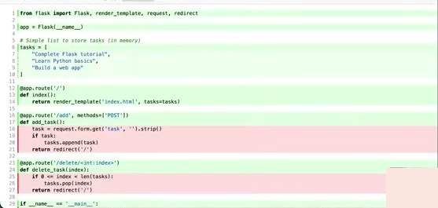

**Coverage for app.py: 58%** — 19 statements · 11 run · 8 missing · 0 excluded

- **绿色**行 = 测试运行时执行过（已覆盖）
- **红色**行 = 缺失（第 18–21、25–27、30 行）

💬 "这 8 行红的需要**考虑**加测试——是否必要取决于你自己的判断，**不需要追求 100%**，有些代码行本来就不需要测试（做项目时你会碰到）。这就是为什么说不能把指标当唯一目标，但用得对时它非常有帮助。"

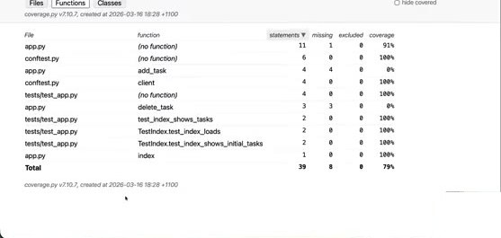

💬 学生问："顶部的 Functions 和 Classes 标签是什么？"讲师点开 **Functions** 视图：按函数列出覆盖率——

| File | function | statements | missing | coverage |
|---|---|---|---|---|
| app.py | (no function) | 11 | 1 | 91% |
| conftest.py | (no function) | 6 | 0 | 100% |
| app.py | add_task | 4 | 4 | 0% |
| conftest.py | client | 4 | 0 | 100% |
| tests/test_app.py | (no function) | 4 | 0 | 100% |
| app.py | delete_task | 3 | 3 | 0% |
| tests/test_app.py | test_index_shows_tasks | 2 | 0 | 100% |
| tests/test_app.py | TestIndex.test_index_loads | 2 | 0 | 100% |
| tests/test_app.py | TestIndex.test_index_shows_initial_tasks | 2 | 0 | 100% |
| app.py | index | 1 | 0 | 100% |

🇨🇳 这里的函数很小，但当函数很多或很大时，按函数看"哪个函数完全没测"（`add_task` 4/4 缺失、`delete_task` 3/3 缺失）非常有用。"I love this HTML report."

💬 **学生问：能不能在 pipeline 里为每个 feature 出一份覆盖率报告？** 讲师："说实话我不知道怎么做，可能可以也可能不行——你去研究一下，下节课告诉我们。**最低限度**：通常每个新功能开一个分支，你可以拿到那个**分支**的覆盖率报告，也就相当于那个功能的覆盖率。"

### 8. Reading The Coverage Table / 什么是 statement

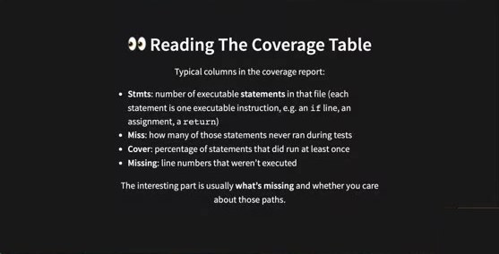

**👀 Reading The Coverage Table** — Typical columns in the coverage report:

- **Stmts**: number of executable **statements** in that file (each statement is one executable instruction, e.g. an `if` line, an assignment, a `return`)
- **Miss**: how many of those statements never ran during tests
- **Cover**: percentage of statements that did run at least once
- **Missing**: line numbers that weren't executed

The interesting part is usually **what's missing** and whether you care about those paths.

🇨🇳 Stmts=可执行语句数；Miss=没跑过的语句数；Cover=至少跑过一次的百分比；Missing=未执行的行号。**有意思的部分永远是"缺了什么"以及你是否在乎那些路径。**

💬 讲师现场讲 **statement**："一个 statement = 一个有意义的代码块。`a = 1` 是一个 statement；`tasks = [ ... ]` 跨了 5 行也只是一个 statement。"接着把两个操作写到一起问大家："这是一个还是两个 statement？"——**两个**，因为你在做两件不同的事。所以 `delete_task` 函数里有 3 个 statement（`if`、`pop`、`return`），全部缺失。

### 9. The Classic Coverage Mandate / Why This Dysfunction Is Inevitable

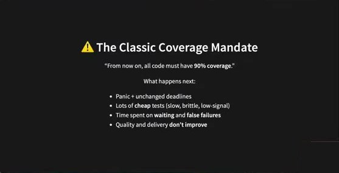

**⚠️ The Classic Coverage Mandate** — "From now on, all code must have **90% coverage**."

What happens next:

- Panic + unchanged deadlines
- Lots of **cheap** tests (slow, brittle, low-signal)
- Time spent on **waiting** and **false failures**
- Quality and delivery **don't improve**

🇨🇳 经典的"从现在起所有代码必须 90% 覆盖率"命令：恐慌+截止日期不变 → 一堆廉价测试（慢、脆、信号低）→ 时间花在等待和误报上 → 质量和交付并没有改善。

💬 讲师："有些创业公司/项目要求最低 90%，我不是说这一定错，只是要**小心使用**，让团队追求的是**好的测试覆盖**而不是数字。廉价测试不但没用而且有害。"

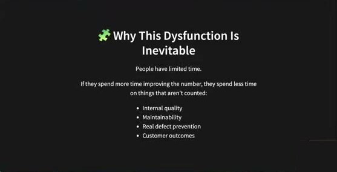

**🧩 Why This Dysfunction Is Inevitable** — People have limited time. If they spend more time improving the number, they spend less time on things that aren't counted:

- Internal quality
- Maintainability
- Real defect prevention
- Customer outcomes

🇨🇳 人的时间有限：花在刷数字上的时间越多，花在"没被计数"的事情上（内部质量、可维护性、真正的缺陷预防、客户成果）就越少。

### 10. Coverage Report: What It Is (And Isn't) / Branch coverage

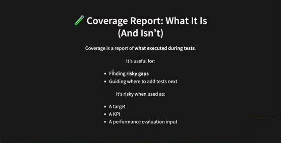

**🧪 Coverage Report: What It Is (And Isn't)** — Coverage is a report of **what executed during tests**.

It's useful for: Finding **risky gaps** · Guiding where to add tests next
It's risky when used as: A target · A KPI · A performance evaluation input

🇨🇳 覆盖率报告 = 测试期间执行了什么的报告。用来找风险缺口、指导下一步在哪加测试很好；当作目标、KPI、绩效评估输入就危险。

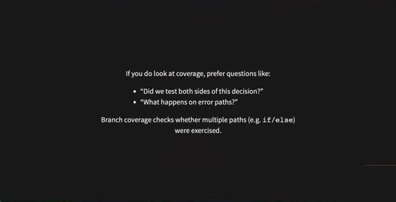

If you do look at coverage, prefer questions like:

- "Did we test both sides of this decision?"
- "What happens on error paths?"

Branch coverage checks whether multiple paths (e.g. `if/else`) were exercised.

🇨🇳 看覆盖率时多问"这个判断的两边都测了吗？""出错路径会怎样？"**分支覆盖**检查 `if/else` 等多条路径是否都被走到。

💬 讲师强调：写测试时很容易只测 **happy path**（一切顺利的场景），但**边界情况**同样要考虑——用户不会按你设计的方式用产品（"人们有时用得很奇怪"）。例如上周的例子：输入框留空点 Add Task 应该发生什么？实现和测试都要考虑到。

### 11. AI And Coverage / AI And Measurement Dysfunction / What This Means For You

💬 讲师："反馈表里有同学提到 AI 正在剧烈改变工程领域，去年也有公司大裁员的坏消息。了解趋势、知道 AI 何时有帮助何时有害、正确使用它很重要。"

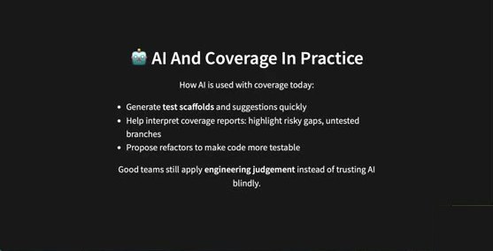

**🤖 AI And Coverage In Practice** — How AI is used with coverage today:

- Generate **test scaffolds** and suggestions quickly
- Help interpret coverage reports: highlight risky gaps, untested branches
- Propose refactors to make code more testable

Good teams still apply **engineering judgement** instead of trusting AI blindly.

🇨🇳 AI 能快速生成测试骨架、帮你解读覆盖率报告（看不懂的地方可以问 AI）、建议让代码更可测的重构。好团队仍然运用工程判断，不盲信 AI。

💬 讲师亲历："上一门课里我见过学生用 AI 写了**大量廉价测试**，只让覆盖率数字上涨，但并没有真正测试项目。头几天甚至几周看起来没事，但随着不断改代码、加故事，测试并不能在你弄坏东西时正确报警——长期越来越危险。"

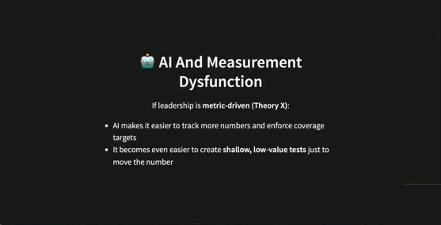

**🤖 AI And Measurement Dysfunction** — If leadership is **metric-driven (Theory X)**:

- AI makes it easier to track more numbers and enforce coverage targets
- It becomes even easier to create **shallow, low-value tests** just to move the number

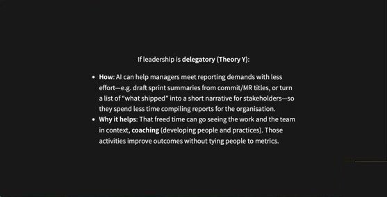

If leadership is **delegatory (Theory Y)**:

- **How**: AI can help managers meet reporting demands with less effort—e.g. draft sprint summaries from commit/MR titles, or turn a list of "what shipped" into a short narrative for stakeholders—so they spend less time compiling reports for the organisation.
- **Why it helps**: That freed time can go seeing the work and the team in context, **coaching** (developing people and practices). Those activities improve outcomes without tying people to metrics.

🇨🇳 X 型领导 + AI：更容易追踪更多数字、强推覆盖率目标，也更容易造出肤浅低价值的测试。Y 型领导 + AI：经理可以让 AI 从 commit / merge request 信息里起草 sprint 总结、把"交付了什么"变成给干系人的简短叙述，省下的时间用来看真实的工作、做 **coaching**。

💬 讲师问大家 AI 对经理还有哪些健康/危险的用法。学生答：不懂的东西可以问 AI 帮助理解；但**使用自己不理解的 AI 生成代码很危险**。讲师补充在 Reddit 开发者社区看到："最后悔的事是合并了几行自己不理解的 AI 代码，把产品整个搞坏了。" **教训：不要合并任何你没完全理解的 AI 生成代码。**

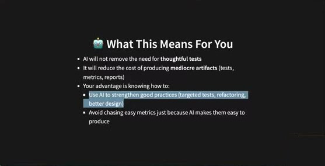

**🤖 What This Means For You**

- AI will not remove the need for **thoughtful tests**
- It will reduce the cost of producing **mediocre artifacts** (tests, metrics, reports)
- Your advantage is knowing how to:
  - Use AI to strengthen good practices (targeted tests, refactoring, better design)
  - Avoid chasing easy metrics just because AI makes them easy to produce

🇨🇳 AI 不会消除对深思熟虑的测试的需求；它会降低产出**平庸产物**（测试、指标、报告）的成本。你的优势在于：先掌握好实践，再用 AI 强化它；不要因为 AI 让某个指标容易刷就去追那个指标。

💬 讲师："这是今天第一讲：管理、如何正确使用指标、用错了的风险与危害。"随后投票决定休息 7 分钟（约 00:46–00:52）。

---

## Lecture 5.2 — Designing For Maintainability


**COMP9820 - 26T1 — Designing For Maintainability — Lecture 5.2**

💬 休息回来后讲师先在 Moodle 论坛发了本周 newsletter（内容：本周继续在 Sprint 2 中实践敏捷、standups、meetings、issue board、Git、TDD、CI；**Sprint 1 成绩与反馈已在 Moodle Grades 发布**）。

### 12. In This Lecture / Why Care About Maintainability?

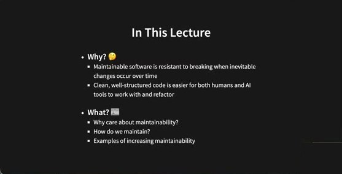

**In This Lecture**

- **Why? 🤔**
  - Maintainable software is resistant to breaking when inevitable changes occur over time
  - Clean, well-structured code is easier for both humans and AI tools to work with and refactor
- **What? 📖**
  - Why care about maintainability?
  - How do we maintain?
  - Examples of increasing maintainability

💬 讲师："第二个主题也不难：可维护性 / 重构 / 写可维护的代码。第一周就说过软件项目**一定会变**：用户需求变（改功能、要新功能）、经理/项目方向变、技术栈变、成员进出，或者只是想让代码更优雅。要让改动**安全**，项目就得可维护、改起来风险低。"

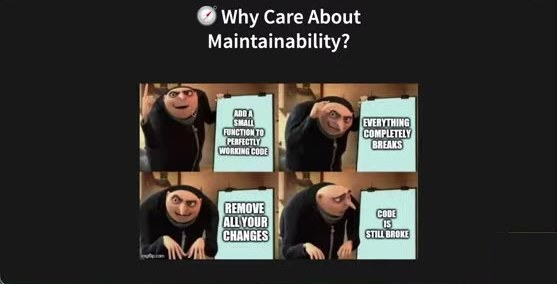

**🧭 Why Care About Maintainability?** — （Gru 计划表情包）"Add a small function to perfectly working code" → "Everything completely breaks" → "Remove all your changes" → "Code is still broke"

💬 "我见过很多版本。为什么会这样？因为改项目需要项目可维护。"

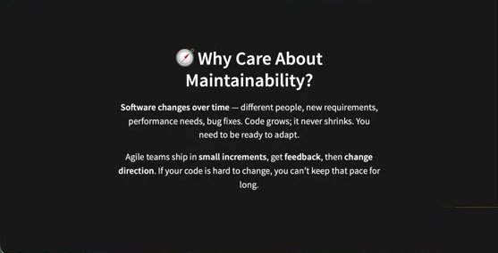

**Software changes over time** — different people, new requirements, performance needs, bug fixes. Code grows; it never shrinks. You have to be ready to adapt.

Agile teams ship in **small increments**, get **feedback**, then **change direction**. If your code is hard to change, you can't keep that pace for long.

🇨🇳 软件随时间变化（不同的人、新需求、性能需求、修 bug），代码只增不减。敏捷团队小步交付→反馈→调整方向；代码难改就跟不上这个节奏——你可能一开始赶工交付得很快，但后面越加越慢。

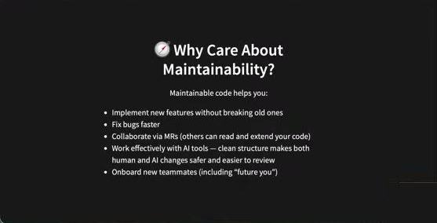

**Maintainable code helps you:**

- Implement new features without breaking old ones
- Fix bugs faster
- Collaborate via MRs (others can read and extend your code)
- Work effectively with AI tools — clean structure makes both human and AI changes safer and easier to review
- Onboard new teammates (including "future you")

🇨🇳 加新功能不破坏旧功能；修 bug 更快；通过 MR 协作（别人读得懂、能扩展）；和 AI 工具高效协作（代码乱，AI 也更难帮你）；新成员（包括"未来的你"）上手更容易。

💬 "你不希望项目只活一两个月就扔掉，而是被真实用户使用、越来越好，理想情况下永远活下去。"

### 13. Sustainable Speed > Raw Performance / Maintainability: But How?

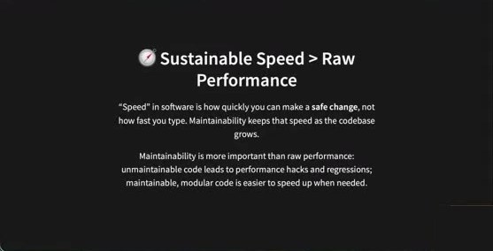

**⏱️ Sustainable Speed > Raw Performance** — "Speed" in software is how quickly you can make a **safe change**, not how fast you type. Maintainability keeps that speed as the codebase grows.

Maintainability is more important than raw performance: unmaintainable code leads to performance hacks and regressions; maintainable, modular code is easier to speed up when needed.

🇨🇳 软件里的"速度"是**安全地做出一次改动**有多快，不是打字多快；可维护性让这个速度随代码库增长而保持。可维护性比原始性能更重要。

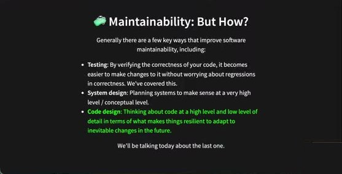

**🧩 Maintainability: But How?** — Generally there are a few key ways that improve software maintainability, including:

- **Testing**: By verifying the correctness of your code, it becomes easier to make changes to it without worrying about regressions in correctness. We've covered this.
- **System design**: Planning systems to make sense at a very high level / conceptual level.
- **Code design**: Thinking about code at a high level and low level of detail in terms of what makes things resilient to adapt to inevitable changes in the future.

We'll be talking today about the last one.

🇨🇳 三条路：测试（已讲）、系统设计（本课不涉及，可自行探索）、**代码设计**（今天的主题；并且会讲为什么 AI 不能替代它，只能辅助）。

### 14. Code Design / 7 Design Questions To Ask

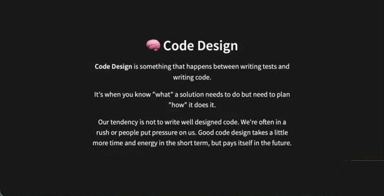

**🧠 Code Design** — **Code Design** is something that happens between writing tests and writing code.

It's when you know "what" a solution needs to do but need to plan "how" it does it.

Our tendency is not to write well designed code. We're often in a rush or people put pressure on us. Good code design takes a little more time and energy in the short term, but pays itself in the future.

🇨🇳 代码设计发生在写测试和写代码之间：你知道要做"什么"，需要规划"怎么做"。人倾向于不好好设计（赶时间、有压力）；好的设计短期多花一点时间，长期回报。

💬 对应上周 TDD：先写测试 → 写**刚好够**让测试通过的代码 → **重构**让代码可维护——第三步就是代码设计发生的地方。重构时问自己下面这些问题。

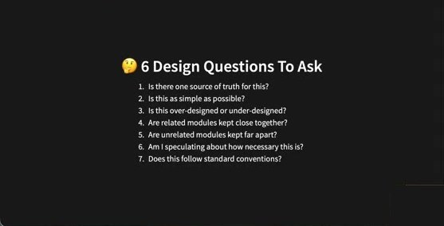

**🤔 6 Design Questions To Ask**（课件标题写 6，实际列了 7 条，讲师结尾也说"七个问题"）

1. Is there one source of truth for this?
2. Is this as simple as possible?
3. Is this over-designed or under-designed?
4. Are related modules kept close together?
5. Are unrelated modules kept far apart?
6. Am I speculating about how necessary this is?
7. Does this follow standard conventions?

🇨🇳 1 有唯一事实来源吗？2 已经尽可能简单了吗？3 过度设计还是设计不足？4 相关模块放得近吗？5 无关模块分得开吗？6 我是否在臆测它有多必要？7 遵循标准惯例了吗？

### 15. Q1 Is There One Source Of Truth? — DRY

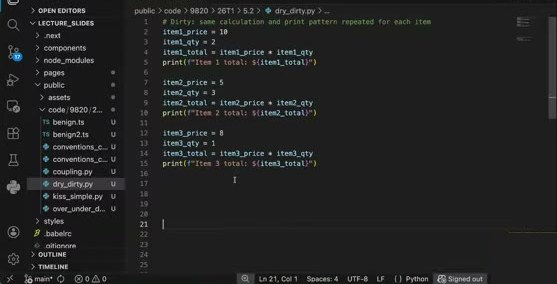

💬 讲师先打开示例 `dry_dirty.py`（网购购物车：每件商品有单价和数量，要打印每件的总价）：

```python
# Dirty: same calculation and print pattern repeated for each item
item1_price = 10
item1_qty = 2
item1_total = item1_price * item1_qty
print(f"Item 1 total: ${item1_total}")

item2_price = 5
item2_qty = 3
item2_total = item2_price * item2_qty
print(f"Item 2 total: ${item2_total}")

item3_price = 8
item3_qty = 1
item3_total = item3_price * item3_qty
print(f"Item 3 total: ${item3_total}")
```

💬 "问题在哪？"学生："冗余。"讲师："对，商品会有 4、5、6……20 件，代码块无穷无尽。更糟的是：如果要改——比如把 'Item 1 total' 改成 'Item 1 cost'——每一块都得改。"讲师现场改了三处，故意演示出 `costs`、`coosts`、`cost` 三种不一致的手误："块一多就很容易打错字、漏改，因为你想改得一致。**冗余带来的第二个问题是更容易出错、产生 bug。**"

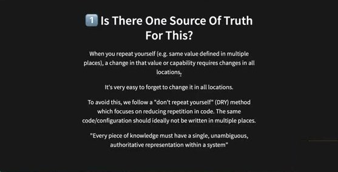

**1️⃣ Is There One Source Of Truth For This?**

When you repeat yourself (e.g. same value defined in multiple places), a change in that value or capability requires changes in all locations.

It's very easy to forget to change it in all locations.

To avoid this, we follow a "don't repeat yourself" (DRY) method which focuses on reducing repetition in code. The same code/configuration should ideally not be written in multiple places.

"Every piece of knowledge must have a single, unambiguous, authoritative representation within a system"

🇨🇳 **DRY（Don't Repeat Yourself）**：同一个值/能力定义在多处，改动就要改所有地方，极易漏改或改得不一致。每一条知识在系统中都应有**唯一、无歧义、权威**的表示。（讲师："这条原则不是绝对的，后面会讲。"）

### 16. Q2 Is This As Simple As Possible? — KISS

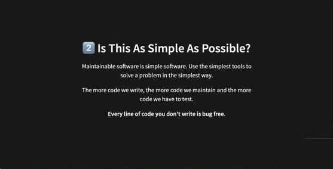

**2️⃣ Is This As Simple As Possible?** — Maintainable software is simple software. Use the simplest tools to solve a problem in the simplest way.

The more code we write, the more code we maintain and the more code we have to test.

**Every line of code you don't write is bug free.**

🇨🇳 写的每一行代码都要维护、都要测试。**你没写的每一行代码都没有 bug。** 例如已有 Python 库/函数能用，就不要自己再写一个。

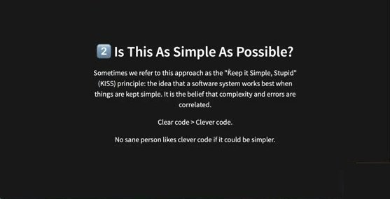

Sometimes we refer to this approach as the "Keep it Simple, Stupid" (KISS) principle: the idea that a software system works best when things are kept simple. It is the belief that complexity and errors are correlated.

Clear code > Clever code.

No sane person likes clever code if it could be simpler.

🇨🇳 **KISS**：系统在简单时运行得最好；复杂度与错误相关。**清晰 > 聪明。** 不要炫技。

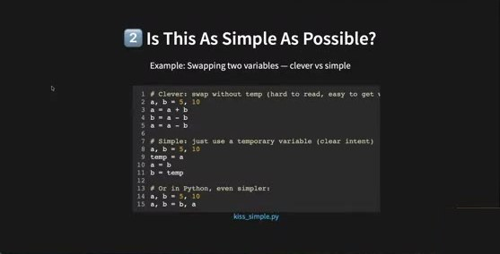

Example: Swapping two variables — clever vs simple（`kiss_simple.py`）

```python
# Clever: swap without temp (hard to read, easy to get wrong)
a, b = 5, 10
a = a + b
b = a - b
a = a - b

# Simple: just use a temporary variable (clear intent)
a, b = 5, 10
temp = a
a = b
b = temp

# Or in Python, even simpler:
a, b = 5, 10
a, b = b, a
```

💬 现场投票 A/B/C 哪种更好。选 B 的理由："在很多语言里都通用（C、JavaScript 都一样），容易理解"；选 C 的理由："易维护；我们项目用 Python，就用 Python 的方式；非常简单"。讲师：**B 和 C 都可以，看个人偏好**；要避免的是 A——"显得你很聪明，但连未来的你都难维护"。

### 17. Q3 Is This Over-Designed Or Under-Designed?

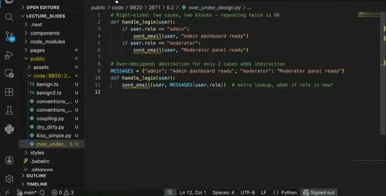

💬 讲师先展示 `over_under_design.py`（登录功能，系统只有 admin 和 moderator 两种角色，登录时按角色发邮件）：

```python
# Right-sized: two cases, two blocks — repeating twice is OK
def handle_login(user):
    if user.role == "admin":
        send_email(user, "Admin dashboard ready")
    if user.role == "moderator":
        send_email(user, "Moderator panel ready")

# Over-designed: abstraction for only 2 cases adds indirection
MESSAGES = {"admin": "Admin dashboard ready", "moderator": "Moderator panel ready"}
def handle_login(user):
    send_email(user, MESSAGES[user.role])  # extra lookup, what if role is new?
```

💬 投票 A（上）/B（下）。选 A："结构清晰、可读、定义明确；只有两个角色，没有多余东西，维护容易；角色多了字典那行会很长甚至多行。"选 B："行数少、要维护的少；将来角色更多时更容易扩展。"讲师让双方互相说服（"辩论课"）。

讲师意见：**我也选 A。** "我理解为什么有人选 B——刚刚才说行数越少越好维护。但这里 A 更**易读、逻辑更清楚**。它和购物车例子不同：购物车可能有 10、20 件商品；而这里只有两个角色，最多再加一两个，而且以后可能想给不同角色发不同的邮件。**没有对错，看你更舒服哪种，也取决于具体场景**（会不会加很多角色？还是确定只有两个？）。"

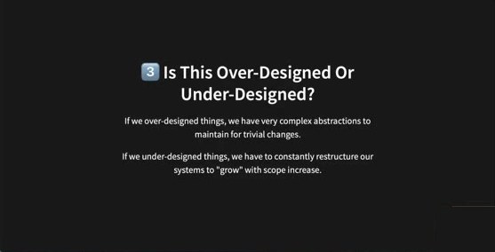

**3️⃣ Is This Over-Designed Or Under-Designed?**

If we over-designed things, we have very complex abstractions to maintain for trivial changes.

If we under-designed things, we have to constantly restructure our systems to "grow" with scope increase.

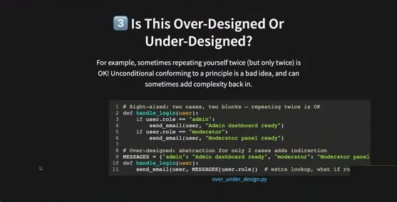

For example, sometimes repeating yourself twice (but only twice) is OK! Unconditional conforming to a principle is a bad idea, and can sometimes add complexity back in.

🇨🇳 过度设计：为琐碎改动维护复杂抽象；设计不足：随着范围扩大不断重构。有时**重复两次（仅两次）是可以的**！无条件遵守某条原则反而会把复杂度加回来。讲师："我们通常从设计不足开始（像购物车那种），然后变'聪明'开始各种设计，最终找到适合自己的平衡——多练习。"

### 18. Q4/Q5 Coupling：related close, unrelated apart

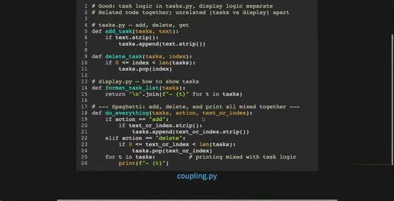

💬 讲师先展示 `coupling.py`（仍以 Task Tracker 为例）：

```python
# Good: task logic in tasks.py, display logic separate
# Related code together; unrelated (tasks vs display) apart

# tasks.py — add, delete, get
def add_task(tasks, text):
    if text.strip():
        tasks.append(text.strip())

def delete_task(tasks, index):
    if 0 <= index < len(tasks):
        tasks.pop(index)

# display.py — how to show tasks
def format_task_list(tasks):
    return "\n".join(f"- {t}" for t in tasks)

# --- Spaghetti: add, delete, and print all mixed together ---
def do_everything(tasks, action, text_or_index):
    if action == "add":
        if text_or_index.strip():
            tasks.append(text_or_index.strip())
    elif action == "delete":
        if 0 <= text_or_index < len(tasks):
            tasks.pop(text_or_index)
    for t in tasks:              # printing mixed with task logic
        print(f"- {t}")
```

🇨🇳 第一种：三个独立函数（加、删、格式化显示）；第二种：一个函数做所有事，无论什么 action 都顺带打印。


**4️⃣ Are Related Modules Kept Close Together? 5️⃣ Are Unrelated Modules Kept Far Apart?**

Coupling = how much one piece of code relies on another piece of code.

We want related components to be tightly coupled, and unrelated components to be loosely coupled.

The more software components are connected, the more changes and alterations to one component may break another.

Excessive coupling can also lead to **spaghetti code**.

🇨🇳 **耦合** = 一段代码对另一段代码的依赖程度。相关组件紧耦合、无关组件松耦合。组件连得越多，改一个越容易弄坏另一个；过度耦合导致**意大利面代码**（所有东西缠在一起）。

💬 讲师："Sprint 2 还好，到 Sprint 3 功能更多更复杂时，你会发现成员之间的工作互相依赖：'我在等 B 做完才能开始'、'我的改动影响了 C 的功能'。**本质无关的就分开，本质相关的就放一起，没问题。**"
💬 为什么第二种是 spaghetti？学生：加/删/显示本可以独立，现在混在一起；函数会越来越大。讲师：更难维护、更难读；而且**打印/格式化逻辑和用户触发的动作逻辑性质完全不同**，混在一起就有问题。

### 19. Q6 Am I Speculating About How Necessary This Is? — YAGNI

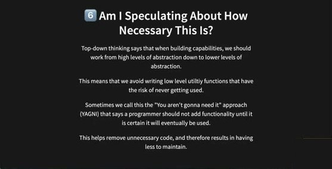

**6️⃣ Am I Speculating About How Necessary This Is?**

Top-down thinking says that when building capabilities, we should work from high levels of abstraction down to lower levels of abstraction.

This means that we avoid writing low level utility functions that have the risk of never getting used.

Sometimes we call this the "You aren't gonna need it" approach (YAGNI) that says a programmer should not add functionality until it is certain it will eventually be used.

This helps remove unnecessary code, and therefore results in having less to maintain.

🇨🇳 自顶向下：从高层抽象往下做，避免先写"可能用得上"的底层工具函数结果从未被用。**YAGNI（You Aren't Gonna Need It）**：确定会用到之前不要加功能。讲师："这是初学者**非常非常常见**的错误：'这行代码将来可能有用'、'这个 helper 现在只用一次，但我很确定以后会反复用，所以先抽出来'——你在臆测未来。只有真的看到需要时才写，否则保持简单。"（上周 TDD 也讲过：只写让测试通过的代码。）


**Question:** Should we add export-to-PDF for the Task Tracker task list before anyone has asked for it?

🇨🇳 没人要之前该给 Task Tracker 加"导出 PDF"吗？**不该。** 所有故事都应来自 Sprint 1 的需求工程（访谈、市场调研、观察）：如果当时发现用户强烈需要导出，就把它排进优先级；没人要过就不要做，否则只是冗余功能。

### 20. Q7 Does This Follow Standard Conventions?

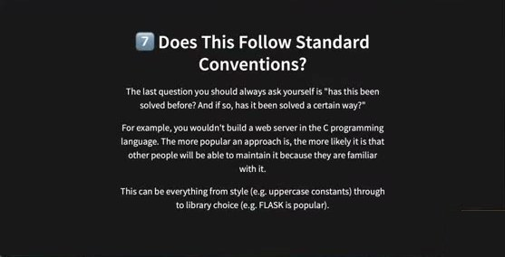

**7️⃣ Does This Follow Standard Conventions?**

The last question you should always ask yourself is "has this been solved before? And if so, has it been solved a certain way?"

For example, you wouldn't build a web server in the C programming language. The more popular an approach is, the more likely it is that other people will be able to maintain it because they are familiar with it.

This can be everything from style (e.g. uppercase constants) through to library choice (e.g. FLASK is popular).

🇨🇳 总要问"这个问题以前被解决过吗？是按某种固定方式解决的吗？"例如不会用 C 写 Web 服务器：方法越流行，越多人熟悉、越容易维护。范围从代码风格（常量大写）到库的选择（Flask 很流行）。

💬 讲师问"你会用 C 写 Web 应用吗？"有学生说 C 自己控制循环更高效。讲师："不是不能，而是不符合惯例：用 C 的人少，资源和支持就少（人们不用它也许有原因）；将来别人想贡献时多半没有用 C 写 Web 的经验，但大多数人会 Python 或 JavaScript。**没有任何一个人能独自写出业界规模的软件，必须团队协作**——再天才也写不出 YouTube 这个体量。遵循惯例让项目对你和其他贡献者都更易维护。"

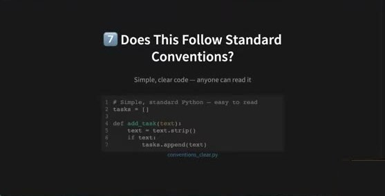

Simple, clear code — anyone can read it（`conventions_clear.py`）

```python
# Simple, standard Python — easy to read
tasks = []

def add_task(text):
    text = text.strip()
    if text:
        tasks.append(text)
```

💬 课件另有 `conventions_clever.py` 对照（讲师开头在 VS Code 里闪过）：为只用一次的 `text.strip()` 抽了一个 `is_valid_task(text)` helper——"这就是我说的不必要的 helper 函数"。

```python
# Extracted a "helper" — but we only use it once
tasks = []
def is_valid_task(text):
    return bool(text.strip())
def add_task(text):
    if is_valid_task(text):
        tasks.append(text.strip())
```

### 21. Refactoring

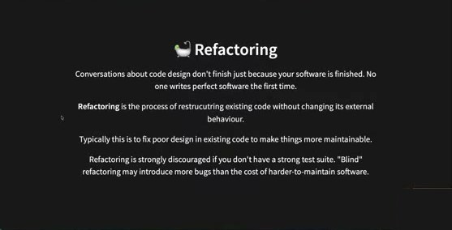

**🛁 Refactoring** — Conversations about code design don't finish just because your software is finished. No one writes perfect software the first time.

**Refactoring** is the process of restructuring existing code without changing its external behaviour.

Typically this is to fix poor design in existing code to make things more maintainable.

Refactoring is strongly discouraged if you don't have a strong test suite. "Blind" refactoring may introduce more bugs than the cost of harder-to-maintain software.

🇨🇳 **重构** = 在不改变外部行为的前提下重组现有代码（黑盒视角：盒子里在变，盒子外行为不变；可能更快、更易维护、更易改）。通常用于修正现有代码的糟糕设计。**没有强测试套件时强烈不建议重构**——"盲重构"引入的 bug 可能比难维护的代价还大。

### 22. Why Does This Still Matter With AI?

💬 讲师先不放课件，问大家："AI 对重构有帮助还是有局限？"学生们的回答：
- 取决于项目和使用者；**你脑子里得有架构**，不能只对 AI 说"重构这个"——需要更高层次地知道重构什么、怎么重构。
- AI 会犯错。
- **没人负责**（AI 生成的代码出问题谁负责？）。
- 一个正面例子：把后端从 JavaScript 框架**迁移到 Python/Flask**，逻辑不变只换语言——AI 能帮上忙。讲师："很好的想法，我之前没想到。风险呢？——整个项目换语言会产生**大量需要你审查的 AI 代码**，审查工作量本身就巨大；而我们说过不合并任何没完全理解的代码。"

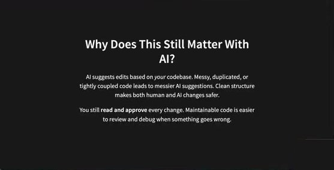

**Why Does This Still Matter With AI?**

AI suggests edits based on *your* codebase. Messy, duplicated, or tightly coupled code leads to messier AI suggestions. Clean structure makes both human and AI changes safer.

You still **read and approve** every change. Maintainable code is easier to review and debug when something goes wrong.

🇨🇳 AI 基于**你的**代码库给建议：代码越乱/重复/紧耦合，AI 的重构就越乱。人类一开始就要给出清晰结构。你仍要读并批准每一处改动——所以你得**懂这些原则**，才能判断好坏。

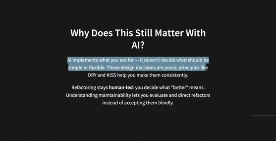

AI implements what you ask for — it doesn't decide *what* should be simple or flexible. Those design decisions are yours; principles like DRY and KISS help you make them consistently.

Refactoring stays **human-led**: you decide what "better" means. Understanding maintainability lets you evaluate and direct refactors instead of accepting them blindly.

🇨🇳 AI 只实现你要求的，不替你决定什么该简单、什么该灵活；设计决策来自人。重构由人主导："更好"由你定义。

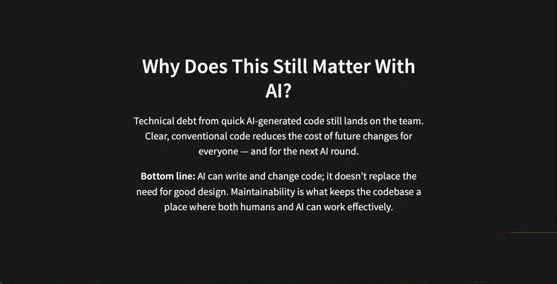

Technical debt from quick AI-generated code still lands on the team. Clear, conventional code reduces the cost of future changes for everyone — and for the next AI round.

**Bottom line:** AI can write and change code; it doesn't replace the need for good design. Maintainability is what keeps the codebase a place where both humans and AI can work effectively.

🇨🇳 快速 AI 生成代码带来的技术债仍落在团队头上。**底线：AI 能写和改代码，但不能替代好的设计；可维护性让代码库成为人和 AI 都能高效工作的地方。**

💬 讲师："今天讲完了。课后你可以开始**重构你的项目代码**：看着代码问那七个问题——我遵循 DRY 了吗？KISS？YAGNI？在重复自己吗？过度还是不足设计？但**重构任何一行之前先确保有强测试套件**。"

### 23. 结尾 Q&A：Sprint 1 成绩

- 线上学生问 **Sprint 1 成绩何时发**：已经在 **Moodle → Grades** 发布；讲师正在写 newsletter 并会附链接。部分 tutor 反馈很详细，有些较抽象——**本周 class 上 tutor 会解释反馈**，对分数/反馈有疑问请在 class 上问 tutor。
- **Sprint 1 平均分高于 HD**，"做得非常好，恭喜"。
- **Sprint 2 的评分 rubric 更有挑战**：工作量更大、质量要求更高，拿 HD 会比 Sprint 1 难；**Sprint 3 比 Sprint 2 更难**。一路都在打基础：Sprint 2 要用到 Sprint 1+2 学的东西，Sprint 3 同理。
- 提前约 20 分钟下课。

---

## 附：本周待办清单

- [ ] `pip3 install pytest-cov`（Mac 加 3），并把 `pytest-cov` 加入 `requirements.txt`（便于 pipeline 里跑覆盖率）
- [ ] 在项目里跑 `pytest --cov --cov-report=term-missing` 和 `pytest --cov --cov-report=html`，打开 `htmlcov/index.html`，看 Files / Functions 视图和逐行红绿
- [ ] 根据 **Missing** 行补测试——把"已有实现但没测试"的功能（如 add / delete）补回来；**不要追求 100%**，用判断决定哪些路径重要
- [ ] 测试要覆盖**边界情况/错误路径**（空输入、非法 index 等），不只 happy path；多问"这个 if 的两边都测了吗"
- [ ] 不要让 AI 批量生成廉价测试刷数字；**不合并任何自己没完全理解的 AI 代码**
- [ ] 思考如何把覆盖率报告加进自己的 pipeline / 每个 feature 分支（课堂开放问题：能否 per-feature 出报告，欢迎研究后下节课分享）
- [ ] 在有强测试套件的前提下重构项目代码，逐段问 7 个设计问题（DRY / KISS / over-under design / coupling / YAGNI / conventions）
- [ ] 到 Moodle → Grades 查看 Sprint 1 成绩；本周 class 上向 tutor 询问反馈细节
- [ ] Sprint 2 rubric 更严：按 Sprint 2 指南本周做覆盖率与代码质量
- [ ] 填写讲师的课程反馈表（课件首尾的 QR 码 / form 链接）

> 字幕注意：YouTube 自动字幕把 Agile 识作 "IGL/I"、sprint 识作 "spring"、pytest 识作 "piest/pest"、Git 识作 "g/gate"、Moodle 识作 "Mudo"、YAGNI 识作 "yageni"，本文档已按上下文更正。
