# COMP9820 26T1 · Week 7 课件整理 — Sprint 3 Guideline / Lecture 7.1 Persistence / Lecture 7.2 Software Complexity

> 来源：https://www.youtube.com/watch?v=b4GgAYKhjGQ（约 1h39m，2026-03-30 周一现场讲座）
> 说明：本文件按投影顺序整理。每张幻灯片给出 **英文原文**（逐字）→ 🇨🇳 中文翻译 → 💬 讲师补充（口头讲解、Q&A，来自字幕）。
> 字幕为 YouTube 自动生成，已按语义修正明显错词：`spring`→sprint、`spray/stray/three three`→Sprint 3、`G/gate`→Git、`waso`→Vercel、`psychomatic/secometric/cyclatic`→cyclomatic、`coherent`→cohesion、`Mudo`→Moodle、`readmi/rimy`→README、`pass`→Path、`lip year`→leap year、`nose/ages`→nodes/edges 等。

---

## 第 0 部分 · 课程进度与本周安排（00:00–00:05）

💬 **讲师补充**
- 现在是 Week 7，Sprint 2 已结束，只剩最后一个 Sprint 3，大约还有 3.5–4 周。
- Sprint 3 有两条线：
  1. **Week 10 的 lab 课上做 Final Demo** —— 讲故事：用户是谁、给用户带来什么价值，展示 Sprint 1–3 所有实现的 story。
  2. **Week 10 周五晚** 提交代码库、报告等「过程证据」给导师，不再需要额外 demo。
- 剩余的新概念很少："heavy content has already done"。
  - Week 7（本周）：**Complexity + Persistence**
  - Week 8：**Risk Management**（下周一是 Easter Monday 公共假期，**没有直播，改为录播**，会在下周一前录好）
  - Week 9：**Portfolio packaging & into the future**（Portfolio 是个人提交：学到了什么、遇到什么挑战、如何解决、未来计划、贡献了什么）。Week 9 是最后一次讲座。
- 现场投票：学生希望先讲 Sprint 3 guideline，再讲新概念。

---

## 第 1 部分 · Sprint 3 Guideline（Moodle 页面走读，00:05–00:27）

### 1.1 Sprint 3: Ownership, Risk & Portfolio — Overview & Goals

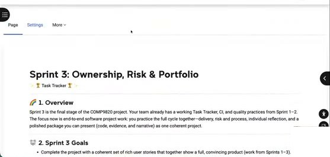

**1. Overview**
> Sprint 3 is the final stage of the COMP9820 project. Your team already has a working Task Tracker, CI, and quality practices from Sprint 1–2. The focus now is end-to-end software project work: you practice the full cycle together—delivery, risk and process, individual reflection, and a polished package you can present (code, evidence, and narrative) as one coherent product.

🇨🇳 Sprint 3 是 COMP9820 项目的最后阶段。团队已有可运行的 Task Tracker、CI 和质量实践。现在的重点是端到端的软件项目工作：完整走一遍交付、风险与流程、个人反思，以及一个可展示的、打磨过的整体包（代码、证据、叙述）。

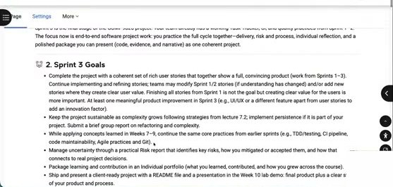

**2. Sprint 3 Goals**
- Complete the project with a coherent set of rich user stories that together show a full, convincing product (work from Sprints 1–3). Continue implementing and refining stories; teams may modify Sprint 1/2 stories (if understanding has changed) and/or add new stories where they create clear user value. Finishing all stories from Sprint 1 is not the goal but creating clear value for the users is more important. At least one meaningful product improvement in Sprint 3 (e.g., UI/UX or a different feature apart from user stories to add an innovation factor).
- Keep the project sustainable as complexity grows following strategies from lecture 7.2; implement persistence if it is part of your project. Submit a brief group report on refactoring and complexity.
- While applying concepts learned in Weeks 7–9, continue the same core practices from earlier sprints (e.g., TDD/testing, CI pipeline, code maintainability, Agile practices and Git).
- Manage uncertainty through a practical Risk report that identifies key risks, how you mitigated or accepted them, and how that connects to real project decisions.
- Package learning and contribution in an Individual portfolio (what you learned, contributed, and how you grew across the course).
- Ship and present a client-ready project with a README file and a presentation in the Week 10 lab demo: final product plus a clear story of your product and your process.

🇨🇳
- 用一组连贯、丰富的用户故事完成项目，整体呈现一个完整可信的产品（Sprint 1–3 的工作）。继续实现和完善 story；可修改 Sprint 1/2 的 story（理解变化时），或新增有明确用户价值的 story。**做完 Sprint 1 的所有 story 不是目标，为用户创造清晰价值更重要。** Sprint 3 至少要有一个**有意义的产品改进**（如 UI/UX，或用户故事之外的新功能作为创新点）。
- 随复杂度增长保持项目可持续（按 Lecture 7.2 的策略）；如项目需要则实现持久化。提交一份简短的小组「重构与复杂度」报告。
- 继续 Week 7–9 的新概念，同时延续之前的核心实践（TDD/测试、CI、可维护性、敏捷、Git）。
- 通过一份实用的风险报告管理不确定性。
- 用个人 Portfolio 打包学习与贡献。
- 交付可面向客户的项目：README + Week 10 lab 的演示。

💬 **讲师补充**
- 感谢 6–7 位学生志愿者周末审阅了 guideline。原因：Sprint 1/2 收到反馈说 guideline 有些地方不清楚，讲师意识到自己可能有偏见/假设。所有反馈已在本 guideline 中处理；如仍有疑问，去论坛或问 tutor。
- Sprint 3 的目标是「**交付**」——把产品打包好交给 stakeholder/client。
- Week 10 的 demo 是**正式 presentation**，不同于 Sprint 1/2 的随意演示。
- 「meaningful improvement」不确定是否算数？问 tutor/同学/论坛确认。
- **README**：目前你们的 README 大概还是 starter code 那份很长的使用说明（见下图）。需要替换成自己项目的 README：项目是什么、如何运行、环境/数据库设置等。会给模板，不需要太长。
- 所有报告都只规定**上限**（最大字数/页数），不设下限——"we aim for short brief documentations as long as that's telling enough stories"。

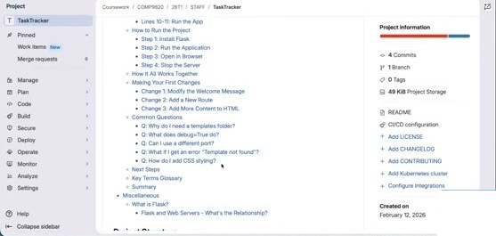
🇨🇳 上图：starter code 自带的 README（GitLab TaskTracker 仓库），需替换成你们项目自己的 README。

### 1.2 Suggested Weekly Planner

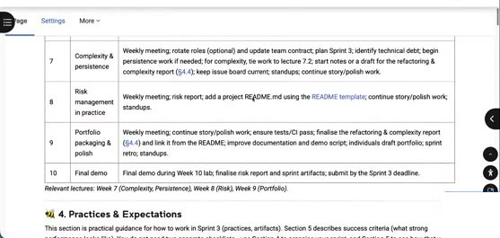

| Week | Focus | Tasks |
|---|---|---|
| 7 | Complexity & persistence | Weekly meeting; rotate roles (optional) and update team contract; plan Sprint 3; identify technical debt; begin persistence work if needed; for complexity, tie work to lecture 7.2; start notes or a draft for the refactoring & complexity report (§4.4); keep issue board current; standups; continue story/polish work. |
| 8 | Risk management in practice | Weekly meeting; risk report; add a project README.md using the README template; continue story/polish work; standups. |
| 9 | Portfolio packaging & polish | Weekly meeting; continue story/polish work; ensure tests/CI pass; finalise the refactoring & complexity report (§4.4) and link it from the README; improve documentation and demo script; individuals draft portfolio; sprint retro; standups. |
| 10 | Final demo | Final demo during Week 10 lab; finalise risk report and sprint artifacts; submit by the Sprint 3 deadline. |

*Relevant lectures: Week 7 (Complexity, Persistence), Week 8 (Risk), Week 9 (Portfolio).*

🇨🇳 Week 7 复杂度与持久化；Week 8 风险管理 + README；Week 9 Portfolio 与打磨；Week 10 最终演示。

💬 **讲师补充**：Final demo 的时间**各组不同**——有的组在 Week 10 周二，有的在周五。周二 demo 的组要在周二前把代码准备好，然后用周三–周五写报告/portfolio；周五 demo 的组则所有东西都得在周五前就绪。要提前规划时间。

### 1.3 Practices & Expectations — 4.1 Agile / 4.2 Risk / 4.3 Demo

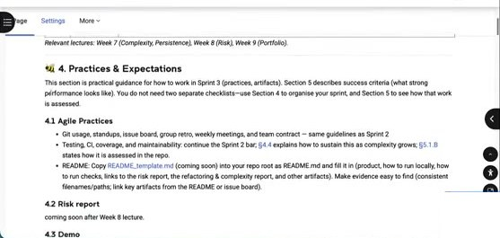

**4. Practices & Expectations**
> This section is practical guidance for how to work in Sprint 3 (practices, artifacts). Section 5 describes success criteria (what strong performance looks like). You do not need two separate checklists—use Section 4 to organise your sprint, and Section 5 to see how that work is assessed.

**4.1 Agile Practices**
- Git usage, standups, issue board, group retro, weekly meetings, and team contract — same guidelines as Sprint 2
- Testing, CI, coverage, and maintainability: continue the Sprint 2 bar; §4.4 explains how to sustain this as complexity grows; §5.1.B states how it is assessed in the repo.
- README: Copy README_template.md (coming soon) into your repo root as README.md and fill it in (product, how to run locally, how to run checks, links to the risk report, the refactoring & complexity report, and other artifacts). Make evidence easy to find (consistent filenames/paths; link key artifacts from the README or issue board).

**4.2 Risk report** — coming soon after Week 8 lecture.

🇨🇳 敏捷实践与 Sprint 2 完全相同（Git、standup、issue board、retro、周会、team contract、测试、CI、覆盖率、可维护性）。**唯一新增：README**（用模板）。风险报告在 Week 8 讲座后发布。

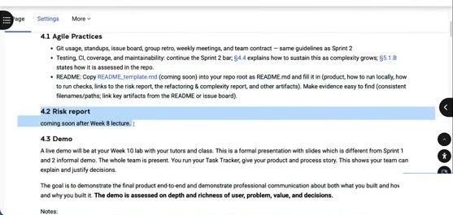

**4.3 Demo**
> A live demo will be at your Week 10 lab with your tutors and class. This is a formal presentation with slides which is different from Sprint 1 and 2 informal demo. The whole team is present. You run your Task Tracker, give your product and process story. This shows your team can explain and justify decisions.
>
> The goal is to demonstrate the final product end-to-end and demonstrate professional communication about both what you built and how and why you built it. **The demo is assessed on depth and richness of user, problem, value, and decisions.**

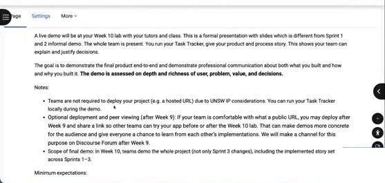

**Notes:**
- Teams are not required to deploy your project (e.g. a hosted URL) due to UNSW IP considerations. You can run your Task Tracker locally during the demo.
- Optional deployment and peer viewing (after Week 9): If your team is comfortable with what a public URL, you may deploy after Week 9 and share a link so other teams can try your app before or after the Week 10 lab. That can make demos more concrete for the audience and give everyone a chance to learn from each other's implementations. We will make a channel for this purpose on Discourse Forum after Week 9.
- Scope of final demo: In Week 10, teams demo the whole project (not only Sprint 3 changes), including the implemented story set across Sprints 1–3.

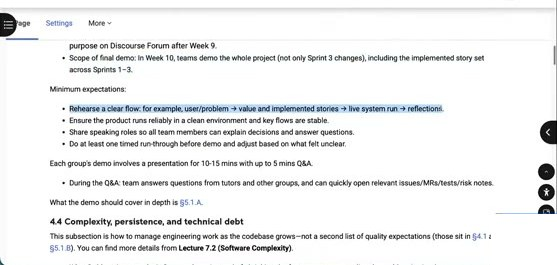

**Minimum expectations:**
- Rehearse a clear flow: for example, user/problem → value and implemented stories → live system run → reflections.
- Ensure the product runs reliably in a clean environment and key flows are stable.
- Share speaking roles so all team members can explain decisions and answer questions.
- Do at least one timed run-through before demo and adjust based on what felt unclear.

> Each group's demo involves a presentation for 10-15 mins with up to 5 mins Q&A.
> - During the Q&A: team answers questions from tutors and other groups, and can quickly open relevant issues/MRs/tests/risk notes.
>
> What the demo should cover in depth is §5.1.A.

🇨🇳
- Demo 在 Week 10 lab，有自己的 tutor **和另一位 tutor** 以及其他组同学在场；正式 presentation，带幻灯片。
- **不要求部署**（UNSW 知识产权考虑），本地运行即可；Week 9 后可自愿部署并在论坛频道分享链接。
- Demo 范围是**整个项目**（Sprint 1–3）。
- 最低要求：排练清晰流程（用户/问题 → 价值与 story → 现场运行 → 反思）；干净环境下稳定运行；所有成员都要讲；至少一次计时彩排。
- 10–15 分钟演示 + 最多 5 分钟 Q&A。

💬 **讲师补充**
- **两位 tutor 打分取平均**，减少不同 tutor 的偏差，更公平。
- 让其他组当听众是为了互相学习，任何人都可以提问。
- **每个成员都要有发言**，讲自己主要负责的部分，并能回答该部分的问题。
- Q：是否必须部署到 Vercel？A：Sprint 3 **不要求部署**，因为是小组项目，有 IP 考虑，课程不能强制。全组同意的话可以公开部署。**localhost 就够了。**
- 一位学生审阅者建议「可选部署 + 互相观摩」——讲师会在 Week 9 后在论坛开一个频道，可以贴部署链接和简介；不部署的组可以录 5 分钟左右的产品介绍视频贴上去，互相反馈。
- Demo **不需要逐文件讲代码**，是讲产品的故事：用户是谁、为什么重要、如何满足需求、带来什么价值。guideline 里给了推荐流程，可按小组情况调整。

### 1.4 4.4 Complexity, persistence, and technical debt

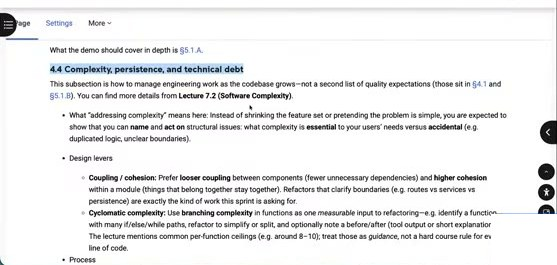

**4.4 Complexity, persistence, and technical debt**
> This subsection is how to manage engineering work as the codebase grows—not a second list of quality expectations (those sit in §4.1 and §5.1.B). You can find more details from **Lecture 7.2 (Software Complexity)**.

- What "addressing complexity" means here: Instead of shrinking the feature set or pretending the problem is simple, you are expected to show that you can **name** and **act on** structural issues: what complexity is **essential** to your users' needs versus **accidental** (e.g. duplicated logic, unclear boundaries).
- Design levers
  - **Coupling / cohesion:** Prefer **looser coupling** between components (fewer unnecessary dependencies) and **higher cohesion** within a module (things that belong together stay together). Refactors that clarify boundaries (e.g. routes vs services vs persistence) are exactly the kind of work this sprint is asking for.
  - **Cyclomatic complexity:** Use **branching complexity** in functions as one *measurable* input to refactoring—e.g. identify a function with many if/else/while paths, refactor to simplify or split, and optionally note a before/after (tool output or short explanation). The lecture mentions common per-function ceilings (e.g. around 8–10); treat those as *guidance*, not a hard course rule for every line of code.

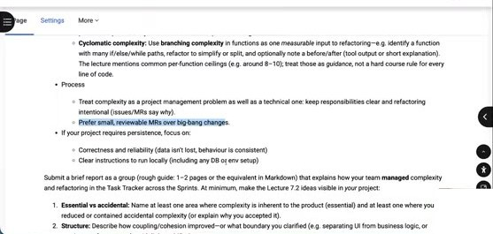

- Process
  - Treat complexity as a project management problem as well as a technical one: keep responsibilities clear and refactoring intentional (issues/MRs say *why*).
  - Prefer small, reviewable MRs over big-bang changes.
- If your project requires persistence, focus on:
  - Correctness and reliability (data isn't lost, behaviour is consistent)
  - Clear instructions to run locally (including any DB or env setup)

> Submit a brief report as a group (rough guide: 1–2 pages or the equivalent in Markdown) that explains how your team **managed** complexity and refactoring in the Task Tracker across the Sprints. At minimum, make the Lecture 7.2 ideas visible in *your* project:

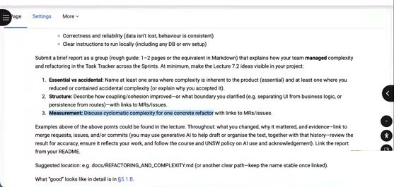

1. **Essential vs accidental:** Name at least one area where complexity is inherent to the product (essential) and at least one where you reduced or contained accidental complexity (or explain why you accepted it).
2. **Structure:** Describe how coupling/cohesion improved—or what boundary you clarified (e.g. separating UI from business logic, or persistence from routes)—with links to MRs/issues.
3. **Measurement:** Discuss cyclomatic complexity for one concrete refactor with links to MRs/issues.

> Examples above of the above points could be found in the lecture. Throughout: what you changed, why it mattered, and evidence—link to merge requests, issues, and/or commits (you may use generative AI to help draft or organise the text, together with that history—review the result for accuracy, ensure it reflects your work, and follow the course and UNSW policy on AI use and acknowledgement). Link the report from your README.
>
> Suggested location: e.g. `docs/REFACTORING_AND_COMPLEXITY.md` (or another clear path—keep the name stable once linked).
>
> What "good" looks like in detail is in §5.1.B.

🇨🇳
- 「处理复杂度」不是砍功能或假装问题简单，而是能**指出并处理**结构问题：哪些复杂度是用户需求固有的（essential），哪些是偶然的（accidental，如重复逻辑、边界不清）。
- 设计杠杆：**低耦合/高内聚**（澄清 routes / services / persistence 的边界）；**圈复杂度**作为可度量的重构输入（找一个 if/else/while 很多的函数，简化或拆分，可选记录前后对比；8–10 的上限只是指导，不是硬规定）。
- 流程：把复杂度当作项目管理问题——职责清晰、重构有意图（issue/MR 说明为什么）；**小而可审的 MR 优于大爆炸式改动**。
- 如需持久化：关注正确性/可靠性（数据不丢、行为一致）和本地运行说明。
- 小组提交 **1–2 页**报告，至少包含：① essential vs accidental 各至少一例；② 耦合/内聚如何改善或澄清了什么边界（链接 MR/issue）；③ 对一次具体重构讨论圈复杂度（链接 MR/issue）。可用 GenAI 辅助起草但要审核并声明。建议放在 `docs/REFACTORING_AND_COMPLEXITY.md`，从 README 链接。

💬 **讲师补充（讲座末尾回到此节，01:34–01:38）**
- 不需要对项目每一行做全面重构，「just do some practice using your project will be enough」；圈复杂度也只需选**一个最复杂的函数**计算并尝试降低。
- 可以建一个「refactoring for complexity」的 issue，下面细分 cohesion / coupling / cyclomatic complexity 的具体任务并指派人。
- 报告是一个 markdown 文件，**不需要一次写完**，可以多次 commit（一次写 essential/accidental，一次写别的）。

### 1.5 4.5 Portfolio (Individual)

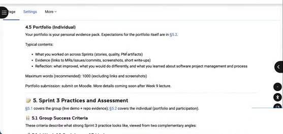

> Your portfolio is your personal evidence pack. Expectations for the portfolio itself are in §5.2.
>
> Typical contents:
> - What you worked on across Sprints (stories, quality, PM artifacts)
> - Evidence (links to MRs/issues/commits, screenshots, short write-ups)
> - Reflection: what improved, what you would do differently, and what you learned about software project management and process
>
> Maximum words (recommended): 1000 (excluding links and screenshots)
>
> Portfolio submission: submit on Moodle. More details coming soon after Week 9 lecture.

🇨🇳 Portfolio 是个人证据包：各 Sprint 做了什么、证据（链接/截图/短文）、反思（改进、会怎样做不同、学到什么）。**建议上限 1000 词**（不含链接和截图）。提交到 Moodle，Week 9 后给详情。

### 1.6 5. Sprint 3 Practices and Assessment（共 40 分）

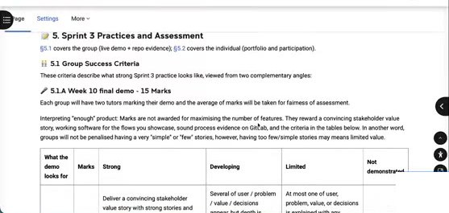

> §5.1 covers the group (live demo + repo evidence); §5.2 covers the individual (portfolio and participation).
>
> **5.1 Group Success Criteria** — These criteria describe what strong Sprint 3 practice looks like, viewed from two complementary angles:
>
> **5.1.A Week 10 final demo - 15 Marks**
> Each group will have two tutors marking their demo and the average of marks will be taken for fairness of assessment.
>
> Interpreting "enough" product: Marks are not awarded for maximising the number of features. They reward a convincing stakeholder value story, working software for the flows you showcase, sound process evidence on GitLab, and the criteria in the tables below. In another word, groups will not be penalised having a very "simple" or "few" stories, however, having too few/simple stories may means limited value.

🇨🇳 **不按功能数量给分**；奖励有说服力的价值故事、展示流程能跑通、GitLab 上的过程证据。故事少/简单不扣分，但可能意味着价值有限。

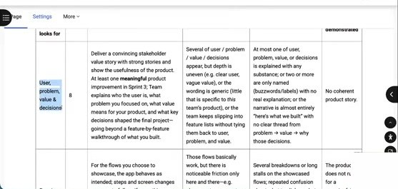
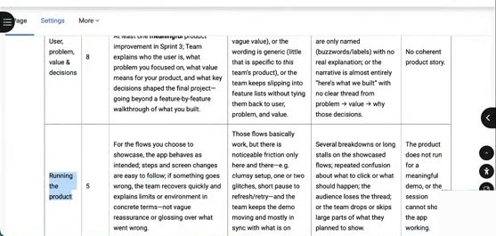

| What the demo looks for | Marks | Strong | Developing | Limited | Not demonstrated |
|---|---|---|---|---|---|
| **User, problem, value & decisions** | 8 | Deliver a convincing stakeholder value story with strong stories and show the usefulness of the product. At least one **meaningful** product improvement in Sprint 3; Team explains who the user is, what problem you focused on, what value means for your product, and what key decisions shaped the final project—going beyond a feature-by-feature walkthrough of what you built. | Several of user / problem / value / decisions appear, but depth is uneven (e.g. clear user, vague value), or the wording is generic (little that is specific to this team's product), or the team keeps slipping into feature lists without tying them back to user, problem, and value. | At most one of user, problem, value, or decisions is explained with any substance; or two or more are only named (buzzwords/labels) with no real explanation; or the narrative is almost entirely "here's what we built" with no clear thread from problem → value → why those decisions. | No coherent product story. |
| **Running the product** | 5 | For the flows you choose to showcase, the app behaves as intended; steps and screen changes are easy to follow; if something goes wrong, the team recovers quickly and explains limits or environment in concrete terms—not vague reassurance or glossing over what went wrong. | Those flows basically work, but there is noticeable friction only here and there—e.g. clumsy setup, one or two glitches, short pause to refresh/retry—and the team shows the demo moving and mostly in sync with what is on screen. | Several breakdowns or long stalls on the showcased flows; repeated confusion about what to click or what should happen; the audience loses the thread; or the team drops or skips large parts of what they planned to show. | The product does not run for a meaningful demo, or the session cannot show the app working. |
| **Q&A** | 2 | Answers are specific and consistent across team members; can open issues/MRs/tests/CI when asked to justify a claim. | Reasonable answers but vague or slow to locate detail. | N/A | Cannot engage with questions. |

🇨🇳 Final demo 15 分 = 用户/问题/价值/决策 8 分 + 产品运行 5 分 + Q&A 2 分。

💬 **讲师补充**：「Running the product」——tutor 可能会说「点一下那个按钮给我看」，看它是否真的能用。

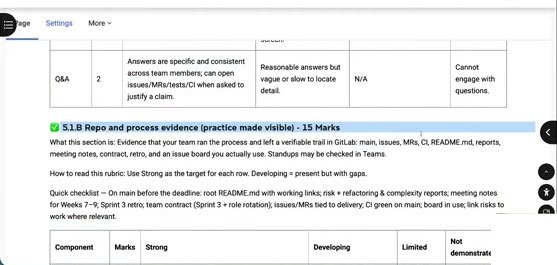

**5.1.B Repo and process evidence (practice made visible) - 15 Marks**
> What this section is: Evidence that your team ran the process and left a verifiable trail in GitLab: main issues, MRs, CI, README.md, reports, meeting notes, contract, retro, and an issue board you actually use. Standups may be evidenced in Teams.
>
> How to read this rubric: Use Strong as the target for each row. Developing = present but with gaps.
>
> Quick checklist — On main before the deadline: root README.md with working links; risk + refactoring & complexity reports; meeting notes for Weeks 7–9; Sprint 3 retro; team contract (Sprint 3 + role rotation); issues/MRs tied to delivery; CI green on main; board in use; link risks to work where relevant.

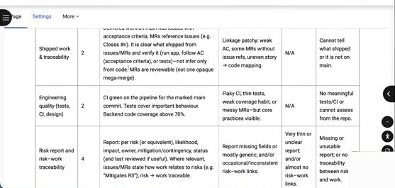
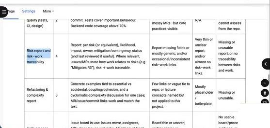
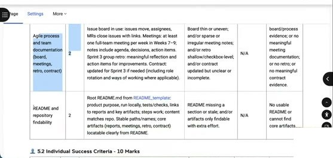

| Component | Marks | Strong | Developing | Limited | Not demonstrated |
|---|---|---|---|---|---|
| **Shipped work & traceability** | 2 | Delivered work on main has issues with acceptance criteria; MRs reference issues (e.g. Closes #n). It is clear what shipped from issues/MRs and verify it (run app, follow AC (acceptance criteria), or tests)—not infer only from code. MRs are reviewable (not one opaque mega-merge). | Linkage patchy: weak AC, some MRs without issue refs, uneven story → code mapping. | N/A | Cannot tell what shipped or it is not on main. |
| **Engineering quality (tests, CI, design)** | 2 | CI green on the pipeline for the marked main commit. Tests cover important behaviour. Backend code coverage above 70%. | Flaky CI, thin tests, weak coverage habit, or messy MRs—but core practices visible. | N/A | No meaningful tests/CI or cannot assess from the repo. |
| **Risk report and risk–work traceability** | 4 | Report: per risk (or equivalent), likelihood, impact, owner, mitigation/contingency, status (and last reviewed if useful). Where relevant, issues/MRs state how work relates to risks (e.g. "Mitigates R3"); risk → work traceable. | Report missing fields or mostly generic; and/or occasional/inconsistent risk–work links. | Very thin or unclear report; and/or almost no risk–work links. | Missing or unusable report; or no traceability between risks and work. |
| **Refactoring & complexity report** | 3 | Concrete examples tied to essential vs accidental, coupling/cohesion, and a cyclomatic-complexity discussion for one concrete refactor; MR/issue/commit links work and match the text. | Few links or vague tie to repo; or lecture concepts named but not applied to *this* project. | Mostly placeholder / boilerplate. | Missing or unusable. |
| **Agile process and team documentation (board, meetings, retro, contract)** | 2 | Issue board in use: issues move, assignees, MRs close issues with links. Meetings: at least one full-team meeting per week in Weeks 7–9; notes include agenda, decisions, action items. Sprint 3 group retro: meaningful reflection and action items for improvements. Contract: updated for Sprint 3 if needed (including role rotation and ways of working where applicable). | Board thin or uneven; and/or sparse or irregular meeting notes; and/or retro shallow/checkbox-level; and/or contract updated but unclear or incomplete. | N/A | No usable board/process evidence; or no meaningful meeting documentation; or no retro; or no meaningful contract evidence. |
| **README and repository findability** | 2 | Root README.md from README_template: product purpose, run locally, tests/checks, links to reports and key artifacts; steps work; content matches repo. Stable paths/names; core artifacts (reports, meetings, retro, contract) locatable clearly from README. | README missing a section or stale; and/or artifacts only findable with extra effort. | N/A | No usable README or cannot find core artifacts. |

🇨🇳 过程证据 15 分 = 交付与可追溯 2 + 工程质量 2（CI 绿、后端覆盖率 >70%）+ 风险报告 4 + 重构与复杂度报告 3 + 敏捷过程文档 2 + README 2。

💬 **讲师补充**：AC 没达到的要能解释——是时间不够，还是觉得不重要而改了。敏捷实践这一项分值从之前下降很多，因为 Sprint 3 把重心放到了其他部分。

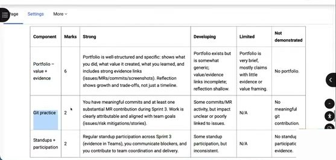

**5.2 Individual Success Criteria - 10 Marks**

| Component | Marks | Strong | Developing | Limited | Not demonstrated |
|---|---|---|---|---|---|
| **Portfolio – value + evidence** | 6 | Portfolio is well-structured and specific: shows what you did, what value it created, what you learned, and includes strong evidence links (issues/MRs/commits/screenshots). Reflection shows growth and trade-offs, not just a timeline. | Portfolio exists but is somewhat generic; value/evidence links incomplete; reflection shallow. | Portfolio is very brief, mostly claims with little evidence or value framing. | No portfolio. |
| **Git practice** | 2 | You have meaningful commits and at least one substantial MR contribution during Sprint 3. Work is clearly attributable and aligned with team goals (issues/risk mitigations/stories). | Some commits/MR activity, but impact unclear or poorly linked to issues. | N/A | No meaningful git contribution. |
| **Standups + participation** | 2 | Regular standup participation across Sprint 3 (evidence in Teams), you communicate blockers, and you contribute to team coordination and delivery. | Some standup participation, but inconsistent. | N/A | No standup participation evidence. |

🇨🇳 个人 10 分 = Portfolio 6 + Git 2 + Standup 2。

### 1.7 6. Submission and final demo / 7. Plagiarism

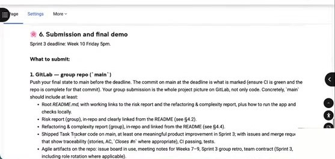
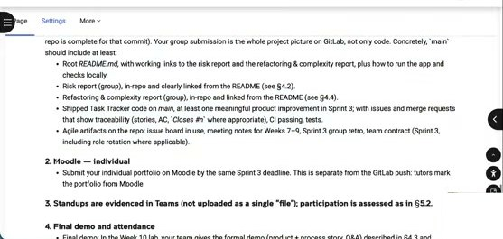

> **Sprint 3 deadline: Week 10 Friday 5pm.**
>
> **What to submit:**
> **1. GitLab — group repo (`main`)**
> Push your final state to `main` before the deadline. The commit on main at the deadline is what is marked (ensure CI is green and the repo is complete for that commit). Your group submission is the whole project picture on GitLab, not only code. Concretely, `main` should include at least:
> - Root *README.md*, with working links to the risk report and the refactoring & complexity report, plus how to run the app and checks locally.
> - Risk report (group), in-repo and clearly linked from the README (see §4.2).
> - Refactoring & complexity report (group), in-repo and linked from the README (see §4.4).
> - Shipped Task Tracker code on *main*, at least one meaningful product improvement in Sprint 3; with issues and merge requests that show traceability (stories, AC, `Closes #n` where appropriate), CI passing, tests.
> - Agile artifacts on the repo: issue board in use, meeting notes for Weeks 7–9, Sprint 3 group retro, team contract (Sprint 3, including role rotation where applicable).
>
> **2. Moodle — individual**
> - Submit your individual portfolio on Moodle by the same Sprint 3 deadline. This is separate from the GitLab push: tutors mark the portfolio from Moodle.
>
> **3. Standups are evidenced in Teams (not uploaded as a single "file"); participation is assessed as in §5.2.**
>
> **4. Final demo and attendance**
> - Final demo: In the Week 10 lab, your team gives the formal demo (product + process story, Q&A) described in §4.3 and assessed in §5.1.A. This is a live session, not a separate file submission.
> - Attendance: All team members must attend the Week 10 demo otherwise 0 marks for Sprint 3 unless special consideration applies.

🇨🇳 截止 **Week 10 周五 17:00**。GitLab main 上：README（带可用链接）、风险报告、重构与复杂度报告、代码（含 Sprint 3 至少一个有意义的改进）、敏捷产物（board、Week 7–9 会议记录、retro、team contract）。Moodle：个人 portfolio。Teams：standup 证据。**Week 10 demo 全员必须出席，否则 Sprint 3 记 0 分**（特殊情况除外）。

💬 **讲师补充**：根据另一位学生审阅者的建议，guideline 末尾加了**提交清单**——什么交到 GitLab、什么交到 Moodle、什么在 Teams，以及 demo 和出勤。

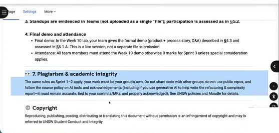

> **7. Plagiarism & academic integrity**
> The same rules as Sprint 1–2 apply: your work must be your group's own. Do not share code with other groups, do not use public repos, and follow the course policy on AI tools and acknowledgements (including if you use generative AI to help write the refactoring & complexity report—it must remain accurate, tied to your commits/MRs, and properly acknowledged). See UNSW policies and Moodle for details.
>
> **© Copyright** Reproducing, publishing, posting, distributing or translating this document without permission is an infringement of copyright and may be referred to UNSW Student Conduct and Integrity.

💬 **讲师补充（GenAI 使用）**
- 可以用 GenAI 帮助写文档，但要**正确声明**用法，遵守 UNSW 的 AI 使用规范。
- 一个进阶用法：让 GenAI **总结你们的 commit message**，讲出做了什么的故事。但 GenAI 会自己做假设，信息可能不对，**务必审核、核对、编辑**。
- Sprint 1 的教训：有的组 tutor 在 lab 里亲眼看到讨论质量很高，但会议记录和 commit message 明显是 AI 生成、质量反而不如实际——结果因此**得了更低的分**。AI 生成的东西必须反映事实。
- Q：工作量如何？A（学生）：看目标——想拿高分就工作量大，想 pass 不难。讲师：Sprint 3 也一样。

---

## 第 2 部分 · Lecture 7.1 Persistence（00:27–00:46）

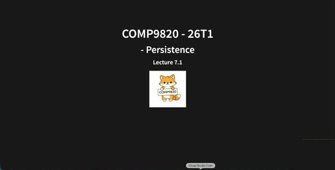

**COMP9820 - 26T1 - Persistence — Lecture 7.1**

### 2.1 现场演示：内存版 Task Tracker 的问题

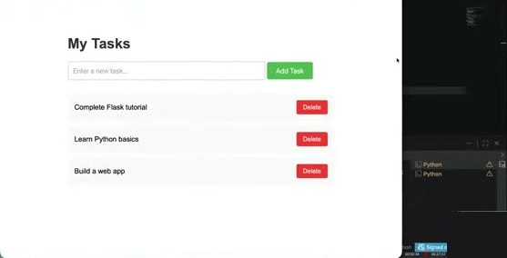
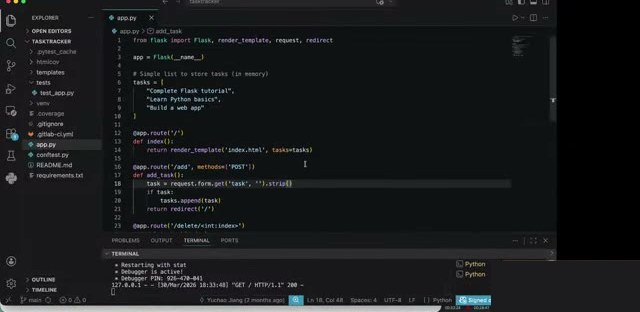

```python
from flask import Flask, render_template, request, redirect

app = Flask(__name__)

# Simple list to store tasks (in memory)
tasks = [
    "Complete Flask tutorial",
    "Learn Python basics",
    "Build a web app"
]

@app.route('/')
def index():
    return render_template('index.html', tasks=tasks)

@app.route('/add', methods=['POST'])
def add_task():
    task = request.form.get('task', '').strip()
    if task:
        tasks.append(task)
    return redirect('/')

@app.route('/delete/<int:index>')
...
```

💬 **讲师补充**
- 这是前几周讲座 demo 用的 task tracker（`main` 分支），有添加、删除、显示任务三个 route。`python3 app.py` 运行。
- 添加一个任务 "persistence"，刷新页面它还在；但**重启服务器后就没了**。为什么？——因为任务列表**只存在内存里**。
- 这样的 task tracker 能正常工作吗？不能——理想情况是任务应该一直在，直到点击 Delete。这就是今天要讲的 **persistence**。
- 如果任务有 deadline、assignee，或者有多个用户，这些数据也都需要被妥善保存——都属于 persistence。

### 2.2 In This Lecture

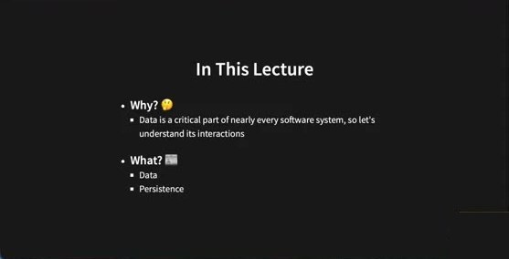

- **Why?** 🤔
  - Data is a critical part of nearly every software system, so let's understand its interactions
- **What?** 📖
  - Data
  - Persistence

🇨🇳 为什么：数据是几乎所有软件系统的关键部分。讲什么：数据、持久化。

### 2.3 Data In Applications

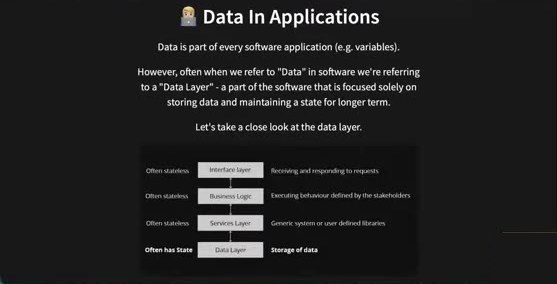

> Data is part of every software application (e.g. variables).
>
> However, often when we refer to "Data" in software we're referring to a "Data Layer" - a part of the software that is focused solely on storing data and maintaining a state for longer term.
>
> Let's take a close look at the data layer.

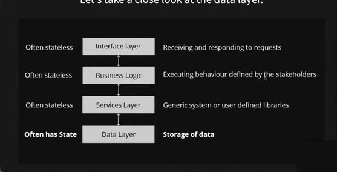

| | Layer | |
|---|---|---|
| Often stateless | **Interface layer** | Receiving and responding to requests |
| Often stateless | **Business Logic** | Executing behaviour defined by the stakeholders |
| Often stateless | **Services Layer** | Generic system or user defined libraries |
| **Often has State** | **Data Layer** | Storage of data |

🇨🇳 数据存在于每个应用（如变量）。但软件里说的「Data」通常指**数据层**——专门负责存储数据、长期维持状态的部分。四层：接口层（通常无状态，收发请求）、业务逻辑（执行 stakeholder 定义的行为）、服务层（通用或自定义库）、数据层（**通常有状态**，存储数据）。

💬 **讲师补充**：不同人对分层描述不同，这只是其中一种。「stateless」= 不持久，比如页面缩放状态丢了没关系。业务逻辑例：点这个按钮应回到上一页。服务层例：购物车、「用户可以添加任务」的 story。数据层存用户、任务等一切，常被叫做 database。

### 2.4 Data Layers ("Databases")

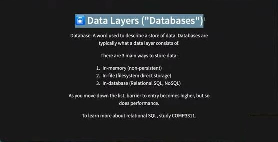

> Database: A word used to describe a store of data. Databases are typically what a data layer consists of.
>
> There are 3 main ways to store data:
> 1. In-memory (non-persistent)
> 2. In-file (filesystem direct storage)
> 3. In-database (Relational SQL, NoSQL)
>
> As you move down the list, barrier to entry becomes higher, but so does performance.
>
> To learn more about relational SQL, study COMP3311.

🇨🇳 三种存储方式：内存（不持久）、文件（直接存文件系统）、数据库（关系型 SQL、NoSQL）。越往下门槛越高，性能也越高。想学关系型 SQL 去修 COMP3311。

💬 **讲师补充**
- 现场问「项目在用数据库吗？」——有的用有的没用，都没问题。研究生课程背景多样。已经在用数据库的可以学一种更简单的存储方式；没用的话，今天介绍的**基于文件的**方式对学生项目（如 task tracker）已足够。
- 文件式数据库的直觉：我笔记本上有一个文件夹放所有讲义 PDF，重启电脑它们还在——这其实就是一种「数据库」，以文件形式存数据。
- 数据关系/依赖很复杂时才需要 SQL/NoSQL；**本项目文件系统就够了**。

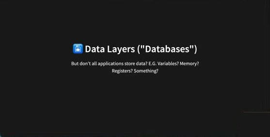

> But don't all applications store data? E.G. Variables? Memory? Registers? Something?

### 2.5 Storing Data: Persistence

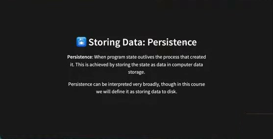

> **Persistence**: When program state outlives the process that created it. This is achieved by storing the state as data in computer data storage.
>
> Persistence can be interpreted very broadly, though in this course we will define it as storing data to disk.

🇨🇳 **持久化**：程序状态比创建它的进程活得更久——重启后数据还在。通过把状态作为数据存入计算机存储实现。本课程定义为「存到磁盘」。

### 2.6 现场演示：`persistence` 分支 — 用 JSON 文件持久化

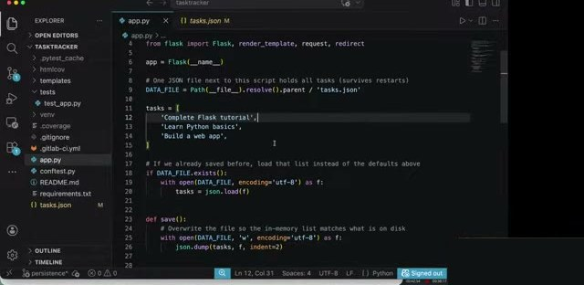
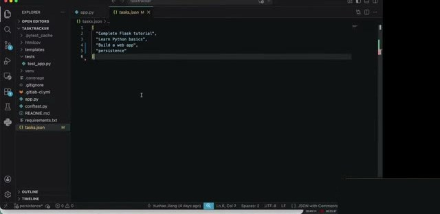

```python
import json  # read/write the task list as JSON text
from pathlib import Path  # build a filesystem path to tasks.json beside this file

from flask import Flask, render_template, request, redirect

app = Flask(__name__)

# One JSON file next to this script holds all tasks (survives restarts)
DATA_FILE = Path(__file__).resolve().parent / 'tasks.json'

tasks = [
    'Complete Flask tutorial',
    'Learn Python basics',
    'Build a web app',
]

# If we already saved before, load that list instead of the defaults above
if DATA_FILE.exists():
    with open(DATA_FILE, encoding='utf-8') as f:
        tasks = json.load(f)

def save():
    # Overwrite the file so the in-memory list matches what is on disk
    with open(DATA_FILE, 'w', encoding='utf-8') as f:
        json.dump(tasks, f, indent=2)

@app.route('/')
def index():
    return render_template('index.html', tasks=tasks)
# add_task / delete 里在修改 tasks 之后调用 save()
```

`tasks.json`：
```json
[
  "Complete Flask tutorial",
  "Learn Python basics",
  "Build a web app",
  "persistence"
]
```

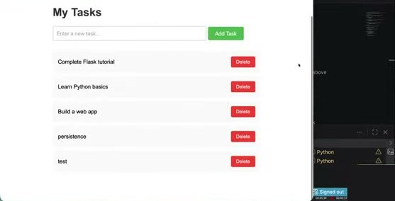

💬 **讲师补充**
- 切到 `persistence` 分支运行，添加 "persistence"，停止并重启服务器，刷新——任务**还在**。
- 代码改动很少，「maybe about maximum five or six extra lines」。用一个 **JSON 文件 `tasks.json`** 存任务列表。
- **什么是 JSON 文件**：另一种存数据的文件，不能运行（不像 Python/JS），像 Google Doc / Excel 一样只存数据。之前见过的 YAML（CI pipeline）和 Markdown 也是存数据的文件。JSON 的强项是**与编程语言交互方便**——能轻松读成 Python list/object 或 JavaScript object。这里存的是简单 list，也可以存对象。
- 改动：`import json`（把 Python list 与 JSON 互转）；`from pathlib import Path`（需要知道存在哪、从哪读）；`DATA_FILE` 指向 `tasks.json`（名字随意）；如果文件已存在就 `json.load` 读出来变成 Python list，而不是用代码里的默认列表——JSON 文件里的内容只是**字符串**，`json.load` 把它变成 Python list/object，之后就能增删改；`save()` 用 `json.dump` 写回文件。
- 演示直接在 `tasks.json` 里手动加一项 "test"（不经过浏览器），重启后页面上出现 "test"——说明**改变数据的途径不止前端 UI**，也可以通过后端、邮件触发、点赞计数等。
- 在 add / delete 之后都调用 `save()`，所有改动都会写回 JSON 文件。数据更多时可以有 `tasks.json`、`users.json` 等多个文件。
- **Q：想保存图片怎么办？** 学生答：存文件地址、存另一网站的 URL 等。讲师：以上都可行，选最适合项目的；还要考虑**图片大小**。很多项目会需要图片（如用户头像），取决于多种因素。
- Sprint 3 如果觉得 SQL 太复杂，可以考虑这种文件式持久化，简单快速。**Persistence 不是必须的**，取决于你们的 story，但估计大多数项目都需要某种持久化。

### 2.7 Adding Persistence To The Project

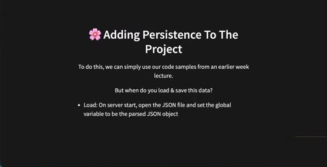

> To do this, we can simply use our code samples from an earlier week lecture.
>
> But when do you load & save this data?
> - Load: On server start, open the JSON file and set the global variable to be the parsed JSON object

🇨🇳 直接复用前几周的代码样例。何时加载/保存？加载：服务器启动时打开 JSON 文件，把解析结果赋给全局变量。

### 2.8 Sprint Expectations When You Add Persistence

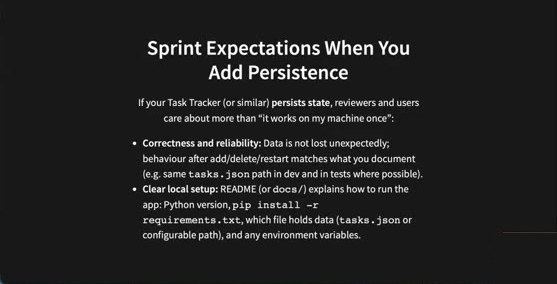

> If your Task Tracker (or similar) **persists state**, reviewers and users care about more than "it works on my machine once":
> - **Correctness and reliability:** Data is not lost unexpectedly; behaviour after add/delete/restart matches what you document (e.g. same `tasks.json` path in dev and in tests where possible).
> - **Clear local setup:** README (or `docs/`) explains how to run the app: Python version, `pip install -r requirements.txt`, which file holds data (`tasks.json` or configurable path), and any environment variables.

🇨🇳 如果项目持久化状态，审阅者关心的不只是「在我机器上跑过一次」：**正确性与可靠性**（数据不意外丢失，增删/重启后的行为与文档一致）；**清晰的本地设置**（README 写明 Python 版本、依赖安装、数据文件位置、环境变量）。

### 2.9 Examples Tied To A Simple JSON-Backed App

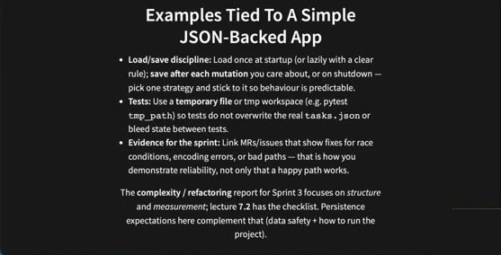

> - **Load/save discipline:** Load once at startup (or lazily with a clear rule); **save after each mutation** you care about, or on shutdown — pick one strategy and stick to it so behaviour is predictable.
> - **Tests:** Use a **temporary file** or tmp workspace (e.g. pytest `tmp_path`) so tests do not overwrite the real `tasks.json` or bleed state between tests.
> - **Evidence for the sprint:** Link MRs/issues that show fixes for race conditions, encoding errors, or bad paths — that is how you demonstrate reliability, not only that a happy path works.
>
> The **complexity / refactoring** report for Sprint 3 focuses on *structure* and *measurement*; lecture **7.2** has the checklist. Persistence expectations here complement that (data safety + how to run the project).

🇨🇳 加载/保存纪律（启动时加载一次，每次变更后保存，策略一致）；**测试用临时文件**（pytest `tmp_path`），别覆盖真实 `tasks.json`；用 MR/issue 证明修复了竞态、编码错误、坏路径等——这才是可靠性证据。


> **Feedback** — Or go to the form here.

💬 休息到 7pm。休息期间一位学生推荐了 **diff-cover**：

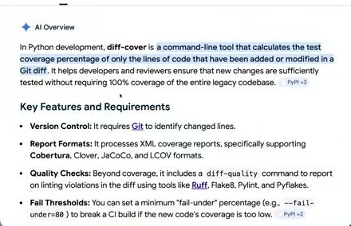

> In Python development, **diff-cover** is a command-line tool that calculates the test coverage percentage of only the lines of code that have been added or modified in a Git diff. It helps developers and reviewers ensure that new changes are sufficiently tested without requiring 100% coverage of the entire legacy codebase.
> - **Version Control:** It requires Git to identify changed lines.
> - **Report Formats:** It processes XML coverage reports, specifically supporting Cobertura, Clover, JaCoCo, and LCOV formats.
> - **Quality Checks:** Beyond coverage, it includes a `diff-quality` command to report on linting violations in the diff using tools like Ruff, Flake8, Pylint, and Pyflakes.
> - **Fail Thresholds:** You can set a minimum "fail-under" percentage (e.g., `--fail-under=80`) to break a CI build if the new code's coverage is too low.

🇨🇳 diff-cover 只计算 Git diff 中新增/修改行的测试覆盖率，适合想知道**每个 MR / 每个成员**的改动覆盖率的小组。

---

## 第 3 部分 · Lecture 7.2 Software Complexity（00:54–01:35）

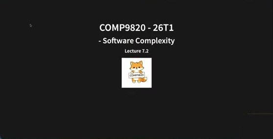

**COMP9820 - 26T1 - Software Complexity — Lecture 7.2**

### 3.1 In This Lecture

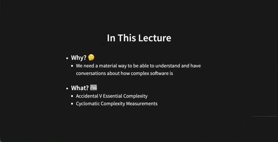

- **Why?** 🤔
  - We need a material way to be able to understand and have conversations about how complex software is
- **What?** 📖
  - Accidental V Essential Complexity
  - Cyclomatic Complexity Measurements

🇨🇳 为什么：需要一种实在的方式来理解和讨论软件有多复杂。讲什么：偶然复杂度 vs 本质复杂度；圈复杂度度量。

💬 之前多次提到「要避免复杂度，越复杂越难维护、越容易出错」。今天讲如何**定义/理解**复杂度、如何**度量**、什么时候需要处理它。

### 3.2 What Is Software Complexity?


> Any ideas?

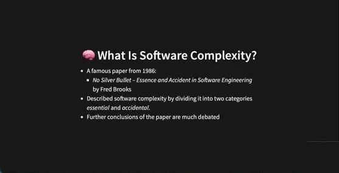

- A famous paper from 1986:
  - *No Silver Bullet – Essence and Accident in Software Engineering* by Fred Brooks
- Described software complexity by dividing it into two categories *essential* and *accidental*.
- Further conclusions of the paper are much debated

🇨🇳 1986 年 Fred Brooks 的著名论文《没有银弹》把软件复杂度分为**本质**与**偶然**两类；论文的其他结论争议很大。

### 3.3 Essential vs Accidental

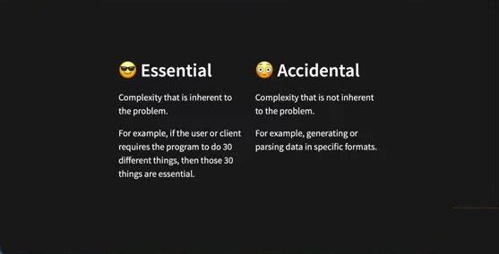

| 😎 Essential | 😳 Accidental |
|---|---|
| Complexity that is inherent to the problem. | Complexity that is not inherent to the problem. |
| For example, if the user or client requires the program to do 30 different things, then those 30 things are essential. | For example, generating or parsing data in specific formats. |

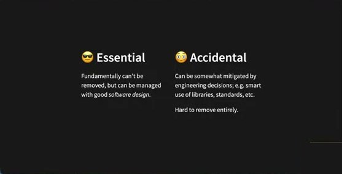

| 😎 Essential | 😳 Accidental |
|---|---|
| Fundamentally can't be removed, but can be managed with good *software design*. | Can be somewhat mitigated by engineering decisions; e.g. smart use of libraries, standards, etc. |
| | Hard to remove entirely. |

🇨🇳 **本质复杂度**：问题固有的——客户要 30 个功能，这 30 个就是本质的；无法去除，但可用好的软件设计（低耦合、高内聚）管理。**偶然复杂度**：非问题固有——如生成/解析特定格式的数据；可通过工程决策缓解（善用库、遵循标准），但很难完全去除。

### 3.4 Quiz Q1

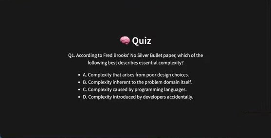

> Q1. According to Fred Brooks' No Silver Bullet paper, which of the following best describes essential complexity?
> - A. Complexity that arises from poor design choices.
> - B. Complexity inherent to the problem domain itself.
> - C. Complexity caused by programming languages.
> - D. Complexity introduced by developers accidentally.

💬 现场：1 人选 A、几人选 B、1 人选 D、无人选 C。**答案 B**。A 的「糟糕设计」可以去除 → 是偶然复杂度；D「开发者不小心引入」能部分去除（不能 100%）→ 偶然；C 编程语言——可以换语言，也不是本质。

### 3.5 Open Questions

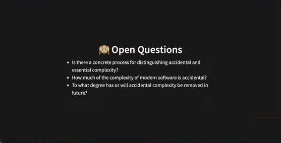

- Is there a concrete process for distinguishing accidental and essential complexity?
- How much of the complexity of modern software is accidental?
- To what degree has or will accidental complexity be removed in future?

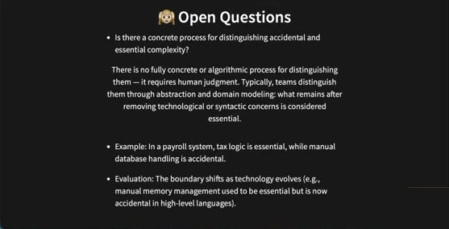

> **Is there a concrete process for distinguishing accidental and essential complexity?**
> There is no fully concrete or algorithmic process for distinguishing them — it requires human judgment. Typically, teams distinguish them through abstraction and domain modeling: what remains after removing technological or syntactic concerns is considered essential.
> - Example: In a payroll system, tax logic is essential, while manual database handling is accidental.
> - Evaluation: The boundary shifts as technology evolves (e.g., manual memory management used to be essential but is now accidental in high-level languages).

🇨🇳 没有算法式流程，**需要人的判断**。通常通过抽象和领域建模区分：去掉技术/语法层面的东西后剩下的是本质。例：薪资系统里税务逻辑是本质的（法律要求），手动处理数据库是偶然的。边界随技术演进移动——用 C 时手动管理内存是本质的，现在高级语言（Python/JS）自动管理，若还手动管理就是偶然复杂度。

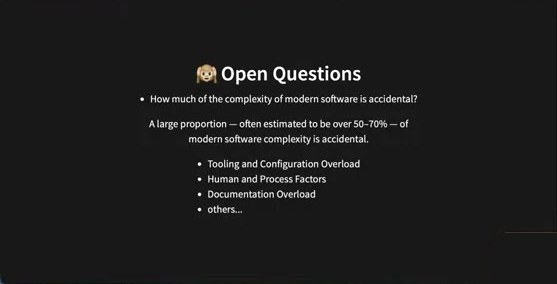

> **How much of the complexity of modern software is accidental?**
> A large proportion — often estimated to be over 50–70% — of modern software complexity is accidental.
> - Tooling and Configuration Overload
> - Human and Process Factors
> - Documentation Overload
> - others...

🇨🇳 很大比例——常估计 **50–70% 以上**。来源：工具与配置过载（如 13 或 30 个环境变量）、人与流程因素（协作管理不善）、文档过载等。即使 Microsoft、Google 的系统也有大量偶然复杂度。

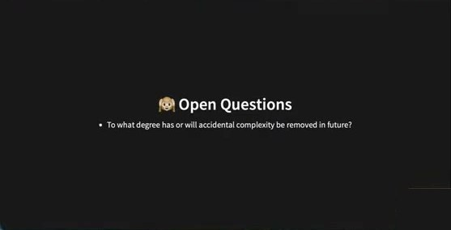

> **To what degree has or will accidental complexity be removed in future?**

💬 "I don't know. So you may tell me in the future."

💬 **Sprint 3 任务**：在你们项目里**识别一些本质复杂度和偶然复杂度**，并说明为什么。现场给一分钟思考；不清楚就和队友讨论。

### 3.6 How Can We Measure Software Complexity?

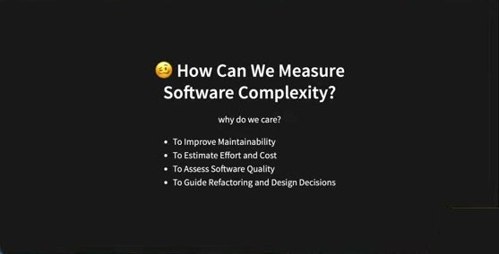

> why do we care?
> - To Improve Maintainability
> - To Estimate Effort and Cost
> - To Assess Software Quality
> - To Guide Refactoring and Design Decisions

🇨🇳 为什么要度量：改善可维护性（找出过于复杂的组件去处理，复杂度 OK 的就不用管）；估算工作量与成本（重构高复杂度模块要多留时间，因为依赖多、涉及的人多）；评估软件质量；指导重构与设计决策。


- Coupling
- Cohesion
- Cyclomatic Complexity

💬 本课讲三种，实际还有更多。Coupling 和 Cohesion 在可维护性讲座的设计原则里讲过。

### 3.7 Coupling


- A measure of how closely connected different software components are.
- Usually expressed as a simple ordinal measure of "loose" or "tight".
- For example, web applications tend to have a frontend that is loosely coupled from the backend.
- **Loose coupling is good**

🇨🇳 耦合：不同组件之间联系的紧密程度，用「松/紧」描述。例：Web 应用前后端通常松耦合。**松耦合好**。

💬 学生回答：耦合 = 依赖少；「把不相关的分开，相关的放一起」。如果一个函数依赖很多东西，改一个就要更新很多模块——不好。为什么前后端要松耦合？学生：后端有很多数据逻辑、后端可能出问题、后端某些东西不再需要时不该影响前端。讲师：逻辑分离，互相影响小，改动时不牵连。

### 3.8 Cohesion


- The degree to which elements of a module belong together.
- Elements belong together if they're somehow related.
- Usually expressed as a simple ordinal measure of "low" or "high".
- **High cohesion is good**
- Read more here

🇨🇳 内聚：模块内元素彼此归属的程度，相关的元素放在一起，用「低/高」描述。**高内聚好**。

💬 学生例子：相关的功能放一组；点击 checkbox 删除任务——删除逻辑的代码放在一起。

### 3.9 Quiz Q2


> Q2. Which statement about coupling is true?
> - A. High coupling is desirable because it promotes reusability.
> - B. Low coupling means fewer dependencies between modules.
> - C. Tight coupling improves maintainability.
> - D. Coupling only applies to object-oriented systems.

💬 全场选 **B**，正确。

💬 **Sprint 3 任务**：检查代码库，找出因 coupling / cohesion 问题需要重构的地方。技巧：**看自己的代码很难发现问题，看别人的容易**——作为小组互相重构对方的代码。

### 3.10 Cyclomatic Complexity


- A measure of the branching complexity of functions.
- Computed by counting the number of linearly-independent paths through a function.
- It was introduced by Thomas McCabe (1976) to quantify how complex a program's logic is — based on its control flow structure (like if, else, for, while, switch statements).

🇨🇳 圈复杂度：函数**分支复杂度**的度量，数函数中线性无关路径的条数。McCabe 1976 提出，基于控制流结构（if/else/for/while/switch）。

💬 「分支」指逻辑分支（if/else、while 循环），不是 Git 的分支。研究发现分支复杂度是函数复杂度的主要来源。从测试角度也是——每个分支都需要测试。


> **The Core Idea**
> Every decision point (a branch where the program can take a different path) increases the number of possible execution routes.
> ```python
> if x > 0:
>     print("Positive")
> else:
>     print("Non-positive")
> ```
> There are two independent paths (true/false), so the cyclomatic complexity = 2.


> To compute:
> 1. Convert function into a control flow graph
> 2. Calculate the value of the formula
>
> **V(G) = e − n + 2**
>
> where e is the number of edges and n is the number of nodes

🇨🇳 每个决策点都增加可能的执行路径。计算：① 画控制流图；② V(G) = 边数 − 节点数 + 2。

### 3.11 Examples


**Example 1**
```python
def foo():
    if A():
        B()
    else:
        C()
```
图：A → B, A → C, B → D, C → D。**V(G) = 4 − 4 + 2 = 2**

💬 A 为真走 B 到 D，否则走 C 到 D。4 条边，4 个节点。


**Example 2**
```python
def foo():
    if A():
        B()
    else:
        if C():
            D()
```
图：A → B, A → C, C → D, B → E, C → E, D → E。**V(G) = 6 − 5 + 2 = 3**

💬 讲师用 Teams Whiteboard 现场画图，一开始漏了 B → E 和 D → E 两条边（"It's okay to be confused sometimes"）。关键：**所有分支最后都汇到同一个结束节点 E**。6 边 5 节点 → 3。


**Example 3**
```python
def foo():
    while A():
        B()
    C()
```
图：A → B, B → A, A → C。**V(G) = 3 − 3 + 2 = 2**

💬 while 循环：A 为真到 B 再回到 A；否则直接到 C。


**Example 4**
```python
def day_to_year(days):
    year = 1970

    while days > 365:
        if is_leap_year(year):
            if days > 366:
                days -= 366
                year += 1
        else:
            days -= 365
            year += 1

    return year
```


**V(G) = 8 − 6 + 2 = 4**

节点（6）：`days>365`、`is_leap_year`、`days>366`、`days-=366; year+=1`、`days-=365; year+=1`、`end`。
边（8）：`days>365`→`is_leap_year`、`days>365`→`end`、`is_leap_year`→`days>366`、`is_leap_year`→`days-=365`、`days>366`→`days-=366`、`days>366`→`days>365`（为假回到循环）、`days-=366`→`days>365`、`days-=365`→`days>365`。

💬 讲师让大家自己画（有人 4 分钟内算出 4）。讲师自己画时「I'm so lost」，一位学生上台一起完成：`days > 366` 为假时要**回到 while 判断**，两个赋值块执行完也都回到 while。答案 **4**。"When I look at the answer I also had no question, but when I do it myself, so complicated."


**Example 5（重构后）**
```python
def day_to_year(days):
    year = 1970

    while days > 0:
        if is_leap_year(year):
            days -= 366
        else:
            days -= 365
        year += 1

    return year - 1
```
**V(G) = 7 − 6 + 2 = 3**

💬 同一件事有多种写法——重构可以降低圈复杂度。可课后自己练习。**Sprint 3 任务**：找项目里一个分支多（while/for/if-else）、看起来最复杂的函数，计算圈复杂度并尝试降低。有挑战性，卡住很正常，小组讨论。**不需要算所有函数**，只挑一个。

### 3.12 Usage / Drawbacks / Automatic Calculation


> **Usage**
> A simple understandable measure of function complexity.
> Some people argue 10 should be the maximum cyclomatic complexity of a function where others argue for 8.

🇨🇳 简单易懂的函数复杂度度量。有人认为上限应为 10，也有人说 8。如果你们没有超过 8 或 10 的函数就没问题。


> **Drawbacks**
> - Assumes non-branching statements have no complexity.
> - Keeping cyclomatic complexity low encourages splitting functions up, regardless of whether that really makes the code more understandable.

🇨🇳 缺点：① 假设非分支语句（如 `a = 1`、`a + b`）没有复杂度，这并不真实；② 追求低圈复杂度会鼓励拆函数，但拆分不一定让代码更易懂——本该属于一个函数的逻辑只为降指标而拆分不是好主意。**如果函数天生就复杂、无法降低，写明「it's just complicated by nature」，不拆也可以。**


> **Automatic Calculation**
> Depending on the programming language, sometimes there are tools that exist to automatically calculate it.

🇨🇳 视语言有自动计算工具，但需要知道公式和画图的原理。


> **Further Reading**
> - The original No Silver Bullet paper: http://faculty.salisbury.edu/~xswang/Research/Papers/SERelated/no-silver-bullet.pdf
> - A more modern description: https://stevemcconnell.com/articles/software-engineering-principles/
> - A recent rebuttal: https://blog.ploeh.dk/2019/07/01/yes-silver-bullet/

---

## 第 4 部分 · 结束语（01:37–01:39）

💬 提前 15 分钟下课。祝 final sprint 和期中考试顺利，长周末愉快。**Week 8 周一是 Easter Monday，改录播**；Week 9 见，那是最后一次讲座。

---

## ✅ Sprint 3 待办清单（据本讲整理）

**本周（Week 7）**
- [ ] 周会；（可选）轮换角色并更新 team contract；规划 Sprint 3；识别技术债
- [ ] 讨论并记录项目中的 **essential vs accidental complexity**（各至少一例，说明理由）
- [ ] 审视代码库找 **coupling / cohesion** 问题（互相看对方的代码），建 issue「refactoring for complexity」并细分指派
- [ ] 挑**一个最复杂的函数**，画控制流图、算 V(G) = e − n + 2，尝试重构降低
- [ ] 如需持久化：用 JSON 文件（`json` + `pathlib`，启动时 load、每次变更后 save），测试用 `tmp_path`
- [ ] 开始 `docs/REFACTORING_AND_COMPLEXITY.md` 草稿（可多次 commit）

**Week 8**
- [ ] 观看 Risk Management 录播；写风险报告（likelihood / impact / owner / mitigation / status，issue/MR 标注「Mitigates R3」）
- [ ] 用 README_template 替换 starter README（产品、本地运行、检查、报告链接）

**Week 9**
- [ ] 完成重构与复杂度报告（≤1–2 页）并从 README 链接；测试/CI 全绿；后端覆盖率 >70%
- [ ] 准备 demo 幻灯片与脚本（用户/问题 → 价值与 story → 现场运行 → 反思），至少一次计时彩排，全员分工发言
- [ ] 个人 portfolio 草稿（≤1000 词，附证据链接）；Sprint 3 retro
- [ ] （可选）部署并在论坛频道分享链接，或录 5 分钟介绍视频

**Week 10**
- [ ] lab 课 Final Demo（10–15 min + 5 min Q&A），**全员出席**，否则 Sprint 3 记 0 分
- [ ] 周五 17:00 前：GitLab `main`（README、风险报告、复杂度报告、代码、board、Week 7–9 会议记录、retro、contract）；Moodle 提交 portfolio；Teams 有 standup 记录
- [ ] 所有 GenAI 辅助内容已审核、符合事实并正确声明
