# COMP9820 26T1 · Week 8 课件整理 — Lecture 8.1 Risk Management（风险管理）

> 来源：https://www.youtube.com/watch?v=PAOI2TLyMQI（约 35 min，录播；屏幕菜单栏显示录制日期为 2026-04-09 周四。Week 8 周一为 Easter Monday 公共假期，故本讲改为录播）
> 说明：本文件按投影顺序整理。每张幻灯片给出 **英文原文**（逐字）→ 🇨🇳 中文翻译 → 💬 讲师补充（口头讲解，来自字幕）。
> 字幕为 YouTube 自动生成，已按语义修正明显错词：`rights/rise`→writes、`springs`→sprints、`race/regs`→risk、`age cases`→edge cases、`dine and credit`→done and correct、`rows`→roles、`wheel points`→viewpoints、`content factor`→counterfactual、`ID/atti project`→IT project、`RIT report`→risk report、`task.json/track tax`→tasks.json / Task Tracker 等。
> 部分幻灯片在视频中仅停留 1–3 秒（讲师快速翻过），已通过逐秒抽帧补齐；标注 ⚡ 的页面讲师口头未展开。

---

## 第 0 部分 · 开场（00:00–00:02）

### 0.1 Risk Management（标题页）

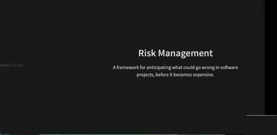

**Risk Management**
> A framework for anticipating what could go wrong in software projects, before it becomes expensive.

🇨🇳 **风险管理** —— 一套在软件项目中"提前预判什么可能出错"的框架，赶在问题变得昂贵之前。

💬 **讲师补充**
- 第一讲就提过：软件项目充满不确定性——人员变动、需求变化、新技术、新法律法规等。风险管理就是在这些不确定性下改善 **时间、成本、质量** 及整体结果。
- 为什么会"变昂贵"？如果没有预案，事情出错时你会额外花时间，或者走上更耗时间、金钱、资源的方向。

### 0.2 In This Lecture

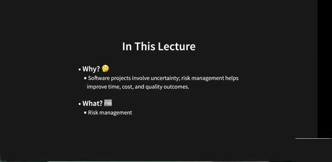

- **Why? 🤔**
  - Software projects involve uncertainty; risk management helps improve time, cost, and quality outcomes.
- **What? 📖**
  - Risk management

🇨🇳 为什么：软件项目有不确定性，风险管理有助于改善时间、成本和质量结果。讲什么：风险管理。

### 0.3 Lecture Roadmap

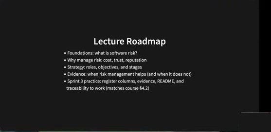

- Foundations: what is software risk?
- Why manage risk: cost, trust, reputation
- Strategy: roles, objectives, and stages
- Evidence: when risk management helps (and when it does not)
- Sprint 3 practice: register columns, evidence, README, and traceability to work (matches course §4.2)

🇨🇳 基础：什么是软件风险 → 为何管理风险：成本、信任、声誉 → 策略：角色、目标、阶段 → 证据：风险管理何时有效（何时无效） → Sprint 3 实践：风险登记表字段、证据、README、与实际工作的可追溯性（对应课程 Sprint 3 指南 §4.2）。

---

## 第 1 部分 · 为什么需要风险管理（00:02–00:04）

### 1.1 Why Software Projects Fail

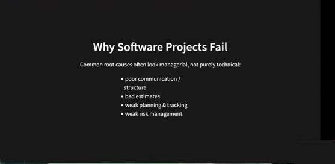

> Common root causes often look managerial, not purely technical:
- poor communication / structure
- bad estimates
- weak planning & tracking
- weak risk management

🇨🇳 常见根因往往是管理性的而非纯技术的：沟通/组织结构差、估算差、计划与跟踪弱、风险管理弱。

💬 **讲师补充**（Week 1/2 内容回顾）
- 软件项目失败多半不是技术问题，而是管理问题。例如开发者与利益相关者之间的沟通：用户说"我有个难题，你能帮我解决吗"，双方对"难题"理解不同，做出来的方案自然不符合期望。
- "估算差"既包括对问题复杂度的估算，也包括对时间的估算。

### 1.2 The "Risk Management" Idea

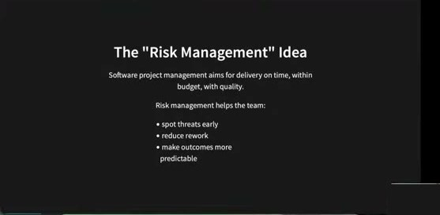

> Software project management aims for delivery on time, within budget, with quality.
>
> Risk management helps the team:
- spot threats early
- reduce rework
- make outcomes more predictable

🇨🇳 软件项目管理的目标是按时、在预算内、有质量地交付。风险管理帮助团队：更早发现威胁、减少返工、让结果更可预测。

💬 讲师补充：由于一开始就考虑了潜在风险，返工会减少；结果"不太可能完全可预测，但会更可预测一些"。

---

## 第 2 部分 · Foundations：什么是风险（00:04–00:12）

### 2.1 Section: Foundations

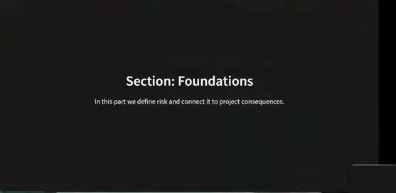

> In this part we define risk and connect it to project consequences.

🇨🇳 本节定义"风险"，并把它与项目后果联系起来。

### 2.2 What Is "Risk"?

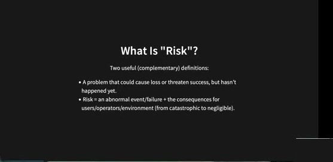

> Two useful (complementary) definitions:
- A problem that could cause loss or threaten success, but hasn't happened yet.
- Risk = an abnormal event/failure + the consequences for users/operators/environment (from catastrophic to negligible).

🇨🇳 两个互补的定义：① 一个 **尚未发生**、但可能造成损失或威胁成功的问题；② 风险 = 异常事件/故障 + 它对用户/操作者/环境造成的后果（从灾难性到可忽略）。

💬 讲师补充：不同软件工程文献对"风险"定义不同，这两条是最容易采用的。

### 2.3 Uncertainty Vs Risk + Opportunity

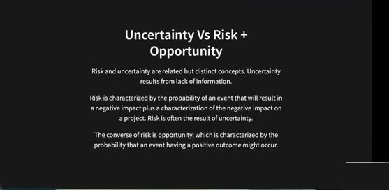

> Risk and uncertainty are related but distinct concepts. Uncertainty results from lack of information.
>
> Risk is characterized by the probability of an event that will result in a negative impact plus a characterization of the negative impact on a project. Risk is often the result of uncertainty.
>
> The converse of risk is opportunity, which is characterized by the probability that an event having a positive outcome might occur.

🇨🇳 风险与不确定性相关但不同。**不确定性**来自信息缺失。**风险**由"事件导致负面影响的概率"加上"该负面影响的特征描述"构成；风险往往是不确定性的结果。风险的反面是 **机会**——某事件产生正面结果的概率。

💬 **讲师补充**
- 不确定性的例子：不知道未来是否会出现新技术、是否有人员变动。
- 风险 = 不确定性 + 负面影响。但不确定性不总是负面的：新技术也可能让流程更顺畅，这就是机会。

### 2.4 What Risk Management Does

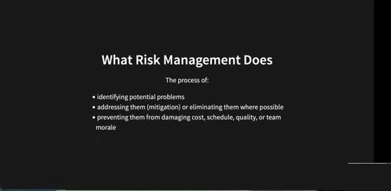

> The process of:
- identifying potential problems
- addressing them (mitigation) or eliminating them where possible
- preventing them from damaging cost, schedule, quality, or team morale

🇨🇳 风险管理是这样一个过程：识别潜在问题 → 处理（缓解）它们，或在可能时消除它们 → 防止它们损害成本、进度、质量或团队士气。

💬 讲师补充："addressing"（缓解）= 降低潜在伤害；"eliminating"（消除）= 彻底去掉负面影响。

### 2.5 Where Threats Come From

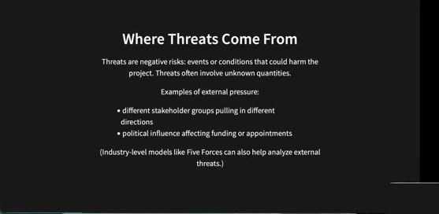

> Threats are negative risks: events or conditions that could harm the project. Threats often involve unknown quantities.
>
> Examples of external pressure:
- different stakeholder groups pulling in different directions
- political influence affecting funding or appointments
>
> (Industry-level models like Five Forces can also help analyze external threats.)

🇨🇳 威胁 = 负面风险：可能损害项目的事件或条件，常含未知量。外部压力例子：不同利益相关者群体拉向不同方向；政治因素影响资金或人事任命。（行业级模型如波特五力也可用于分析外部威胁。）

💬 讲师补充：付钱的客户与实际用户想要的功能可能不同甚至冲突，这在现实中很常见。政治影响在科研项目中更常见。

### 2.6 Risks Come From People Too

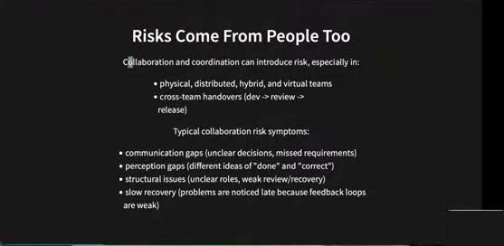

> Collaboration and coordination can introduce risk, especially in:
- physical, distributed, hybrid, and virtual teams
- cross-team handovers (dev -> review -> release)
>
> Typical collaboration risk symptoms:
- communication gaps (unclear decisions, missed requirements)
- perception gaps (different ideas of "done" and "correct")
- structural issues (unclear roles, weak review/recovery)
- slow recovery (problems are noticed late because feedback loops are weak)

🇨🇳 协作与协调也会引入风险，尤其在线下/分布式/混合/虚拟团队，以及跨团队交接（开发 → 评审 → 发布）中。典型症状：沟通缺口（决策不清、需求遗漏）、认知缺口（对"完成"和"正确"理解不同）、结构问题（角色不清、评审/恢复弱）、恢复慢（反馈回路弱导致问题发现太晚）。

💬 **讲师补充**
- 现在很多人在线协作，会给清晰沟通带来障碍。
- 开发、评审、发布由不同团队负责却没有恰当的 DevOps 流程和沟通，会引入风险。
- 认知缺口既存在于团队内部（成员对"什么算做完"看法不同），也存在于团队与利益相关者之间。
- 这就是本课程反复强调 **快速反馈与反馈回路** 的原因。

### 2.7 Task Tracker Examples (Collaboration)

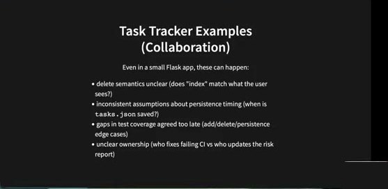

> Even in a small Flask app, these can happen:
- delete semantics unclear (does "index" match what the user sees?)
- inconsistent assumptions about persistence timing (when is `tasks.json` saved?)
- gaps in test coverage agreed too late (add/delete/persistence edge cases)
- unclear ownership (who fixes failing CI vs who updates the risk report)

🇨🇳 即使是小型 Flask 应用也会发生：删除语义不清（"index"是否与用户看到的一致？）、对持久化时机的假设不一致（何时保存 `tasks.json`？）、测试覆盖缺口发现太晚（增/删/持久化的边界情况）、归属不清（谁修 CI，谁更新风险报告）。

💬 讲师补充：有人早就提出了边界情况，有人却没及时意识到；归属问题经过三个 sprint 希望已经解决。

### 2.8 Security + Ethical Risks

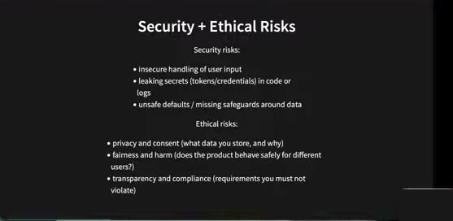

> Security risks:
- insecure handling of user input
- leaking secrets (tokens/credentials) in code or logs
- unsafe defaults / missing safeguards around data
>
> Ethical risks:
- privacy and consent (what data you store, and why)
- fairness and harm (does the product behave safely for different users?)
- transparency and compliance (requirements you must not violate)

🇨🇳 安全风险：不安全地处理用户输入；在代码或日志中泄露密钥/凭证；不安全的默认值/缺少数据防护。伦理风险：隐私与同意（存什么数据、为什么）；公平与伤害（产品对不同用户是否安全）；透明与合规（不能违反的要求）。

💬 讲师补充：现在很多应用调用 AI API（如 OpenAI），透明性问题很突出——用户 **如何、为何** 看到你给他们的信息？

### 2.9 Risk Retirement (Make Risk Go Away)

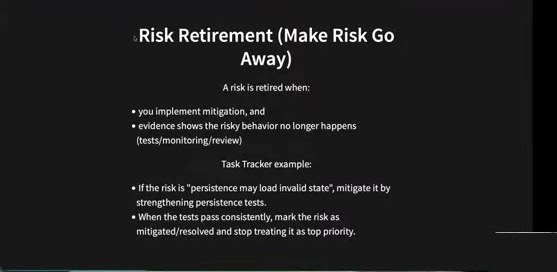

> A risk is retired when:
- you implement mitigation, and
- evidence shows the risky behavior no longer happens (tests/monitoring/review)
>
> Task Tracker example:
- If the risk is "persistence may load invalid state", mitigate it by strengthening persistence tests.
- When the tests pass consistently, mark the risk as mitigated/resolved and stop treating it as top priority.

🇨🇳 风险"退役"= 风险消失：① 你实现了缓解措施，并且 ② 有证据表明风险行为不再发生（测试/监控/评审）。Task Tracker 例子：风险"持久化可能加载无效状态"，通过加强持久化测试缓解；测试持续通过后，把风险标为 mitigated/resolved，不再作为最高优先级。

💬 讲师补充：缓解措施例如考虑边界情况、显示错误信息等；"加更多 **有意义的** 测试"。

---

## 第 3 部分 · 为什么要管理风险（00:13–00:17）

### 3.1 Why Manage Risk?

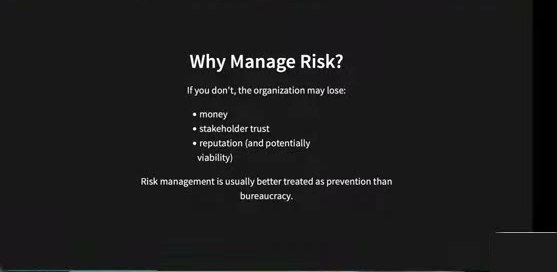

> If you don't, the organization may lose:
- money
- stakeholder trust
- reputation (and potentially viability)
>
> Risk management is usually better treated as prevention than bureaucracy.

🇨🇳 不管理风险，组织可能失去金钱、利益相关者信任、声誉（甚至生存能力）。风险管理更应被当作"预防"而不是"官僚流程"。

💬 讲师补充：如果不合乎伦理、不安全地处理用户数据，可能丢失用户数据，进而失去信任、金钱、声誉。

### 3.2 "Prevention" Makes Projects Less Complex

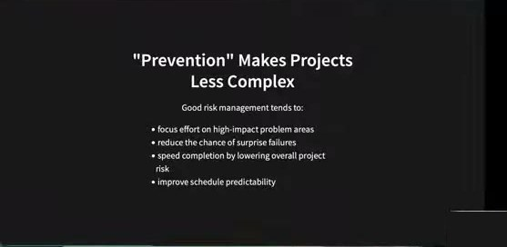

> Good risk management tends to:
- focus effort on high-impact problem areas
- reduce the chance of surprise failures
- speed completion by lowering overall project risk
- improve schedule predictability

🇨🇳 好的风险管理倾向于：把精力集中在高影响的问题区域；降低 **意外** 失败的几率；通过降低整体项目风险加快完成；提高进度可预测性。

💬 **讲师补充**
- 高影响区域的例子：伦理、隐私问题。
- 即使风险管理做得好，仍可能失败（如项目延期）；我们要避免的是 **surprise**（意外的）失败——知道有不确定性、知道可能有负面影响，就要么设法避免（哪怕多花时间实现边界情况），要么知道一旦发生该如何应对。

### 3.3 Cost Vs Benefit (The Trade-Off)

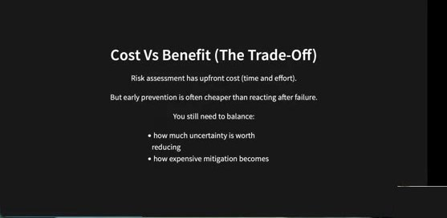

> Risk assessment has upfront cost (time and effort).
>
> But early prevention is often cheaper than reacting after failure.
>
> You still need to balance:
- how much uncertainty is worth reducing
- how expensive mitigation becomes

🇨🇳 风险评估有前期成本（时间与精力），但早期预防通常比失败后补救便宜。仍需权衡：值得减少多少不确定性；缓解措施会变得多昂贵。

💬 讲师补充：把大量时间花在风险评估而不是实现 story 上，也不对。不要花过多时间做风险管理，但对项目伤害大的风险 **必须** 管好。

---

## 第 4 部分 · 角色与职责（00:17–00:20）

### 4.1 Section: Roles & Responsibilities

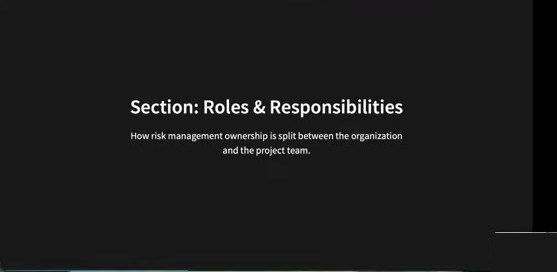

> How risk management ownership is split between the organization and the project team.

🇨🇳 风险管理的归属如何在组织与项目团队之间划分。

### 4.2 Assessment Level Matters

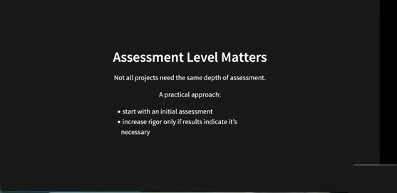

> Not all projects need the same depth of assessment.
>
> A practical approach:
- start with an initial assessment
- increase rigor only if results indicate it's necessary

🇨🇳 不是所有项目都需要同样深度的评估。实用做法：先做初步评估；只有结果表明有必要时才提高严格程度。

💬 讲师补充：临床用途的应用需要更深的风险评估；只给一小群人用的小项目评估可以浅一些。不需要给所有风险都写详细计划，聚焦更重要的那些。

### 4.3 Organization Vs Project Manager

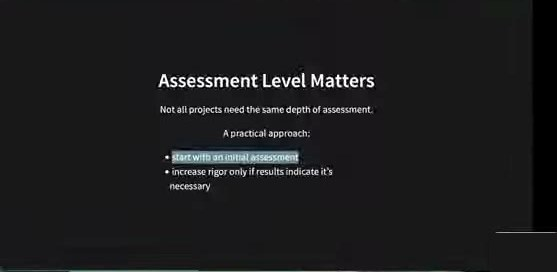

> Risk ownership is shared, but responsibilities differ:

🇨🇳 风险归属是共享的，但职责不同。

### 4.4 Project Manager: Day-To-Day Risk ⚡

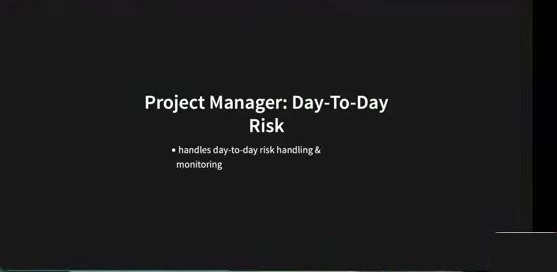

- handles day-to-day risk handling & monitoring

🇨🇳 项目经理负责日常的风险处理与监控。

### 4.5 Organization Responsibilities (Top-Down) ⚡

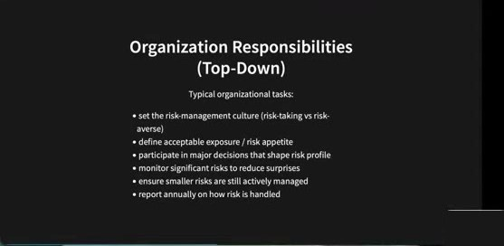

> Typical organizational tasks:
- set the risk-management culture (risk-taking vs risk-averse)
- define acceptable exposure / risk appetite
- participate in major decisions that shape risk profile
- monitor significant risks to reduce surprises
- ensure smaller risks are still actively managed
- report annually on how risk is handled

🇨🇳 组织层面的典型任务：设定风险管理文化（冒险 vs 保守）；定义可接受的暴露/风险偏好；参与塑造风险概况的重大决策；监控重大风险以减少意外；确保小风险仍被主动管理；每年汇报风险处理情况。

💬 讲师补充（针对 4.3–4.5）：组织侧重 **治理**，定下基调——"风险管理很重要，这是优先关注领域，这是我们的流程"；项目经理侧重日常——"本 sprint 要实现的 story 涉及哪些风险，如何处理和监控"。

### 4.6 Objectives Of Software Risk Management ⚡

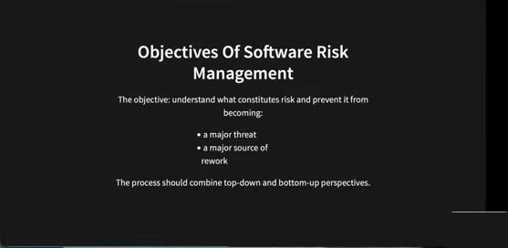

> The objective: understand what constitutes risk and prevent it from becoming:
- a major threat
- a major source of rework
>
> The process should combine top-down and bottom-up perspectives.

🇨🇳 目标：理解什么构成风险，防止它变成重大威胁或返工的主要来源。流程应结合自上而下与自下而上两个视角。

---

## 第 5 部分 · 策略阶段：实际怎么做（00:19–00:27）

### 5.1 Section: Strategy Stages

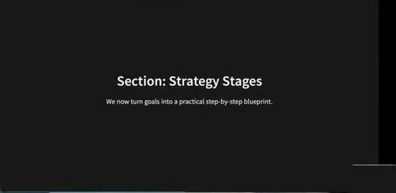

> We now turn goals into a practical step-by-step blueprint.

🇨🇳 现在把目标变成一步一步的实用蓝图。

### 5.2 接受后果 vs 付费避免

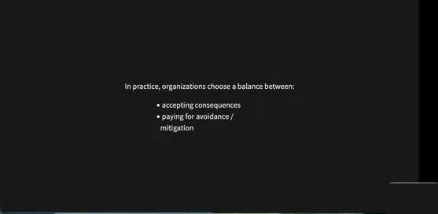

> In practice, organizations choose a balance between:
- accepting consequences
- paying for avoidance / mitigation

🇨🇳 实践中组织在"接受后果"与"为避免/缓解付出代价"之间取平衡。

💬 讲师补充：风险伤害不大时可以选择接受后果，之后再处理；或者提前规划，花时间和钱去识别与规划。

### 5.3 Two Viewpoints On Risk

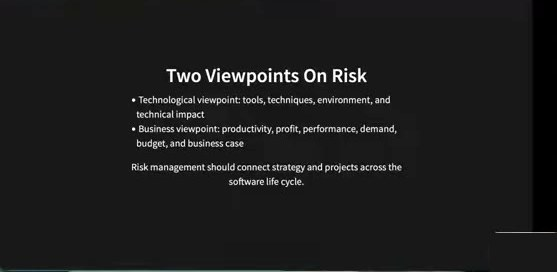

- Technological viewpoint: tools, techniques, environment, and technical impact
- Business viewpoint: productivity, profit, performance, demand, budget, and business case
>
> Risk management should connect strategy and projects across the software life cycle.

🇨🇳 技术视角：工具、技术、环境、技术影响。业务视角：生产力、利润、性能、需求、预算、商业案例。风险管理应贯穿软件生命周期，把战略与项目连接起来。两者都重要。

### 5.4 Risk management (practically) means

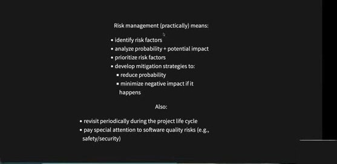

> Risk management (practically) means:
- identify risk factors
- analyze probability + potential impact
- prioritize risk factors
- develop mitigation strategies to:
  - reduce probability
  - minimize negative impact if it happens
>
> Also:
- revisit periodically during the project life cycle
- pay special attention to software quality risks (e.g., safety/security)

🇨🇳 风险管理实际上意味着：① 识别风险因素 → ② 分析概率 + 潜在影响 → ③ 排优先级 → ④ 制定缓解策略（降低概率 / 减小发生后的负面影响 / 两者兼有）。另外：在项目生命周期中定期重访；特别关注软件质量风险（安全性/安全）。

💬 **讲师补充**
- 识别：前面已举例——人的因素、协作沟通因素、隐私伦理因素、技术因素。
- 分析：以持久化为例，风险是"团队对何时保存数据没有一致的沟通/约定"——发生概率是高/中/低？如果对如何保存持久化数据理解不一致，会发生什么、影响是什么？
- 排序：你可能识别出很多风险，而规划每一个都要花时间、钱、资源，所以用概率×影响找出最重要的。
- 定期重访：监控这些风险是否已退役、是否需要提升优先级、是否要做其它调整。

### 5.5 Example: Concurrent Writes (Task Tracker)

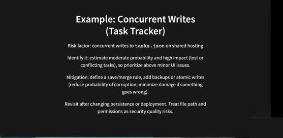

> Risk factor: concurrent writes to `tasks.json` on shared hosting
>
> Identify it: estimate moderate probability and high impact (lost or conflicting tasks), so prioritize above minor UI issues.
>
> Mitigation: define a save/merge rule, add backups or atomic writes (reduce probability of corruption; minimize damage if something goes wrong).
>
> Revisit after changing persistence or deployment. Treat file path and permissions as security quality risks.

🇨🇳 风险因素：共享主机上对 `tasks.json` 的并发写入。识别：估计概率中等、影响高（任务丢失或冲突），因此优先级高于次要的 UI 问题。缓解：定义保存/合并规则，增加备份或原子写入（降低损坏概率；出错时减小损失）。在修改持久化或部署方式后重访。把文件路径和权限当作安全质量风险看待。

💬 **讲师补充**
- 场景：多个用户同时向 Task Tracker 提交任务；或一个用户删除某任务的同时另一个用户添加同一任务——数据文件会怎样？
- "中等概率""高影响"都要 **给出理由**（justify）：为什么是中等？影响具体是什么？
- 幻灯片上的缓解只是例子，你的报告里需要 **更详细** 的缓解计划。
- 有了风险管理计划后，改动持久化或部署之后仍要重新检查，确认计划有效。

---

## 第 6 部分 · Evidence Check：风险管理真的有用吗（00:27–00:29）

### 6.1 Section: Evidence Check

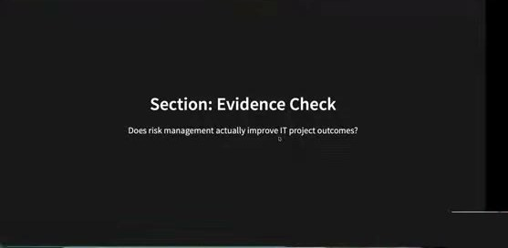

> Does risk management actually improve IT project outcomes?

🇨🇳 风险管理真的能改善 IT 项目结果吗？（讲师留给你的开放问题）

### 6.2 Does Risk Management Improve Success?

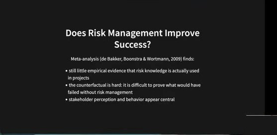

> Meta-analysis (de Bakker, Boonstra & Wortmann, 2009) finds:
- still little empirical evidence that risk knowledge is actually used in projects
- the counterfactual is hard: it is difficult to prove what would have failed without risk management
- stakeholder perception and behavior appear central

🇨🇳 元分析（de Bakker, Boonstra & Wortmann, 2009）发现：几乎没有实证证据表明风险知识真的在项目中被使用；反事实难以证明——很难证明没有风险管理会失败什么；利益相关者的认知和行为似乎是核心。

### 6.3 "Known Risks" Are Not Enough ⚡

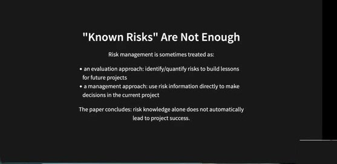

> Risk management is sometimes treated as:
- an evaluation approach: identify/quantify risks to build lessons for future projects
- a management approach: use risk information directly to make decisions in the current project
>
> The paper concludes: risk knowledge alone does not automatically lead to project success.

🇨🇳 风险管理有时被当作"评估方法"（识别/量化风险，为未来项目积累经验）或"管理方法"（直接用风险信息在当前项目中做决策）。论文结论：仅有风险知识并不会自动带来项目成功。

### 6.4 When Does Risk Management Work?

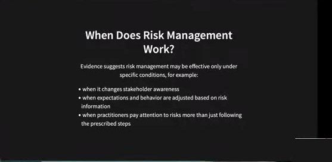

> Evidence suggests risk management may be effective only under specific conditions, for example:
- when it changes stakeholder awareness
- when expectations and behavior are adjusted based on risk information
- when practitioners pay attention to risks more than just following the prescribed steps

🇨🇳 证据表明风险管理只在特定条件下有效：当它改变了利益相关者的意识；当期望和行为根据风险信息做了调整；当从业者真正关注风险而不只是走流程。

💬 讲师补充：很常见的是"没人在乎风险管理"。风险管理计划不能只停在纸面上，要真的改变团队行为——更像一种 **心态/文化** 的事。

---

## 第 7 部分 · Sprint 3 实践：风险报告（00:29–00:35）

### 7.1 Map: Risk Management Stages -> Risk Report Fields

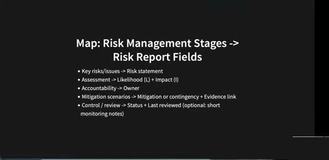

- Key risks/issues -> Risk statement
- Assessment -> Likelihood (L) + Impact (I)
- Accountability -> Owner
- Mitigation scenarios -> Mitigation or contingency + Evidence link
- Control / review -> Status + Last reviewed (optional: short monitoring notes)

🇨🇳 风险管理阶段与报告字段的对应：关键风险 → 风险陈述；评估 → 可能性 + 影响；问责 → 负责人；缓解方案 → 缓解/应急 + 证据链接；控制/评审 → 状态 + 最近评审时间（可选：简短监控记录）。

### 7.2 Sprint 3: Make Risk Work For Your Task Tracker

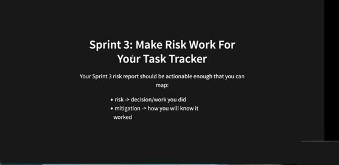

> Your Sprint 3 risk report should be actionable enough that you can map:
- risk -> decision/work you did
- mitigation -> how you will know it worked

🇨🇳 Sprint 3 风险报告要足够可操作，能对应出：风险 → 你做的决策/工作；缓解 → 你如何知道它奏效了。

### 7.3 Risk Report Fields (What To Write)

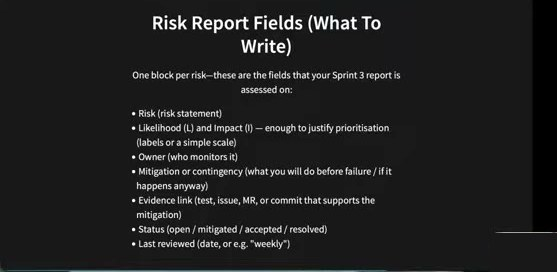

> One block per risk—these are the fields that your Sprint 3 report is assessed on:
- Risk (risk statement)
- Likelihood (L) and Impact (I) — enough to justify prioritisation (labels or a simple scale)
- Owner (who monitors it)
- Mitigation or contingency (what you will do before failure / if it happens anyway)
- Evidence link (test, issue, MR, or commit that supports the mitigation)
- Status (open / mitigated / accepted / resolved)
- Last reviewed (date, or e.g. "weekly")

🇨🇳 每个风险一个块——Sprint 3 报告按这些字段评分：风险陈述；可能性与影响（足以说明优先级，用标签或简单量表）；负责人（谁监控）；缓解或应急（失败前做什么 / 万一发生怎么办）；证据链接（支撑缓解的测试、issue、MR 或 commit）；状态（open / mitigated / accepted / resolved）；最近评审时间（日期或如"每周"）。

💬 **讲师补充**
- Owner：可以指定一位或几位组员作为该风险的负责人。
- Evidence 例子：为并发写入持久化文件添加了测试？有没有为这个风险建 issue？测试是否作为缓解计划的一部分？链接到支持缓解的 MR 或 commit。
- 可能性与影响都需要 **justify**（给理由）。

### 7.4 Tips For The Risk Register ⚡

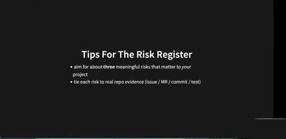

- aim for about **three** meaningful risks that matter to *your* project
- tie each risk to real repo evidence (issue / MR / commit / test)

🇨🇳 大约写 **三个** 对你们项目真正重要的风险；每个风险都绑定真实的仓库证据（issue / MR / commit / test）。

### 7.5 Risk Statement Formula (Easy To Apply)

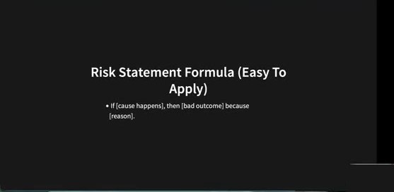

- If [cause happens], then [bad outcome] because [reason].

🇨🇳 风险陈述公式：**如果** [原因发生]，**那么** [坏结果]，**因为** [理由]。

### 7.6 Where To Put Your Risk Report (Make It Discoverable)

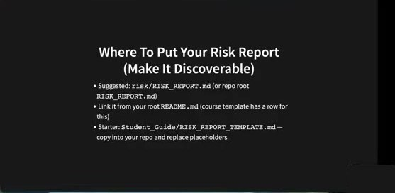

- Suggested: `risk/RISK_REPORT.md` (or repo root `RISK_REPORT.md`)
- Link it from your root `README.md` (course template has a row for this)
- Starter: `Student_Guide/RISK_REPORT_TEMPLATE.md` — copy into your repo and replace placeholders

🇨🇳 建议放在 `risk/RISK_REPORT.md`（或仓库根目录 `RISK_REPORT.md`）；从根目录 `README.md` 链接过去（课程 README 模板里有对应一行）；起步模板：`Student_Guide/RISK_REPORT_TEMPLATE.md`，复制进仓库并替换占位符。

💬 讲师补充：模板是 **可选** 的，你可以用自己的结构，但它是个不错的起点。

### 7.7 Moodle · Project Sprint 3 Guidelines（讲师现场切到 Moodle 页面）

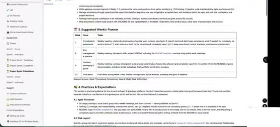

**3. Suggested Weekly Planner**（页面中的表格，转录）

| Week | Focus | Tasks |
|---|---|---|
| 7 | Complexity & persistence | Weekly meeting; rotate roles (optional) and update team contract; plan Sprint 3; identify technical debt; begin persistence work if needed; for complexity, tie work to lecture 7.2; start notes or a draft for the refactoring & complexity report (§4.4); keep issue board current; standups; continue story/polish work. |
| 8 | Risk management in practice | Weekly meeting; risk report; add a project README.md using the README template; continue story/polish work; standups. |
| 9 | Portfolio packaging & polish | Weekly meeting; continue story/polish work; ensure tests/CI pass; finalise the refactoring & complexity report (§4.4) and link it from the README; improve documentation and demo script; individuals draft portfolio; sprint retro; standups. |
| 10 | Final demo | Final demo during Week 10 lab; finalise risk report and sprint artifacts; submit by the Sprint 3 deadline. |

> Relevant lectures: Week 7 (Complexity, Persistence), Week 8 (Risk), Week 9 (Portfolio)

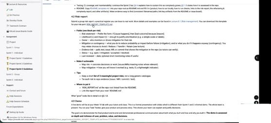

**4.2 Risk report**（页面文字，转录）
> Submit a group risk report: a practical register you can trace to real work. More details and examples can be found in Lecture 8.1 (Risk management). You can download this template for your risk report: RISK_REPORT_TEMPLATE.md
>
> - **Fields (one block per risk)**
>   - Risk statement — Prefer the form: If [cause happens], then [bad outcome] because [reason].
>   - Likelihood (L) and Impact (I) — enough to justify prioritisation (e.g. a simple scale or labels).
>   - Owner — who monitors or drives mitigation for that risk.
>   - Mitigation or contingency — what you do to reduce probability or impact before failure (mitigation), and/or what you do if it happens anyway (contingency). You may relate choices to Avoid / Reduce / Transfer / Retain (see lecture).
>   - Evidence link — path, test, issue, MR, or commit that shows the mitigation in the repo (so tutors can verify).
>   - Status — e.g. open / mitigated / accepted / resolved.
>   - Last reviewed — date; optional short monitoring notes if useful.
> - **Make it actionable**
>   - Map risk → concrete decisions or work (issues/MRs/meeting notes where relevant).
>   - Map mitigation → how you will know it worked (e.g. tests, CI, a lightweight indicator).
> - **Tips**
>   - Keep a short **list of 3 meaningful project risks**, not a long generic catalogue.
>   - Tie each risk to repo evidence (issue / MR / commit / test).
> - **Where to put it**
>   - `RISK_REPORT.md` at the repo root linked from the README.
>   - Link the report from your root `README.md`.
>
> What "good" looks like in detail is in §5.1.8.
>
> **4.3 Demo** — A live demo will be at your Week 10 lab with your tutors and class. This is a formal presentation with slides which is different from Sprint 1 and 2 informal demo. The whole team is present. You run your Task Tracker, give your product and process story. This shows your team can explain and justify decisions. The goal is to demonstrate the final product end-to-end and demonstrate professional communication about both what you built and how and why you built it. **The demo is assessed on depth and richness of user, problem, value, and decisions.**

🇨🇳 提交小组风险报告：一个能追溯到真实工作的实用登记表。字段同 7.3；要可操作（风险 → 具体决策/工作；缓解 → 如何知道有效）；建议 3 个有意义的项目风险而非冗长的通用清单；放在仓库根目录 `RISK_REPORT.md` 并从 README 链接。4.3 Demo：Week 10 lab 上的正式演示（带幻灯片，区别于 Sprint 1/2 的非正式演示），全员到场，按用户、问题、价值、决策的深度与丰富度评分。

### 7.8 Risk Statement Example (Persistence)

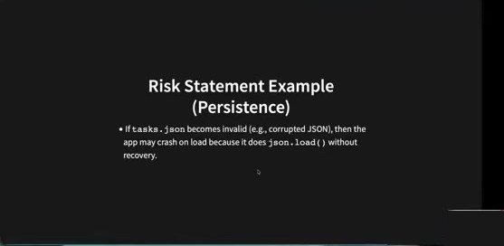

- If `tasks.json` becomes invalid (e.g., corrupted JSON), then the app may crash on load because it does `json.load()` without recovery.

🇨🇳 如果 `tasks.json` 变为无效（如 JSON 损坏），那么应用可能在加载时崩溃，因为它直接 `json.load()` 而没有恢复机制。

### 7.9 Example: Persistence Failure (Full Row)

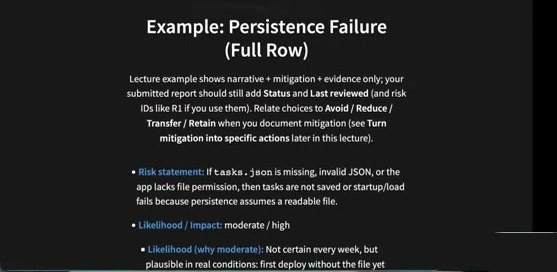
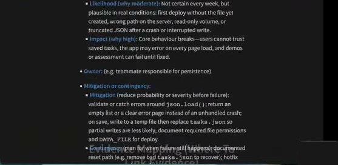

> Lecture example shows narrative + mitigation + evidence only; your submitted report should still add **Status** and **Last reviewed** (and risk IDs like R1 if you use them). Relate choices to **Avoid / Reduce / Transfer / Retain** when you document mitigation (see **Turn mitigation into specific actions** later in this lecture).
>
> - **Risk statement:** If `tasks.json` is missing, invalid JSON, or the app lacks file permission, then tasks are not saved or startup/load fails because persistence assumes a readable file.
> - **Likelihood / Impact:** moderate / high
>   - **Likelihood (why moderate):** Not certain every week, but plausible in real conditions: first deploy without the file yet created, wrong path on the server, read-only volume, or truncated JSON after a crash or interrupted write.
>   - **Impact (why high):** Core behaviour breaks—users cannot trust saved tasks, the app may error on every page load, and demos or assessment can fail until fixed.
> - **Owner:** (e.g. teammate responsible for persistence)
> - **Mitigation or contingency:**
>   - **Mitigation** (reduce probability or severity before failure): validate or catch errors around `json.load()`; return an empty list or a clear error page instead of an unhandled crash; on save, write to a temp file then replace `tasks.json` so partial writes are less likely; document required file permissions and `DATA_FILE` for deploy.
>   - **Contingency** (plan for when failure still happens): documented reset path (e.g. remove bad `tasks.json` to recover); hotfix … *(幻灯片下半部分在视频中被截断，讲师说"这页没显示完整，我回头看一下")*

🇨🇳 完整示例行：
- **风险陈述**：如果 `tasks.json` 缺失、JSON 无效或应用缺少文件权限，那么任务无法保存或启动/加载失败，因为持久化假设文件可读。
- **可能性/影响**：中 / 高。可能性中等的理由：不是每周必然发生，但在真实条件下很可能——首次部署时文件尚未创建、服务器路径错误、只读卷、崩溃或写入中断后 JSON 被截断。影响高的理由：核心行为崩溃——用户无法信任已保存的任务，每次页面加载都可能报错，演示或评分可能失败。
- **负责人**：如负责持久化的组员。
- **缓解**：在 `json.load()` 周围校验/捕获错误；返回空列表或清晰的错误页而非未处理的崩溃；保存时先写临时文件再替换 `tasks.json` 以减少部分写入；为部署记录所需文件权限与 `DATA_FILE`。**应急**：记录好的重置路径（如删除坏的 `tasks.json` 恢复）；热修复……

### 7.10 Evidence Mapping (Where To Link Evidence)

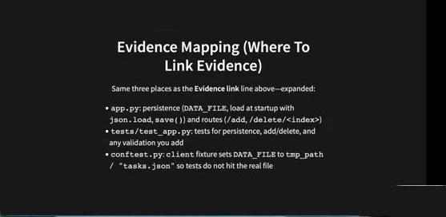

> Same three places as the **Evidence link** line above—expanded:
- `app.py`: persistence (`DATA_FILE`, load at startup with `json.load`, `save()`) and routes (`/add`, `/delete/<index>`)
- `tests/test_app.py`: tests for persistence, add/delete, and any validation you add
- `conftest.py`: `client` fixture sets `DATA_FILE` to `tmp_path / "tasks.json"` so tests do not hit the real file

🇨🇳 证据可链接的三个位置：`app.py`（持久化：`DATA_FILE`、启动时 `json.load`、`save()`；路由 `/add`、`/delete/<index>`）；`tests/test_app.py`（持久化、增删及你添加的校验的测试）；`conftest.py`（`client` fixture 把 `DATA_FILE` 指向 `tmp_path / "tasks.json"`，测试不碰真实文件）。

### 7.11 Evidence Mapping (How To Use It) ⚡

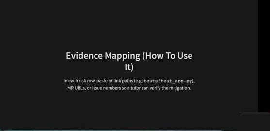

> In each risk row, paste or link paths (e.g. `tests/test_app.py`), MR URLs, or issue numbers so a tutor can verify the mitigation.

🇨🇳 在每个风险行里粘贴或链接路径（如 `tests/test_app.py`）、MR 链接或 issue 编号，让导师能核实缓解措施。

### 7.12 Status And Last Reviewed (Required On Submission)

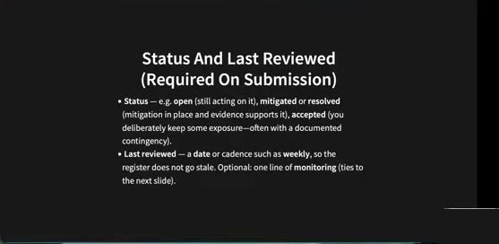

- **Status** — e.g. **open** (still acting on it), **mitigated** or **resolved** (mitigation in place and evidence supports it), **accepted** (you deliberately keep some exposure—often with a documented contingency).
- **Last reviewed** — a **date** or cadence such as **weekly**, so the register does not go stale. Optional: one line of **monitoring** (ties to the next slide).

🇨🇳 状态：open（仍在处理）、mitigated / resolved（缓解到位且有证据）、accepted（有意保留部分暴露——通常附带记录的应急方案）。最近评审：日期或"每周"这样的节奏，防止登记表过期；可选一行监控说明。

### 7.13 Turn Mitigation Into Specific Actions ⚡

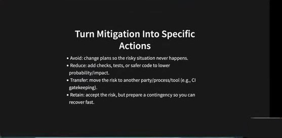

- Avoid: change plans so the risky situation never happens.
- Reduce: add checks, tests, or safer code to lower probability/impact.
- Transfer: move the risk to another party/process/tool (e.g., CI gatekeeping).
- Retain: accept the risk, but prepare a contingency so you can recover fast.

🇨🇳 四种应对：**回避**（改计划让风险场景根本不发生）、**降低**（加检查、测试或更安全的代码以降低概率/影响）、**转移**（把风险交给另一方/流程/工具，如 CI 把关）、**保留**（接受风险，但准备应急方案以便快速恢复）。

### 7.14 Monitoring: How You Will Know You Are Winning ⚡

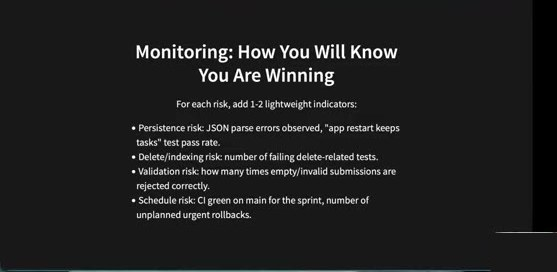

> For each risk, add 1-2 lightweight indicators:
- Persistence risk: JSON parse errors observed, "app restart keeps tasks" test pass rate.
- Delete/indexing risk: number of failing delete-related tests.
- Validation risk: how many times empty/invalid submissions are rejected correctly.
- Schedule risk: CI green on main for the sprint, number of unplanned urgent rollbacks.

🇨🇳 每个风险加 1–2 个轻量指标：持久化风险——观察到的 JSON 解析错误数、"重启后任务仍在"测试通过率；删除/索引风险——删除相关测试失败数；校验风险——空/无效提交被正确拒绝的次数；进度风险——本 sprint main 分支 CI 保持绿色、计划外紧急回滚次数。

### 7.15 Exercise: One Risk Block In Your Draft Report

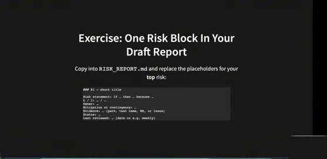

> Copy into `RISK_REPORT.md` and replace the placeholders for your **top** risk:

```markdown
### R1 — short title

Risk statement: If … then … because …
L / I: … / …
Owner: …
Mitigation or contingency: …
Evidence: … (path, test name, MR, or issue)
Status: …
Last reviewed: … (date or e.g. weekly)
```

🇨🇳 练习：把这个块复制进 `RISK_REPORT.md`，为你们最重要的风险填上占位符。

### 7.16 References

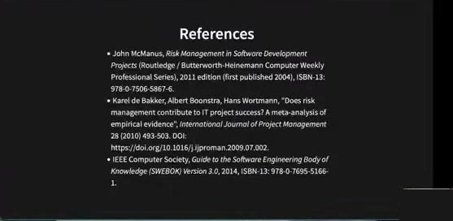

- John McManus, *Risk Management in Software Development Projects* (Routledge / Butterworth-Heinemann Computer Weekly Professional Series), 2011 edition (first published 2004), ISBN-13: 978-0-7506-5867-6.
- Karel de Bakker, Albert Boonstra, Hans Wortmann, "Does risk management contribute to IT project success? A meta-analysis of empirical evidence", *International Journal of Project Management* 28 (2010) 493-503. DOI: https://doi.org/10.1016/j.ijproman.2009.07.002.
- IEEE Computer Society, *Guide to the Software Engineering Body of Knowledge (SWEBOK) Version 3.0*, 2014, ISBN-13: 978-0-7695-5166-1.

💬 讲师补充：风险与风险管理的定义来自 McManus / SWEBOK；"风险管理是否有助于 IT 项目成功"来自 de Bakker 等的元分析。

### 7.17 Feedback


> 👂 Feedback — QR code / Or go to the form here.

🇨🇳 课程反馈二维码/表单链接。

💬 结语：这是一堂比较短的课，概念不难。请把本讲所学应用到你们的项目中，用模板和结构写出自己的风险管理计划。祝好运。

---

## 📋 Sprint 3 风险报告待办清单（来自本讲 + Moodle §4.2）

- [ ] 从 `Student_Guide/RISK_REPORT_TEMPLATE.md` 复制模板到仓库根目录 `RISK_REPORT.md`（或 `risk/RISK_REPORT.md`）
- [ ] 在根目录 `README.md` 中加入指向风险报告的链接（README 模板已有对应一行）
- [ ] 选出 **约 3 个** 对本项目真正重要的风险（不要写通用长清单）；候选：并发写入 `tasks.json`、`tasks.json` 缺失/损坏/无权限、删除索引语义、输入校验、安全/隐私（密钥、日志）、进度/CI
- [ ] 每个风险一个块，包含 7 个字段：Risk statement（If…then…because…）/ L & I（附理由）/ Owner / Mitigation or contingency（标明 Avoid / Reduce / Transfer / Retain）/ Evidence link / Status / Last reviewed
- [ ] 为每个风险找到真实仓库证据：`app.py`、`tests/test_app.py`、`conftest.py` 路径，或 issue / MR / commit 链接
- [ ] 为每个风险加 1–2 个轻量监控指标（如测试通过率、CI 绿色、回滚次数）
- [ ] 每周（或每次改动持久化/部署后）重访并更新 Status 与 Last reviewed；测试持续通过的风险标为 mitigated/resolved
- [ ] Week 8：写风险报告 + 用 README 模板添加项目 README；Week 9：完成 refactoring & complexity 报告并从 README 链接；Week 10：lab 正式 demo（带幻灯片，全员到场），按 Sprint 3 截止日期提交
