# COMP9820 26T1 · Week 9 课件整理 — Lecture 9.1 Reflection, Synthesis, And Next Steps（回顾、综合与下一步）

> 来源：https://www.youtube.com/watch?v=VOPS9nNgIAM（约 67 min 现场直播录像；屏幕菜单栏显示录制日期为 2026-04-13 周一，本学期最后一讲）
> 说明：本文件按投影顺序整理。每张幻灯片给出 **英文原文**（逐字）→ 🇨🇳 中文翻译 → 💬 讲师补充（口头讲解，来自字幕）。本讲以互动活动为主（结对讨论、举手、独立写作、面试演练），课件内容不多，大量价值在讲师与同学的口头交流中。
> 字幕为 YouTube 自动生成，已按语义修正明显错词：`spring/springs`→sprint(s)、`CDD`→TDD、`type plan`→test plan(?)、`formal masses`→formal methods、`Mac experience`→myExperience、`comp 9820`→COMP9820、`Rachel`→(c)(讲师读选项 c 时被误识别)等。
> 视频前 4 分 44 秒为 OBS 推流待机画面（"STANDBY"），无内容。

---

## 第 0 部分 · 开场（04:44–07:40）

### 0.1 COMP9820 - 26T1 — Reflection, Synthesis, And Next Steps（标题页）

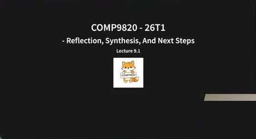

**COMP9820 - 26T1**
**- Reflection, Synthesis, And Next Steps**
Lecture 9.1

🇨🇳 **回顾、综合与下一步** —— Lecture 9.1。

💬 **讲师补充**
- 开场先测试线上音频，然后请大家坐得靠近一点：今天的课"非常互动"，几乎所有活动都是两人一组；线上同学请准备一张纸。
- "这是本学期最后一讲，秋天了外面已经黑了，大家可能有点累、有点困，没关系，我会尽量让课堂互动、有吸引力。"
- 今天主要是 **反思（reflection）**：回顾过去八九周学了什么，如何走向未来、下一步是什么。"今天没有太多新内容，但我觉得每次最后一讲都是最有意义的一讲——你可以把所有碎片拼成一幅连贯的图，找到它们之间的关系，总结出课程的主要收获。"

### 0.2 In This Lecture

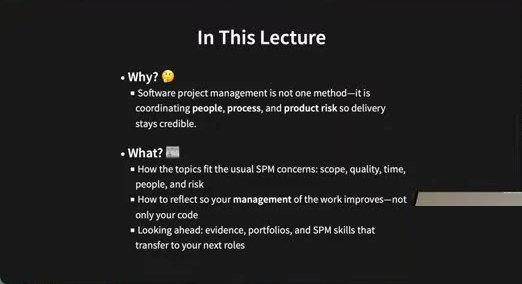

- **Why? 🤔**
  - Software project management is not one method—it is coordinating **people**, **process**, and **product risk** so delivery stays credible.
- **What? 📖**
  - How the topics fit the usual SPM concerns: scope, quality, time, people, and risk
  - How to reflect so your **management** of the work improves—not only your code
  - Looking ahead: evidence, portfolios, and SPM skills that transfer to your next roles

🇨🇳 为什么：软件项目管理不是某一种方法，而是协调 **人、过程、产品风险**，让交付保持可信。讲什么：各主题如何对应 SPM 的常见关注点（范围、质量、时间、人、风险）；如何反思，让你对工作的 **管理** 变好——不只是代码变好；展望：证据、作品集，以及能迁移到下一份工作的 SPM 技能。

💬 **讲师补充**
- 核心问题："我们讲了一学期软件项目管理，现在你对它的理解是什么？为什么它重要？"——这是今天的主线。

### 0.3 Looking Back—And Forward

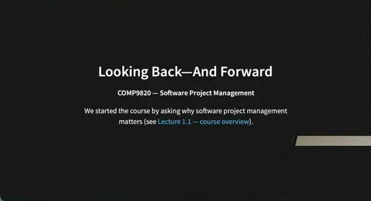

**Looking Back—And Forward**
COMP9820 — Software Project Management

We started the course by asking why software project management matters (see Lecture 1.1 — course overview).

🇨🇳 **回望与前瞻** —— 课程一开始（Lecture 1.1 课程概览）我们就问过"为什么软件项目管理重要"。

💬 **讲师补充（课堂问答，07:40–10:05）**
- 讲师问：经过几周的活动和项目，现在你觉得为什么它重要？
  - 同学 A："让工作有结构（how to be structured）。"讲师："尤其是和人一起工作、和大团队一起工作时。我们虽然只有 3–5 人一组，但也能看到它的重要性。"
- 讲师追问：软件项目管理和其他项目管理（如工程项目管理）有什么不同？和一般的软件开发有什么不同？
  - 同学回答后讲师总结：软件项目管理有 **专门的系统和工具**，例如 **Git**——它是为软件项目管理特化的，不是给一般工程项目管理用的；还有 **pipeline**（流水线）——为软件项目特化的自动化工具。"这就是不同之处。"

---

## 第 1 部分 · 热身与课程全景（10:05–30:30）

### 1.1 🤝 Warm-Up — Neighbour Chat (90 Seconds)

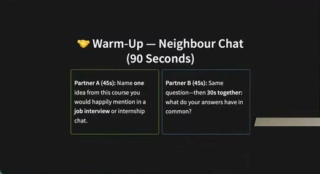

| Partner A (45s) | Partner B (45s) |
|---|---|
| Name **one** idea from this course you would happily mention in a **job interview** or internship chat. | Same question—then **30s together**: what do your answers have in common? |

🇨🇳 **热身——邻座聊天（90 秒）**：A 说出本课程中一个你愿意在 **求职面试** 或实习面谈中提到的想法；B 回答同一问题；然后一起花 30 秒找共同点。

💬 **讲师补充**
- 做这个活动的原因："我发现这种 **专门化课程** 对求职申请特别有用，比那些很泛的课程有用得多。我希望你能从课程里带走一些可以放进面试或作品集的东西。可能有些东西你学了但没意识到自己学了，这种对话可以互相启发。"
- 线上同学请在聊天框里发想法。（讲师用 Google 在线计时器计时，并到处安排落单同学配对。）
- **同学分享（13:44–17:24，讲师复述给线上同学）**：
  1. 用 **Git** 在软件项目中协作——merge request、pipeline。
  2. **Issue board**：让每个人在同一页面上，知道团队下一步要做什么。
  3. **文档（Documentation）**——"把一切都记录在案"、"每个人都能看到其他人在做什么"。讲师："这正是软件项目管理里说的 **可追溯性（traceability）**——对其他成员、对未来的自己、对未来的新成员、对利益相关者都非常重要。"
- 建议课后和自己的小组继续这个讨论。

### 1.2 The Course In One Arc

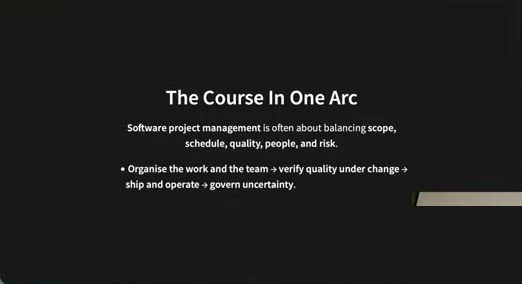

**The Course In One Arc**

**Software project management** is often about balancing **scope, schedule, quality, people, and risk**.

- **Organise the work and the team → verify quality under change → ship and operate → govern uncertainty**.

🇨🇳 **一条主线看整门课** —— 软件项目管理常常是在 **范围、进度、质量、人、风险** 之间做平衡。组织工作与团队 → 在变化中验证质量 → 交付与运营 → 治理不确定性。

💬 **讲师补充**
- **组织工作和团队**：管理人、teamwork；使用工具（Git、merge request、issue board）；还有 **心理安全（psychological safety）**——每个人在 sprint retro 里都应该能安心发言。
- **在变化中验证质量**：变化在软件项目中太常见、太正常了；如何在所有这些变化下依然确认"一切都验证过了、质量是好的"——我们用了测试、TDD、pipeline 这些质量控制手段。
- **交付与运营**：出于 IP 考虑本课不强制部署，"但如果你还没做 deployment lab，我强烈建议你试一下——看到自己的应用上线很有意思。"还有 **可维护性**：项目"做完但又没完全做完"之后如何维护、如何管理复杂度、好代码的原则。
- **治理不确定性**：风险以及如何管理风险。

### 1.3 In more detail

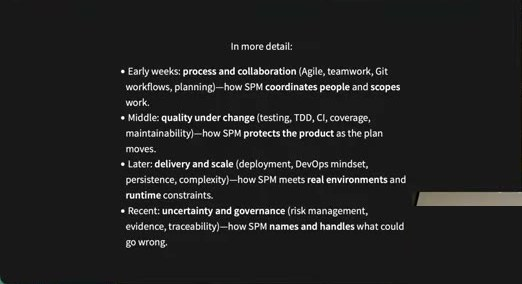

**In more detail:**
- Early weeks: **process and collaboration** (Agile, teamwork, Git workflows, planning)—how SPM **coordinates people** and **scopes** work.
- Middle: **quality under change** (testing, TDD, CI, coverage, maintainability)—how SPM **protects the product** as the plan moves.
- Later: **delivery and scale** (deployment, DevOps mindset, persistence, complexity)—how SPM meets **real environments** and **runtime** constraints.
- Recent: **uncertainty and governance** (risk management, evidence, traceability)—how SPM **names and handles** what could go wrong.

🇨🇳 **更详细地说**：
- 前几周：**过程与协作**（Agile、团队合作、Git 工作流、计划）——SPM 如何 **协调人** 并 **界定工作范围**。
- 中期：**变化中的质量**（测试、TDD、CI、覆盖率、可维护性）——计划变动时 SPM 如何 **保护产品**。
- 后期：**交付与规模**（部署、DevOps 思维、持久化、复杂度）——SPM 如何面对 **真实环境** 与 **运行时** 约束。
- 最近：**不确定性与治理**（风险管理、证据、可追溯性）——SPM 如何 **说出并处理** 可能出错的事。

💬 **讲师补充（逐条抽问复习，19:10–30:30，这一页停留了约 11 分钟）**
- "看看有没有哪一项你还不够自信，也许接下来几周或将来要多学一点。"
- **Agile 原则**：还记得吗？同学："合作"——讲师："一群人能做的远多于一个天才。"同学："适应性（adaptability）"——讲师："**适应性优先于计划**——不是说计划和组织不重要，而是适应性/灵活性更重要。其他原则忘了没关系，回看第一讲或第二讲。"
- **Teamwork** 的核心是 **心理安全**；**Git 工作流、merge conflict** 非常非常常见，怎么解决——实践性的内容。
- **Planning**：怎么知道要做什么？和利益相关者、潜在用户交谈，做 **需求工程**。讲师带大家回忆需求工程四步：① **收集数据**（和人交谈）；② **分析数据**、找优先级；③ **整合（consolidation）**——写文档；④ **验证（validation）**——回到利益相关者那里验证你对 stories 的假设。"没记住没关系，slides 还在，确保下次做项目时你知道要遵循什么流程。"
- **测试**：用 **Pytest** 写后端单元测试；前端测试超出本课范围，但鼓励将来看看，确保前端也是安全的。
- **TDD** = Test-driven development：先写测试再实现。"是把所有测试都先写完再写所有实现吗？"——**不是**。它是一种 **黑盒测试**：你不需要知道函数/单元内部怎么实现，可以根据 stories 或其他文档来写测试。
- **CI** = Continuous integration，用 **pipeline** 管理；在 GitLab 里通过 **YAML 文件** 添加 pipeline。不同 Git 平台方式不同，但背后逻辑相同。
- **Coverage**：测试覆盖代码的百分比，确保没有代码/分支/逻辑没被测试覆盖。为什么重要？——找 bug；更重要的是：我们一直在改项目，改的时候要确保 **没有弄坏任何东西**，靠的就是这些测试。如果某函数缺测试、又改了它，就不知道它还能不能工作。
- TDD 里写完测试后只写"刚好让测试通过"的代码，代码可能不完美，将来要 **重构**——遵循讲过的原则：
  - 代码尽量简单——"你写的每一行代码都要维护"；
  - **不要对未来做假设**——不要写"将来我会用到"的东西；
  - **Coupling 与 cohesion**——一个要高、一个要低，哪个高哪个低自己想（不确定就回看讲义）；
  - **清晰的代码 vs 聪明的代码**——选清晰的。
  - "其他原则课后自己看。"**可维护性** 讲的就是这些原则。
- **Deployment lab**：再次强烈建议做。
- **Persistence（持久化）**：重启服务器数据不丢。例：用户往购物车加东西，登出再登入，东西还在吗？Task Tracker 加了任务、重启服务器，任务还在吗？最简单的持久层是 **数据库**；最简单的"数据库"？——"内存不是数据库（笑）"——把数据 **存到文件**，最常用的是 **JSON 文件**。
- **Complexity（复杂度）** 为什么在意？① 要维护它——写完、测完不是生命周期的终点，软件不太复杂维护才容易；② 改动多时不容易犯错/引入新 bug；③ 将来要改时要 **估算** 时间——知道单元/组件/模块的复杂度有助于估算重构或改动所需的时间、精力、人手、资源。
- **不确定性与治理**（风险管理、证据、可追溯性）：这是一段 **录播**（Lecture 8.1，约 30–40 分钟）。没看的去看；不想看录播的话 slides 也很详细。

### 1.4 ⏱️ Table Talk — Map One Topic (2 Minutes)

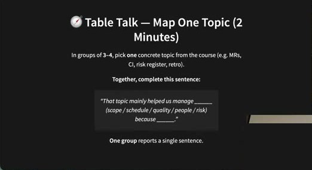

In groups of **3–4**, pick **one** concrete topic from the course (e.g. MRs, CI, risk register, retro).

**Together, complete this sentence:**
> "That topic mainly helped us manage ______ (scope / schedule / quality / people / risk) because ______."

**One group** reports a single sentence.

🇨🇳 **桌边讨论——把一个主题映射到 SPM 关注点（2 分钟）**：3–4 人一组，选课程中一个具体主题（如 MR、CI、风险登记表、retro），一起补全句子："这个主题主要帮我们管理了 ___（范围/进度/质量/人/风险），因为 ___。"一组汇报一句话。

💬 **讲师补充（30:30–35:30）**
- 实际改为 **两人一组** 即可；"这对求职面试也有用，试一下。"给了约 2 分钟并额外等线上同学。
- 分享：
  - 一组选 **Quality（质量）**（用麦克风讲了质量如何帮助他们）；另一组选了相关的 **test plan / 计划** 类主题——讲师："这两个主题是相关的，一个是质量，一个是计划，非常相关。"
  - 一组选 **Retro**：所有组员聚在一起，谈需要改什么、一切运作得如何。讲师："这是很好的反思方式，也和你的组员聊聊。"

---

## 第 2 部分 · 五个模块的关键收获（35:30–39:50）

### 2.1 🙋 Quick Pulse — Show Of Hands

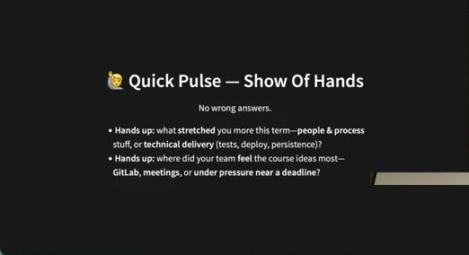

**No wrong answers.**
- **Hands up:** what **stretched** you more this term—**people & process** stuff, or **technical delivery** (tests, deploy, persistence)?
- **Hands up:** where did your team **feel** the course ideas most—**GitLab**, **meetings**, or **under pressure near a deadline**?

🇨🇳 **快速举手调查**（没有错误答案）：这学期什么更 **挑战** 你——**人与过程**，还是 **技术交付**（测试、部署、持久化）？你的团队在哪里最 **感受** 到课程内容——GitLab、会议，还是临近 deadline 的压力下？

💬 **讲师补充**
- 现场：认为"人与过程"更有挑战的举手较少……但技术交付举手后讲师总结"多数人选了 **人与管理**"。问为什么——同学："管理团队有挑战吗？**取决于人**（笑）。"讲师："没问题，马上会做更多相关活动。"
- （第二个问题未实际进行。）

### 2.2 Block 1 — Foundations: People, Process, And Version Control

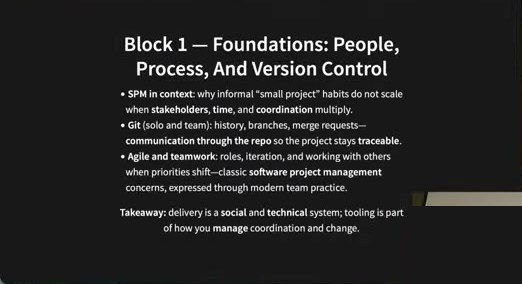

- **SPM in context**: why informal "small project" habits do not scale when **stakeholders**, **time**, and **coordination** multiply.
- **Git (solo and team)**: history, branches, merge requests—**communication through the repo** so the project stays **traceable**.
- **Agile and teamwork**: roles, iteration, and working with others when priorities shift—classic **software project management** concerns, expressed through modern team practice.

**Takeaway:** delivery is a **social** and **technical** system; tooling is part of how you **manage** coordination and change.

🇨🇳 **模块 1 —— 基础：人、过程与版本控制**
- **SPM 的背景**：当利益相关者、时间、协调成倍增加时，"小项目"式的非正式习惯为什么无法扩展。
- **Git（个人与团队）**：历史、分支、merge request——**通过仓库沟通**，让项目保持 **可追溯**。
- **Agile 与团队合作**：角色、迭代、优先级变化时与他人协作——经典 SPM 关注点，用现代团队实践表达。
- **收获**：交付是一个 **社会 + 技术** 系统；工具是你 **管理** 协调与变化的一部分。

💬 **讲师补充**
- "我不会逐条讲，都放在 slides 里了，讲几个关键收获。"
- 第一个收获：**软件系统既是社会的也是技术的**。"擅长写代码的人不一定擅长软件项目/软件项目管理。两种技能都要有，才能成为软件工程的高手。"
- **工具** 是管理协调与变化的一部分：课上介绍了几个工具，但还有更多，例如 **Jira**（更强大的项目管理工具）；现在也有一些 **AI 工具**——"我没在课上介绍具体哪个，因为不确定它们是否成熟到可以进课程，你们可以自己探索。有几个是专门面向软件项目管理（不是写代码）的。"

### 2.3 Block 2 — Planning And Improvement

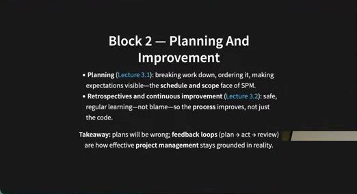

- **Planning** (Lecture 3.1): breaking work down, ordering it, making expectations visible—the **schedule and scope** face of SPM.
- **Retrospectives and continuous improvement** (Lecture 3.2): safe, regular learning—not blame—so the **process** improves, not just the code.

**Takeaway:** plans will be wrong; **feedback loops** (plan → act → review) are how effective **project management** stays grounded in reality.

🇨🇳 **模块 2 —— 计划与改进**
- **计划**（Lecture 3.1）：拆解工作、排序、让期望可见——SPM 的 **进度与范围** 面。
- **回顾与持续改进**（Lecture 3.2）：安全、定期的学习——不是指责——让 **过程** 变好，而不只是代码。
- **收获**：计划一定会出错；**反馈回路**（计划 → 行动 → 回顾）是有效项目管理扎根现实的方式。

💬 **讲师补充**
- "项目里经历过计划出错吗？"——同学："没有。"——"那你们很幸运（笑）。计划出错非常非常常见。没关系，我们是 Agile 的：每周开会、两周或三周一个 sprint，随时可以回头。反馈回路很重要：计划、行动、回顾——这就是 **retro 非常非常重要** 的原因。"

### 2.4 Block 3 — Confidence In The Product

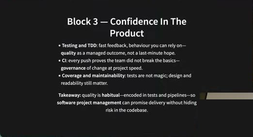

- **Testing and TDD**: fast feedback, behaviour you can rely on—**quality** as a managed outcome, not a last-minute hope.
- **CI**: every push proves the team did not break the basics—**governance** of change at project speed.
- **Coverage and maintainability**: tests are not magic; design and readability still matter.

**Takeaway:** quality is **habitual**—encoded in tests and pipelines—so **software project management** can promise delivery without hiding risk in the codebase.

🇨🇳 **模块 3 —— 对产品的信心**
- **测试与 TDD**：快速反馈、可依赖的行为——**质量** 是被管理出来的结果，不是最后一刻的祈祷。
- **CI**：每次 push 都证明团队没弄坏基础——以项目速度对变化做 **治理**。
- **覆盖率与可维护性**：测试不是魔法；设计和可读性仍然重要。
- **收获**：质量是 **习惯**——编码进测试和 pipeline——这样 SPM 才能承诺交付而不把风险藏在代码库里。

💬 **讲师补充**
- "质量是习惯：先写测试、遵循 TDD、确保测试覆盖代码、用 pipeline 辅助流程。"

### 2.5 Block 4 — From Laptop To World

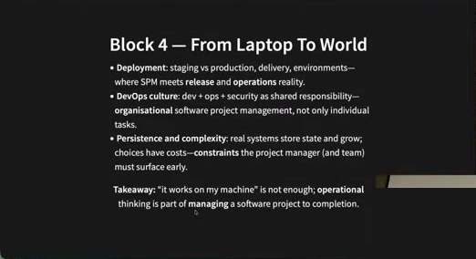

- **Deployment**: staging vs production, delivery, environments—where SPM meets **release** and **operations** reality.
- **DevOps culture**: dev + ops + security as shared responsibility—**organisational** software project management, not only individual tasks.
- **Persistence and complexity**: real systems store state and grow; choices have costs—**constraints** the project manager (and team) must surface early.

**Takeaway:** "it works on my machine" is not enough; **operational** thinking is part of **managing** a software project to completion.

🇨🇳 **模块 4 —— 从笔记本到世界**
- **部署**：staging vs production、交付、环境——SPM 与 **发布** 和 **运维** 现实相遇之处。
- **DevOps 文化**：开发 + 运维 + 安全是共同责任——**组织层面** 的 SPM，不只是个人任务。
- **持久化与复杂度**：真实系统存储状态并不断增长；选择有代价——项目经理（和团队）必须尽早暴露这些 **约束**。
- **收获**："在我机器上能跑"不够；**运维** 思维是把软件项目 **管理** 到完成的一部分。

💬 **讲师补充**
- "'在我机器上能跑'够吗？——不够。它得能让别人用；而且在别人用上之后你还要能继续管理这个项目：重构、加新功能、做改动。"

### 2.6 Block 5 — Risk And Professional Practice

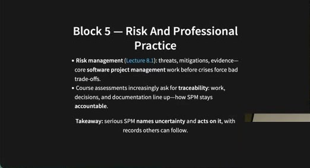

- **Risk management** (Lecture 8.1): threats, mitigations, evidence—core **software project management** work before crises force bad trade-offs.
- Course assessments increasingly ask for **traceability**: work, decisions, and documentation line up—how SPM stays **accountable**.

**Takeaway:** serious SPM **names uncertainty** and **acts on it**, with records others can follow.

🇨🇳 **模块 5 —— 风险与专业实践**
- **风险管理**（Lecture 8.1）：威胁、缓解、证据——在危机逼你做糟糕取舍之前的核心 SPM 工作。
- 课程评估越来越要求 **可追溯性**：工作、决策、文档对得上——SPM 如何保持 **可问责**。
- **收获**：认真的 SPM **说出不确定性** 并 **对它采取行动**，留下他人可以跟随的记录。

💬 **讲师补充**
- "不确定性很重要。计划会错、不确定性很常见——如何对这些不确定性采取行动、管理这些风险，同样重要。"

---

## 第 3 部分 · 三大主题与回顾活动（39:50–49:00）

### 3.1 Three SPM Themes — Match The Example

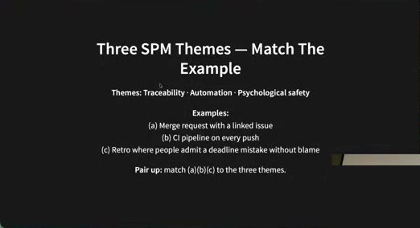

**Themes:** Traceability · Automation · Psychological safety

**Examples:**
(a) Merge request with a linked issue
(b) CI pipeline on every push
(c) Retro where people admit a deadline mistake without blame

**Pair up:** match (a)(b)(c) to the three themes.

🇨🇳 **三大 SPM 主题——配对示例**：主题：可追溯性 · 自动化 · 心理安全。示例：(a) 关联了 issue 的 merge request；(b) 每次 push 都跑 CI pipeline；(c) 有人在 retro 里承认错过 deadline 而不被指责。两人一组把 (a)(b)(c) 与三个主题配对。

💬 **讲师补充**
- 三个主题从前面的内容中浮现出来：
  - **Traceability**：文档、merge request、issue、commit message 都是可追溯性——对未来的自己、对其他成员都重要。
  - **Automation**：如果什么都手工做，代码库大了会非常耗时、低效，所以需要自动化的控制。
  - **Psychological safety**。
- 现场快速配对：(a) → Traceability；(b) → Automation；(c) → Psychological safety。"完美。"

### 3.2 Three SPM Themes That Cut Across Everything ⚡

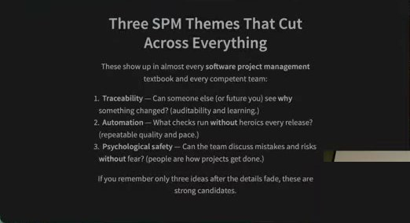

These show up in almost every **software project management** textbook and every competent team:

1. **Traceability** — Can someone else (or future you) see **why** something changed? (auditability and learning.)
2. **Automation** — What checks run **without** heroics every release? (repeatable quality and pace.)
3. **Psychological safety** — Can the team discuss mistakes and risks **without** fear? (people are how projects get done.)

If you remember only three ideas after the details fade, these are strong candidates.

🇨🇳 **贯穿一切的三大 SPM 主题**——几乎每本 SPM 教材、每个称职的团队都有：
1. **可追溯性**——别人（或未来的你）能看出某个改动 **为什么** 发生吗？（可审计、可学习。）
2. **自动化**——每次发布有哪些检查 **不靠英雄主义** 就自动运行？（可重复的质量与节奏。）
3. **心理安全**——团队能 **无所畏惧** 地讨论错误和风险吗？（项目是靠人做成的。）
细节淡忘之后如果只记得三个想法，这三个是有力的候选。

💬 **讲师补充**
- 该页只停留约 3 秒："这只是总结我们刚才说的。"

### 3.3 ⏲️ Micro-Retro

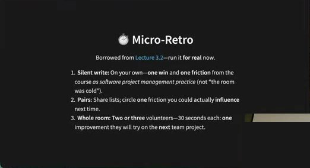

Borrowed from Lecture 3.2—run it **for real** now.

1. **Silent write:** On your own—**one win** and **one friction** from the course *as software project management practice* (not "the room was cold").
2. **Pairs:** Share lists; circle **one** friction you could actually **influence** next time.
3. **Whole room:** Two or three volunteers—30 seconds each: **one** improvement they will try on the **next** team project.

🇨🇳 **微型回顾**（借自 Lecture 3.2，现在真做一次）：① 静默书写：本课程作为 SPM 实践的 **一个收获** 和 **一个摩擦**（不是"教室太冷"这种）；② 两人分享，圈出一个下次你真能 **影响** 的摩擦；③ 全班 2–3 位志愿者各 30 秒：下一个团队项目要尝试的 **一个** 改进。

💬 **讲师补充**
- "这个留给你们和小组自己做——这是对 **整个学期** 的 retro，不是针对某个 sprint。"（课堂上跳过，直接做下一个活动。）

### 3.4 ✍️ Solo — Three Lines

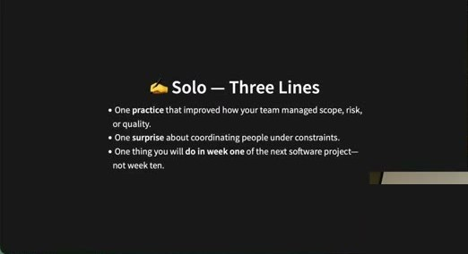

- One **practice** that improved how your team managed scope, risk, or quality.
- One **surprise** about coordinating people under constraints.
- One thing you will **do in week one** of the next software project—not week ten.

🇨🇳 **独立完成——三行**：一个改善了团队管理范围/风险/质量的 **实践**；一个关于在约束下协调人的 **意外**；一件你会在下个软件项目 **第一周** 就做的事——而不是第十周。

💬 **讲师补充（41:35–48:50）**
- 独立活动，1.5–2 分钟。"约束"指时间约束、deadline 约束、利益相关者需求约束等。"不是这学期"，是下一个项目。
- **同学 1 分享**（三点都和 **一致性 consistency** 有关）：
  - 实践：每次有人要 merge 时都有 **一致的 review**——每次都检查"这会怎样影响别人写的代码"；commit message 也随时间变好。
  - 意外：即使是 Task Tracker 这样的小项目，人们对同一功能该怎么做也有不同想法（例如任务的日期时间该用什么结构）——要找共同点。他们的解决办法：**把任务拆得更清楚**——"你对这部分有想法就你做这部分，别碰那一部分。"
  - 第一周要做的：让所有人都用 **虚拟环境（virtual environment）**，避免库版本不一致带来的无谓问题。
  - 讲师点评："review 流程太有价值了——即使一个人很努力想把 MR 做到完美，也可能漏掉东西，让另一个人 review 非常有用；有 **一致的 review 流程** 是很好的实践。"拆分工作也是好办法。
- **同学 2 分享**：
  - 实践：批准任何 merge 前会问所有人、大家在本地拉下来检查后再批准。
  - 意外：有人会给出很好的 review 意见——"我从没想到"；每个 sprint 的头脑风暴也会冒出好主意。
  - 第一周要做的：教所有人 **怎么处理 merge conflict**——"第一周就很重要：**不要删掉别人的代码**。"
  - 讲师："Git 很棘手。我发现很多学生要花好几周才真正理解 Git——讲师觉得都讲完了，但学生真正理解并会用需要练习和时间。这很常见。希望下个项目对大家都容易些。"
- "课后和组员一起做这种针对整个学期的 retro。"

### 3.5 🎤 Pitch Practice — "SPM In 30 Seconds" (Pairs, 3 Minutes)

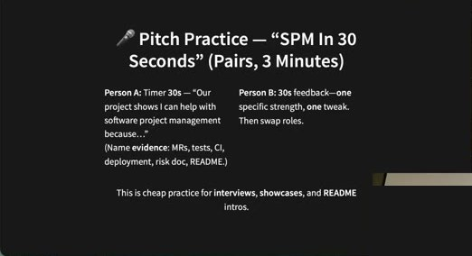

| Person A | Person B |
|---|---|
| Timer 30s — "Our project shows I can help with software project management because…" (Name **evidence**: MRs, tests, CI, deployment, risk doc, README.) | 30s feedback—**one** specific strength, **one** tweak. Then swap roles. |

This is cheap practice for **interviews**, **showcases**, and **README** intros.

🇨🇳 **演讲练习——"30 秒说 SPM"（两人，3 分钟）**：A 计时 30 秒："我们的项目表明我能胜任软件项目管理，因为……"（要点名 **证据**：MR、测试、CI、部署、风险文档、README）；B 用 30 秒反馈——一个具体优点、一个改进；交换。这是面试、展示、README 开头的廉价练习。

💬 **讲师补充（48:55–54:55）**
- 面试可能这样问："你对软件项目管理了解多少？能用你在学习期间做的项目展示你的 SPM 技能吗？"你会怎么答？可以用的结构："这是我们的 Task Tracker 项目，我们的项目表明我能帮助做 SPM，因为——证据。"
- "这是廉价练习的好机会，别浪费。"（教室很安静，讲师提前结束："我知道天晚了大家累了，没关系。"）
- **同学 A 分享**：讲了自己项目里的做法，讲师请她"把它重新表述成面试问题的证据"。
- **同学 B 分享**："我能带来的 SPM 是严格遵循导师给的指南、在 GitLab 里做很好的文档。正确地做文档能让队友了解你的进度、明确各自要做什么；GitLab 的 **issue board** 很有用，可以跟踪一切、随时掌握进度。"
- 讲师点评：两人可以互补——B 更擅长 **举例**（"例如我用 issue board 做了……"）；A 的优点是给出 **证据**（"我可以给你看我们的项目和文档"）。

---

## 第 4 部分 · 展望：作品集、证据与可迁移技能（55:00–63:10）

### 4.1 Looking Ahead — Your Portfolio And Evidence

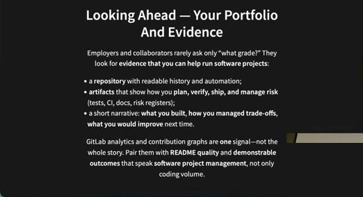

Employers and collaborators rarely ask only "what grade?" They look for **evidence that you can help run software projects**:

- a **repository** with readable history and automation;
- **artifacts** that show how you **plan, verify, ship, and manage risk** (tests, CI, docs, risk registers);
- a short narrative: **what you built**, **how you managed trade-offs**, **what you would improve** next time.

GitLab analytics and contribution graphs are **one** signal—not the whole story. Pair them with **README quality** and **demonstrable outcomes** that speak **software project management**, not only coding volume.

🇨🇳 **展望——你的作品集与证据**：雇主和合作者很少只问"什么分数"，他们找的是 **你能帮忙运营软件项目的证据**：一个历史可读、有自动化的 **仓库**；展示你如何 **计划、验证、交付、管理风险** 的 **工件**（测试、CI、文档、风险登记表）；一段简短叙述：**做了什么、如何权衡、下次改进什么**。GitLab 分析和贡献图只是 **一个** 信号，不是全部；要搭配 **README 质量** 和能体现 SPM（不只是代码量）的 **可演示成果**。

💬 **讲师补充**
- 接下来你们要写 **portfolio（作品集）**，今天练的东西可以直接用上。
- "见过别人的作品集吗？搜 *software engineer portfolio examples* 网上很多。本课对作品集的要求 **不会那么高**——那些例子要花很长时间才能做到那个水平，**交一个 PDF 就够了**。"
- 作品集的用途：求职时 CV 里不只列项目名，还有一个链接让人点进去看你做了什么、项目是什么、你的角色——一些证据。现在可以只为这一个项目写，将来有其他项目再逐步合并。
- 网上的作品集大多 **不写太多细节**；"但本课要求你写 **更多细节**，将来你可以压缩、总结成正式的作品集。"不需要做网站，上传 PDF 即可。

### 4.2 网页演示：作品集示例（55:30–58:10）

Google 搜索 "Software engineer portfolio examples" 的结果（GitHub `emmabostian/developer-portfolios`、Reddit、网站列表等）。

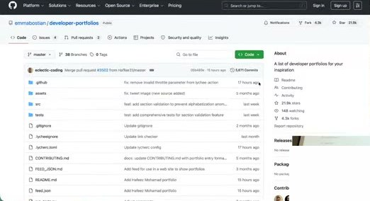

GitHub 仓库 **emmabostian / developer-portfolios** —— "A list of developer portfolios for your inspiration"（README 里按字母列出 1600+ 个开发者作品集）。

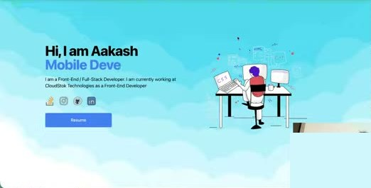

示例 1：Aakash（Front-End / Full-Stack Developer）个人网站——首页自我介绍 + Resume 按钮 + Projects 页面（每个项目有简介、"Read more"）。

示例 2：PARTH —— "I design and build products that deliver real impact."：Work 页面列出项目（如 Rune，一个含 140+ 工具的生产力工具集），标注所用技术（React、TypeScript、Tailwind CSS、Framer Motion、Node.js、Vercel），可点进看更多细节、文档；页面动效很花哨（"Let's create something real"）。

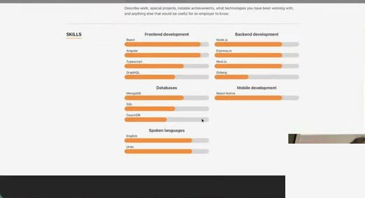

示例 3：以 **技能条** 展示的作品集（Frontend: React/Angular/TypeScript/GraphQL；Backend: Node.js/Express/NestJS/Golang；Databases: MongoDB/SQL/CouchDB；Mobile: React Native；Spoken languages）。

💬 **讲师补充**
- 讲师现场 Wi-Fi 不稳，图片加载失败："随便挑一个……这个没有项目……再换一个。"
- 要点：他们把 **项目** 放进作品集，写用了什么语言、库，项目介绍，点进去有更多细节和文档。"你可以看到这些例子；本课要求更详细。"

### 4.3 Moodle：Sprint 3 Guidelines §4.1/§4.2/§4.5（59:00–60:10）

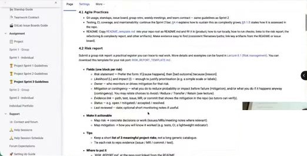

页面显示 Sprint 3 指南 **4.1 Agile Practices**（Git usage、standups、issue board、group retro、weekly meetings、team contract；Testing/CI/coverage/maintainability；README：copy `README_template.md` 填写……）与 **4.2 Risk report**（RISK_REPORT_TEMPLATE.md；Fields：Risk statement / Likelihood & impact / Owner / Mitigation or contingency / Evidence link / Status / Last reviewed；Make it actionable；Tips；Where to put it：`RISK_REPORT.md` at repo root, linked from README）。（这两节在 Lecture 8.1 已详细整理。）

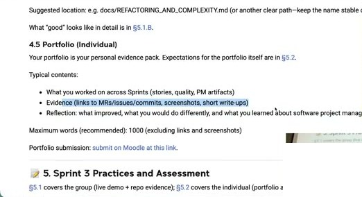

**4.5 Portfolio (Individual)**

Your portfolio is your personal evidence pack. Expectations for the portfolio itself are in §5.2.

Typical contents:
- What you worked on across Sprints (stories, quality, PM artifacts)
- Evidence (links to MRs/issues/commits, screenshots, short write-ups)
- Reflection: what improved, what you would do differently, and what you learned about software project management and process

Maximum words (recommended): 1000 (excluding links and screenshots)

Portfolio submission: submit on Moodle at this link.

**📝 5. Sprint 3 Practices and Assessment** — §5.1 covers the group (live demo + repo evidence); §5.2 covers the individual (portfolio and participation).

🇨🇳 **4.5 作品集（个人）**：作品集是你的个人证据包，具体期望见 §5.2。典型内容：跨 sprint 你做了什么（stories、质量、PM 工件）；**证据**（MR/issue/commit 链接、截图、简短说明）；**反思**（哪些变好了、下次会怎样不同、你对 SPM 与过程学到了什么）。建议上限 **1000 词**（不含链接和截图）。在 Moodle 提交。§5 中 §5.1 是小组（现场 demo + 仓库证据），§5.2 是个人（作品集与参与度）。

💬 **讲师补充**
- 作品集里的证据可以是：你的测试（怎么写测试的例子）、你的文档（"给热爱文档的人"）、你对风险的贡献，以及简短叙述：贡献了什么、如何管理取舍、下次改进什么。更多说明见 Sprint 3 指南。
- "这些都是将来可以给面试官看的东西——虽然是小组项目，但这是 **我** 做的、我贡献的、我学到的。"
- **反思很重要**：求职时对方也关心你的反思——他们知道这是短期学生项目，有可以改进的空间只是没时间，没关系，但你应该有反思：下次做会有什么不同；你对 SPM 和过程学到了什么。

### 4.4 GitLab Analytics 演示（60:20–62:00）

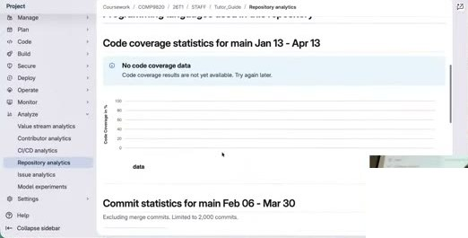

GitLab 项目侧栏 **Analyze** → Value stream analytics / Contributor analytics / CI/CD analytics / **Repository analytics**（Code coverage statistics、Commit statistics：Total 28 commits, Average per day 0.5, Authors 3, Commits per day of month）/ Issue analytics / Model experiments。

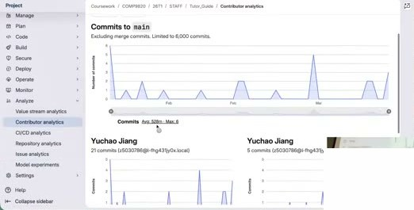

**Contributor analytics** —— Commits to `main`（按日期的提交曲线，Avg 528m, Max 6），按贡献者列出各自的提交数与曲线。

💬 **讲师补充**
- 讲师用自己的 STAFF/Tutor_Guide 项目演示（"我的项目很简单，没设 CI/CD，覆盖率是空的"）。
- 这些分析可以用在作品集里："我把大部分提交贡献给了文档 / 测试 / 功能代码。"（对应幻灯片提醒：这只是 **一个** 信号，要搭配 README 质量和可演示成果。）

### 4.5 Looking Ahead — SPM Skills That Compound

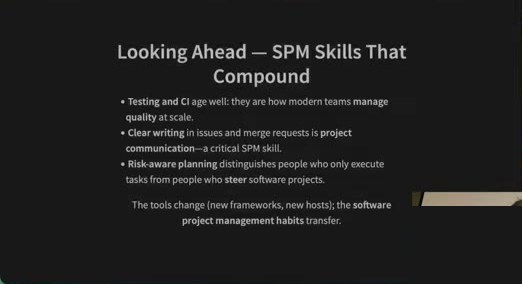

- **Testing and CI** age well: they are how modern teams **manage quality** at scale.
- **Clear writing** in issues and merge requests is **project communication**—a critical SPM skill.
- **Risk-aware planning** distinguishes people who only execute tasks from people who **steer** software projects.

The tools change (new frameworks, new hosts); the **software project management habits** transfer.

🇨🇳 **展望——会复利的 SPM 技能**：**测试与 CI** 越老越香——现代团队规模化 **管理质量** 的方式；issue 和 MR 里的 **清晰写作** 就是 **项目沟通**——关键的 SPM 技能；**有风险意识的计划** 把只会执行任务的人和能 **掌舵** 软件项目的人区分开来。工具会变（新框架、新托管平台），**SPM 习惯** 可以迁移。

💬 **讲师补充**：⚡ 该页只一带而过。

### 4.6 What We Did Not Exhaust

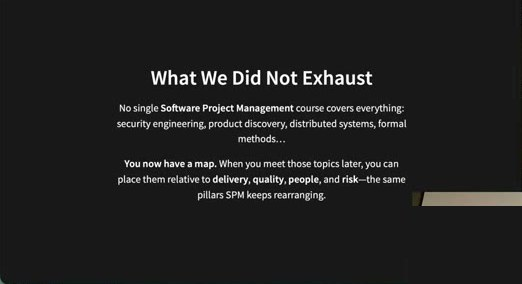

No single **Software Project Management** course covers everything: security engineering, product discovery, distributed systems, formal methods…

**You now have a map.** When you meet those topics later, you can place them relative to **delivery**, **quality**, **people**, and **risk**—the same pillars SPM keeps rearranging.

🇨🇳 **我们没讲完的**：没有哪门 SPM 课能覆盖一切——安全工程、产品发现、分布式系统、形式化方法……**你现在有了一张地图**：将来遇到这些主题，可以把它们放到 **交付、质量、人、风险** 这几根 SPM 不断重排的支柱上。

💬 **讲师补充**
- "本课只有九周讲座，很多项目管理的内容没有覆盖，也没有空间覆盖，请自行探索。例如 **安全工程** 对 SPM 也很重要，还有产品发现、分布式系统、形式化方法，都是很有意思的主题。"
- "对于学过的内容，从开头、中间到结尾，你脑子里现在应该有一张地图。"

### 4.7 🎟️ Exit Ticket

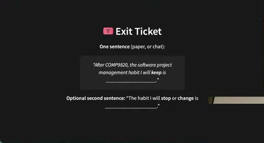

**One sentence** (paper, or chat):
> "After COMP9820, the software project management habit I will **keep** is ______."

**Optional second sentence:** "The habit I will **stop** or **change** is ______."

🇨🇳 **离场券**：一句话（纸上或聊天框）："上完 COMP9820，我会 **保持** 的 SPM 习惯是 ___。"可选第二句："我会 **停止** 或 **改变** 的习惯是 ___。"

💬 **讲师补充**："不用写下来，想一想就好。可能需要一些时间，不急。"

### 4.8 Close

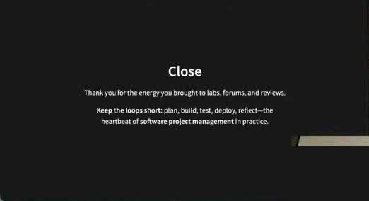

**Close**

Thank you for the energy you brought to labs, forums, and reviews.

**Keep the loops short:** plan, build, test, deploy, reflect—the heartbeat of **software project management** in practice.

🇨🇳 **结语**：感谢你们带到实验课、论坛和 review 里的能量。**让回路保持短小**：计划、构建、测试、部署、反思——这是 SPM 实践的心跳。

💬 **讲师补充**
- "感谢大家带来的能量，我很享受这些讲座、和大家的交流，你们在讲座、论坛、lab 里带来了很多有意思的见解。让回路保持短：计划 → 构建 → 测试 → 部署 → 反思，这是软件项目管理的核心。"

---

## 第 5 部分 · 附：Lecture 9.2 Done Done（未讲，仅提及）与课程反馈（63:50–67:00）

### 5.1 COMP9820 - 26T1 — Done Done（Lecture 9.2 标题页）

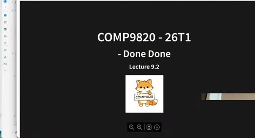

**COMP9820 - 26T1 — Done Done**, Lecture 9.2

### 5.2 In This Lecture（Done Done）

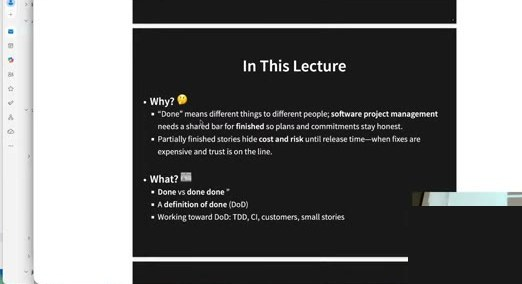

- **Why? 🤔**
  - "Done" means different things to different people; **software project management** needs a shared bar for **finished** so plans and commitments stay honest.
  - Partially finished stories hide **cost and risk** until release time—when fixes are expensive and trust is on the line.
- **What? 📖**
  - **Done** vs **done done**
  - A **definition of done** (DoD)
  - Working toward DoD: TDD, CI, customers, small stories

🇨🇳 为什么："完成"对不同人意味着不同的东西；SPM 需要对"完成"有一条 **共享的标准**，计划和承诺才诚实。半成品 story 会把 **成本和风险** 藏到发布时——那时修复昂贵、信任受考验。讲什么：**Done vs done done**；**完成的定义（DoD）**；朝 DoD 努力：TDD、CI、客户、小 story。

### 5.3 What "Done Done" Is / What To Aim For In Planning

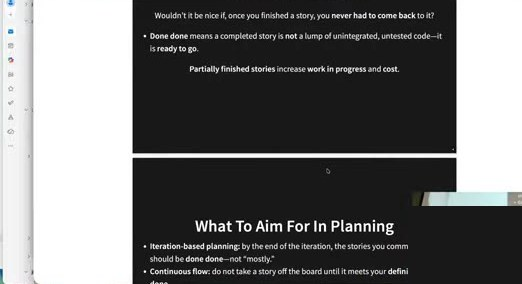

**What "Done Done" Is**
Wouldn't it be nice if, once you finished a story, you **never had to come back** to it?
- **Done done** means a completed story is **not** a lump of unintegrated, untested code—it is **ready to go**.

**Partially finished stories** increase **work in progress** and **cost**.

**What To Aim For In Planning**
- **Iteration-based planning:** by the end of the iteration, the stories you committed to should be **done done**—not "mostly."
- **Continuous flow:** do not take a story off the board until it meets your definition of done.

🇨🇳 **什么是"Done Done"**：如果完成一个 story 后 **再也不用回头** 该多好？Done done = 完成的 story **不是** 一堆未集成、未测试的代码，而是 **随时可以上线**。半成品 story 增加在制品（WIP）和成本。**计划时的目标**：基于迭代的计划——迭代结束时承诺的 story 都应 **done done**，不是"差不多"；持续流——story 没达到你们的 DoD 之前不要从看板上拿掉。

💬 **讲师补充**
- "我还准备了另一个很短的讲座（Done Done），但我觉得不太有帮助，不想浪费大家时间——slides 在课程网站上。"
- 做这个讲座的原因：注意到 **同一组里的人对"什么是完成"理解不同**——很常见。不再讲它是因为"**完成的定义对每个组也不一样**"。建议："将来的项目里，把 **definition of done** 写进你们的 **小组合同（group contract）**。"

### 5.4 👂 Feedback / myExperience

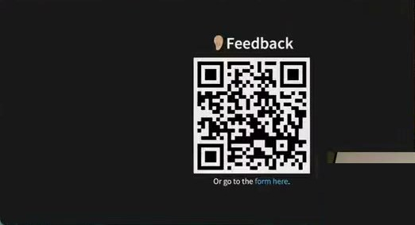

**Feedback** — QR code, "Or go to the form here."

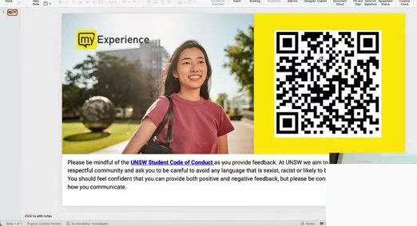

**myExperience** 调查（UNSW）—— QR 码；"Please be mindful of the UNSW Student Code of Conduct as you provide feedback. At UNSW we aim to be a respectful community and ask you to be careful to avoid any language that is sexist, racist or likely to be considered offensive. You should feel confident that you can provide both positive and negative feedback, but please be considerate in how you communicate."

💬 **讲师补充**
- myExperience 对课程、对讲师、对导师都很重要：扫码写反馈——我们可以改进什么、做得好的要继续什么；没有具体意见就写"你们做得很好"或"做得很差"，让我们对整体情况有个概念。
- "感谢大家这学期的耐心——这是本课程 **第一次开设**，你们对所有变动都很耐心；也感谢整个学期的反馈，特别是帮忙审阅 sprint 指南的学生评审，非常有帮助。"
- 有问题可以课后来找讲师聊几分钟。（课后闲聊：讲师下学期不开课，今年余下时间休假，明年回来。）

---

## ✅ 待办清单（课后）

- [ ] **看录播**：如果还没看 Lecture 8.1 Risk Management（约 30–40 分钟），去看或至少读 slides。
- [ ] **做 deployment lab**（强烈建议，即使不是必需）。
- [ ] 回看不熟的知识点：Agile 原则（Lecture 1/2）、需求工程四步、TDD/CI/coverage、代码原则（coupling vs cohesion 哪个高哪个低；清晰优于聪明）、持久化（JSON 文件）、复杂度。
- [ ] 和小组做一次 **整学期的 retro**（Micro-Retro：一个收获 + 一个摩擦 + 下次能影响的一项）。
- [ ] 独立写 **三行**：一个实践、一个意外、下个项目第一周要做的事（如：全员用虚拟环境、第一周教 merge conflict/不要删别人代码、建立一致的 review 流程）。
- [ ] 练习 **30 秒 SPM 面试回答**：项目 + 证据（MR、测试、CI、部署、风险文档、README）+ 具体例子。
- [ ] **写 Portfolio（个人，PDF 即可）**：跨 sprint 做了什么；证据（MR/issue/commit 链接、截图、短说明；可用 GitLab Analyze → Repository/Contributor analytics）；反思（改进了什么、下次会怎么做、对 SPM 与过程学到了什么）；建议 ≤1000 词；按 Sprint 3 指南 §4.5 / §5.2 在 Moodle 提交。
- [ ] Sprint 3 小组交付：README（`README_template.md`）、`RISK_REPORT.md`（§4.2）、现场 demo（§5.1）。
- [ ] 将来项目：把 **definition of done** 写进小组合同。
- [ ] 填写 **myExperience** 课程反馈。
- [ ] 自行探索：Jira、AI 项目管理工具、前端测试、安全工程、产品发现、分布式系统、形式化方法。
