# COMP9820 Week 1 Lecture 课件整理
## Course Introduction, Software Engineering, Version Control, Working in Groups

---

## 目录

1. [课程介绍 Course Introduction](#part-1-course-introduction)（幻灯片 1–18）
2. [项目如何运作 How the Project Works](#part-2-how-the-project-works)（19–24）
3. [考核 Assessment Tasks Overview](#part-3-assessment-tasks-overview)（25–34）
4. [与 COMP9900 的关联 Links to COMP9900](#part-4-links-to-comp9900)（35–44）
5. [软件工程导论 Software Engineering Introduction](#part-5-software-engineering-introduction)（45–57）
6. [版本控制与 Git Version Control – Intro to Git](#part-6-version-control--introduction-to-git)（58–76）
7. [团队协作与冲突 Working in Groups](#part-7-working-in-groups)（77–89）
8. [待办清单](#待办清单)

---

## Part 1. Course Introduction

### 01 · Title
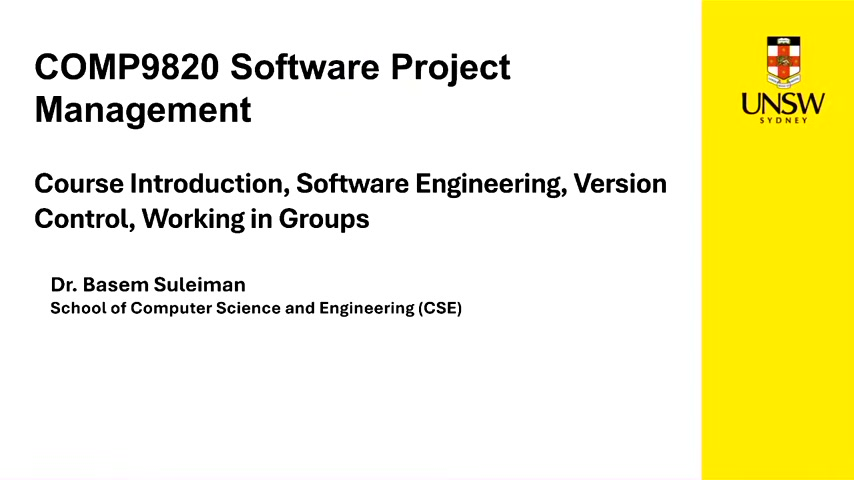

**COMP9820 Software Project Management**
Course Introduction, Software Engineering, Version Control, Working in Groups
Dr. Basem Suleiman — School of Computer Science and Engineering (CSE)

🇨🇳 COMP9820 软件项目管理 —— 课程介绍、软件工程、版本控制、团队协作。

---

### 02 · Acknowledgement of Country
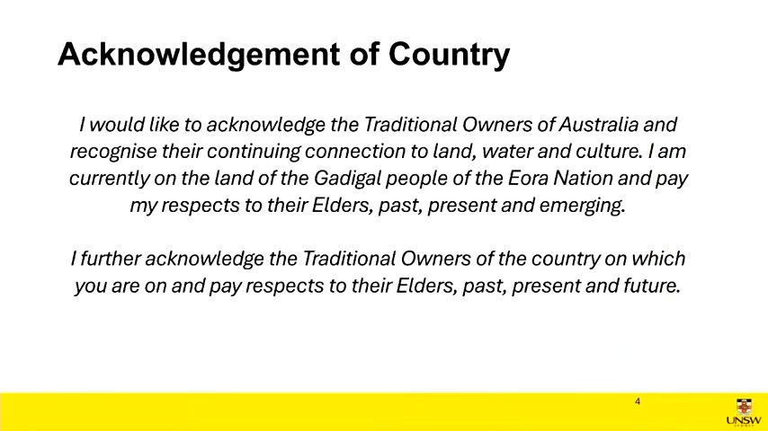

> I would like to acknowledge the Traditional Owners of Australia and recognise their continuing connection to land, water and culture. I am currently on the land of the Gadigal people of the Eora Nation and pay my respects to their Elders, past, present and emerging.
> I further acknowledge the Traditional Owners of the country on which you are on and pay respects to their Elders, past, present and future.

---

### 03 · Outline
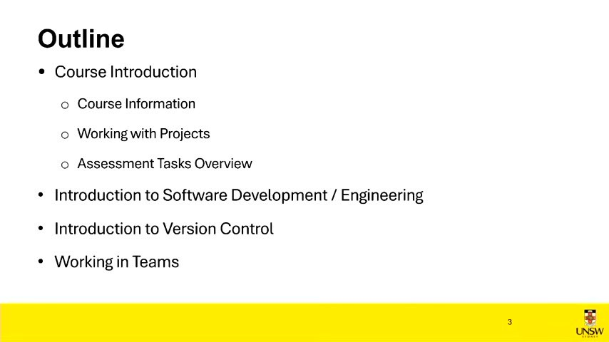

- Course Introduction
  - Course Information
  - Working with Projects
  - Assessment Tasks Overview
- Introduction to Software Development / Engineering
- Introduction to Version Control
- Working in Teams

🇨🇳 大纲：课程介绍（课程信息 / 项目运作 / 考核概览）→ 软件开发与软件工程导论 → 版本控制导论 → 团队协作。

💬 讲师补充：学期只有 9 个教学周，非常短，今天要保证大家"预期一致"。

---

### 04 · Section: Course Introduction
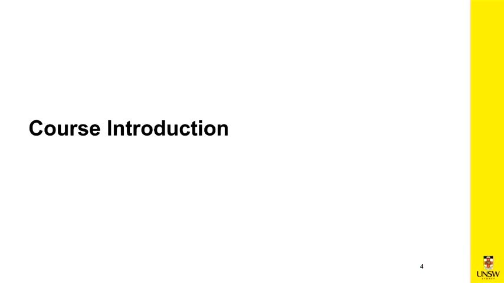

---

### 05 · COMP9820 Teaching Team
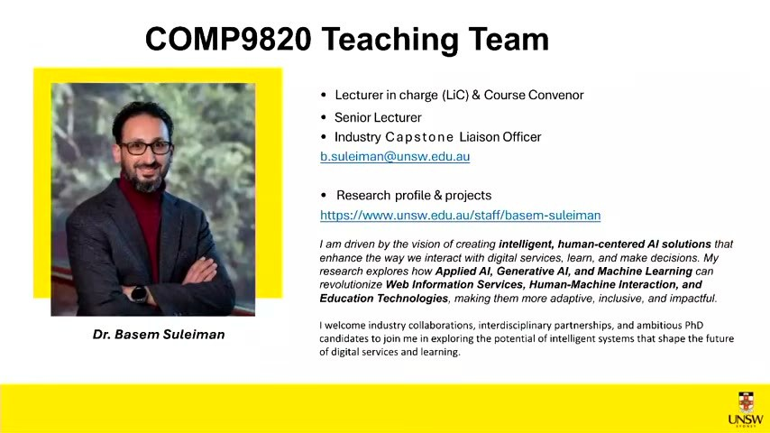

**Dr. Basem Suleiman**
- Lecturer in charge (LiC) & Course Convenor
- Senior Lecturer
- Industry Capstone Liaison Officer — b.suleiman@unsw.edu.au
- Research profile & projects: https://www.unsw.edu.au/staff/basem-suleiman

> I am driven by the vision of creating **intelligent, human-centered AI solutions** that enhance the way we interact with digital services, learn, and make decisions. My research explores how **Applied AI, Generative AI, and Machine Learning** can revolutionize **Web Information Services, Human-Machine Interaction, and Education Technologies**, making them more adaptive, inclusive, and impactful.
> I welcome industry collaborations, interdisciplinary partnerships, and ambitious PhD candidates to join me in exploring the potential of intelligent systems that shape the future of digital services and learning.

🇨🇳 讲师简介：课程负责人兼召集人、高级讲师、行业 Capstone 联络官。研究方向：应用 AI / 生成式 AI / 机器学习在 Web 信息服务、人机交互、教育科技中的应用。

💬 讲师补充：他同时负责 capstone 项目（COMP9900），去年提出开设本课程，目的就是让研究生在进入 9900 之前做好准备。对他研究感兴趣的同学可以私下聊（AI + 教育、推荐系统、Web 服务、agentic AI）。

---

### 06 · Teaching Team – Admin
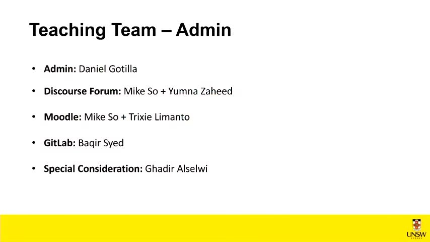

- **Admin:** Daniel Gotilla
- **Discourse Forum:** Mike So + Yumna Zaheed
- **Moodle:** Mike So + Trixie Limanto
- **GitLab:** Baqir Syed
- **Special Consideration:** Ghadir Alselwi

🇨🇳 教学团队（行政）：课程管理员 Daniel Gotilla（也带一个 lab，Discourse 上常见）；Discourse 论坛由 Mike So 和 Yumna Zaheed 维护；Moodle 由 Mike So 和 Trixie Limanto 维护；GitLab 由 Baqir Syed 管理；特殊考虑（Special Consideration）由 Ghadir Alselwi 处理。

💬 讲师补充：列出来是为了让大家收到邮件时知道是谁。Special Consideration 的案例 Ghadir 会先与讲师沟通，讲师全程知情。

---

### 07 · Teaching Team – Tutors
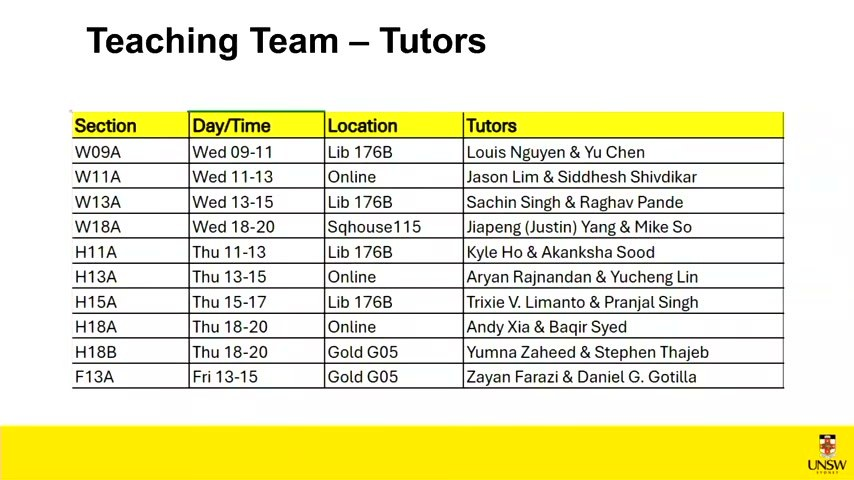

| Section | Day/Time | Location | Tutors |
|---|---|---|---|
| W09A | Wed 09-11 | Lib 176B | Louis Nguyen & Yu Chen |
| W11A | Wed 11-13 | Online | Jason Lim & Siddhesh Shivdikar |
| W13A | Wed 13-15 | Lib 176B | Sachin Singh & Raghav Pande |
| W18A | Wed 18-20 | Sqhouse115 | Jiapeng (Justin) Yang & Mike So |
| H11A | Thu 11-13 | Lib 176B | Kyle Ho & Akanksha Sood |
| H13A | Thu 13-15 | Online | Aryan Rajnandan & Yucheng Lin |
| H15A | Thu 15-17 | Lib 176B | Trixie V. Limanto & Pranjal Singh |
| H18A | Thu 18-20 | Online | Andy Xia & Baqir Syed |
| H18B | Thu 18-20 | Gold G05 | Yumna Zaheed & Stephen Thajeb |
| F13A | Fri 13-15 | Gold G05 | Zayan Farazi & Daniel G. Gotilla |

🇨🇳 10 个 lab 班次，每班 2 名导师。导师都是软件工程师/业界人士或有丰富行业经验的毕业生。

💬 讲师补充：这张表 Moodle 上也有；之前有 Moodle 同步问题导致部分同学看不到，据说已修复。

---

### 08 · Lecture Location and Time
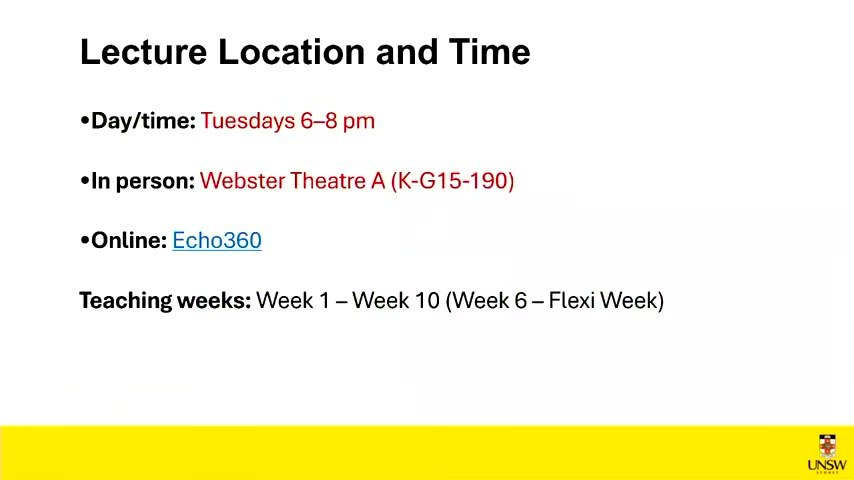

- **Day/time:** Tuesdays 6–8 pm
- **In person:** Webster Theatre A (K-G15-190)
- **Online:** Echo360
- **Teaching weeks:** Week 1 – Week 10 (Week 6 – Flexi Week)

🇨🇳 周二 18:00–20:00，Webster Theatre A；线上 Echo360 直播 + 录像（链接在 Moodle）。第 1–10 周，第 6 周是 Flexi Week。

💬 讲师补充：虽然有直播，但希望每周都能在教室看到大家的脸。

---

### 09 · Contacting us
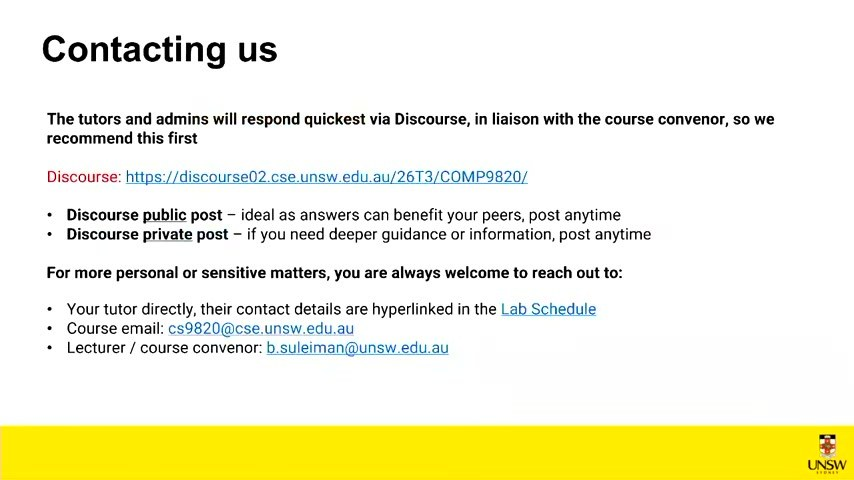

The tutors and admins will respond quickest via Discourse, in liaison with the course convenor, so we recommend this first

- Discourse: https://discourse02.cse.unsw.edu.au/26T3/COMP9820/
- **Discourse public post** – ideal as answers can benefit your peers, post anytime
- **Discourse private post** – if you need deeper guidance or information, post anytime

For more personal or sensitive matters, you are always welcome to reach out to:
- Your tutor directly, their contact details are hyperlinked in the Lab Schedule
- Course email: cs9820@cse.unsw.edu.au
- Lecturer / course convenor: b.suleiman@unsw.edu.au

🇨🇳 联系方式：优先用 Discourse（公开帖让所有人受益；私密帖用于个人问题）。更私密的事可直接联系导师、课程邮箱或讲师。

💬 讲师补充：
- 发帖前先搜 Discourse，很多好问题别人已经问过；"像刷 Facebook / Instagram 一样经常看"。
- 邮件的问题在于回答了一个人，其他人不知道，所以"Discourse first and last"。
- lab 里每个团队都有专门与导师交流的时间，这是最有效的沟通渠道。
- 需要升级（escalate）的事可以直接找讲师，他欢迎任何反馈。

---

### 10 · Equitable Learning Services (ELS) & Special Consideration (SC)
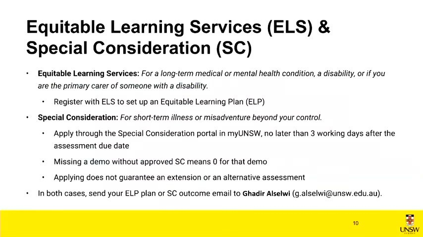

- **Equitable Learning Services:** For a long-term medical or mental health condition, a disability, or if you are the primary carer of someone with a disability.
  - Register with ELS to set up an Equitable Learning Plan (ELP)
- **Special Consideration:** For short-term illness or misadventure beyond your control.
  - Apply through the Special Consideration portal in myUNSW, no later than 3 working days after the assessment due date
  - Missing a demo without approved SC means 0 for that demo
  - Applying does not guarantee an extension or an alternative assessment
- In both cases, send your ELP plan or SC outcome email to **Ghadir Alselwi** (g.alselwi@unsw.edu.au).

🇨🇳 ELS 针对长期疾病/残障/照护者；SC 针对短期突发情况，须在截止后 3 个工作日内通过 myUNSW 申请。**没有获批 SC 而缺席 demo = 该 demo 0 分**；申请不保证延期。两种情况都要把结果邮件发给 Ghadir。

💬 讲师补充：有些同学不知道这些服务的存在，请尽早申请，处理需要时间。

---

### 11 · Course Summary
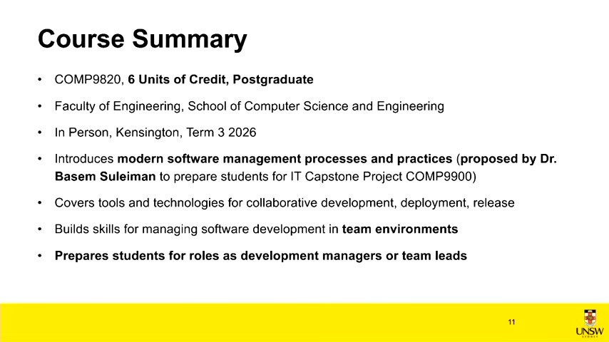

- COMP9820, **6 Units of Credit, Postgraduate**
- Faculty of Engineering, School of Computer Science and Engineering
- In Person, Kensington, Term 3 2026
- Introduces **modern software management processes and practices** (**proposed by Dr. Basem Suleiman** to prepare students for IT Capstone Project COMP9900)
- Covers tools and technologies for collaborative development, deployment, release
- Builds skills for managing software development in **team environments**
- **Prepares students for roles as development managers or team leads**

🇨🇳 6 学分研究生课；由 Basem 提出，为 COMP9900 做准备；涵盖协作开发、部署、发布的工具与技术；培养团队环境下管理软件开发的能力；为成为开发经理/团队负责人做准备。

💬 讲师补充：课程每年开两次（T1 和 T3），要提前规划选课，确保最后一个学期能选 capstone。课名是"软件项目管理"，但重点是**现代软件方法论**和业界真正在用的实践，而不是传统 PM。

---

### 12 · Course Summary: Focus Areas
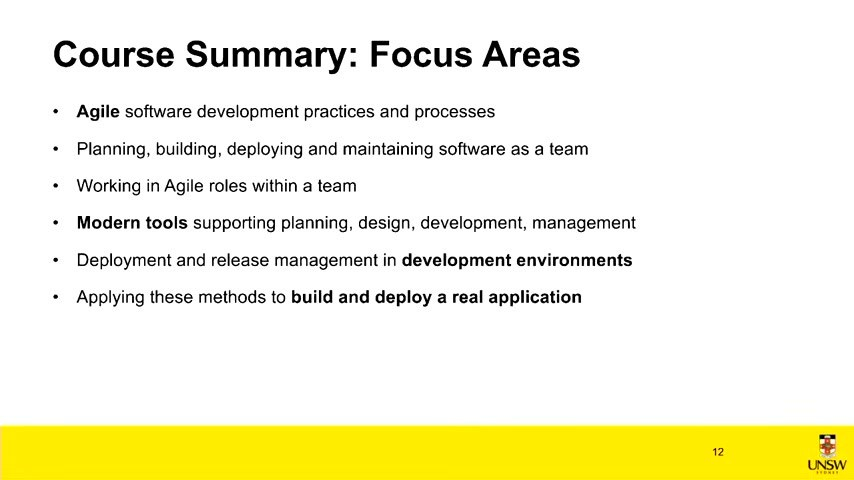

- **Agile** software development practices and processes
- Planning, building, deploying and maintaining software as a team
- Working in Agile roles within a team
- **Modern tools** supporting planning, design, development, management
- Deployment and release management in **development environments**
- Applying these methods to **build and deploy a real application**

🇨🇳 核心是 Agile；以团队方式规划、构建、部署、维护软件；扮演 Agile 角色；使用现代工具；部署与发布管理；最终真正构建并部署一个应用。

💬 讲师补充：6 人一组，遵循 Agile 原则和 Scrum（后续专门一讲）；特别强调"如何发布不同版本、如何在真实环境中管理版本"。

---

### 13 · Our Commitment to You in COMP9820
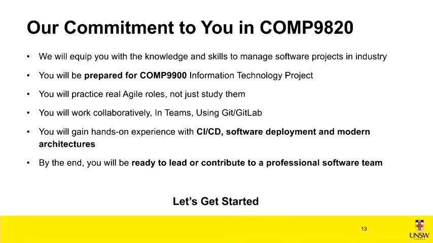

- We will equip you with the knowledge and skills to manage software projects in industry
- You will be **prepared for COMP9900** Information Technology Project
- You will practice real Agile roles, not just study them
- You will work collaboratively, In Teams, Using Git/GitLab
- You will gain hands-on experience with **CI/CD, software deployment and modern architectures**
- By the end, you will be **ready to lead or contribute to a professional software team**

**Let's Get Started**

🇨🇳 我们的承诺：让你具备业界项目管理能力；为 9900 做好准备；真正实践 Agile 角色；用 Git/GitLab 协作；上手 CI/CD、部署、现代架构；结课时能领导或加入专业软件团队。

💬 讲师补充：他花了两年把 capstone 改造成真实企业客户项目，发现研究生普遍缺乏这些经验，只能在 capstone 里"边学边做"。这门课给你 10 周时间"在没有真实客户压力的情况下练习"，请把它当成进入真实项目前的实验场。

---

### 14 · Prerequisites
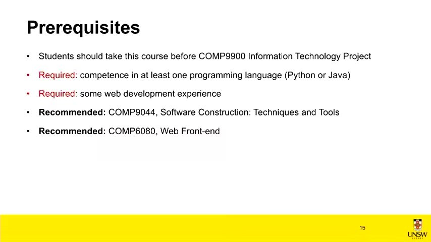

- Students should take this course before COMP9900 Information Technology Project
- **Required:** competence in at least one programming language (Python or Java)
- **Required:** some web development experience
- **Recommended:** COMP9044, Software Construction: Techniques and Tools
- **Recommended:** COMP6080, Web Front-end

🇨🇳 先修要求：应在 9900 之前修；必须熟练至少一门语言（Python/Java）；有一定 Web 开发经验；推荐先修 COMP9044、COMP6080。

💬 讲师补充：**本课不教编程语言**，也不考察你编程有多强，那是其它课的事。

---

### 15 · Labs (Mentoring Sessions)
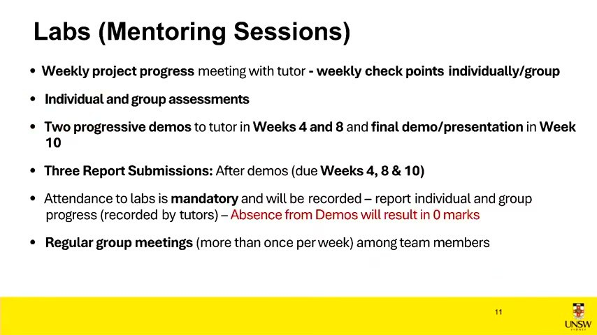

- **Weekly project progress** meeting with tutor **– weekly check points individually/group**
- **Individual and group assessments**
- **Two progressive demos** to tutor in **Weeks 4 and 8** and **final demo/presentation** in **Week 10**
- **Three Report Submissions:** After demos (due **Weeks 4, 8 & 10**)
- Attendance to labs is **mandatory** and will be recorded – report individual and group progress (recorded by tutors) – **Absence from Demos will result in 0 marks**
- **Regular group meetings** (more than once per week) among team members

🇨🇳 Lab = 导师辅导课：每周进度检查；两次阶段性 demo（第 4、8 周）+ 期末 demo（第 10 周）；三份报告（第 4、8、10 周）；**出勤强制记录，缺席 demo 得 0 分**；团队每周至少多次会面。

💬 讲师补充：
- Lab 结构：前 30–40 分钟是与主题/项目相关的练习；然后每组 20–30 分钟与 mentor 单独谈进度、个人贡献、考核疑问；剩余时间团队自由工作。
- 大部分学习都发生在 lab，所以强制出勤。缺席考核 lab 必须申请 Special Consideration，否则 0 分（因为是团队作业）。
- Lab 时间是"全员一定有空"的时间，可以利用 lab 前后开会，但这不应是唯一的会面，学 Agile 后要做 stand-up。

---

### 16 · Learning Resources
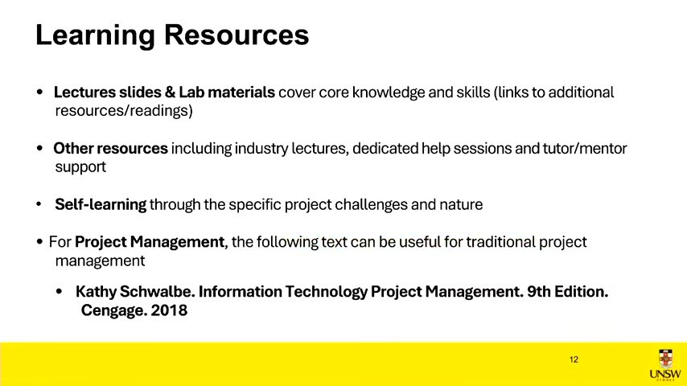

- **Lectures slides & Lab materials** cover core knowledge and skills (links to additional resources/readings)
- **Other resources** including industry lectures, dedicated help sessions and tutor/mentor support
- **Self-learning** through the specific project challenges and nature
- For **Project Management**, the following text can be useful for traditional project management
  - **Kathy Schwalbe. Information Technology Project Management. 9th Edition. Cengage. 2018**

🇨🇳 学习资源：讲义和 lab 材料、行业讲座、答疑、导师支持、自学；传统 PM 参考书 Kathy Schwalbe《IT Project Management》第 9 版（适合想考 PMP 的同学）。没有单一教材，每讲会分享资料。

💬 讲师补充（AI 时代的学习观，）：讲师上周刚从工程教育会议回来。观点：AI 能"做"，但**人必须理解流程和实践**，因为未来你可能是在领导一群 AI agent。很多学生擅长"做"，却缺少"为什么这样规划"的理解。团队里如果只有一个人懂流程、其他人不懂，团队就会失败——**所有成员都要遵循同样的实践、协作使用同样的工具**。

---

### 17 · Assumed Knowledge
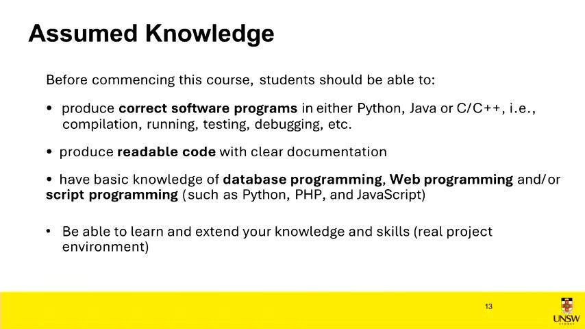

Before commencing this course, students should be able to:
- produce **correct software programs** in either Python, Java or C/C++, i.e., compilation, running, testing, debugging, etc.
- produce **readable code** with clear documentation
- have basic knowledge of **database programming**, **Web programming** and/or **script programming** (such as Python, PHP, and JavaScript)
- Be able to learn and extend your knowledge and skills (real project environment)

🇨🇳 假定已具备：能写出正确的程序（编译/运行/测试/调试）；能写可读、有文档的代码；了解数据库、Web、脚本编程；具备自学与扩展能力。

---

### 18 · Learning Outcomes
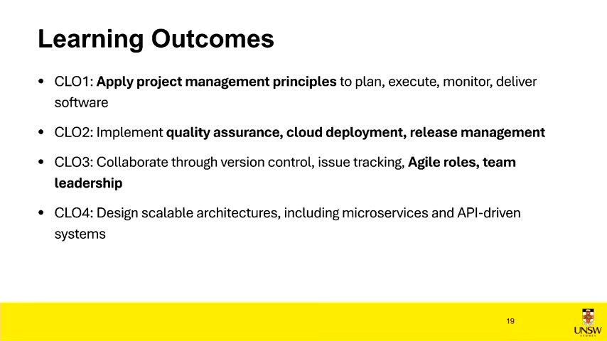

- CLO1: **Apply project management principles** to plan, execute, monitor, deliver software
- CLO2: Implement **quality assurance, cloud deployment, release management**
- CLO3: Collaborate through version control, issue tracking, **Agile roles, team leadership**
- CLO4: Design scalable architectures, including microservices and API-driven systems

🇨🇳 四个课程学习成果：应用 PM 原则规划/执行/监控/交付软件；实施质量保证、云部署、发布管理；通过版本控制、问题跟踪、Agile 角色协作；设计可扩展架构（微服务、API 驱动）。

💬 讲师补充：以上信息都在 Course Outline 里。此处停下来问问题。
**Q（学生）：幻灯片会发布吗？** A：会，课后发。讲师说他正在对幻灯片做大改版。

---

## Part 2. How the Project Works

### 19 · Section: How the Project Works
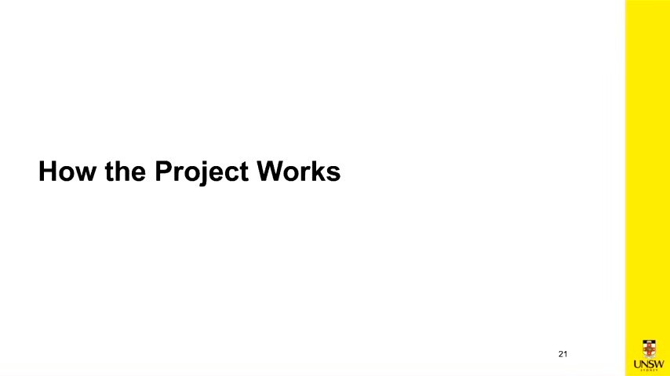

---

### 20 · Cohort Structure
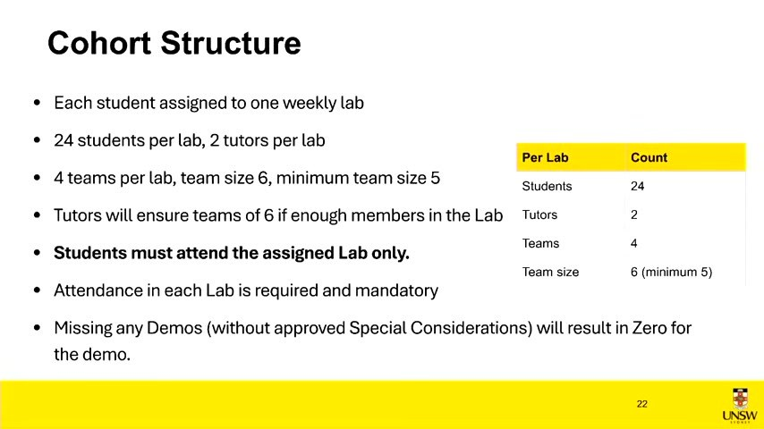

- Each student assigned to one weekly lab
- 24 students per lab, 2 tutors per lab
- 4 teams per lab, team size 6, minimum team size 5
- Tutors will ensure teams of 6 if enough members in the Lab
- **Students must attend the assigned Lab only.**
- Attendance in each Lab is required and mandatory
- Missing any Demos (without approved Special Considerations) will result in Zero for the demo.

| Per Lab | Count |
|---|---|
| Students | 24 |
| Tutors | 2 |
| Teams | 4 |
| Team size | 6 (minimum 5) |

🇨🇳 每人只属于一个 lab；每 lab 24 人、2 名导师、4 组、每组 6 人（至少 5）；导师会把人补满到 6；**只能参加自己的 lab**；出勤强制；无 SC 缺席 demo = 0 分。

💬 讲师补充：
- 和 capstone 一样是 6 人组（不是其它课的 3–4 人），让你提前适应。
- 每个 mentor 带 2 个团队一整个学期；另一名导师可以在某组占用时间过长时补位。
- 5 人组不算"封闭"：如果还有人没组，会被分进来。**不想被加人就自己凑满 6 人。**
- 第 1 周 lab 就做组队，错过第 1 周就失去和本 lab 同学面对面交流的机会。

---

### 21 · Team Formation
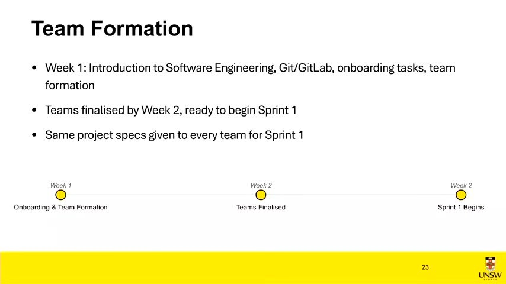

- Week 1: Introduction to Software Engineering, Git/GitLab, onboarding tasks, team formation
- Teams finalised by Week 2, ready to begin Sprint 1
- Same project specs given to every team for Sprint 1

Timeline: Week 1 Onboarding & Team Formation → Week 2 Teams Finalised → Week 2 Sprint 1 Begins

🇨🇳 第 1 周：软件工程/Git/GitLab 入门、onboarding、组队；第 2 周定组并开始 Sprint 1；Sprint 1 所有组用同一份需求。

💬 讲师补充：目标是第 1 周定组，但预计有些组到第 2 周才定；请尽量在第 2 周初完成，因为 Sprint 1 第 2 周就开始。Lab 会提供专门的组队活动和指南（技能自测），本讲后半部分还会讲团队动力学。

---

### 22 · Project Progression
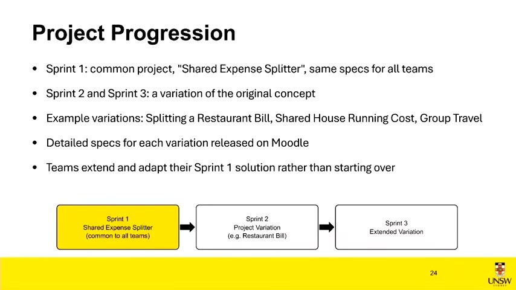

- Sprint 1: common project, "Shared Expense Splitter", same specs for all teams
- Sprint 2 and Sprint 3: a variation of the original concept
- Example variations: Splitting a Restaurant Bill, Shared House Running Cost, Group Travel
- Detailed specs for each variation released on Moodle
- Teams extend and adapt their Sprint 1 solution rather than starting over

Sprint 1 Shared Expense Splitter (common to all teams) → Sprint 2 Project Variation (e.g. Restaurant Bill) → Sprint 3 Extended Variation

🇨🇳 Sprint 1 全体做同一个"共享费用分摊器"；Sprint 2/3 各组选一个变体（餐厅分账、合租开销、团体旅行）；变体的详细规格发布在 Moodle；**Sprint 2/3 在 Sprint 1 的基础上扩展，不重来**。

💬 讲师补充：选"分账"是因为大家都经历过（一起吃饭分钱）。从 Sprint 2 起，团队"接管控制权"，自己定义所选主题的具体需求；Moodle 上的规格提供一个框架，避免跑偏。

---

### 23 · Section: Schedule


---

### 24 · Weekly Schedule
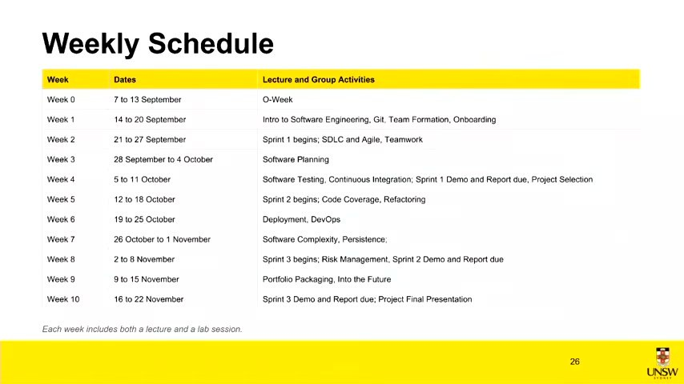

| Week | Dates | Lecture and Group Activities |
|---|---|---|
| Week 0 | 7 to 13 September | O-Week |
| Week 1 | 14 to 20 September | Intro to Software Engineering, Git, Team Formation, Onboarding |
| Week 2 | 21 to 27 September | Sprint 1 begins; SDLC and Agile, Teamwork |
| Week 3 | 28 September to 4 October | Software Planning |
| Week 4 | 5 to 11 October | Software Testing, Continuous Integration; Sprint 1 Demo and Report due, Project Selection |
| Week 5 | 12 to 18 October | Sprint 2 begins; Code Coverage, Refactoring |
| Week 6 | 19 to 25 October | Deployment, DevOps |
| Week 7 | 26 October to 1 November | Software Complexity, Persistence |
| Week 8 | 2 to 8 November | Sprint 3 begins; Risk Management, Sprint 2 Demo and Report due |
| Week 9 | 9 to 15 November | Portfolio Packaging, Into the Future |
| Week 10 | 16 to 22 November | Sprint 3 Demo and Report due; Project Final Presentation |

*Each week includes both a lecture and a lab session.*

🇨🇳 十周日程（见上表）。讲课内容尽量**提前一周**覆盖你下周项目要用的东西。

💬 讲师补充：所有主题都紧贴行业实践，对本课和 capstone 都是"高回报投资"。

---

## Part 3. Assessment Tasks Overview

### 25 · Section: Assessment Tasks Overview
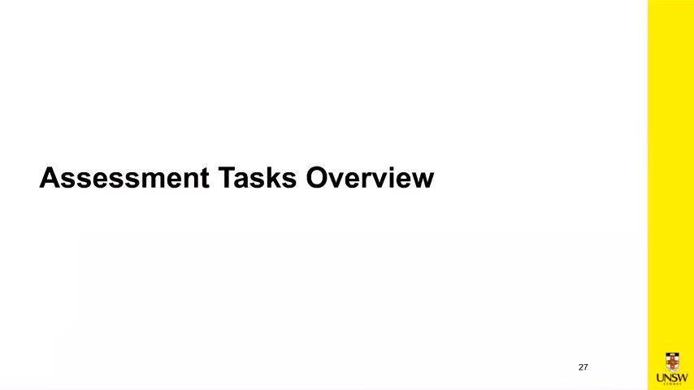

### 26 · Assessment Overview
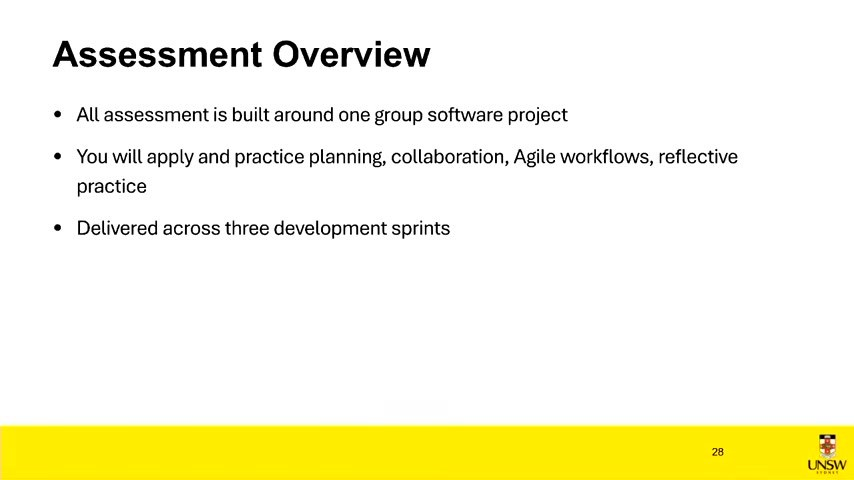

- All assessment is built around one group software project
- You will apply and practice planning, collaboration, Agile workflows, reflective practice
- Delivered across three development sprints

🇨🇳 所有考核围绕一个团队软件项目，分三个 sprint 交付。

💬 讲师补充：**没有考试**。讲师是项目式学习的拥护者，认为考试无法展示学生真正的才能。

---

### 27 · Weighting Summary
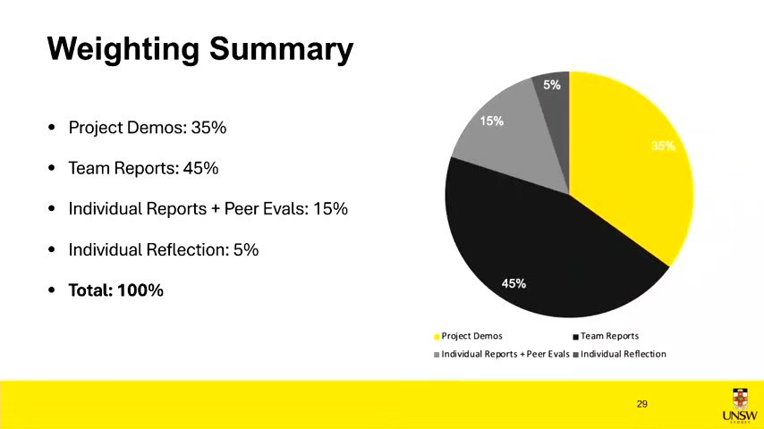

- Project Demos: 35%
- Team Reports: 45%
- Individual Reports + Peer Evals: 15%
- Individual Reflection: 5%
- **Total: 100%**

🇨🇳 按交付物分：项目演示 35%、团队报告 45%、个人报告+互评 15%、个人反思 5%。

---

### 28 · Sprint Breakdown
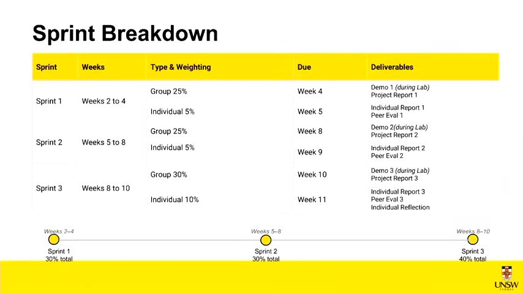

| Sprint | Weeks | Type & Weighting | Due | Deliverables |
|---|---|---|---|---|
| Sprint 1 | Weeks 2 to 4 | Group 25% | Week 4 | Demo 1 (during Lab), Project Report 1 |
| | | Individual 5% | Week 5 | Individual Report 1, Peer Eval 1 |
| Sprint 2 | Weeks 5 to 8 | Group 25% | Week 8 | Demo 2 (during Lab), Project Report 2 |
| | | Individual 5% | Week 9 | Individual Report 2, Peer Eval 2 |
| Sprint 3 | Weeks 8 to 10 | Group 30% | Week 10 | Demo 3 (during Lab), Project Report 3 |
| | | Individual 10% | Week 11 | Individual Report 3, Peer Eval 3, Individual Reflection |

Timeline: Weeks 2–4 Sprint 1 (30% total) · Weeks 5–8 Sprint 2 (30% total) · Weeks 8–10 Sprint 3 (40% total)

🇨🇳 三个 sprint；每个 sprint 团队部分（demo + 报告）在 sprint 最后一周 lab 交，个人部分（个人报告 + 互评）**顺延一周**交。

💬 讲师补充：
- 第 5 周是"缓冲周"：给一周时间思考变体、定义 Sprint 2/3 的 user stories；第 6 周是 flexi week，所以 Sprint 2 实际开发在第 7–8 周。
- 最后的个人反思（Individual Reflection）是对整个项目的回顾：ACS、Engineers Australia 等行业机构都要求工程师能反思自己的学习和实践。

---

### 29 · Assessment Structure
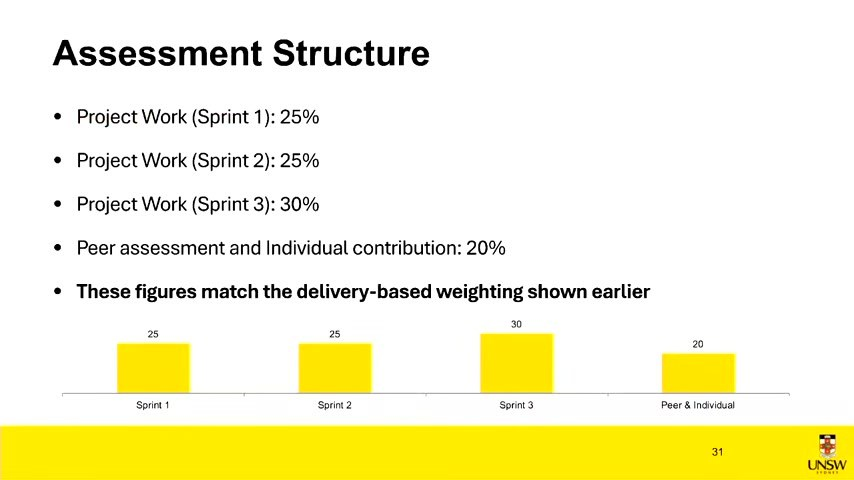

- Project Work (Sprint 1): 25%
- Project Work (Sprint 2): 25%
- Project Work (Sprint 3): 30%
- Peer assessment and Individual contribution: 20%
- **These figures match the delivery-based weighting shown earlier**

🇨🇳 按 sprint 分：25 / 25 / 30，个人贡献与互评合计 20（5+5+10）。与前面按交付物的 35/45/15/5 是同一件事的两种切分。

💬 讲师补充：详细考核说明会尽快发到 Moodle。

---

### 30 · Types of Assessments
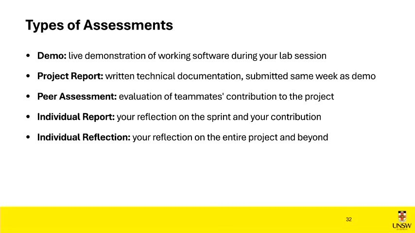

- **Demo:** live demonstration of working software during your lab session
- **Project Report:** written technical documentation, submitted same week as demo
- **Peer Assessment:** evaluation of teammates' contribution to the project
- **Individual Report:** your reflection on the sprint and your contribution
- **Individual Reflection:** your reflection on the entire project and beyond

🇨🇳 五种考核形式：lab 内现场演示；与 demo 同周提交的技术文档；对队友贡献的互评；对本 sprint 的个人报告；对整个项目的个人反思。

💬 讲师补充：互评是业界通行做法，帮助你从他人反馈中改进。个人贡献除了报告，还会通过工具（GitLab）和 mentor 观察来核实。

---

### 31 · Assessment – GenAI Level
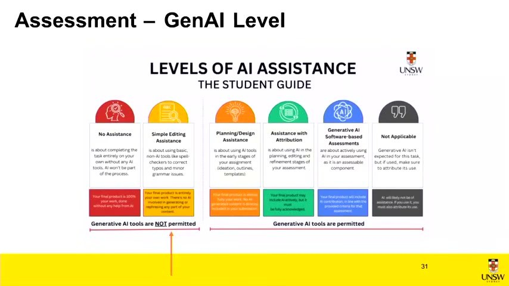

**LEVELS OF AI ASSISTANCE – THE STUDENT GUIDE (UNSW)**

| Level | 说明 |
|---|---|
| No Assistance | completing the task entirely on your own without any AI tools |
| **Simple Editing Assistance** ← 本课采用 | using basic, non-AI tools like spell-checkers to correct typos and minor grammar issues |
| Planning/Design Assistance | using AI tools in the early stages (ideation, outlines, templates) |
| Assistance with Attribution | using AI in the planning, editing and refinement stages |
| Generative AI Software-based Assessments | actively using AI in your assessment, as it is an assessable component |
| Not Applicable | Generative AI isn't expected for this task |

Generative AI tools are **NOT** permitted: No Assistance, Simple Editing Assistance. Permitted: the other levels.

🇨🇳 UNSW 的 AI 使用六级量表。**本课处于第二级"Simple Editing Assistance"，即不允许使用生成式 AI。**

💬 讲师补充：面试时你要证明"为什么还需要人类"。可以和 AI agent 合作，但要有人来领导它们。本课要练的是**在团队环境中用一套实践和工具协作**，这是 AI 给不了你的技能。

---

### 32 · Assessment – GenAI Level: Simple editing assistance
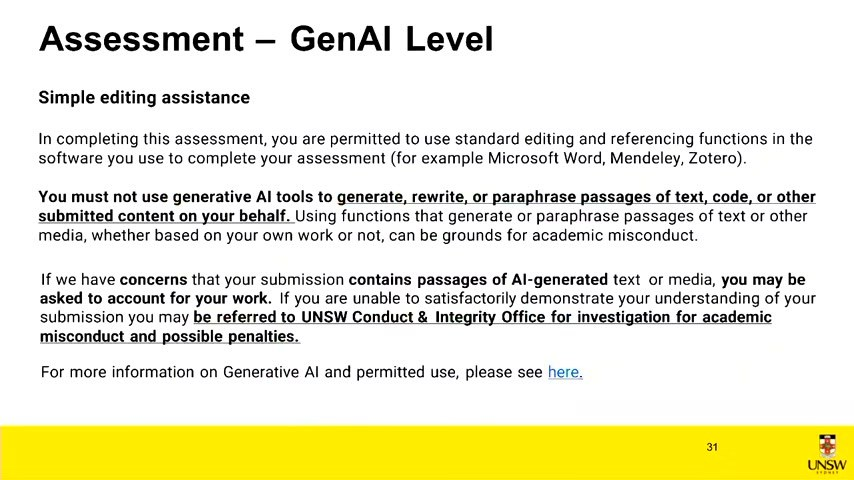

**Simple editing assistance**

In completing this assessment, you are permitted to use standard editing and referencing functions in the software you use to complete your assessment (for example Microsoft Word, Mendeley, Zotero).

**You must not use generative AI tools to generate, rewrite, or paraphrase passages of text, code, or other submitted content on your behalf.** Using functions that generate or paraphrase passages of text or other media, whether based on your own work or not, can be grounds for academic misconduct.

If we have **concerns** that your submission **contains passages of AI-generated** text or media, **you may be asked to account for your work.** If you are unable to satisfactorily demonstrate your understanding of your submission you may **be referred to UNSW Conduct & Integrity Office for investigation for academic misconduct and possible penalties.**

For more information on Generative AI and permitted use, please see here.

🇨🇳 允许：Word 拼写检查、Mendeley/Zotero 等引用工具。**禁止：用生成式 AI 生成、改写、转述文本、代码或其它提交内容。** 若被怀疑含 AI 生成内容，可能被要求解释；无法解释则移交 Conduct & Integrity Office。

---

### 33 · Generative AI – practical implications
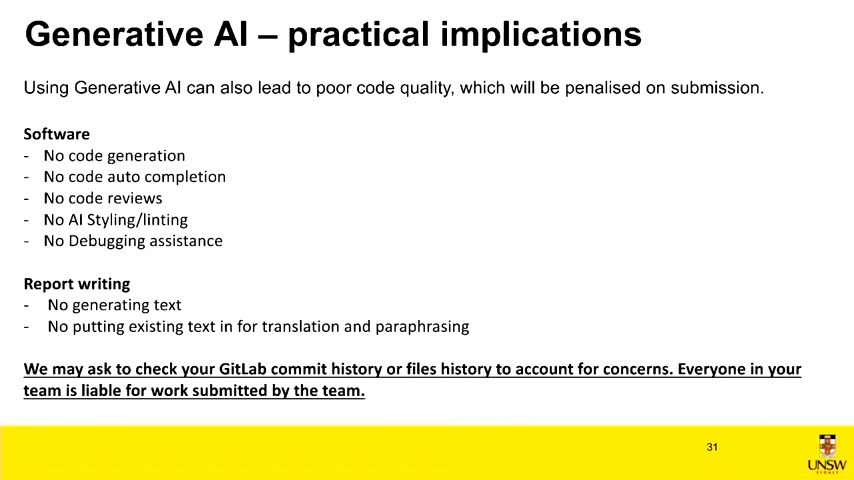

Using Generative AI can also lead to poor code quality, which will be penalised on submission.

**Software**
- No code generation
- No code auto completion
- No code reviews
- No AI Styling/linting
- No Debugging assistance

**Report writing**
- No generating text
- No putting existing text in for translation and paraphrasing

**We may ask to check your GitLab commit history or files history to account for concerns. Everyone in your team is liable for work submitted by the team.**

🇨🇳 具体禁令：代码方面不许 AI 生成、自动补全、代码审查、AI 格式化/lint、调试辅助；报告方面不许生成文本、不许把已有文本喂给 AI 翻译或改写。**可能会查 GitLab 提交历史；团队提交的内容全员连带负责。**

💬 讲师补充：这也是公司在做的——通过 GitLab / 跟踪系统看"谁做了什么"来确认每个人真的在贡献。

---

### 34 · Advice for doing well in this course
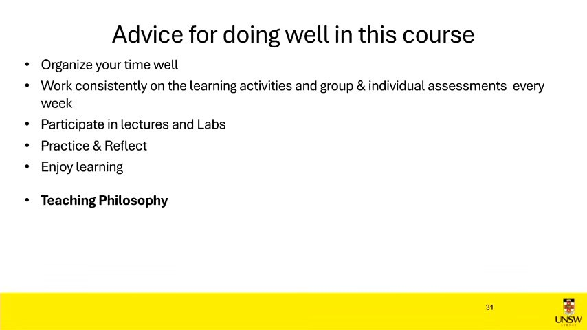

- Organize your time well
- Work consistently on the learning activities and group & individual assessments every week
- Participate in lectures and Labs
- Practice & Reflect
- Enjoy learning
- **Teaching Philosophy**

🇨🇳 建议：管理好时间；每周持续投入；参加讲座和 lab；练习并反思；享受学习。

💬 讲师补充：
- 学的是软件管理，时间管理是关键，别拖到最后一刻；遵循 Scrum/Agile 会让生活轻松。
- 学生常问"一定要做 stand-up 吗？" —— 公司确实在做，可能是变体；你把标准实践学好了，到公司遇到变体也能适应。
- 教学理念：**involve students to learn, not teach them to remember**，所以不设考试；学习以你为中心，你每周的投入至关重要。

---

## Part 4. Links to COMP9900

### 35 · Section: Links to COMP9900 (Industry Capstone Projects)
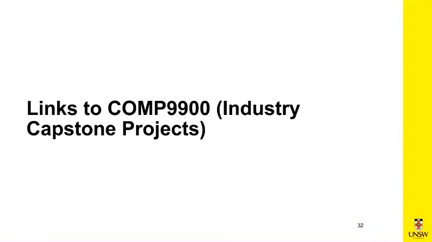

💬 讲师补充：讲师 2024 年初把 COMP3900/9900 改造成行业 capstone，之后不断演进并扩展到大规模学生。

---

### 36 · Capstone Projects – Closing the Gap
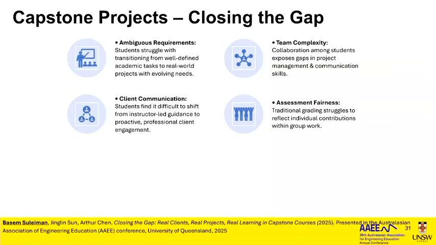

- **Ambiguous Requirements:** Students struggle with transitioning from well-defined academic tasks to real-world projects with evolving needs.
- **Team Complexity:** Collaboration among students exposes gaps in project management & communication skills.
- **Client Communication:** Students find it difficult to shift from instructor-led guidance to proactive, professional client engagement.
- **Assessment Fairness:** Traditional grading struggles to reflect individual contributions within group work.

*Basem Suleiman, Jinglin Sun, Arthur Chen. Closing the Gap: Real Clients, Real Projects, Real Learning in Capstone Courses (2025). Presented in the Australasian Association of Engineering Education (AAEE) conference, University of Queensland, 2025*

🇨🇳 Capstone 要解决的四个差距：需求模糊（真实项目需求会变）、团队复杂性、客户沟通（从"老师带"转到主动专业地与客户打交道）、考核公平性（如何反映个人贡献）。

💬 讲师补充：传统课程会把需求写得"完美清晰"，但真实客户需要你自己去弄清楚问题。本课没有真实客户，**导师会同时戴"导师"和"客户"两顶帽子**给你反馈。

---

### 37 · Capstone Projects – Closing the Gap (Challenge)
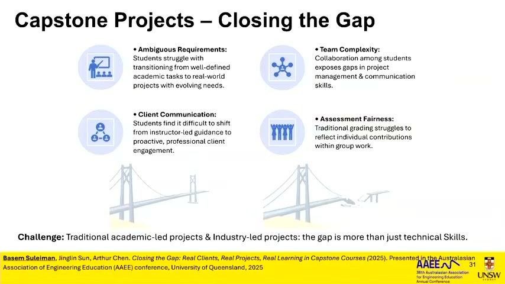

**Challenge:** Traditional academic-led projects & Industry-led projects: the gap is more than just technical Skills.

🇨🇳 学术项目与行业项目之间的差距不只是技术技能。这个模型已发表论文（2024 年）并在 2025 年欧洲的会议上做了新版报告，很多学者感兴趣。

---

### 38 · Capstone Project Framework for Authentic Industry Experience
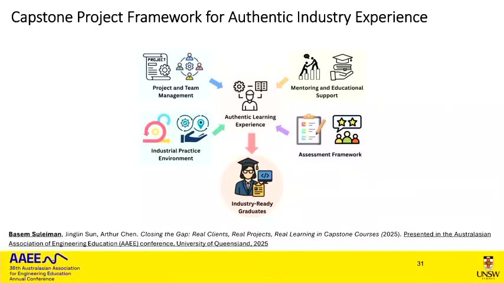

Authentic Learning Experience（中心）由四个部分支撑：
- Project and Team Management
- Mentoring and Educational Support
- Industrial Practice Environment
- Assessment Framework
→ Industry-Ready Graduates

🇨🇳 Capstone 框架：以学生为中心，通过项目与团队管理、辅导与教育支持、工业实践环境、考核框架四个组件构建真实学习体验，培养"工业就绪"的毕业生。本课就是进入该体系前的准备。

---

### 39–40 · Industry Projects – Success Stories: Atlassian
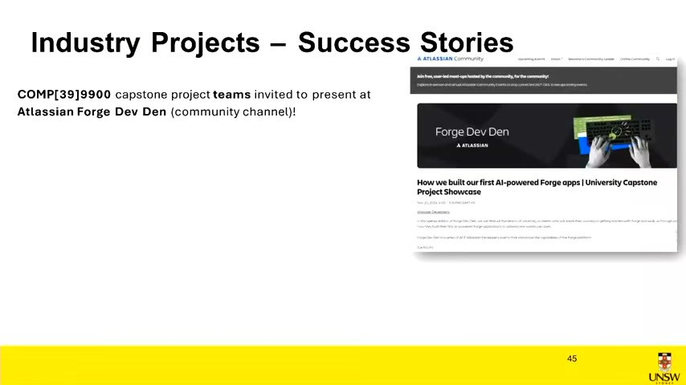
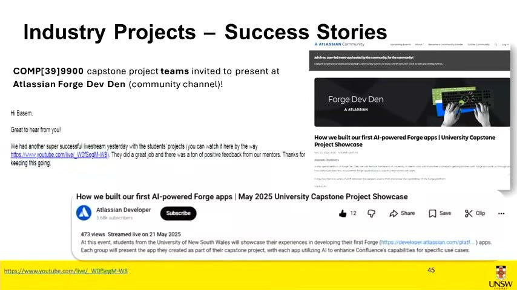

COMP[39]9900 capstone project **teams** invited to present at **Atlassian Forge Dev Den** (community channel)!

> "How we built our first AI-powered Forge apps | University Capstone Project Showcase" — Atlassian Developer, streamed live on 21 May 2025
> Hi Basem, Great to hear from you! We had another super successful livestream yesterday with the students' projects … They did a great job and there was a ton of positive feedback from our mentors. Thanks for keeping this going.

🇨🇳 Atlassian 每学期提供 5 个项目，学生构建 Forge 应用（Atlassian 正在做的 AI 服务），成果被邀请到 Atlassian 社区直播展示。

---

### 41 · Success Stories: The Royal Hospital for Women
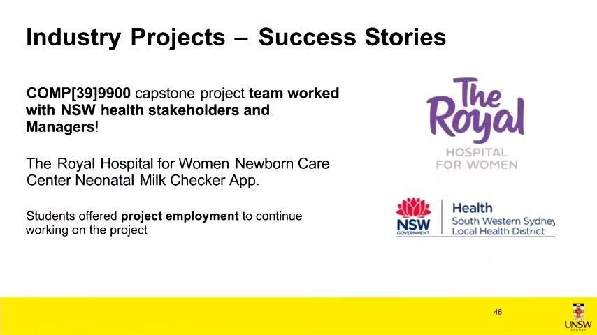

COMP[39]9900 capstone project **team worked with NSW health stakeholders and Managers!**
The Royal Hospital for Women Newborn Care Center Neonatal Milk Checker App.
Students offered **project employment** to continue working on the project.

🇨🇳 与 NSW Health 合作的新生儿母乳检查 App，医院希望部署使用，学生获得项目雇佣。

---

### 42 · Success Stories: Publication
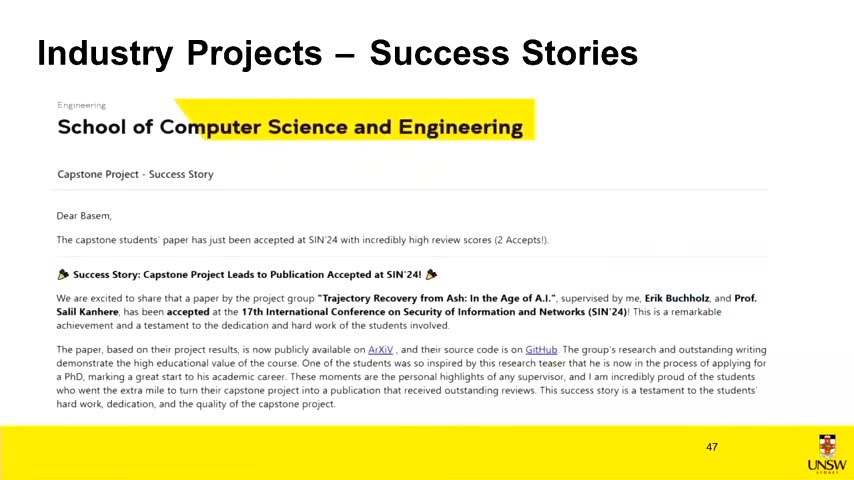

> **Success Story: Capstone Project Leads to Publication Accepted at SIN'24!**
> A paper by the project group "Trajectory Recovery from Ash: In the Age of A.I.", supervised by Erik Buchholz and Prof. Salil Kanhere, has been accepted at the 17th International Conference on Security of Information and Networks (SIN'24) … One of the students was so inspired by this research teaser that he is now in the process of applying for a PhD.

🇨🇳 校内客户项目产出论文并被 SIN'24 接收；有学生因此获得全额奖学金读博。

---

### 43 · Student's Testimonials
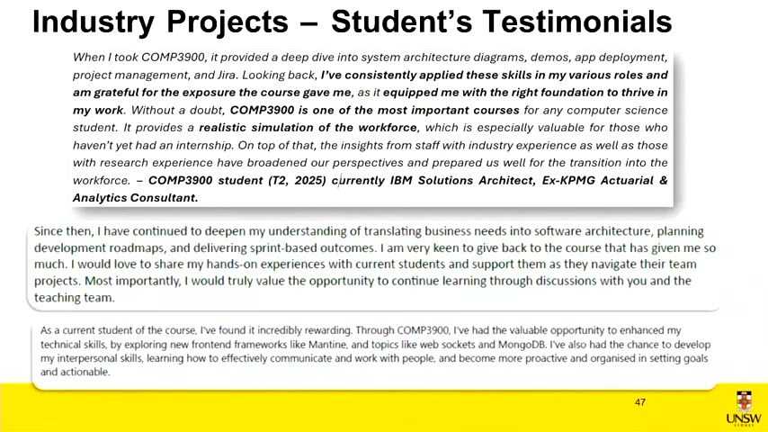

> "When I took COMP3900, it provided a deep dive into system architecture diagrams, demos, app deployment, project management, and Jira. Looking back, I've consistently applied these skills in my various roles … COMP3900 is one of the most important courses for any computer science student. It provides a realistic simulation of the workforce…" – COMP3900 student (T2, 2025) currently IBM Solutions Architect, Ex-KPMG Actuarial & Analytics Consultant.

（另两段：毕业生希望回来分享经验；在读生表示通过 Mantine、WebSocket、MongoDB 等提升了技术和沟通能力。）

🇨🇳 学生反馈：毕业后进入公司才体会到这门课的价值。

---

### 44 · Clients Feedback
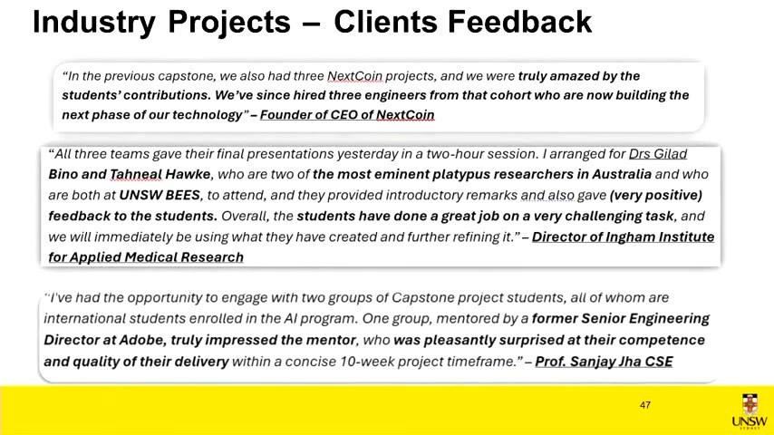

> "…we were truly amazed by the students' contributions. We've since hired three engineers from that cohort…" – Founder of CEO of NextCoin
> "…the students have done a great job on a very challenging task, and we will immediately be using what they have created…" – Director of Ingham Institute for Applied Medical Research
> "One group, mentored by a former Senior Engineering Director at Adobe, truly impressed the mentor…" – Prof. Sanjay Jha CSE

🇨🇳 客户反馈：有客户直接雇了 3 名学生；医疗研究所立刻投入使用学生成果。

💬 讲师补充：课程介绍到此结束，休息 5 分钟；可以边吃晚饭边听。休息期间有学生私下问 lab/时间表问题，讲师建议邮件问 Daniel；直播问题他已上报 AV 团队。

---

## Part 5. Software Engineering Introduction

### 45 · Section: Software Engineering / Development – Introduction
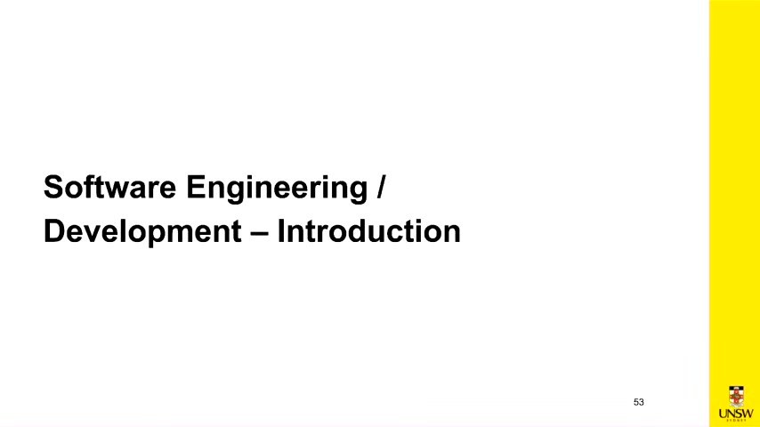

💬 讲师补充：这部分内容你可能在其它课学过，目的是让**所有人站在同一起跑线**。Capstone 里最大的问题就是"我队友不会前端/后端/Git/Docker"，造成大量矛盾。单人做事容易，**六人团队 + Scrum + Jira/GitLab** 时复杂性才会浮现——这才是本课要你关注的体验。软件质量来自团队协作地遵循流程；一个成员不信 Scrum 价值观就会拖累整队。

---

### 46 · Software is Everywhere!
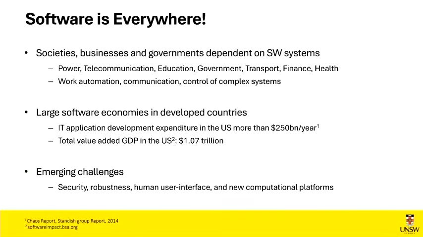

- Societies, businesses and governments dependent on SW systems
  - Power, Telecommunication, Education, Government, Transport, Finance, Health
  - Work automation, communication, control of complex systems
- Large software economies in developed countries
  - IT application development expenditure in the US more than $250bn/year¹
  - Total value added GDP in the US²: $1.07 trillion
- Emerging challenges
  - Security, robustness, human user-interface, and new computational platforms

¹ Chaos Report, Standish group Report, 2014 · ² softwareimpact.bsa.org

🇨🇳 软件无处不在：社会、企业、政府都依赖软件系统；美国每年软件开发支出超 2500 亿美元；新挑战包括安全、健壮性、人机界面、新计算平台。

💬 讲师补充：想象你写的软件在管理电厂、几十亿用户的通讯 App、红绿灯或航班——上周英国航班就因软件问题大面积延误取消。这就是为什么要遵循严格的开发流程。建桥的工程师有严格流程是因为涉及人命；软件也一样（连建筑设计都靠软件）。软件工程师仍是美国等国增长最快的职业之一。

---

### 47 · What is Software Engineering?
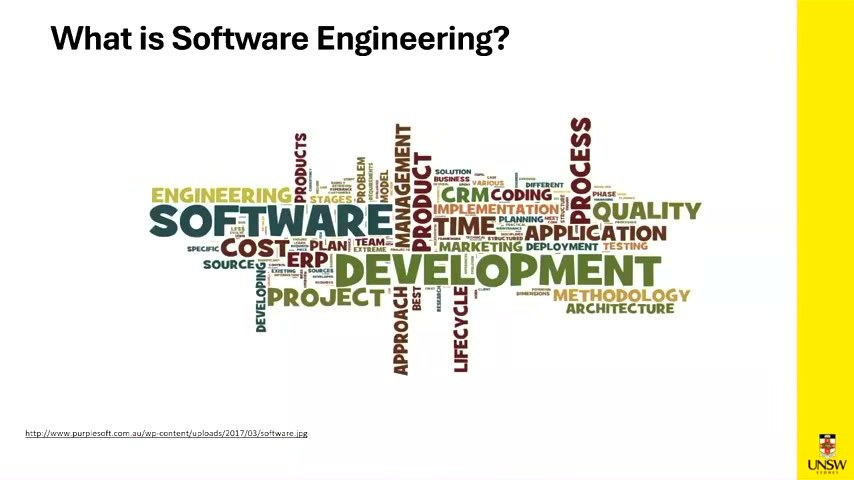

（词云：SOFTWARE, DEVELOPMENT, PROCESS, QUALITY, PRODUCT, MANAGEMENT, PROJECT, LIFECYCLE, TIME, COST, APPLICATION, METHODOLOGY, ARCHITECTURE, REQUIREMENTS, TESTING, DEPLOYMENT, PLANNING …）

🇨🇳 问"什么是软件工程"，大家最先想到 development，但开发只是其中一项。

💬 讲师补充：在写代码之前，必须先深刻理解问题、需求、用户，设计健壮的架构。很多人低估了软件工程，以为它就是开发。

---

### 48 · Why Software Engineering?
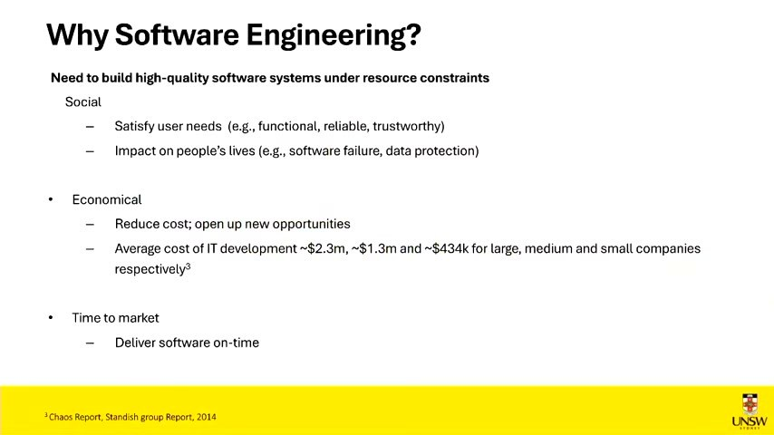

**Need to build high-quality software systems under resource constraints**
- Social
  - Satisfy user needs (e.g., functional, reliable, trustworthy)
  - Impact on people's lives (e.g., software failure, data protection)
- Economical
  - Reduce cost; open up new opportunities
  - Average cost of IT development ~$2.3m, ~$1.3m and ~$434k for large, medium and small companies respectively³
- Time to market
  - Deliver software on-time

³ Chaos Report, Standish group Report, 2014

🇨🇳 为什么需要软件工程：在资源约束下构建高质量软件。社会层面（满足用户需求、可靠可信、影响生活）；经济层面（降低成本、开辟机会；大/中/小公司平均 IT 开发成本 230 万/130 万/43.4 万美元）；上市时间（按时交付）。

💬 讲师补充：有些项目做了很多年、花了很多钱，最后没有产出任何能用的东西；现在 AI 领域的"抢先上市"竞赛更是如此。

---

### 49–50 · Software Engineering (definition)
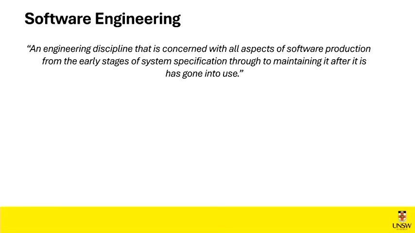
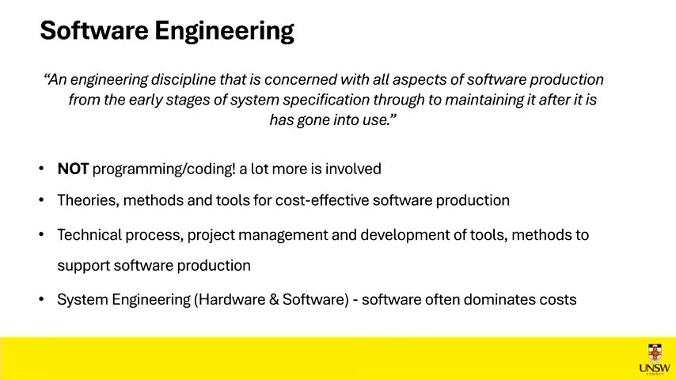

> "An engineering discipline that is concerned with all aspects of software production from the early stages of system specification through to maintaining it after it has gone into use."

- **NOT** programming/coding! a lot more is involved
- Theories, methods and tools for cost-effective software production
- Technical process, project management and development of tools, methods to support software production
- System Engineering (Hardware & Software) - software often dominates costs

🇨🇳 定义（Sommerville）：关注软件生产全部环节的工程学科，从系统规格说明的早期阶段直到投入使用后的维护。**不等于编程**；包括理论、方法、工具；技术流程、项目管理；系统工程中软件往往主导成本。

💬 讲师补充：要按工程学科的方式管理和监控所有环节，而不是随意/临时(ad hoc)地做。需求定义、测试方法、工具选择等背后有大量决策。机器人、IoT 等软硬件结合的场景使问题更复杂。

---

### 51 · The Software Development Process
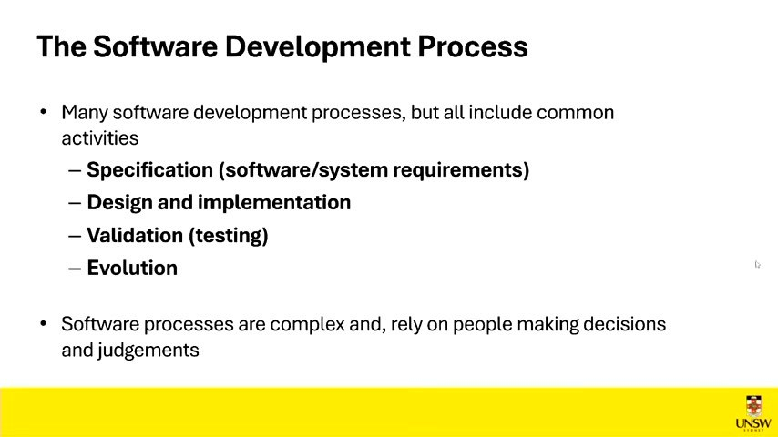

- Many software development processes, but all include common activities
  - **Specification (software/system requirements)**
  - **Design and implementation**
  - **Validation (testing)**
  - **Evolution**
- Software processes are complex and, rely on people making decisions and judgements

🇨🇳 所有软件开发流程都包含四类共同活动：规格说明（需求）、设计与实现、验证（测试）、演进。软件流程复杂，依赖人的决策和判断。

💬 讲师补充：
- 类比做蛋糕：同样的步骤，两个人做出的蛋糕味道和质量不同。
- 规格 = 软件的预期行为；设计 = 用记号表达实现前的结构；测试类型很多，后面专门一讲；**演进** = 软件可能存活几十年，设计时就要考虑可扩展、可维护，不能做成"刚性"的。
- 每个阶段都可以自成一门课；人是关键因素——工具帮你写需求、测试，但**测什么、为什么测**要人来想。
- 有趣的事实：没人能说软件 100% 可靠，十年后还可能发现新 bug。

---

### 52 · Software (Development) Process Models
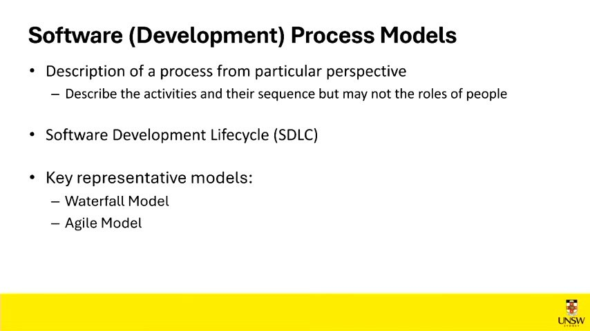

- Description of a process from particular perspective
  - Describe the activities and their sequence but may not the roles of people
- Software Development Lifecycle (SDLC)
- Key representative models:
  - Waterfall Model
  - Agile Model

🇨🇳 过程模型 = 从某个视角描述流程（活动及其顺序，不一定包含人的角色）；即 SDLC；两个代表：瀑布模型、敏捷模型。

---

### 53 · Spot the Differences – Software Development Models
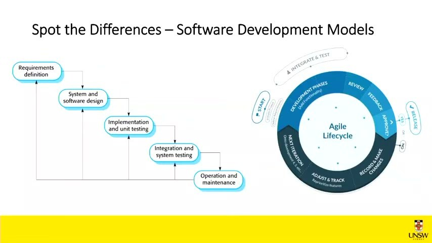

左：瀑布（Requirements definition → System and software design → Implementation and unit testing → Integration and system testing → Operation and maintenance）；右：Agile Lifecycle 环（Start → Development phases → Integrate & Test → Review → Feedback → Approve? → Release / Record & make changes → Adjust & Track → Next iteration）。

💬 讲师补充：课堂互动——扫码进 **slido.com，code 2804174**，用关键词描述瀑布模型。

---

### 54 · Waterfall Software Development Model
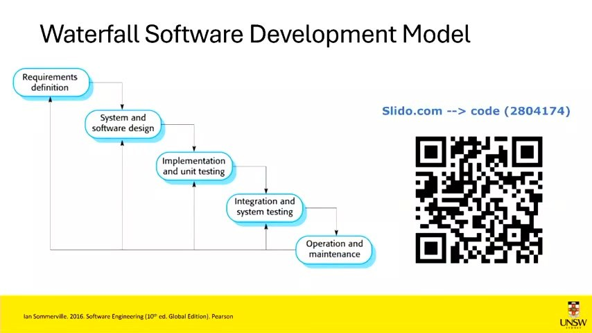

Requirements definition → System and software design → Implementation and unit testing → Integration and system testing → Operation and maintenance（每级有回退的反馈箭头）
*Ian Sommerville. 2016. Software Engineering (10th ed. Global Edition). Pearson*

Slido.com --> code (2804174)

🇨🇳 瀑布模型：需求定义 → 系统与软件设计 → 实现与单元测试 → 集成与系统测试 → 运行与维护。

---

### 55 · Slido 结果：Describe the Waterfall model
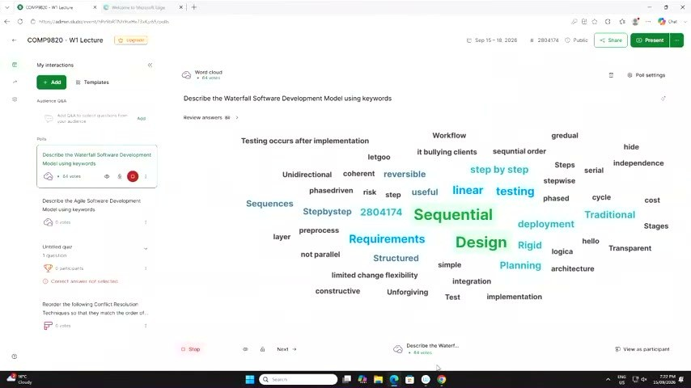

学生词云（84 票）：**Sequential**、Design、Requirements、linear、testing、step by step、Rigid、Planning、Traditional、Structured、Stepbystep、limited change flexibility、Testing occurs after implementation、Unidirectional、phasedriven、reversible、Workflow、deployment、integration、architecture、Unforgiving …（有人把 slido 码 2804174 当成答案输入了）

💬 讲师补充：
- 先讲一个团队协作的道理：同一个观点大家表达方式不同，甚至对概念的理解不同，**团队要先对齐认知**。
- 瀑布模型下：专门的需求工程团队花**数月**写出 SRS（软件需求规格说明），交给设计团队翻译成 UML 等设计，再交给开发团队实现——你可能就是那个拿到一堆设计图被要求实现的人。
- 每个阶段都试图"做到完美再进入下一阶段"，**不处理不确定性**；后期发现问题要反馈回起点重做，代价巨大——这就是"刚性、不灵活"。它统治了很长时间，也催生了 Agile。

---

### 56 · Agile Software Development Process Model
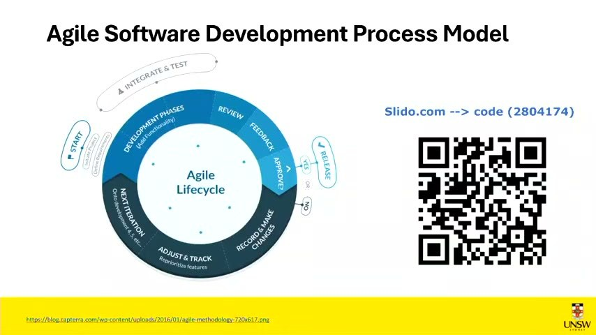

Agile Lifecycle：Start (Gather requirements) → Development phases (Add functionality) → Integrate & Test → Review → Feedback → Approve? Yes → Release / No → Record & Make Changes → Adjust & Track (Reprioritize features) → Next Iteration (Deliver updates & fixes)
*https://blog.capterra.com/wp-content/uploads/2016/01/agile-methodology-720x617.png*

🇨🇳 敏捷生命周期：收集需求（不必完整） → 开发一小批功能 → 集成测试 → 评审 → 收集客户/用户反馈 → 批准则发布，否则记录改动 → 调整优先级 → 下一次迭代。

---

### 57 · Slido 结果：Describe the Agile model
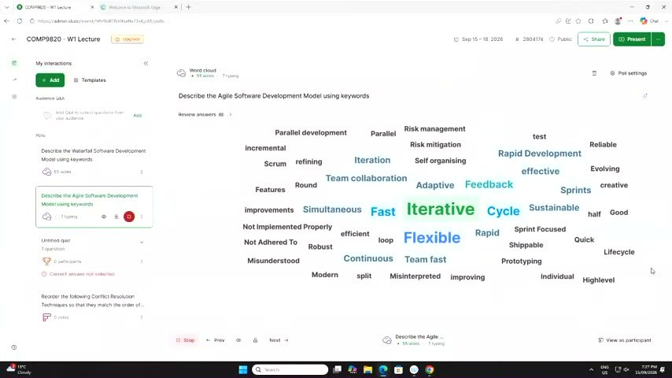

学生词云（55 票）：**Iterative**、Flexible、Fast、Cycle、Continuous、Feedback、Adaptive、Team collaboration、Sprints、Rapid Development、Sustainable、incremental、Scrum、Iteration、Risk management、Self organising、Prototyping、Parallel development、Evolving、Team fast …

💬 讲师补充：
- Agile 是为了修复瀑布的问题而生；关键词是 **iterative and incremental development**。你们的项目就是 3 个迭代（sprint）。
- 流程：需求不必完美，可以随时间演进；挑一些 user stories 在 1–3 周的固定 sprint 内做；开发+集成是最长的阶段；结束时评审并向客户/最终用户收集反馈；反馈通过就发布，否则记录变更、在下一迭代调整；下一迭代可能是"上一轮的修改 + 新功能"的混合。
- 本课使用 Agile 中的 **Scrum**，后续详细讲。

---

## Part 6. Version Control – Introduction to Git

### 58 · Section: Version Control – Introduction to Git
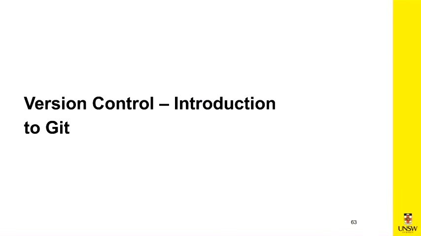

💬 讲师补充：软件由很多文件组成，团队协作时"谁改了什么、最新版本是哪个、能否回滚"变得非常复杂。想想两个人在 Google Docs 上改一份报告、接受/拒绝修订有多麻烦——代码文件更多、更复杂，所以需要版本控制。

---

### 59 · What is Version Control?
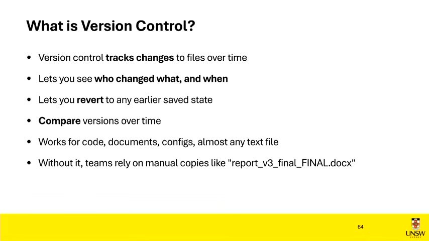

- Version control **tracks changes** to files over time
- Lets you see **who changed what, and when**
- Lets you **revert** to any earlier saved state
- **Compare** versions over time
- Works for code, documents, configs, almost any text file
- Without it, teams rely on manual copies like "report_v3_final_FINAL.docx"

🇨🇳 版本控制：跟踪文件随时间的变化；看到谁在何时改了什么；回退到任意历史状态；比较版本；适用于代码、文档、配置等文本文件；没有它就只能靠 "report_v3_final_FINAL.docx" 这种手工副本。

💬 讲师补充：团队里每人负责一个 user story / task（通过工单系统分配），Git 能追踪谁提交了什么；某次改动引入 bug 时可以定位并回滚。

---

### 60 · What is Git?
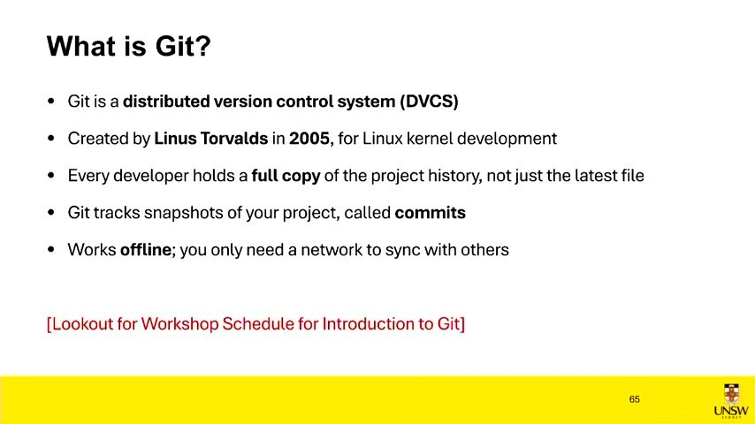

- Git is a **distributed version control system (DVCS)**
- Created by **Linus Torvalds** in **2005**, for Linux kernel development
- Every developer holds a **full copy** of the project history, not just the latest file
- Git tracks snapshots of your project, called **commits**
- Works **offline**; you only need a network to sync with others

[Lookout for Workshop Schedule for Introduction to Git]

🇨🇳 Git 是分布式版本控制系统；2005 年 Linus Torvalds 为 Linux 内核开发而创建；每个开发者持有完整历史副本；以快照（commit）方式记录；可离线工作，只在同步时需要网络。**留意 Git 入门 workshop 的时间表。**

💬 讲师补充：Git 既可以一个人用来管理自己的版本，也可以团队用——各自持有分布式副本，共享一个中央仓库提交变更。Git 内部把每次增改作为对象跟踪，通过快照间的 delta 快速定位变化。**第一次 lab 就是 Git 命令的动手练习。**

---

### 61 · Why Git for Collaboration
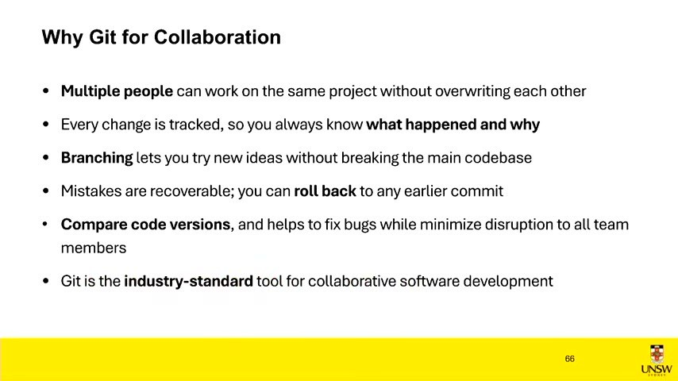

- **Multiple people** can work on the same project without overwriting each other
- Every change is tracked, so you always know **what happened and why**
- **Branching** lets you try new ideas without breaking the main codebase
- Mistakes are recoverable; you can **roll back** to any earlier commit
- **Compare code versions**, and helps to fix bugs while minimize disruption to all team members
- Git is the **industry-standard** tool for collaborative software development

🇨🇳 多人协作不互相覆盖；每次变更都有记录（commit message 说明为什么）；分支让你在不破坏主线的情况下尝试；可回滚；可比较版本；业界标准。

💬 讲师补充（分支的直观解释）：把开发想成一条主线（main line）。A 从主线拉一个分支修 bug X，B 拉另一个分支加功能 Y，两人各自本地工作，主线始终可运行；完成后各自 merge 回主线进入下一个发布。**merge 前先构建、测试，确认不会破坏主线**；出问题就回滚。这样 5、6、10 甚至上百人可以互不影响地工作。没有 Git 你就得自己解决"如何不互相覆盖、如何回滚"的问题，精力从写代码转移到解决这些问题上。

---

### 62 · Installing and Configuring Git
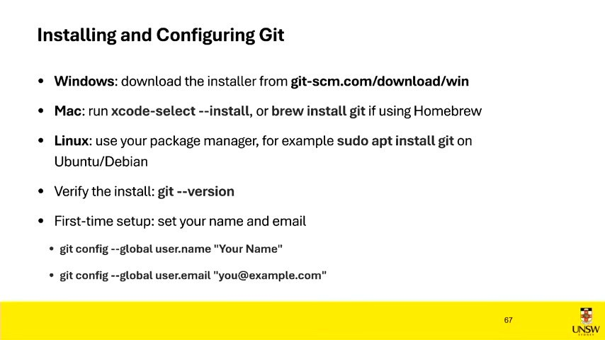

- **Windows**: download the installer from **git-scm.com/download/win**
- **Mac**: run **xcode-select --install**, or **brew install git** if using Homebrew
- **Linux**: use your package manager, for example **sudo apt install git** on Ubuntu/Debian
- Verify the install: **git --version**
- First-time setup: set your name and email

```bash
git config --global user.name "Your Name"
git config --global user.email "you@example.com"
```

🇨🇳 三大平台安装方式；`git --version` 验证；首次设置用户名和邮箱，这样每次提交都能追溯到你。

💬 讲师补充：设置 user.name / user.email 是"谁做了什么"追踪的基础，加入团队时做一次即可。lab 会有更多动手内容。

📋 Lab 中的具体做法（来自 Week 1 Lab Slides，与本页有出入处以 lab 为准）：
- **Windows 必须用 WSL**（`wsl --install`，重启后从开始菜单打开 Ubuntu，Git 装在 Ubuntu 里：`sudo apt update && sudo apt install git`）。项目要跑 Web 应用、数据库、容器和 CI，Git for Windows "能撑过今天，撑不过项目"。装不完就先用 VLAB，回家装好后重做一遍 lab。
- macOS：`xcode-select --install`；Linux：发行版包管理器。
- 配置是**四条**，不只两条；邮箱用 zID 邮箱：

```bash
git config --global user.name "Your Full Name"
git config --global user.email "z1234567@unsw.edu.au"
git config --global pull.rebase false
git config --global core.editor "nano"     # 防止 Git 打开 Vim
git config --global --list                 # 检查
```

---

### 63 · Key Concepts Before the Commands
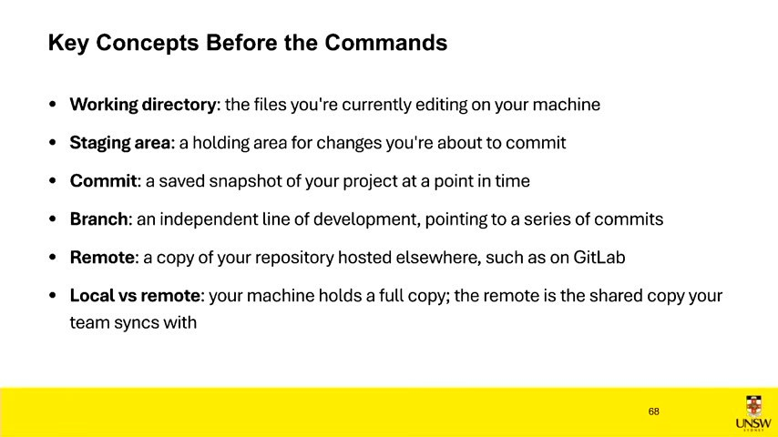

- **Working directory**: the files you're currently editing on your machine
- **Staging area**: a holding area for changes you're about to commit
- **Commit**: a saved snapshot of your project at a point in time
- **Branch**: an independent line of development, pointing to a series of commits
- **Remote**: a copy of your repository hosted elsewhere, such as on GitLab
- **Local vs remote**: your machine holds a full copy; the remote is the shared copy your team syncs with

🇨🇳 关键概念：工作目录（正在编辑的文件）；暂存区（准备提交但尚未提交）；commit（某时刻的快照）；分支（独立的开发线）；远程仓库（托管在 GitLab 等处的副本）；本地 vs 远程（本机有完整副本，远程是团队共享的副本）。

---

### 64 · Git Concepts
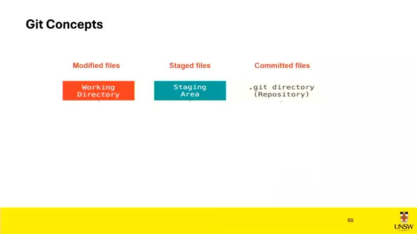

| Modified files | Staged files | Committed files |
|---|---|---|
| Working Directory | Staging Area | .git directory (Repository) |

🇨🇳 文件的三种状态对应三个区域：已修改（工作目录）→ 已暂存（暂存区）→ 已提交（.git 仓库）。

---

### 65 · Git – Basic Workflow
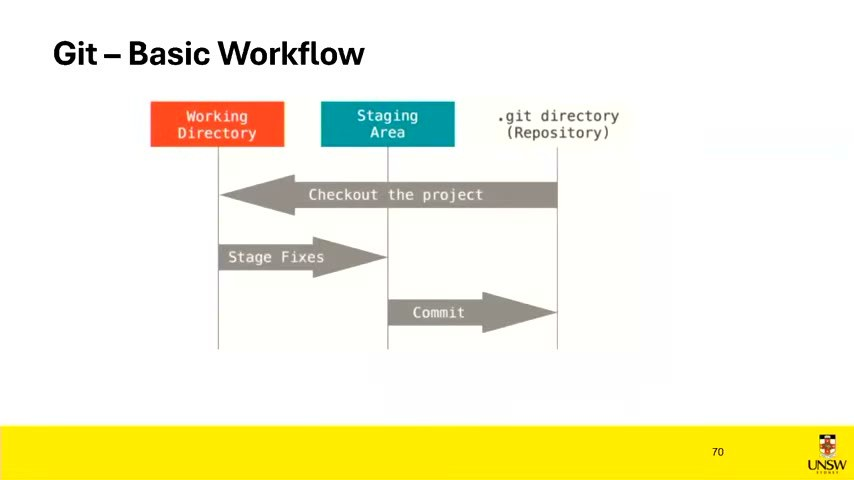

Working Directory ← **Checkout the project** ← .git directory (Repository)
Working Directory → **Stage Fixes** → Staging Area
Staging Area → **Commit** → .git directory (Repository)

🇨🇳 基本工作流：从仓库 checkout 到工作目录 → 编辑后 stage 到暂存区 → commit 进仓库。

💬 讲师补充：`git init` 让一个文件夹成为仓库并开始跟踪。关键是时刻清楚自己处于哪个阶段——"我在工作目录编辑，还没 commit；add 之后进暂存区；commit 后才被跟踪成新版本"。

---

### 66 · How You'll Work with Git
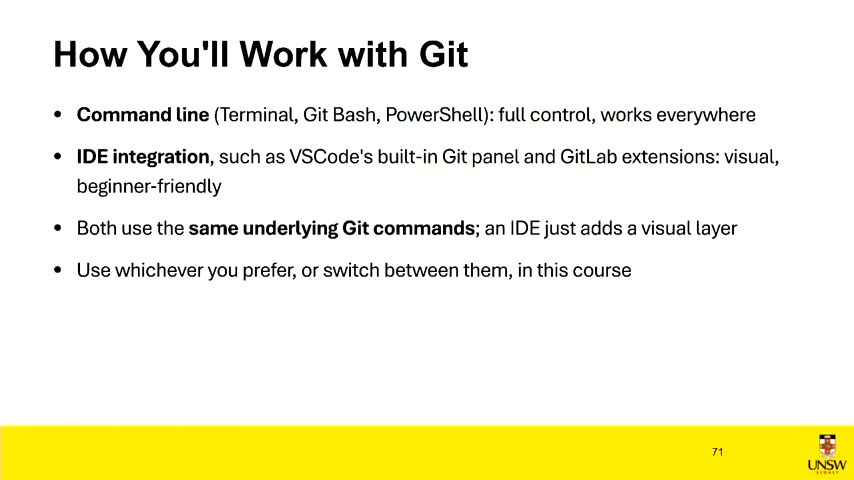

- **Command line** (Terminal, Git Bash, PowerShell): full control, works everywhere
- **IDE integration**, such as VSCode's built-in Git panel and GitLab extensions: visual, beginner-friendly
- Both use the **same underlying Git commands**; an IDE just adds a visual layer
- Use whichever you prefer, or switch between them, in this course

🇨🇳 命令行（完全控制、到处可用）或 IDE 集成（VSCode Git 面板、GitLab 扩展，可视化、适合新手）；底层是同一套命令；本课两者皆可。

---

### 67 · Basic Commands I: Starting a Repository
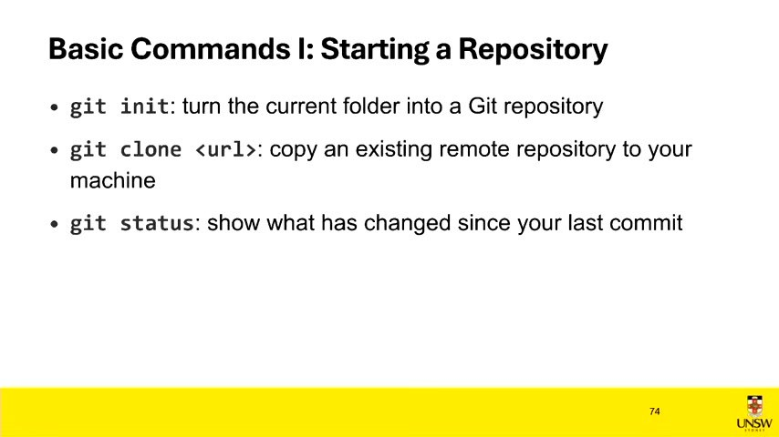

- `git init`: turn the current folder into a Git repository
- `git clone <url>`: copy an existing remote repository to your machine
- `git status`: show what has changed since your last commit

🇨🇳 `git init` 把当前文件夹变成仓库；`git clone <url>` 克隆远程仓库；`git status` 查看自上次提交以来的变化。

---

### 68 · Basic Commands II: Saving Your Work
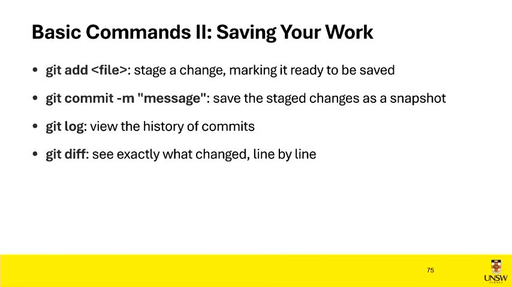

- `git add <file>`: stage a change, marking it ready to be saved
- `git commit -m "message"`: save the staged changes as a snapshot
- `git log`: view the history of commits
- `git diff`: see exactly what changed, line by line

🇨🇳 `git add` 暂存；`git commit -m` 提交快照；`git log` 看历史；`git diff` 逐行看差异。

💬 讲师补充：**commit message 极其重要**——五六个人都提交却不写说明，就没人知道改了什么。写清楚"修了 bug X"或关联 Jira 工单。

---

### 69 · Basic Commands III: Branching
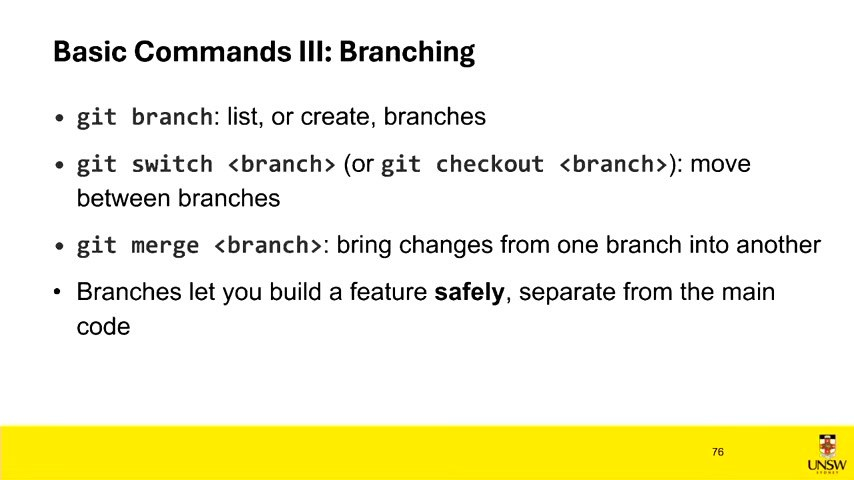

- `git branch`: list, or create, branches
- `git switch <branch>` (or `git checkout <branch>`): move between branches
- `git merge <branch>`: bring changes from one branch into another
- Branches let you build a feature **safely**, separate from the main code

🇨🇳 `git branch` 列出/创建分支；`git switch`/`git checkout` 切换；`git merge` 合并；分支让你安全地在主线之外开发功能。团队分支协作在第 2 周详细讲。

---

### 70 · Basic Commands IV: Remotes and Extras
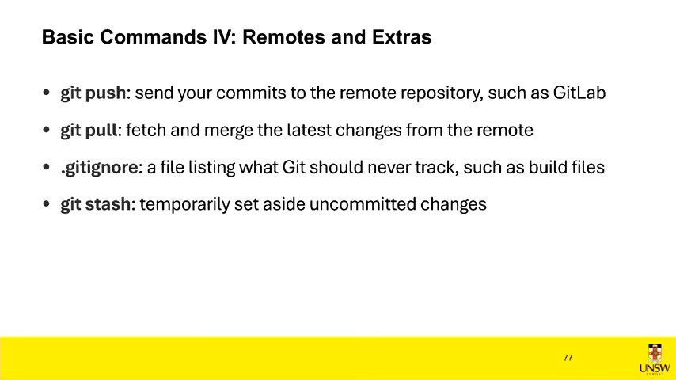

- `git push`: send your commits to the remote repository, such as GitLab
- `git pull`: fetch and merge the latest changes from the remote
- `.gitignore`: a file listing what Git should never track, such as build files
- `git stash`: temporarily set aside uncommitted changes

🇨🇳 `git push` 推送到远程；`git pull` 拉取并合并；`.gitignore` 列出不跟踪的文件（如构建产物）；`git stash` 暂存未提交的改动。

---

### 71 · A Basic Git Workflow: Working Solo
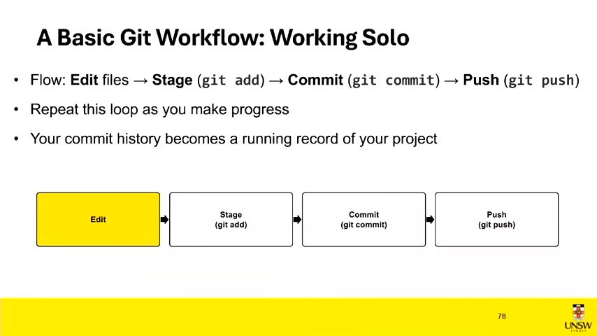

- Flow: **Edit** files → **Stage** (`git add`) → **Commit** (`git commit`) → **Push** (`git push`)
- Repeat this loop as you make progress
- Your commit history becomes a running record of your project

🇨🇳 单人流程：编辑 → 暂存 → 提交 → 推送，循环往复；提交历史就是项目的流水记录。

---

### 72 · A Basic Git Workflow: Working in a Team
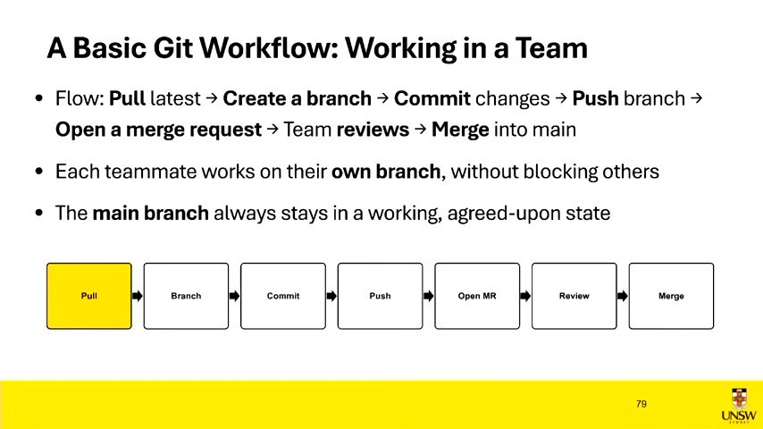

- Flow: **Pull** latest → **Create a branch** → **Commit** changes → **Push** branch → **Open a merge request** → Team **reviews** → **Merge** into main
- Each teammate works on their **own branch**, without blocking others
- The **main branch** always stays in a working, agreed-upon state

Pull → Branch → Commit → Push → Open MR → Review → Merge

🇨🇳 团队流程：先 pull 最新 → 建分支 → 提交 → 推送分支 → 开 merge request → 团队评审 → 合并进 main。每人在自己的分支上工作；main 始终保持可运行、团队认可的状态。

💬 讲师补充：合并前必须有人评审，确认不会引入问题；有时指定专人负责审所有代码；审不过会被退回修改——这就是"控制"。

---

### 73 · What is GitLab?
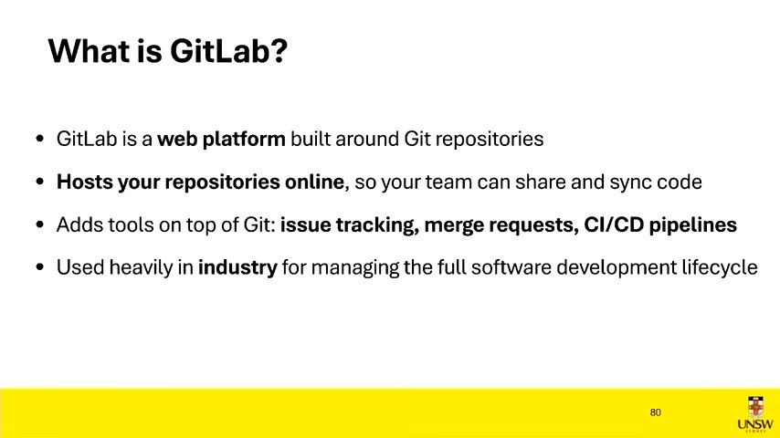

- GitLab is a **web platform** built around Git repositories
- **Hosts your repositories online**, so your team can share and sync code
- Adds tools on top of Git: **issue tracking, merge requests, CI/CD pipelines**
- Used heavily in **industry** for managing the full software development lifecycle

🇨🇳 GitLab 是围绕 Git 仓库的 Web 平台；在线托管仓库；额外提供问题跟踪、merge request、CI/CD 流水线；业界广泛使用。课程会帮你搭好环境。

---

### 74 · Git vs GitLab: What's the Difference?
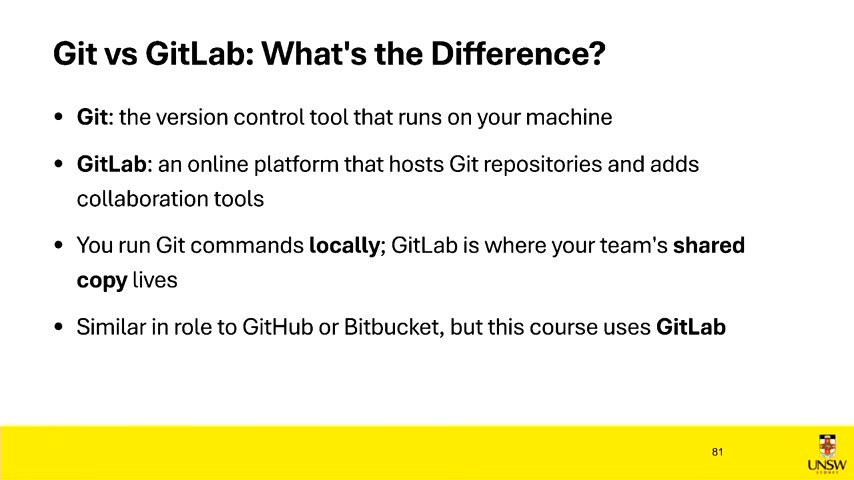

- **Git**: the version control tool that runs on your machine
- **GitLab**: an online platform that hosts Git repositories and adds collaboration tools
- You run Git commands **locally**; GitLab is where your team's **shared copy** lives
- Similar in role to GitHub or Bitbucket, but this course uses **GitLab**

🇨🇳 Git 是本机上的版本控制工具；GitLab 是托管仓库并提供协作工具的在线平台；本课用 GitLab（角色类似 GitHub/Bitbucket）。

---

### 75 · Accessing UNSW CSE GitLab
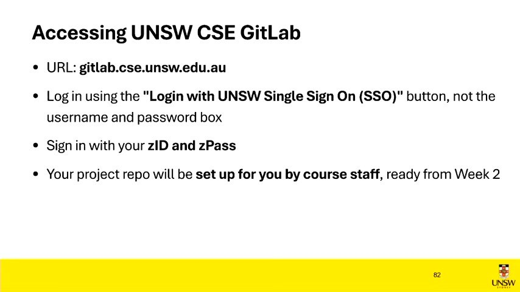

- URL: **gitlab.cse.unsw.edu.au**
- Log in using the **"Login with UNSW Single Sign On (SSO)"** button, not the username and password box
- Sign in with your **zID and zPass**
- Your project repo will be **set up for you by course staff**, ready from Week 2

🇨🇳 UNSW CSE 的 GitLab：用 **SSO 按钮**登录（不是用户名密码框），用 zID/zPass；项目仓库由课程组在第 2 周前建好。

💬 讲师补充：用 SSO 是为了让教学组能看到所有团队的仓库，以便反馈和检查工作。

📋 Lab 中的具体做法：登录 https://gitlab.cse.unsw.edu.au/ 时勾选 "Remember me"，点 "Login with UNSW Single Sign On (SSO)"。这是 UNSW 自己的 GitLab，不是 gitlab.com，账号已存在；登不进去**当场**告诉导师。Lab 练习要新建一个 **Private** 项目 `comp9820-lab01-git`，namespace 用自己的用户名，勾选 "Initialize repository with a README"。

---

### 76 · Setting Up SSH Access
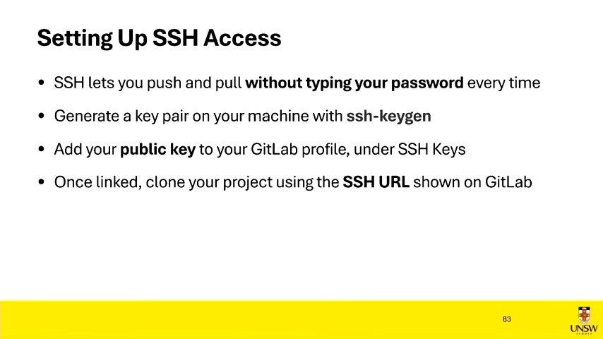

- SSH lets you push and pull **without typing your password** every time
- Generate a key pair on your machine with **ssh-keygen**
- Add your **public key** to your GitLab profile, under SSH Keys
- Once linked, clone your project using the **SSH URL** shown on GitLab

🇨🇳 SSH 免密推拉；`ssh-keygen` 生成密钥对；公钥添加到 GitLab 的 SSH Keys；之后用 SSH URL 克隆。详细步骤在 lab。

📋 Lab 中的具体做法：

```bash
cat ~/.ssh/id_ed25519.pub          # 已有 ssh-ed25519 开头的一行就跳过生成
ssh-keygen -t ed25519              # 三个问题全部回车（默认路径、空口令）
cat ~/.ssh/id_ed25519.pub          # 复制整行；WSL 可用 clip.exe < ~/.ssh/id_ed25519.pub，macOS 用 pbcopy
ssh -T git@gitlab.cse.unsw.edu.au  # 首次要输完整的 yes；看到 Welcome to GitLab, @zID 即成功
```

- 公钥粘贴到 gitlab.cse.unsw.edu.au/-/user_settings/ssh_keys → "Add new key"，Title 自动填，过期日期不改。
- `id_ed25519` 是私钥，**永远不要粘贴、提交或发给任何人**；只交 `.pub`。
- "PTY allocation failed" 是正常提示；"Permission denied (publickey)" 说明公钥没加上，重做。
- 克隆要用 **Clone with SSH** 的 `git@` 地址，不是 https；被问密码就是复制错了。WSL 下克隆到 Linux home（`~/comp9820`），**不要**放在 `/mnt/c/...`。

---

## Part 7. Working in Groups

### 77 · Group-based Projects
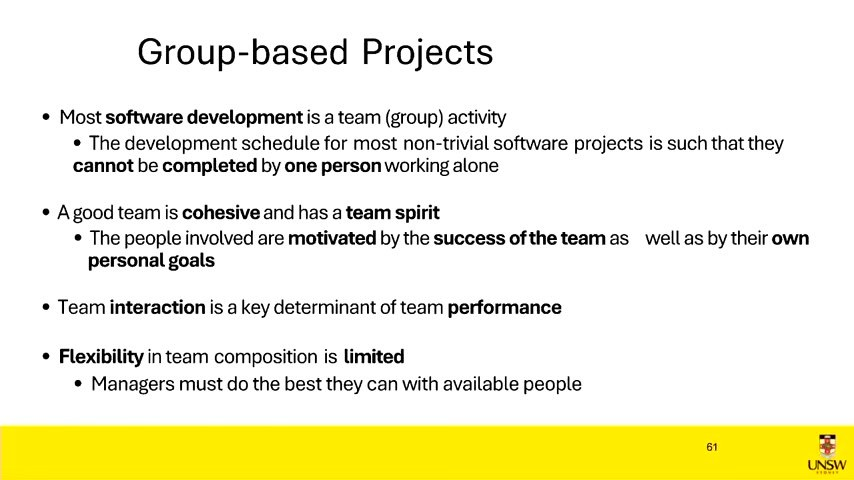

- Most **software development** is a team (group) activity
  - The development schedule for most non-trivial software projects is such that they **cannot be completed** by **one person** working alone
- A good team is **cohesive** and has a **team spirit**
  - The people involved are **motivated** by the **success of the team** as well as by their **own personal goals**
- Team **interaction** is a key determinant of team **performance**
- **Flexibility** in team composition is **limited**
  - Managers must do the best they can with available people

🇨🇳 软件开发本质是团队活动；好团队有凝聚力和团队精神，成员被团队成功驱动；互动决定绩效；团队构成的灵活性有限，管理者只能尽量用好现有的人。

💬 讲师补充：团队动力学（team dynamics）会出现，这不是坏事，是正常现象，要学会应对。"不是你怎么做、我怎么做，而是我们**用同样的实践、同样的工具**这样做。"

---

### 78 · Things won't go to plan!
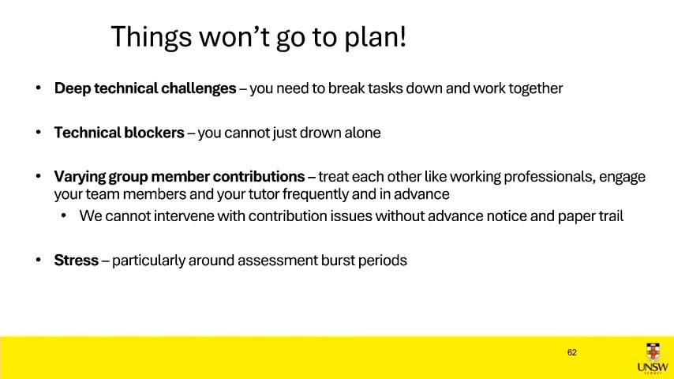

- **Deep technical challenges** – you need to break tasks down and work together
- **Technical blockers** – you cannot just drown alone
- **Varying group member contributions** – treat each other like working professionals, engage your team members and your tutor frequently and in advance
  - We cannot intervene with contribution issues without advance notice and paper trail
- **Stress** – particularly around assessment burst periods

🇨🇳 计划总会被打乱：深层技术难题要拆解并合作；遇到阻塞不要一个人硬扛；成员贡献不均——像职业人士一样对待彼此，**及早、频繁地告知队友和导师，没有提前通知和书面记录教学组无法介入**；考核高峰期的压力要管理。

---

### 79 · Selecting Team Members
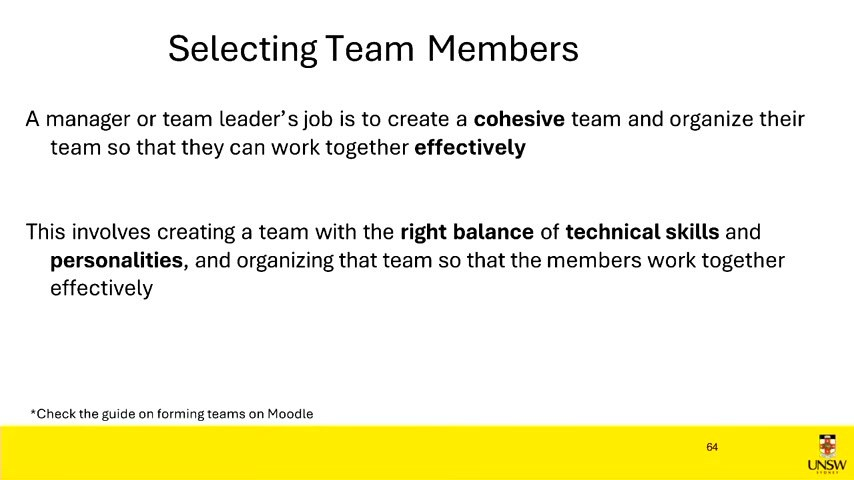

A manager or team leader's job is to create a **cohesive** team and organize their team so that they can work together **effectively**

This involves creating a team with the **right balance** of **technical skills** and **personalities**, and organizing that team so that the members work together effectively

*Check the guide on forming teams on Moodle

🇨🇳 组队要兼顾**技术技能和性格的平衡**，让成员能有效协作。**Moodle 上有组队指南。**

💬 讲师补充：允许自选队友，但要选得明智——考虑角色、技术、知识。**一个团队不要三个"领导者"**，会打架；一个领导 + 其他人配合更好。冲突往往来自组队时没考虑这些。

📋 Lab 中的组队标准（Technical Skillset Self-test，A–F 各 0–4 分，G/H 不计分只做约束；不影响成绩，如实填）：
- **看覆盖，不看总分**。0 分和 1 分很正常，课程会教。建议至少：一人后端 **D3+**；另一人前端 **C3+**（没有就 C2）；一人版本控制 **B2+**；一人愿意协调（E 分高有帮助，但意愿更重要）。这些是建议不是硬性要求。
- **可用时间比技能更重要**：全员至少共享 **两个 G 时间窗**（工作日上午/下午/晚上、周六、周日、周末晚上）；有人只能线上，团队就线上开会。
- **每周投入预期（H）要接近**：避免"3 小时以内"和"10 小时以上"同组。
- 5–6 人；5 人组不封闭，导师可补人到 6。定好后在 Moodle → 本课程 → "Team Formation" 页面加入本 lab 的团队；第 2 周 lab 最终确认。

---

### 80 · Team Communications
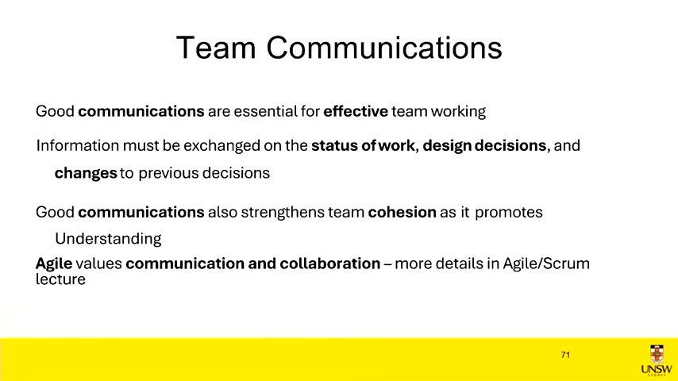

Good **communications** are essential for **effective** team working
Information must be exchanged on the **status of work**, **design decisions**, and **changes** to previous decisions
Good **communications** also strengthens team **cohesion** as it promotes Understanding
**Agile** values **communication and collaboration** – more details in Agile/Scrum lecture

🇨🇳 良好沟通是团队有效工作的基础：交换工作状态、设计决策、决策变更；沟通增强凝聚力；Agile 重视沟通与协作（Scrum 讲会详述）。

---

### 81 · Team Conflicts
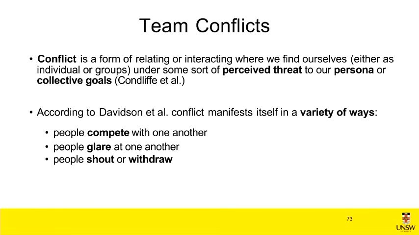

- **Conflict** is a form of relating or interacting where we find ourselves (either as individual or groups) under some sort of **perceived threat** to our **persona** or **collective goals** (Condliffe et al.)
- According to Davidson et al. conflict manifests itself in a **variety of ways**:
  - people **compete** with one another
  - people **glare** at one another
  - people **shout** or **withdraw**

🇨🇳 冲突 = 感到个人形象或集体目标受到威胁时的互动形式；表现为竞争、怒视、大喊或退缩。冲突的根源是我们无法控制他人的性格、心态、文化、背景——它的存在不是"有什么错了"。

---

### 82–83 · Conflict Intensity
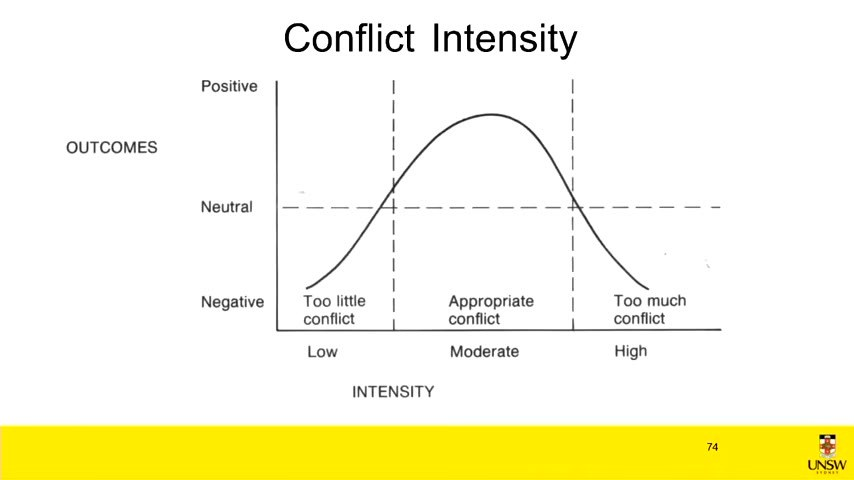
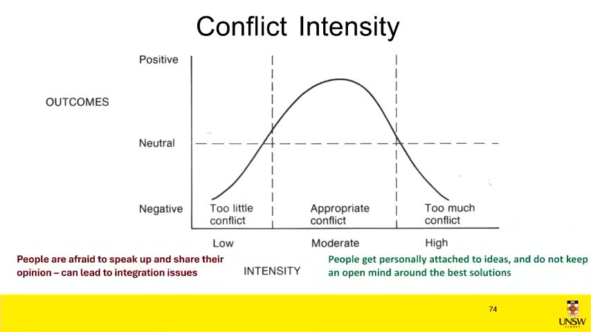

X 轴 INTENSITY（Low – Moderate – High）；Y 轴 OUTCOMES（Negative – Neutral – Positive）。倒 U 形曲线：
- Too little conflict → Negative：*People are afraid to speak up and share their opinion – can lead to integration issues*
- Appropriate conflict → Positive
- Too much conflict → Negative：*People get personally attached to ideas, and do not keep an open mind around the best solutions*

🇨🇳 冲突强度与结果呈倒 U 关系：太少（都沉默、隐藏问题）和太多（人人争着证明自己对）都是负面的；**适度冲突**（分享、讨论、接纳他人观点）能提前发现问题，结果是正面的。

💬 讲师补充：不要为了"证明我对"而忽视别人的好想法，那只会把问题留到以后；把冲突当成建设性的手段来改进需求和方案。

---

### 84 · Process of Conflict
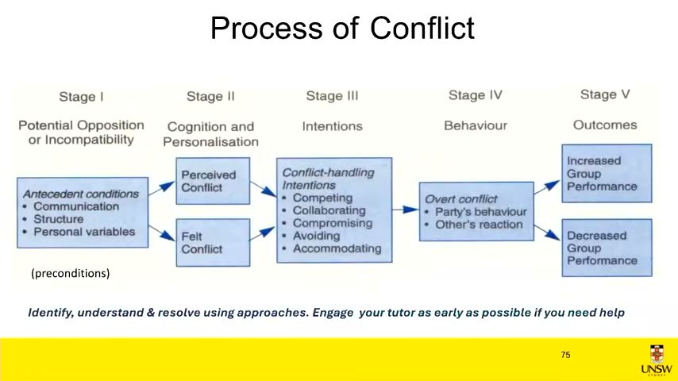

| Stage I | Stage II | Stage III | Stage IV | Stage V |
|---|---|---|---|---|
| Potential Opposition or Incompatibility | Cognition and Personalisation | Intentions | Behaviour | Outcomes |
| Antecedent conditions: Communication, Structure, Personal variables (preconditions) | Perceived Conflict / Felt Conflict | Conflict-handling Intentions: Competing, Collaborating, Compromising, Avoiding, Accommodating | Overt conflict: Party's behaviour, Other's reaction | Increased / Decreased Group Performance |

*Identify, understand & resolve using approaches. Engage your tutor as early as possible if you need help*

🇨🇳 冲突是一个过程：前置条件 → 感知/感受到冲突 → 处理意图（竞争/协作/妥协/回避/迁就）→ 外显行为 → 结果（团队绩效提升或下降）。理解这个过程有助于及时识别并处理；**需要帮助尽早找导师。**

---

### 85 · Types of Conflict
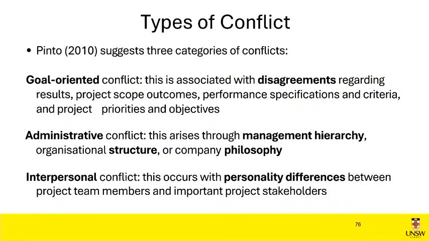

- Pinto (2010) suggests three categories of conflicts:
  - **Goal-oriented** conflict: associated with **disagreements** regarding results, project scope outcomes, performance specifications and criteria, and project priorities and objectives
  - **Administrative** conflict: arises through **management hierarchy**, organisational **structure**, or company **philosophy**
  - **Interpersonal** conflict: occurs with **personality differences** between project team members and important project stakeholders

🇨🇳 Pinto 的三类冲突：目标型（结果、范围、优先级的分歧）、管理型（层级、结构、理念）、人际型（性格差异）。

---

### 86 · Sources of Conflict
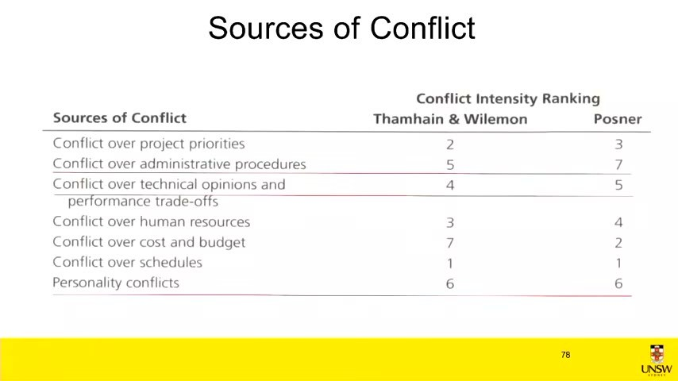

| Sources of Conflict | Thamhain & Wilemon | Posner |
|---|---|---|
| Conflict over project priorities | 2 | 3 |
| Conflict over administrative procedures | 5 | 7 |
| Conflict over technical opinions and performance trade-offs | 4 | 5 |
| Conflict over human resources | 3 | 4 |
| Conflict over cost and budget | 7 | 2 |
| Conflict over schedules | 1 | 1 |
| Personality conflicts | 6 | 6 |

（Conflict Intensity Ranking，1 = 最高）

🇨🇳 两组学者对冲突来源强度的排名：**进度（schedules）冲突在两项研究中都排第一**；技术观点和人际冲突也都靠前。

---

### 87 · Resolving Conflict – Conflict handling model (Blake and Mouton)
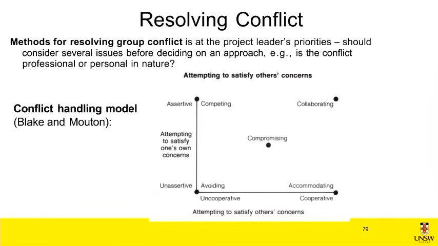

**Methods for resolving group conflict** is at the project leader's priorities – should consider several issues before deciding on an approach, e.g., is the conflict professional or personal in nature?

坐标：X 轴 *Attempting to satisfy others' concerns*（Uncooperative → Cooperative）；Y 轴 *Attempting to satisfy one's own concerns*（Unassertive → Assertive）
- Assertive + Uncooperative → **Competing**
- Assertive + Cooperative → **Collaborating**
- 中间 → **Compromising**
- Unassertive + Uncooperative → **Avoiding**
- Unassertive + Cooperative → **Accommodating**

🇨🇳 Blake & Mouton 冲突处理模型：按"满足自己关切的程度（坚持性）"和"满足他人关切的程度（合作性）"两个维度得出五种方式：竞争、协作、妥协、回避、迁就。

---

### 88 · Resolving Conflict – 课堂练习
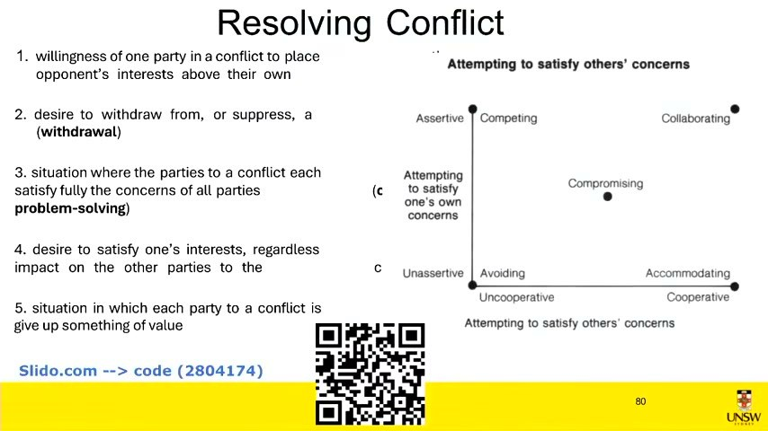

1. willingness of one party in a conflict to place opponent's interests above their own (**smoothing**)
2. desire to withdraw from, or suppress, a conflict (**withdrawal**)
3. situation where the parties to a conflict each desire to satisfy fully the concerns of all parties (**confrontation or problem-solving**)
4. desire to satisfy one's interests, regardless of the impact on the other parties to the conflict (**forcing**)
5. situation in which each party to a conflict is willing to give up something of value

Slido.com --> code (2804174)

🇨🇳 把五段描述与五种方式配对。参考答案：1 = Accommodating（迁就/smoothing），2 = Avoiding（回避/withdrawal），3 = Collaborating（协作/problem-solving），4 = Competing（竞争/forcing），5 = Compromising（妥协）。

---

### 89 · Slido 结果：Conflict Resolution ranking
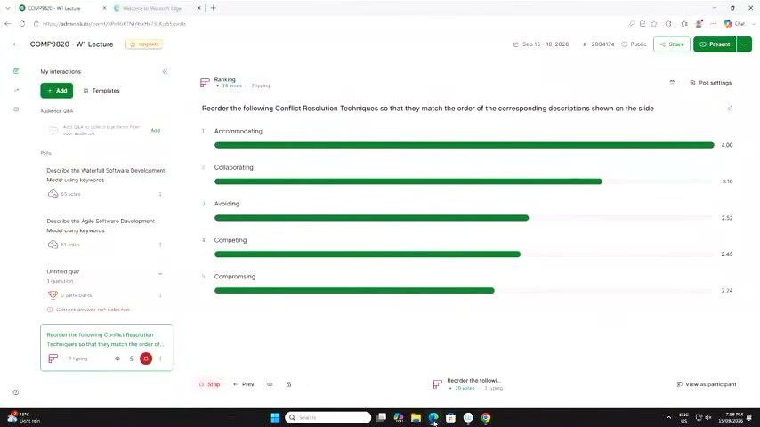

学生排序结果（28 票，平均位次）：1 Accommodating 4.00 · 2 Collaborating 3.10 · 3 Avoiding 2.52 · 4 Competing 2.45 · 5 Compromising 2.74 —— 与参考答案大体一致。

💬 讲师补充（结语）：这是个老模型，但至今仍反映现实。**我们的目标是"合作 + 坚持"的 Collaborating（协作）**——不是妥协，不是竞争，也不是回避或迁就。（录像在此结束。）

---

## 待办清单

- [ ] **组队**：在自己所属 lab 的第 1 周 lab 里找队友（5–6 人，目标 6 人；5 人组会被补人）；先做技能自测（A–H），按 lab 标准组队：后端 D3+、前端 C3+/C2、Git B2+、一人愿意协调，全员共享 ≥2 个可用时间窗、每周投入预期接近；在 Moodle "Team Formation" 页面加入团队；最迟第 2 周初定组。
- [ ] **Moodle**：确认能看到课程页、lab 表、Discourse 链接；阅读 Course Outline 和 Moodle 上的组队指南。
- [ ] **Discourse**：加入 https://discourse02.cse.unsw.edu.au/26T3/COMP9820/ ，养成先搜后问、经常查看的习惯。
- [ ] **Git 环境**（第 1 周 lab 的 12 步，在**项目将使用的那台机器**上完成）：
  1. Windows 装 WSL（重启后打开 Ubuntu），macOS/Linux 用自带终端；`git --version` 确认。
  2. 四条 `git config --global`：user.name（全名）、user.email（zID 邮箱）、`pull.rebase false`、`core.editor "nano"`。
  3. 用 SSO 登录 gitlab.cse.unsw.edu.au；登不上当场找导师。
  4. `ssh-keygen -t ed25519` → 把 `.pub` 加到 GitLab SSH Keys → `ssh -T git@gitlab.cse.unsw.edu.au` 看到 Welcome。
  5. 新建 Private 项目 `comp9820-lab01-git`（勾选 README），用 **SSH 地址**克隆到 `~/comp9820`（WSL 下不要放 `/mnt/c`）。
  6. 两次 commit（`first.txt`）并 `git push`；commit message 写"改了什么、为什么"（不要 `fix`、`update stuff`）。
  7. `git checkout -b add-second-file` 建分支（分支名描述工作，不用 branch2 或人名），提交 `second.txt`，首次推送按提示 `git push -u origin add-second-file`。
  8. 在 GitLab 用 push 输出里的链接开 merge request，写真实描述，看 Changes 标签页，本次 lab **取消勾选** "Delete source branch"，点 Merge。
  9. `git checkout main && git pull`，`git log --oneline --graph --all` 看到分支汇入 main。**每次开工前先 pull。**
  10. 粘贴 lab handout 里的脚本，运行 `bash test_git_basics.sh` 和 `bash test_git_advance.sh`，都要看到 "Tests passed"（不计分，不提交）。
  11. 记住五个常用命令：`git status`（随时）、`git pull`（开工前）、`git add / git commit`、`git push`、`git checkout -b`。
  12. 有任何一步不通，第 1 周就找导师；第 2 周 lab 会直接进入 GitLab issues / boards / milestones，默认以上已完成。
- [ ] **先修补课**：确认自己能用 Python/Java 写、跑、测、调程序，有基本 Web 开发经验；不足的话尽快自学。
- [ ] **日历**：周二 18:00–20:00 讲座（Webster Theatre A）；自己的 lab 时间；Demo 第 4 / 8 / 10 周（缺席无 SC = 0 分）；个人报告 + 互评第 5 / 9 / 11 周。
- [ ] **ELS / SC**：如有需要，尽早注册 ELS 或在截止后 3 个工作日内申请 SC，并把结果邮件发给 Ghadir Alselwi。
- [ ] **AI 政策**：本课为 "Simple Editing Assistance" 级别——**不得用生成式 AI 写/补全/审查/调试代码，不得生成或改写报告文本**；GitLab 历史可能被检查，团队连带负责。
- [ ] **留意**：Git 入门 workshop 时间表；Sprint 1 项目 "Shared Expense Splitter" 的规格（第 2 周发布）。
- [ ] **第 2 周 lab 预告**：最终确认团队；讨论 project brief；规划并启动 Sprint 1。
- [ ] **提前做完的可选练习**（lab 建议）：故意制造并解决一次 merge conflict（两个分支都改 `third.txt`）；在 GitLab 网页编辑器改 `first.txt` 再 `git pull` 下来；试试 `git diff` 与 `git diff --cached`；阅读 Atlassian Git 指南 https://www.atlassian.com/git 。

